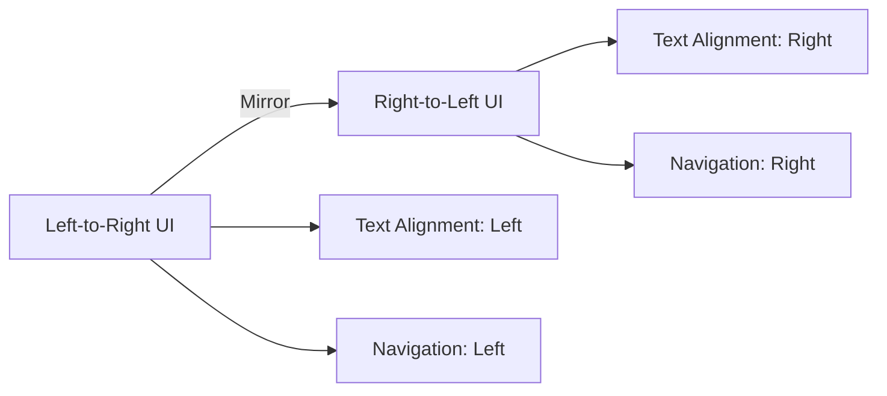

## 26.5 Right-to-Left Language Support

In today's globalized world, supporting multiple languages in software applications is crucial. Among these, right-to-left (RTL) languages present unique challenges that developers must address to ensure a seamless user experience. This section delves into the intricacies of supporting RTL languages in Erlang applications, providing insights into text rendering, layout adjustments, and testing strategies.

### Understanding Right-to-Left Languages

Right-to-left languages are those in which the script is written and read from right to left. Common RTL languages include:

- **Arabic**: Spoken in many countries across the Middle East and North Africa.
- **Hebrew**: Used primarily in Israel.
- **Persian (Farsi)**: Predominantly spoken in Iran.
- **Urdu**: Widely used in Pakistan and India.

These languages require special handling in software applications, particularly in terms of text rendering and user interface design.

### Challenges in Supporting RTL Languages

#### Text Rendering and Layout

When dealing with RTL languages, text rendering and layout are primary concerns. Here are some common issues:

1. **Text Alignment**: In RTL languages, text should be right-aligned. This affects not only paragraphs but also the placement of text within buttons, labels, and other UI elements.

2. **Mirroring UI Components**: Many UI components need to be mirrored to provide a natural flow for RTL users. For example, navigation buttons that are typically on the left in LTR (left-to-right) interfaces should be on the right in RTL interfaces.

3. **Bidirectional Text**: Often, RTL text includes LTR elements, such as numbers or English words. Handling bidirectional text requires careful consideration to maintain readability.

4. **Punctuation and Symbols**: The placement of punctuation marks and symbols can differ in RTL contexts, requiring adjustments to ensure they appear correctly.

### Adjusting User Interfaces for RTL Support

To accommodate RTL languages, developers must make several adjustments to the user interface:

#### 1. Text Alignment and Direction

Ensure that all text elements are right-aligned and that the text direction is set to RTL. In web applications, this can be achieved using CSS properties:

```css
body {
  direction: rtl;
  text-align: right;
}
```

For Erlang-based web applications using frameworks like `cowboy`, ensure that HTML templates incorporate these styles.

#### 2. Mirroring Layouts

Mirroring involves flipping the layout horizontally. This can be done using CSS transformations:

```css
.container {
  transform: scaleX(-1);
}
```

However, be cautious with this approach, as it may affect non-text elements. It's often better to manually adjust the layout for RTL support.

#### 3. Handling Bidirectional Text

Use libraries that support bidirectional text rendering. In Erlang, while there might not be a direct library for bidirectional text, integrating with JavaScript libraries like `bidi.js` in web applications can help manage complex text flows.

#### 4. Adjusting Punctuation and Symbols

Ensure that punctuation marks and symbols are correctly placed in RTL contexts. This might require custom logic to adjust their positions based on the language setting.

### Erlang Libraries and Techniques for RTL Support

While Erlang is not inherently designed for UI development, it can be integrated with front-end technologies to support RTL languages. Here are some techniques and libraries that can assist:

#### 1. Using Erlang with Web Frameworks

Erlang web frameworks like `cowboy` can serve as the backend for applications that require RTL support. By leveraging front-end technologies (HTML, CSS, JavaScript), developers can implement RTL features effectively.

#### 2. Integrating with JavaScript Libraries

JavaScript libraries such as `bidi.js` and `i18next` can be integrated into Erlang-based web applications to handle RTL text and localization.

#### 3. Utilizing Erlang's String Manipulation Capabilities

Erlang's robust string manipulation functions can be used to preprocess text data before rendering it in the UI. Functions like `string:reverse/1` can be useful for reversing text when necessary.

### Testing Applications with RTL Language Settings

Thorough testing is crucial to ensure that applications function correctly with RTL languages. Here are some strategies:

#### 1. Automated Testing

Use automated testing frameworks to verify that UI elements are correctly aligned and that text is rendered properly. Tools like Selenium can be used to automate browser-based testing for web applications.

#### 2. Manual Testing

Manual testing is essential to catch nuances that automated tests might miss. Engage native speakers of RTL languages to test the application and provide feedback.

#### 3. Cross-Browser and Cross-Platform Testing

Ensure that the application behaves consistently across different browsers and platforms. RTL support can vary between browsers, so testing on multiple platforms is important.

### Visualizing RTL Support in UI Design

To better understand the adjustments needed for RTL support, consider the following diagram illustrating the mirroring of a typical user interface:



**Diagram Description**: This diagram shows the transformation of a left-to-right user interface into a right-to-left one. Text alignment changes from left to right, and navigation elements move from the left side to the right side.

### Key Takeaways

- **Understand the unique challenges** of supporting RTL languages, including text alignment, UI mirroring, and bidirectional text handling.
- **Leverage CSS and JavaScript** to implement RTL support in web applications, using Erlang as the backend.
- **Thoroughly test applications** with RTL settings to ensure a seamless user experience.
- **Engage native speakers** in the testing process to gain valuable insights and feedback.

### Embrace the Journey

Supporting RTL languages in your applications is a rewarding endeavor that opens your software to a broader audience. Remember, this is just the beginning. As you progress, you'll build more inclusive and accessible applications. Keep experimenting, stay curious, and enjoy the journey!

## Quiz: Right-to-Left Language Support



### What are common right-to-left languages?

- [x] Arabic
- [x] Hebrew
- [ ] English
- [ ] Spanish

> **Explanation:** Arabic and Hebrew are common RTL languages, while English and Spanish are LTR languages.

### Which CSS property is used to set text direction to RTL?

- [x] `direction: rtl;`
- [ ] `text-align: right;`
- [ ] `float: right;`
- [ ] `align: rtl;`

> **Explanation:** The `direction` property is used to set the text direction to RTL.

### What is a primary concern when supporting RTL languages?

- [x] Text alignment
- [x] UI mirroring
- [ ] Color scheme
- [ ] Font size

> **Explanation:** Text alignment and UI mirroring are primary concerns for RTL support, while color scheme and font size are not specific to RTL.

### How can bidirectional text be handled in web applications?

- [x] Using JavaScript libraries like `bidi.js`
- [ ] Using only CSS
- [ ] Ignoring it
- [ ] Using HTML comments

> **Explanation:** JavaScript libraries like `bidi.js` can help manage bidirectional text, while CSS alone is insufficient.

### What is a recommended strategy for testing RTL support?

- [x] Automated testing
- [x] Manual testing with native speakers
- [ ] Only manual testing
- [ ] No testing needed

> **Explanation:** Both automated and manual testing, especially with native speakers, are recommended for thorough RTL support testing.

### Which Erlang function can be useful for reversing text?

- [x] `string:reverse/1`
- [ ] `lists:reverse/1`
- [ ] `io:format/2`
- [ ] `file:read/1`

> **Explanation:** `string:reverse/1` is used for reversing text in Erlang.

### What is the purpose of mirroring UI components?

- [x] To provide a natural flow for RTL users
- [ ] To change the color scheme
- [ ] To increase font size
- [ ] To add animations

> **Explanation:** Mirroring UI components helps provide a natural flow for RTL users.

### Why is cross-browser testing important for RTL support?

- [x] RTL support can vary between browsers
- [ ] Browsers have the same RTL support
- [ ] Only one browser is used
- [ ] Browsers do not support RTL

> **Explanation:** RTL support can vary between browsers, making cross-browser testing important.

### What is a challenge of bidirectional text?

- [x] Mixing RTL and LTR elements
- [ ] Only using RTL elements
- [ ] Only using LTR elements
- [ ] Ignoring text direction

> **Explanation:** Bidirectional text involves mixing RTL and LTR elements, which can be challenging.

### True or False: Erlang has built-in support for RTL text rendering.

- [ ] True
- [x] False

> **Explanation:** Erlang does not have built-in support for RTL text rendering; it relies on integration with front-end technologies.


