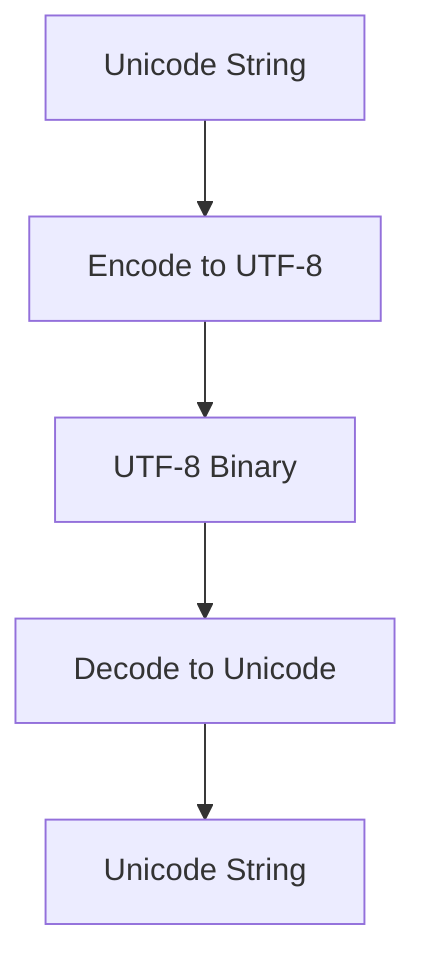

## 26.6 Unicode Handling and Character Encodings

In today's globalized world, software applications must support multiple languages and character sets. This requires a robust understanding of Unicode and character encodings. In this section, we'll explore how Erlang handles Unicode and character encodings, ensuring proper representation and manipulation of international text.

### Understanding Unicode and Its Importance

**Unicode** is a universal character encoding standard that assigns a unique number to every character, regardless of platform, program, or language. It is essential for internationalization because it allows consistent encoding, representation, and handling of text expressed in most of the world's writing systems.

#### Why Unicode Matters

Unicode is crucial for several reasons:

- **Consistency**: It provides a consistent way to encode multilingual text, making it easier to share and process text across different systems.
- **Interoperability**: Unicode ensures that text data can be exchanged between different systems without corruption or loss of information.
- **Comprehensive Coverage**: It supports a wide range of characters, including those from ancient scripts, modern symbols, and emojis.

### Erlang's Support for Unicode

Erlang, being a language designed for building robust systems, provides support for Unicode through its string and binary handling capabilities. Understanding how Erlang manages Unicode is key to developing applications that handle international text effectively.

#### Strings and Binaries in Erlang

In Erlang, strings are represented as lists of integers, where each integer corresponds to a Unicode code point. This representation allows for easy manipulation and pattern matching but can be inefficient for large texts.

Binaries, on the other hand, are more efficient for handling large amounts of text data. They are sequences of bytes and are often used for storing and transmitting data in a compact form.

### Working with Unicode Strings in Erlang

Let's explore how to work with Unicode strings in Erlang, including encoding and decoding operations.

#### Encoding and Decoding

Encoding is the process of converting a string into a specific format for efficient storage or transmission. Decoding is the reverse process, converting encoded data back into a string.

Here's an example of encoding and decoding a Unicode string in Erlang:

```erlang
-module(unicode_example).
-export([encode_utf8/1, decode_utf8/1]).

% Encode a Unicode string to UTF-8 binary
encode_utf8(String) ->
    unicode:characters_to_binary(String, utf8).

% Decode a UTF-8 binary to a Unicode string
decode_utf8(Binary) ->
    unicode:characters_to_list(Binary, utf8).

% Example usage
example() ->
    String = "Hello, 世界",
    Encoded = encode_utf8(String),
    Decoded = decode_utf8(Encoded),
    io:format("Original: ~s~nEncoded: ~p~nDecoded: ~s~n", [String, Encoded, Decoded]).
```

In this example, we define two functions: `encode_utf8/1` and `decode_utf8/1`. The `encode_utf8/1` function converts a Unicode string to a UTF-8 binary, while `decode_utf8/1` converts a UTF-8 binary back to a Unicode string.

#### Handling Different Encodings

Erlang's `unicode` module provides functions for handling various encodings. It's important to specify the correct encoding when converting between strings and binaries to avoid data corruption.

### Potential Pitfalls in Unicode Handling

When working with Unicode and character encodings, there are several potential pitfalls to be aware of:

- **Mixing Encodings**: Ensure that you consistently use the same encoding throughout your application. Mixing different encodings can lead to data corruption and unexpected behavior.
- **Invalid Characters**: Be cautious of invalid characters that may appear when converting between encodings. Use error handling to manage such cases gracefully.
- **Performance Considerations**: Strings in Erlang are lists of integers, which can be inefficient for large texts. Consider using binaries for performance-critical applications.

### Best Practices for Unicode Handling in Erlang

To effectively handle Unicode in Erlang, follow these best practices:

- **Use Unicode-Standard Functions**: Leverage Erlang's `unicode` module for encoding and decoding operations. This ensures compatibility and correctness.
- **Validate Input**: Always validate input data to ensure it conforms to the expected encoding. This prevents errors and security vulnerabilities.
- **Test with Diverse Data**: Test your application with a wide range of characters and scripts to ensure it handles international text correctly.

### Try It Yourself

To deepen your understanding, try modifying the code example above:

- Change the string to include different Unicode characters, such as emojis or characters from other scripts.
- Experiment with different encodings, such as UTF-16 or ISO-8859-1, and observe how the output changes.

### Visualizing Unicode Handling

Below is a diagram illustrating the process of encoding and decoding Unicode strings in Erlang:



**Diagram Description**: This flowchart represents the process of encoding a Unicode string to a UTF-8 binary and then decoding it back to a Unicode string.

### References and Further Reading

- [Unicode Consortium](https://unicode.org/)
- [Erlang Unicode Module Documentation](https://www.erlang.org/doc/man/unicode.html)
- [MDN Web Docs on Character Encoding](https://developer.mozilla.org/en-US/docs/Glossary/Character_encoding)

### Knowledge Check

- What is Unicode, and why is it important for internationalization?
- How does Erlang represent strings and binaries?
- What are some potential pitfalls when handling Unicode in Erlang?

### Embrace the Journey

Remember, mastering Unicode handling is just one step in building robust, internationalized applications. Keep experimenting, stay curious, and enjoy the journey!

## Quiz: Unicode Handling and Character Encodings



### What is Unicode?

- [x] A universal character encoding standard
- [ ] A programming language
- [ ] A type of database
- [ ] A web framework

> **Explanation:** Unicode is a universal character encoding standard that assigns a unique number to every character.

### How are strings represented in Erlang?

- [x] As lists of integers
- [ ] As arrays of characters
- [ ] As binary trees
- [ ] As hash maps

> **Explanation:** In Erlang, strings are represented as lists of integers, where each integer corresponds to a Unicode code point.

### What is the purpose of encoding?

- [x] To convert a string into a specific format for storage or transmission
- [ ] To execute a program
- [ ] To compile source code
- [ ] To encrypt data

> **Explanation:** Encoding is the process of converting a string into a specific format for efficient storage or transmission.

### Which Erlang module is used for Unicode handling?

- [x] unicode
- [ ] string
- [ ] binary
- [ ] io

> **Explanation:** The `unicode` module in Erlang provides functions for handling Unicode encoding and decoding.

### What is a potential pitfall when handling Unicode?

- [x] Mixing different encodings
- [ ] Using too many variables
- [ ] Writing too many comments
- [ ] Using recursion

> **Explanation:** Mixing different encodings can lead to data corruption and unexpected behavior.

### How can you improve performance when handling large texts in Erlang?

- [x] Use binaries instead of strings
- [ ] Use more variables
- [ ] Use recursion
- [ ] Use lists instead of tuples

> **Explanation:** Binaries are more efficient for handling large amounts of text data compared to strings, which are lists of integers.

### What should you do to ensure text data is handled correctly?

- [x] Validate input data
- [ ] Use global variables
- [ ] Avoid using functions
- [ ] Ignore encoding errors

> **Explanation:** Validating input data ensures it conforms to the expected encoding, preventing errors and security vulnerabilities.

### What is decoding?

- [x] Converting encoded data back into a string
- [ ] Compiling source code
- [ ] Encrypting data
- [ ] Executing a program

> **Explanation:** Decoding is the process of converting encoded data back into a string.

### What is the benefit of using Unicode-standard functions?

- [x] Ensures compatibility and correctness
- [ ] Increases execution speed
- [ ] Reduces memory usage
- [ ] Simplifies code syntax

> **Explanation:** Using Unicode-standard functions ensures compatibility and correctness when handling text data.

### True or False: Erlang's `unicode` module can handle multiple encodings.

- [x] True
- [ ] False

> **Explanation:** Erlang's `unicode` module provides functions for handling various encodings, ensuring proper text representation.


