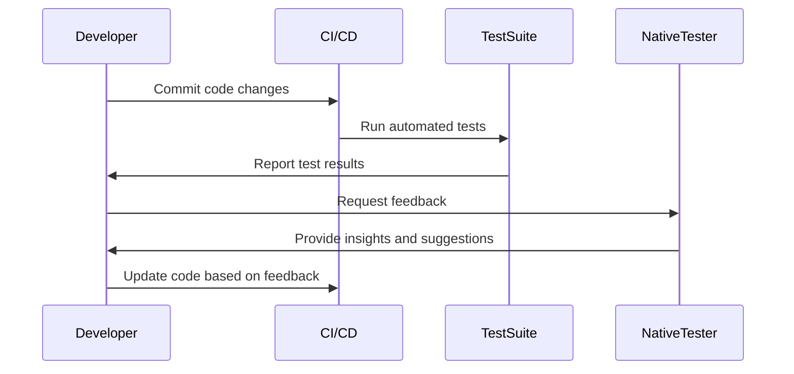

## 26.7 Testing Internationalized Applications

In today's globalized world, ensuring that your application functions correctly across different languages and locales is crucial. Testing internationalized applications involves verifying that the software can handle various languages, character sets, and cultural conventions without errors. This section will guide you through the importance of testing all localized versions, strategies for automating locale-specific tests, tools that can assist in testing, common issues to look for, and the value of involving native speakers in the testing process.

### Importance of Testing All Localized Versions

When developing an internationalized application, it's essential to test each localized version thoroughly. This ensures that users from different regions have a seamless experience. Here are some reasons why testing all localized versions is important:

- **User Experience**: A well-tested application provides a consistent and intuitive user experience, regardless of the user's language or locale.
- **Cultural Sensitivity**: Different regions have unique cultural norms and expectations. Testing helps ensure that the application respects these differences.
- **Legal Compliance**: Some regions have specific legal requirements for software, such as data protection laws. Testing helps ensure compliance with these regulations.
- **Market Reach**: By ensuring that your application works well in multiple locales, you can expand your market reach and attract a broader audience.

### Strategies for Automating Locale-Specific Tests

Automating tests for internationalized applications can save time and resources while ensuring comprehensive coverage. Here are some strategies for automating locale-specific tests:

1. **Use Localization Frameworks**: Leverage localization frameworks that support automated testing. These frameworks can help manage translations and locale-specific data.

2. **Parameterized Tests**: Create parameterized tests that run the same test logic with different locale-specific inputs. This approach ensures that all locales are tested with the same rigor.

3. **Mocking and Stubbing**: Use mocking and stubbing to simulate different locales and test how the application behaves under various conditions.

4. **Continuous Integration**: Integrate locale-specific tests into your continuous integration pipeline to ensure that any changes to the codebase are tested across all locales.

5. **Test Data Management**: Maintain a centralized repository of locale-specific test data to ensure consistency and accuracy across tests.

### Tools for Testing Internationalized Applications

Several tools can assist in testing internationalized applications, each offering unique features to streamline the process:

- **Selenium**: A popular tool for automating web applications, Selenium can be configured to test different locales by simulating user interactions in various languages.

- **Appium**: For mobile applications, Appium provides a robust framework for testing internationalized apps across different devices and operating systems.

- **i18n Testing Tools**: Tools like Globalize and i18next offer built-in support for testing internationalized applications, including locale-specific validation and translation management.

- **Crowdin**: A localization management platform that integrates with your development workflow, Crowdin can help manage translations and automate testing for different locales.

### Common Issues in Internationalized Applications

When testing internationalized applications, be on the lookout for common issues that can affect usability and functionality:

- **Text Truncation**: Ensure that translated text fits within the allocated space in the UI. Different languages have varying word lengths, which can lead to truncation.

- **Layout Problems**: Verify that the application's layout adapts to different text directions (e.g., left-to-right vs. right-to-left) and character sets.

- **Date and Time Formatting**: Check that dates and times are displayed correctly according to the user's locale, including time zones and calendar formats.

- **Currency and Number Formatting**: Ensure that currency symbols, decimal separators, and number formats are appropriate for each locale.

- **Character Encoding**: Test for proper handling of different character encodings to prevent issues with special characters and symbols.

### Involving Native Speakers in the Testing Process

While automated testing is invaluable, involving native speakers in the testing process can provide insights that automated tests might miss. Native speakers can help identify:

- **Translation Accuracy**: Verify that translations are accurate and contextually appropriate.

- **Cultural Relevance**: Ensure that the application respects cultural norms and avoids offensive or inappropriate content.

- **Usability**: Provide feedback on the overall usability and intuitiveness of the application in their native language.

### Code Example: Automating Locale-Specific Tests in Erlang

Let's explore a simple Erlang example to demonstrate how you can automate locale-specific tests using parameterized tests.

```erlang
-module(locale_test).
-include_lib("eunit/include/eunit.hrl").

% Define a test case for greeting messages in different locales
greeting_test() ->
    Locales = [{"en", "Hello"}, {"es", "Hola"}, {"fr", "Bonjour"}],
    lists:foreach(fun({Locale, ExpectedGreeting}) ->
        Greeting = get_greeting(Locale),
        ?assertEqual(ExpectedGreeting, Greeting)
    end, Locales).

% Function to get greeting message based on locale
get_greeting("en") -> "Hello";
get_greeting("es") -> "Hola";
get_greeting("fr") -> "Bonjour";
get_greeting(_) -> "Hello". % Default to English
```

In this example, we define a test case `greeting_test` that checks the greeting message for different locales. The `get_greeting/1` function returns the appropriate greeting based on the locale. The test iterates over a list of locales and verifies that the returned greeting matches the expected value.

### Visualizing the Testing Process

To better understand the testing process for internationalized applications, let's visualize the workflow using a sequence diagram.



**Diagram Description**: This sequence diagram illustrates the workflow for testing internationalized applications. The developer commits code changes, which trigger automated tests in the CI/CD pipeline. The test suite reports results back to the developer, who then involves native testers for additional feedback. Based on this feedback, the developer updates the code and repeats the process.

### Knowledge Check

Before we conclude, let's reinforce what we've learned with a few questions:

1. Why is it important to test all localized versions of an application?
2. What are some strategies for automating locale-specific tests?
3. Name a tool that can assist in testing internationalized applications.
4. What common issues should you look for when testing internationalized applications?
5. How can native speakers contribute to the testing process?

### Summary

In this section, we've explored the importance of testing internationalized applications, strategies for automating locale-specific tests, tools that can assist in the process, common issues to look for, and the value of involving native speakers. By following these guidelines, you can ensure that your application provides a seamless experience for users across different languages and locales.

### Embrace the Journey

Remember, testing internationalized applications is an ongoing process. As you continue to expand your application's reach, stay curious, keep experimenting, and embrace the journey of creating a truly global product.

## Quiz: Testing Internationalized Applications



### Why is it important to test all localized versions of an application?

- [x] To ensure a consistent user experience across different regions
- [ ] To reduce the number of code lines
- [ ] To increase the application's size
- [ ] To limit the application's functionality

> **Explanation:** Testing all localized versions ensures that users from different regions have a consistent and intuitive experience.

### What is a strategy for automating locale-specific tests?

- [x] Use parameterized tests
- [ ] Ignore locale-specific inputs
- [ ] Manually test each locale
- [ ] Use only one locale for testing

> **Explanation:** Parameterized tests allow the same test logic to be applied to different locale-specific inputs, ensuring comprehensive coverage.

### Which tool can assist in testing internationalized applications?

- [x] Selenium
- [ ] Photoshop
- [ ] Excel
- [ ] PowerPoint

> **Explanation:** Selenium is a popular tool for automating web applications and can be configured to test different locales.

### What common issue should you look for when testing internationalized applications?

- [x] Text truncation
- [ ] Increased application size
- [ ] Reduced functionality
- [ ] Faster performance

> **Explanation:** Text truncation occurs when translated text does not fit within the allocated space in the UI, which is a common issue in internationalized applications.

### How can native speakers contribute to the testing process?

- [x] By verifying translation accuracy
- [ ] By writing code
- [ ] By designing the UI
- [ ] By reducing application size

> **Explanation:** Native speakers can help verify that translations are accurate and contextually appropriate.

### What is the role of continuous integration in testing internationalized applications?

- [x] To ensure that any changes to the codebase are tested across all locales
- [ ] To reduce the number of tests
- [ ] To increase the application's size
- [ ] To limit the application's functionality

> **Explanation:** Continuous integration helps ensure that any changes to the codebase are tested across all locales, maintaining consistency.

### What is a common issue related to layout in internationalized applications?

- [x] Adapting to different text directions
- [ ] Increasing application size
- [ ] Reducing functionality
- [ ] Faster performance

> **Explanation:** Layout problems can occur when the application does not adapt to different text directions, such as left-to-right or right-to-left.

### Which of the following is a benefit of involving native speakers in the testing process?

- [x] Ensuring cultural relevance
- [ ] Writing code
- [ ] Designing the UI
- [ ] Reducing application size

> **Explanation:** Native speakers can provide insights into cultural norms and ensure that the application respects these differences.

### What is a key consideration when testing date and time formatting in internationalized applications?

- [x] Displaying dates and times according to the user's locale
- [ ] Increasing application size
- [ ] Reducing functionality
- [ ] Faster performance

> **Explanation:** It's important to ensure that dates and times are displayed correctly according to the user's locale, including time zones and calendar formats.

### True or False: Automated testing can completely replace the need for native speakers in the testing process.

- [ ] True
- [x] False

> **Explanation:** While automated testing is invaluable, native speakers provide insights that automated tests might miss, such as cultural relevance and translation accuracy.


