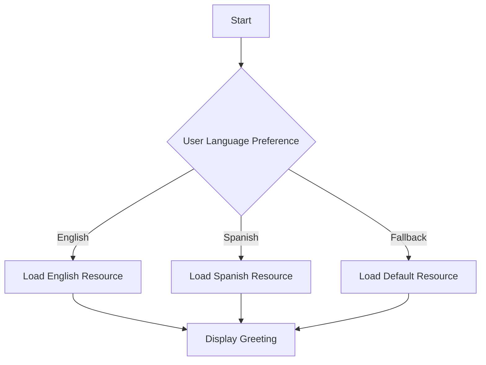

## 26.8 Best Practices for Global Applications

In today's interconnected world, building applications that cater to a global audience is not just an advantage but a necessity. As developers, we must ensure that our applications are accessible, usable, and culturally appropriate for users from diverse backgrounds. This section will guide you through the best practices for internationalization (i18n) and localization (l10n) in Erlang, emphasizing the importance of designing with flexibility for multiple languages and cultural contexts.

### Key Principles for Internationalization and Localization

#### Understanding Internationalization (i18n)

Internationalization is the process of designing your application so that it can be adapted to various languages and regions without requiring engineering changes. It involves:

- **Separating Text from Code**: Ensure that all user-facing text is stored outside the codebase, typically in resource files. This allows easy translation and adaptation.
- **Using Unicode**: Adopt Unicode (UTF-8) for text encoding to support a wide range of characters and symbols from different languages.
- **Designing Flexible UI**: Create user interfaces that can accommodate text expansion and contraction, as different languages vary in length for the same content.

#### Understanding Localization (l10n)

Localization is the process of adapting your application to a specific locale, which includes translating text and adjusting other locale-specific content. It involves:

- **Translating Text**: Convert all user-facing text into the target language, ensuring accuracy and cultural relevance.
- **Adapting Formats**: Adjust date, time, number, and currency formats to match local conventions.
- **Cultural Sensitivity**: Ensure that images, colors, and symbols are culturally appropriate for the target audience.

### Designing with Flexibility for Multiple Languages

#### Implementing Language Support

To support multiple languages in Erlang applications, follow these steps:

1. **Resource Files**: Store all translatable text in external resource files. Use a structured format like JSON or XML for easy parsing and management.

   ```erlang
   % Example JSON resource file for English
   {
     "greeting": "Hello",
     "farewell": "Goodbye"
   }
   ```

2. **Dynamic Loading**: Implement a mechanism to dynamically load the appropriate resource file based on the user's language preference.

   ```erlang
   -module(language_loader).
   -export([load_language/1]).

   load_language(LanguageCode) ->
       FilePath = filename:join(["resources", LanguageCode ++ ".json"]),
       {ok, Binary} = file:read_file(FilePath),
       {ok, Json} = jsx:decode(Binary),
       Json.
   ```

3. **Fallback Mechanism**: Provide a default language (e.g., English) as a fallback if the user's preferred language is not available.

#### Handling Text Expansion

Different languages require different amounts of space for the same content. Design your UI to accommodate text expansion:

- **Responsive Layouts**: Use flexible layouts that can adjust to varying text lengths.
- **Avoid Fixed Widths**: Refrain from using fixed-width containers for text elements.

### Considerations for Cultural Sensitivity and Appropriateness

#### Cultural Context in Content

When localizing content, consider the cultural context to ensure appropriateness:

- **Images and Symbols**: Choose images and symbols that are universally understood or culturally specific to the target audience.
- **Colors**: Be aware of color meanings in different cultures. For example, white is associated with purity in some cultures and mourning in others.

#### Inclusive Language

Use inclusive language that respects all users:

- **Gender-Neutral Terms**: Avoid gender-specific terms unless necessary. Use neutral alternatives where possible.
- **Avoid Idioms and Slang**: Idioms and slang may not translate well and can confuse non-native speakers.

### Guidelines for Handling Locale-Specific Content Beyond Text

#### Adapting Visual Elements

Beyond text, other elements of your application may need localization:

- **Images**: Use culturally relevant images that resonate with the target audience.
- **Icons and Symbols**: Ensure icons and symbols are universally understood or adapted for specific locales.

#### Adjusting Formats

Locale-specific formats are crucial for user comprehension:

- **Date and Time**: Use libraries like `calendar` in Erlang to format dates and times according to local conventions.
- **Numbers and Currency**: Format numbers and currency using locale-aware libraries to ensure accuracy.

### Continuous Localization Efforts

Localization is not a one-time task but an ongoing process:

- **Regular Updates**: Continuously update translations and locale-specific content as your application evolves.
- **Feedback Mechanism**: Implement a feedback mechanism to gather user input on localization quality and make improvements.

### Code Example: A Simple Internationalized Greeting Application

Let's create a simple Erlang application that greets users in their preferred language.

```erlang
-module(greeting_app).
-export([start/1]).

start(LanguageCode) ->
    LanguageData = language_loader:load_language(LanguageCode),
    Greeting = maps:get("greeting", LanguageData, "Hello"),
    io:format("~s~n", [Greeting]).
```

**Try It Yourself**: Modify the `greeting_app` module to include farewells and test it with different language codes.

### Visualizing the Localization Process



**Diagram Description**: This flowchart illustrates the process of loading language resources based on user preference and displaying the appropriate greeting.

### References and Links

- [Unicode Consortium](https://unicode.org/)
- [W3C Internationalization](https://www.w3.org/International/)
- [MDN Web Docs on i18n](https://developer.mozilla.org/en-US/docs/Web/Internationalization)

### Knowledge Check

- What are the key differences between internationalization and localization?
- How can you ensure your application is culturally sensitive?
- Why is it important to separate text from code in internationalized applications?

### Embrace the Journey

Remember, building global applications is an ongoing journey. As you progress, you'll learn more about the nuances of different cultures and languages. Keep experimenting, stay curious, and enjoy the process of making your application accessible to a worldwide audience.

## Quiz: Best Practices for Global Applications



### What is the primary goal of internationalization?

- [x] To design applications that can be adapted to various languages and regions without requiring engineering changes.
- [ ] To translate all user-facing text into multiple languages.
- [ ] To ensure cultural sensitivity in images and symbols.
- [ ] To adjust date and time formats for different locales.

> **Explanation:** Internationalization focuses on designing applications for easy adaptation to various languages and regions.

### Which of the following is a key principle of localization?

- [ ] Separating text from code.
- [x] Translating text and adjusting locale-specific content.
- [ ] Using Unicode for text encoding.
- [ ] Designing flexible UI layouts.

> **Explanation:** Localization involves translating text and adjusting content to fit specific locales.

### Why is it important to use Unicode in internationalized applications?

- [x] To support a wide range of characters and symbols from different languages.
- [ ] To separate text from code.
- [ ] To ensure cultural sensitivity.
- [ ] To provide a fallback language.

> **Explanation:** Unicode supports diverse characters and symbols, essential for internationalization.

### What should you avoid when designing UI for multiple languages?

- [ ] Responsive layouts.
- [x] Fixed-width containers for text elements.
- [ ] Dynamic loading of resource files.
- [ ] Providing a fallback language.

> **Explanation:** Fixed-width containers can cause issues with text expansion in different languages.

### How can you ensure cultural sensitivity in your application?

- [x] Choose culturally relevant images and symbols.
- [ ] Use fixed-width containers for text.
- [x] Avoid idioms and slang.
- [ ] Use gender-specific terms.

> **Explanation:** Culturally relevant images and avoiding idioms ensure sensitivity.

### What is a fallback mechanism in internationalization?

- [x] A default language used if the user's preferred language is unavailable.
- [ ] A method for translating text.
- [ ] A way to adjust date and time formats.
- [ ] A process for separating text from code.

> **Explanation:** A fallback mechanism provides a default language when the preferred one is unavailable.

### Why is continuous localization important?

- [x] To keep translations and locale-specific content updated as the application evolves.
- [ ] To separate text from code.
- [x] To gather user feedback on localization quality.
- [ ] To use Unicode for text encoding.

> **Explanation:** Continuous localization ensures content remains relevant and accurate.

### What is the purpose of resource files in internationalization?

- [x] To store all translatable text outside the codebase.
- [ ] To adjust date and time formats.
- [ ] To provide a fallback language.
- [ ] To ensure cultural sensitivity.

> **Explanation:** Resource files store translatable text, facilitating easy updates and translations.

### How can you handle text expansion in UI design?

- [x] Use responsive layouts that adjust to varying text lengths.
- [ ] Use fixed-width containers for text.
- [ ] Avoid dynamic loading of resource files.
- [ ] Provide a fallback language.

> **Explanation:** Responsive layouts accommodate text expansion in different languages.

### True or False: Localization is a one-time task.

- [ ] True
- [x] False

> **Explanation:** Localization is an ongoing process that requires regular updates and adjustments.




