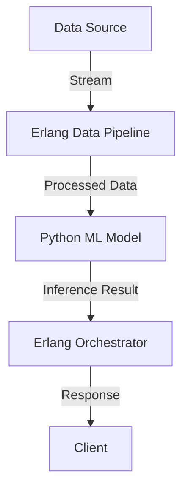

## 27.3 Artificial Intelligence and Machine Learning

### Introduction

Artificial Intelligence (AI) and Machine Learning (ML) are transforming industries by enabling systems to learn from data and make intelligent decisions. While Erlang is not traditionally associated with AI/ML, its robust concurrency model and real-time processing capabilities make it a compelling choice for orchestrating AI/ML services and managing data pipelines. In this section, we will explore how Erlang can be integrated with AI/ML applications, leveraging its strengths to enhance performance and scalability.

### The Intersection of Erlang and AI/ML

Erlang's strengths lie in its ability to handle concurrent processes efficiently, making it ideal for real-time data processing and distributed systems. These capabilities can be harnessed to support AI/ML applications in several ways:

1. **Orchestrating AI/ML Services**: Erlang can manage and coordinate AI/ML services, ensuring seamless communication and data flow between different components.
2. **Data Pipeline Management**: With its ability to handle large volumes of data concurrently, Erlang can be used to build and manage data pipelines that feed into AI/ML models.
3. **Integration with ML Languages**: Erlang can integrate with languages like Python, which are commonly used for ML, through ports or Native Implemented Functions (NIFs).

### Orchestrating AI/ML Services with Erlang

Erlang's concurrency model allows it to manage multiple AI/ML services simultaneously, ensuring efficient resource utilization and minimizing latency. This is particularly useful in scenarios where AI/ML models need to be deployed in a distributed environment.

#### Example: Managing AI/ML Services

Consider a scenario where we have multiple AI/ML models deployed as microservices. Erlang can be used to orchestrate these services, handling requests and responses efficiently.

```erlang
-module(ai_service_manager).
-export([start/0, handle_request/1]).

start() ->
    % Start the service manager
    spawn(fun() -> loop() end).

loop() ->
    receive
        {request, Service, Data} ->
            % Forward the request to the appropriate service
            Service ! {process, self(), Data},
            loop();
        {response, Result} ->
            % Handle the response from the service
            io:format("Received result: ~p~n", [Result]),
            loop()
    end.

handle_request(Service, Data) ->
    % Send a request to the service manager
    ai_service_manager ! {request, Service, Data}.
```

In this example, the `ai_service_manager` module manages requests to different AI/ML services. It receives requests, forwards them to the appropriate service, and handles responses.

### Integrating Erlang with ML Languages

Erlang can be integrated with languages like Python, which are commonly used for ML, using ports or NIFs. This allows Erlang to leverage the extensive ML libraries available in these languages while maintaining its concurrency advantages.

#### Using Ports for Integration

Ports provide a way to communicate between Erlang and external programs, such as Python scripts running ML models.

```erlang
-module(python_integration).
-export([start/0, call_python/1]).

start() ->
    Port = open_port({spawn, "python3 ml_model.py"}, [binary]),
    call_python(Port, "input_data").

call_python(Port, Data) ->
    Port ! {self(), {command, Data}},
    receive
        {Port, {data, Result}} ->
            io:format("Python result: ~p~n", [Result])
    end.
```

In this example, we use a port to communicate with a Python script (`ml_model.py`). The Erlang process sends data to the Python script and receives the result.

#### Using NIFs for Performance

For performance-critical applications, NIFs can be used to execute native code directly within the Erlang VM. This approach is more complex but offers better performance than ports.

### Benefits of Erlang's Concurrency in AI/ML

Erlang's concurrency model provides several benefits for AI/ML applications:

1. **Real-Time Data Processing**: Erlang can handle real-time data streams efficiently, making it suitable for applications like real-time analytics and monitoring.
2. **Scalability**: Erlang's lightweight processes allow it to scale horizontally, handling large volumes of data and requests.
3. **Fault Tolerance**: Erlang's "let it crash" philosophy ensures that failures are isolated and do not affect the entire system.

### Real-Time Data Processing with Erlang

Real-time data processing is crucial for many AI/ML applications, such as fraud detection and recommendation systems. Erlang's ability to handle concurrent data streams makes it an excellent choice for these applications.

#### Example: Real-Time Data Processing

Consider a real-time recommendation system that processes user interactions and updates recommendations on the fly.

```erlang
-module(recommendation_system).
-export([start/0, process_event/1]).

start() ->
    spawn(fun() -> loop() end).

loop() ->
    receive
        {event, UserId, Interaction} ->
            % Process the user interaction
            Recommendations = update_recommendations(UserId, Interaction),
            io:format("Updated recommendations for user ~p: ~p~n", [UserId, Recommendations]),
            loop()
    end.

process_event(UserId, Interaction) ->
    recommendation_system ! {event, UserId, Interaction}.

update_recommendations(UserId, Interaction) ->
    % Dummy implementation for updating recommendations
    [Interaction | get_current_recommendations(UserId)].

get_current_recommendations(_UserId) ->
    % Dummy implementation for retrieving current recommendations
    [].
```

In this example, the `recommendation_system` module processes user interactions in real-time, updating recommendations as new data arrives.

### Hybrid Architectures: Combining Erlang with AI/ML Tools

Hybrid architectures that combine Erlang with AI/ML tools can leverage the strengths of both. Erlang can handle the orchestration and real-time processing, while languages like Python can perform the heavy lifting of model training and inference.

#### Example: Hybrid Architecture

Consider a hybrid architecture where Erlang manages the data pipeline and orchestrates AI/ML services, while Python handles model training and inference.



In this architecture, Erlang processes data streams and forwards processed data to a Python ML model. The model performs inference, and the result is sent back to the Erlang orchestrator, which responds to the client.

### Encouragement to Explore

Exploring the integration of Erlang with AI/ML opens up new possibilities for building scalable, real-time applications. By combining Erlang's concurrency model with the powerful ML libraries available in languages like Python, developers can create hybrid architectures that leverage the best of both worlds.

### Try It Yourself

To get hands-on experience, try modifying the code examples provided. Experiment with different data processing techniques, integrate with various ML models, and explore the use of ports and NIFs for communication between Erlang and other languages.

### Knowledge Check

- How can Erlang's concurrency model benefit AI/ML applications?
- What are the advantages of using ports for integrating Erlang with ML languages?
- How can Erlang be used to manage real-time data processing for AI/ML applications?

### Summary

In this section, we've explored how Erlang can be integrated with AI/ML applications, leveraging its concurrency and real-time processing capabilities. By orchestrating AI/ML services, managing data pipelines, and integrating with ML languages, Erlang can enhance the performance and scalability of AI/ML systems.

## Quiz: Artificial Intelligence and Machine Learning



### How can Erlang's concurrency model benefit AI/ML applications?

- [x] By handling real-time data streams efficiently
- [ ] By providing built-in ML libraries
- [ ] By simplifying model training
- [ ] By reducing code complexity

> **Explanation:** Erlang's concurrency model allows it to handle real-time data streams efficiently, making it suitable for AI/ML applications that require real-time processing.

### What is a common method for integrating Erlang with Python for ML tasks?

- [x] Using ports
- [ ] Using gen_server
- [ ] Using ETS
- [ ] Using supervisors

> **Explanation:** Ports provide a way to communicate between Erlang and external programs, such as Python scripts running ML models.

### What is the benefit of using NIFs for Erlang and ML integration?

- [x] Improved performance
- [ ] Easier debugging
- [ ] Simplified code
- [ ] Better error handling

> **Explanation:** NIFs allow native code to be executed directly within the Erlang VM, offering better performance than ports for performance-critical applications.

### Which Erlang feature is particularly useful for real-time data processing in AI/ML?

- [x] Lightweight processes
- [ ] Pattern matching
- [ ] List comprehensions
- [ ] Macros

> **Explanation:** Erlang's lightweight processes allow it to handle concurrent data streams efficiently, making it ideal for real-time data processing.

### What is a key advantage of hybrid architectures combining Erlang with AI/ML tools?

- [x] Leveraging the strengths of both Erlang and ML languages
- [ ] Simplifying code structure
- [ ] Reducing development time
- [ ] Eliminating the need for external libraries

> **Explanation:** Hybrid architectures allow developers to leverage Erlang's concurrency model and the powerful ML libraries available in languages like Python.

### How does Erlang's "let it crash" philosophy benefit AI/ML applications?

- [x] By ensuring failures are isolated
- [ ] By simplifying error handling
- [ ] By reducing code complexity
- [ ] By improving model accuracy

> **Explanation:** Erlang's "let it crash" philosophy ensures that failures are isolated and do not affect the entire system, enhancing fault tolerance.

### What is a common use case for Erlang in AI/ML applications?

- [x] Orchestrating AI/ML services
- [ ] Training ML models
- [ ] Visualizing data
- [ ] Simplifying algorithms

> **Explanation:** Erlang is often used to orchestrate AI/ML services, managing communication and data flow between different components.

### Which Erlang feature allows for communication with external programs like Python?

- [x] Ports
- [ ] Supervisors
- [ ] Gen_server
- [ ] ETS

> **Explanation:** Ports provide a way to communicate between Erlang and external programs, such as Python scripts running ML models.

### What is a benefit of using Erlang for managing data pipelines in AI/ML?

- [x] Efficient handling of large volumes of data
- [ ] Built-in ML libraries
- [ ] Simplified model training
- [ ] Reduced code complexity

> **Explanation:** Erlang's concurrency model allows it to handle large volumes of data efficiently, making it suitable for managing data pipelines in AI/ML applications.

### True or False: Erlang is traditionally used for AI/ML model training.

- [ ] True
- [x] False

> **Explanation:** Erlang is not traditionally used for AI/ML model training, but it can be integrated with languages like Python to leverage ML libraries.



Remember, this is just the beginning. As you progress, you'll discover more ways to integrate Erlang with AI/ML applications, building scalable and efficient systems. Keep experimenting, stay curious, and enjoy the journey!
