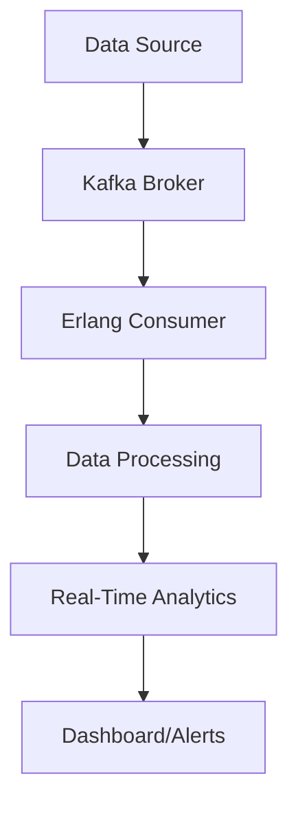

## 27.4 Real-Time Analytics and Big Data

In the ever-evolving landscape of technology, the ability to process and analyze data in real-time is becoming increasingly crucial. Erlang, with its robust concurrency model and fault-tolerant design, is uniquely positioned to handle the demands of real-time analytics and big data processing. In this section, we will explore the requirements of real-time data processing, how Erlang's concurrent processes efficiently manage large volumes of data, and how Erlang integrates with stream processing frameworks and technologies like Apache Kafka.

### Understanding Real-Time Data Processing and Big Data Analytics

Real-time data processing involves the continuous input, processing, and output of data in a manner that allows for immediate insights and actions. This is essential in scenarios where timely information is critical, such as financial trading, fraud detection, and IoT applications. Big data analytics, on the other hand, involves analyzing large and complex data sets to uncover patterns, correlations, and insights.

#### Key Requirements for Real-Time Data Processing

1. **Low Latency**: The system must process data with minimal delay to provide timely insights.
2. **High Throughput**: The ability to handle a large volume of data efficiently.
3. **Scalability**: The system should scale horizontally to accommodate growing data volumes.
4. **Fault Tolerance**: The ability to continue operating in the event of failures.
5. **Flexibility**: Support for various data sources and formats.

### Erlang's Strengths in Real-Time Analytics

Erlang's design is inherently suited for real-time analytics due to its lightweight processes, message-passing concurrency, and fault-tolerant architecture. Let's delve into how these features contribute to handling large volumes of data efficiently.

#### Concurrent Processes

Erlang's concurrency model is based on the Actor model, where each process is isolated and communicates with others via message passing. This model allows for:

- **Parallel Processing**: Multiple processes can run concurrently, making full use of multi-core processors.
- **Isolation**: Faults in one process do not affect others, enhancing reliability.
- **Scalability**: Processes can be distributed across nodes in a cluster, allowing the system to scale horizontally.

#### Fault Tolerance

Erlang's "let it crash" philosophy, combined with its supervision trees, ensures that systems can recover from failures gracefully. This is crucial in real-time analytics, where uptime and reliability are paramount.

#### Code Example: Basic Concurrent Process

```erlang
-module(real_time_example).
-export([start/0, process_data/1]).

start() ->
    Pid = spawn(fun() -> process_data([]) end),
    Pid ! {data, "Sample data"}.

process_data(Data) ->
    receive
        {data, NewData} ->
            io:format("Processing data: ~p~n", [NewData]),
            process_data([NewData | Data]);
        stop ->
            io:format("Stopping process.~n")
    end.
```

*In this example, we spawn a process to handle incoming data messages. The process can be extended to handle real-time data streams.*

### Integrating Erlang with Stream Processing Frameworks

Erlang can be integrated with various stream processing frameworks to enhance its capabilities in handling real-time data streams. One popular choice is Apache Kafka, a distributed event streaming platform.

#### Apache Kafka Integration

Apache Kafka is widely used for building real-time data pipelines and streaming applications. Erlang can interact with Kafka using Erlang clients like `brod` or `kafka_ex`.

##### Code Example: Consuming Kafka Messages with `brod`

```erlang
%% Assuming brod is already configured and started
-module(kafka_consumer).
-export([start/0]).

start() ->
    Topic = <<"my_topic">>,
    GroupId = <<"my_group">>,
    brod:start_link_group_subscriber(GroupId, [{brod_topic_subscriber, Topic, ?MODULE, []}]).

handle_message(_Topic, _Partition, _Offset, Message, _State) ->
    io:format("Received message: ~p~n", [Message]),
    ack.
```

*This example demonstrates how to consume messages from a Kafka topic using the `brod` client.*

#### Performance Considerations and Scalability

When dealing with real-time analytics and big data, performance and scalability are critical. Here are some considerations:

- **Efficient Data Structures**: Use Erlang's efficient data structures like binaries for handling large data efficiently.
- **Load Balancing**: Distribute processes across nodes to balance the load and prevent bottlenecks.
- **Monitoring and Profiling**: Use tools like `observer` and `etop` to monitor system performance and identify bottlenecks.

### Visualizing Erlang's Real-Time Data Processing

To better understand how Erlang handles real-time data processing, let's visualize the flow of data through an Erlang-based system.



*This diagram illustrates the flow of data from a source through Kafka to an Erlang consumer, where it is processed and analyzed in real-time.*

### Try It Yourself

To get hands-on experience, try modifying the provided code examples. For instance, extend the `process_data/1` function to perform more complex data transformations or integrate additional data sources into the Kafka consumer.

### Knowledge Check

- What are the key requirements for real-time data processing?
- How does Erlang's concurrency model benefit real-time analytics?
- What are some considerations for integrating Erlang with Apache Kafka?

### Summary

In this section, we've explored how Erlang's concurrency model and fault-tolerant design make it an excellent choice for real-time analytics and big data processing. We've also seen how Erlang can be integrated with stream processing frameworks like Apache Kafka to handle large volumes of data efficiently. Remember, this is just the beginning. As you continue to explore Erlang's capabilities, you'll discover even more ways to leverage its strengths in real-time data processing.

## Quiz: Real-Time Analytics and Big Data



### What is a key requirement for real-time data processing?

- [x] Low Latency
- [ ] High Latency
- [ ] Low Throughput
- [ ] High Complexity

> **Explanation:** Low latency is crucial for real-time data processing to ensure timely insights and actions.

### How does Erlang's concurrency model benefit real-time analytics?

- [x] Parallel Processing
- [x] Fault Isolation
- [ ] Single-threaded Execution
- [ ] High Memory Usage

> **Explanation:** Erlang's concurrency model allows for parallel processing and fault isolation, which are beneficial for real-time analytics.

### Which Erlang client can be used to integrate with Apache Kafka?

- [x] brod
- [ ] cowboy
- [ ] mochiweb
- [ ] hackney

> **Explanation:** `brod` is an Erlang client that can be used to integrate with Apache Kafka.

### What is the "let it crash" philosophy in Erlang?

- [x] Allowing processes to fail and recover automatically
- [ ] Preventing any process from crashing
- [ ] Ignoring process failures
- [ ] Manually restarting failed processes

> **Explanation:** The "let it crash" philosophy involves allowing processes to fail and recover automatically using supervision trees.

### What tool can be used to monitor Erlang system performance?

- [x] observer
- [ ] hackney
- [ ] mochiweb
- [ ] cowboy

> **Explanation:** `observer` is a tool used to monitor Erlang system performance.

### What is a benefit of using Erlang's message-passing concurrency?

- [x] Isolation between processes
- [ ] Shared memory access
- [ ] Global state management
- [ ] Single-threaded execution

> **Explanation:** Erlang's message-passing concurrency provides isolation between processes, enhancing reliability.

### Which of the following is a stream processing framework?

- [x] Apache Kafka
- [ ] mochiweb
- [ ] cowboy
- [ ] hackney

> **Explanation:** Apache Kafka is a stream processing framework used for building real-time data pipelines.

### What is a common use case for real-time analytics?

- [x] Fraud detection
- [ ] Batch processing
- [ ] Offline data analysis
- [ ] Static reporting

> **Explanation:** Fraud detection is a common use case for real-time analytics due to the need for immediate insights.

### How can Erlang processes be distributed for scalability?

- [x] Across nodes in a cluster
- [ ] Within a single node
- [ ] Using shared memory
- [ ] By increasing process priority

> **Explanation:** Erlang processes can be distributed across nodes in a cluster to achieve scalability.

### True or False: Erlang is not suitable for real-time data processing.

- [ ] True
- [x] False

> **Explanation:** False. Erlang is well-suited for real-time data processing due to its concurrency model and fault-tolerant design.



Remember, this is just the beginning. As you progress, you'll build more complex and interactive systems. Keep experimenting, stay curious, and enjoy the journey!
