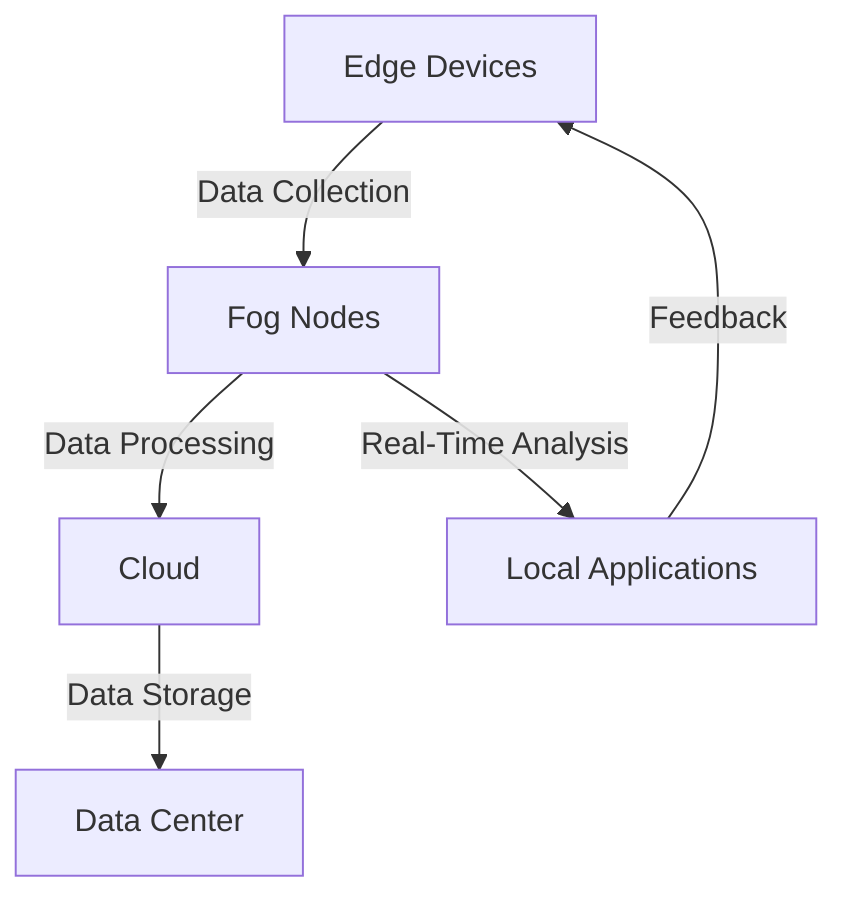

## 27.5 Edge Computing and Fog Computing

In this section, we delve into the fascinating world of edge and fog computing, exploring how Erlang's unique features make it an excellent choice for these emerging technologies. We will define these concepts, discuss their significance, and provide practical examples of deploying Erlang applications in such environments. Additionally, we will address the challenges posed by limited resources and intermittent connectivity, and offer strategies for optimizing Erlang applications for edge computing.

### Understanding Edge and Fog Computing

**Edge Computing** refers to the practice of processing data near the source of data generation, rather than relying on a centralized data-processing warehouse. This approach reduces latency, conserves bandwidth, and enhances real-time data processing capabilities. Edge computing is crucial in scenarios where immediate data processing is required, such as in autonomous vehicles, IoT devices, and smart grids.

**Fog Computing**, on the other hand, extends cloud computing to the edge of the network, providing a decentralized computing infrastructure. It acts as an intermediary layer between the cloud and edge devices, offering additional processing power and storage capabilities closer to the data source. Fog computing is particularly beneficial in applications requiring low latency and high throughput, such as video streaming and industrial automation.

### The Significance of Edge and Fog Computing

The rise of IoT devices and the increasing demand for real-time data processing have made edge and fog computing indispensable. These technologies enable faster decision-making, reduce the load on centralized data centers, and improve the overall efficiency of data processing systems. By processing data closer to its source, edge and fog computing minimize latency and enhance the responsiveness of applications.

### Erlang's Suitability for Decentralized Computing Models

Erlang's distributed nature and robust concurrency model make it an ideal candidate for edge and fog computing environments. Here are some reasons why Erlang excels in these decentralized computing models:

1. **Concurrency and Fault Tolerance**: Erlang's lightweight processes and "let it crash" philosophy ensure that applications remain responsive and resilient, even in the face of failures.

2. **Distributed Computing**: Erlang's built-in support for distributed computing allows for seamless communication between nodes, making it easy to deploy applications across multiple edge devices and fog nodes.

3. **Scalability**: Erlang's ability to handle thousands of concurrent processes makes it well-suited for scaling applications across a distributed network of edge and fog devices.

4. **Hot Code Swapping**: Erlang's support for hot code swapping allows for updates and maintenance without downtime, which is crucial in environments where continuous operation is required.

### Deploying Erlang Applications on Edge Devices

Deploying Erlang applications on edge devices involves several considerations, including resource constraints, connectivity issues, and the need for efficient data processing. Let's explore some practical examples and strategies for deploying Erlang applications in edge computing environments.

#### Example: Real-Time Data Processing on IoT Devices

Consider an IoT application that monitors environmental conditions in a smart city. The application collects data from various sensors and processes it in real-time to provide insights and alerts. Here's how Erlang can be used to implement such an application:

```erlang
-module(env_monitor).
-export([start/0, process_data/1]).

start() ->
    % Start the sensor data collection process
    spawn(fun() -> collect_data() end).

collect_data() ->
    % Simulate data collection from sensors
    SensorData = [{temperature, 22}, {humidity, 60}, {air_quality, 30}],
    process_data(SensorData),
    timer:sleep(1000), % Collect data every second
    collect_data().

process_data(Data) ->
    % Process the sensor data
    lists:foreach(fun({Key, Value}) ->
        io:format("~p: ~p~n", [Key, Value])
    end, Data).
```

In this example, the `env_monitor` module collects data from sensors and processes it in real-time. The use of Erlang's lightweight processes allows for efficient data collection and processing, even on resource-constrained edge devices.

#### Example: Distributed Video Processing in Fog Computing

In a fog computing scenario, consider an application that processes video streams from multiple cameras for security surveillance. The application distributes the processing load across several fog nodes to reduce latency and improve performance.

```erlang
-module(video_processor).
-export([start/1, process_stream/1]).

start(NodeList) ->
    % Distribute video processing tasks across fog nodes
    lists:foreach(fun(Node) ->
        spawn(Node, fun() -> process_stream(Node) end)
    end, NodeList).

process_stream(Node) ->
    % Simulate video stream processing
    io:format("Processing video stream on node: ~p~n", [Node]),
    timer:sleep(5000), % Simulate processing time
    process_stream(Node).
```

In this example, the `video_processor` module distributes video processing tasks across multiple fog nodes. Erlang's distributed computing capabilities enable seamless communication and coordination between nodes, ensuring efficient processing of video streams.

### Challenges in Edge and Fog Computing

While edge and fog computing offer numerous benefits, they also present several challenges that must be addressed when deploying Erlang applications:

1. **Limited Resources**: Edge devices often have limited processing power, memory, and storage. Erlang's lightweight processes help mitigate these constraints, but careful resource management is still necessary.

2. **Intermittent Connectivity**: Edge devices may experience intermittent connectivity, making it challenging to maintain consistent communication with other nodes. Erlang's robust fault tolerance and distributed computing features can help manage these connectivity issues.

3. **Security Concerns**: Deploying applications on edge devices and fog nodes introduces security risks, such as unauthorized access and data breaches. Implementing secure communication protocols and data encryption is essential to protect sensitive information.

4. **Data Consistency**: Ensuring data consistency across distributed edge and fog nodes can be challenging, especially in scenarios with high data volumes and frequent updates. Erlang's distributed database solutions, such as Mnesia, can help manage data consistency.

### Optimizing Erlang Applications for Edge Computing

To optimize Erlang applications for edge computing, consider the following strategies:

1. **Efficient Resource Management**: Minimize resource usage by optimizing code and using lightweight data structures. Avoid unnecessary computations and reduce memory footprint wherever possible.

2. **Asynchronous Communication**: Use asynchronous messaging to handle intermittent connectivity and reduce latency. Erlang's message-passing model is well-suited for asynchronous communication between nodes.

3. **Data Compression**: Compress data before transmission to reduce bandwidth usage and improve data transfer speeds. Erlang's binary data handling capabilities can be leveraged for efficient data compression.

4. **Local Processing**: Perform data processing locally on edge devices to minimize data transfer and reduce latency. Use Erlang's concurrency model to handle multiple processing tasks simultaneously.

5. **Security Measures**: Implement robust security measures, such as data encryption and secure communication protocols, to protect sensitive information and prevent unauthorized access.

### Visualizing Erlang in Edge and Fog Computing

To better understand how Erlang fits into edge and fog computing environments, let's visualize the architecture of a typical fog computing setup using Mermaid.js:



**Diagram Description**: This diagram illustrates the flow of data from edge devices to fog nodes and the cloud. Edge devices collect data, which is processed by fog nodes for real-time analysis. The processed data is then sent to the cloud for storage and further analysis. Local applications receive feedback from fog nodes to make real-time decisions.

### Knowledge Check

Before we conclude, let's reinforce our understanding with a few questions:

- What are the key differences between edge and fog computing?
- How does Erlang's concurrency model benefit edge computing environments?
- What are some challenges faced when deploying Erlang applications on edge devices?
- How can data consistency be maintained across distributed edge and fog nodes?

### Embrace the Journey

As we explore the potential of Erlang in edge and fog computing, remember that this is just the beginning. The field of decentralized computing is rapidly evolving, and there are countless opportunities to innovate and create impactful solutions. Keep experimenting, stay curious, and enjoy the journey!

### References and Further Reading

- [Edge Computing: Vision and Challenges](https://www.researchgate.net/publication/318676844_Edge_Computing_Vision_and_Challenges)
- [Fog Computing: Principles, Architectures, and Applications](https://ieeexplore.ieee.org/document/8016573)
- [Erlang and OTP in Action](https://www.manning.com/books/erlang-and-otp-in-action)

## Quiz: Edge Computing and Fog Computing



### What is the primary goal of edge computing?

- [x] To process data near the source of data generation
- [ ] To centralize data processing in a data center
- [ ] To increase the latency of data processing
- [ ] To reduce the number of IoT devices

> **Explanation:** Edge computing aims to process data near its source to reduce latency and improve real-time processing capabilities.

### How does Erlang's concurrency model benefit edge computing?

- [x] By allowing efficient handling of multiple tasks simultaneously
- [ ] By increasing the complexity of application development
- [ ] By reducing the number of processes that can run concurrently
- [ ] By making applications less responsive

> **Explanation:** Erlang's concurrency model allows for efficient handling of multiple tasks simultaneously, making it ideal for edge computing environments.

### What is a key challenge in deploying Erlang applications on edge devices?

- [x] Limited resources such as processing power and memory
- [ ] Excessive bandwidth availability
- [ ] Unlimited storage capacity
- [ ] Constant connectivity

> **Explanation:** Edge devices often have limited resources, such as processing power and memory, which can be a challenge when deploying Erlang applications.

### What is the role of fog computing in a decentralized computing model?

- [x] To act as an intermediary layer between the cloud and edge devices
- [ ] To replace cloud computing entirely
- [ ] To centralize data processing in a single location
- [ ] To eliminate the need for edge devices

> **Explanation:** Fog computing acts as an intermediary layer between the cloud and edge devices, providing additional processing power and storage closer to the data source.

### How can data consistency be maintained across distributed edge and fog nodes?

- [x] By using distributed database solutions like Mnesia
- [ ] By ignoring data consistency altogether
- [ ] By centralizing all data in the cloud
- [ ] By using only local storage on edge devices

> **Explanation:** Distributed database solutions like Mnesia can help maintain data consistency across distributed edge and fog nodes.

### What is a benefit of local processing on edge devices?

- [x] Reduced data transfer and latency
- [ ] Increased bandwidth usage
- [ ] Higher latency in data processing
- [ ] Centralized data storage

> **Explanation:** Local processing on edge devices reduces data transfer and latency, improving the responsiveness of applications.

### What security measures are important for edge computing?

- [x] Data encryption and secure communication protocols
- [ ] Ignoring security concerns
- [ ] Allowing unauthorized access
- [ ] Disabling data encryption

> **Explanation:** Implementing data encryption and secure communication protocols is essential to protect sensitive information in edge computing environments.

### How does Erlang handle intermittent connectivity in edge computing?

- [x] By using asynchronous messaging
- [ ] By requiring constant connectivity
- [ ] By ignoring connectivity issues
- [ ] By centralizing all communication

> **Explanation:** Erlang's message-passing model supports asynchronous messaging, which helps handle intermittent connectivity in edge computing.

### What is a common use case for fog computing?

- [x] Video streaming and industrial automation
- [ ] Centralized data processing
- [ ] Reducing the number of IoT devices
- [ ] Increasing data latency

> **Explanation:** Fog computing is beneficial in applications requiring low latency and high throughput, such as video streaming and industrial automation.

### True or False: Erlang's hot code swapping feature is beneficial for continuous operation in edge computing.

- [x] True
- [ ] False

> **Explanation:** Erlang's hot code swapping allows for updates and maintenance without downtime, which is beneficial for continuous operation in edge computing environments.


