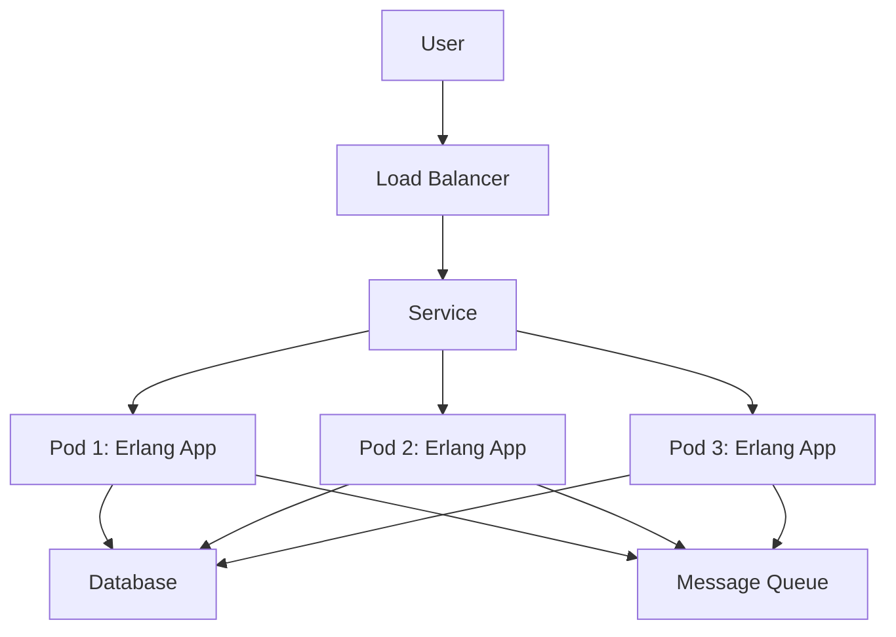

## 27.6 Cloud-Native Applications with Erlang

In the rapidly evolving landscape of software development, cloud-native applications have emerged as a paradigm that leverages the full potential of cloud computing. Erlang, with its inherent strengths in concurrency, fault tolerance, and distributed computing, is uniquely positioned to excel in this domain. In this section, we will explore how to build cloud-native applications using Erlang, focusing on principles, tools, and best practices.

### Understanding Cloud-Native Principles

Cloud-native applications are designed to fully exploit the advantages of the cloud computing model. They are typically characterized by:

- **Microservices Architecture**: Breaking down applications into smaller, independently deployable services.
- **Containerization**: Using containers to package and deploy applications consistently across environments.
- **Dynamic Orchestration**: Managing containers and workloads dynamically using orchestration tools like Kubernetes.
- **DevOps Practices**: Emphasizing continuous integration and continuous deployment (CI/CD) for rapid delivery.
- **Scalability and Resilience**: Ensuring applications can scale horizontally and recover from failures gracefully.
- **Observability**: Implementing monitoring, logging, and tracing to gain insights into application behavior.

Erlang's design aligns well with these principles, making it an excellent choice for cloud-native development.

### Erlang and Microservices

Erlang's lightweight processes and message-passing model make it ideal for building microservices. Each microservice can be implemented as an independent Erlang application, communicating with others through well-defined interfaces.

#### Key Considerations for Erlang Microservices

- **Isolation**: Use Erlang's process isolation to ensure that failures in one service do not affect others.
- **Communication**: Leverage Erlang's message-passing capabilities for inter-service communication.
- **State Management**: Use Erlang's stateful processes to manage state within services, ensuring consistency and reliability.

### Containerization with Docker

Containerization is a cornerstone of cloud-native applications, providing a consistent environment for development, testing, and production. Docker is the most popular tool for containerization, and Erlang applications can be easily containerized using Docker.

#### Dockerizing an Erlang Application

To containerize an Erlang application, follow these steps:

1. **Create a Dockerfile**: Define the environment and dependencies for your Erlang application.

    ```dockerfile
    # Use the official Erlang image from Docker Hub
    FROM erlang:latest

    # Set the working directory
    WORKDIR /app

    # Copy the application code
    COPY . .

    # Compile the Erlang application
    RUN rebar3 compile

    # Define the command to run the application
    CMD ["erl", "-pa", "_build/default/lib/*/ebin", "-s", "my_app"]
    ```

2. **Build the Docker Image**: Use the Docker CLI to build the image.

    ```bash
    docker build -t my_erlang_app .
    ```

3. **Run the Container**: Start a container from the image.

    ```bash
    docker run -d -p 8080:8080 my_erlang_app
    ```

### Orchestration with Kubernetes

Kubernetes is a powerful orchestration tool that automates the deployment, scaling, and management of containerized applications. It provides features like load balancing, self-healing, and rolling updates, which are essential for cloud-native applications.

#### Deploying Erlang Applications on Kubernetes

To deploy an Erlang application on Kubernetes, you need to define the deployment and service configurations.

1. **Create a Deployment Configuration**: Define the desired state of your application.

    ```yaml
    apiVersion: apps/v1
    kind: Deployment
    metadata:
      name: my-erlang-app
    spec:
      replicas: 3
      selector:
        matchLabels:
          app: my-erlang-app
      template:
        metadata:
          labels:
            app: my-erlang-app
        spec:
          containers:
          - name: my-erlang-app
            image: my_erlang_app:latest
            ports:
            - containerPort: 8080
    ```

2. **Create a Service Configuration**: Expose your application to the outside world.

    ```yaml
    apiVersion: v1
    kind: Service
    metadata:
      name: my-erlang-service
    spec:
      type: LoadBalancer
      selector:
        app: my-erlang-app
      ports:
      - protocol: TCP
        port: 80
        targetPort: 8080
    ```

3. **Deploy to Kubernetes**: Use `kubectl` to apply the configurations.

    ```bash
    kubectl apply -f deployment.yaml
    kubectl apply -f service.yaml
    ```

### Deploying on Cloud Platforms

Erlang applications can be deployed on various cloud platforms, each offering unique services and capabilities. Let's explore deployment on AWS, GCP, and Azure.

#### AWS (Amazon Web Services)

AWS provides a comprehensive suite of services for deploying and managing cloud-native applications.

- **Elastic Beanstalk**: Simplifies deployment and management of Erlang applications.
- **ECS (Elastic Container Service)**: Manages Docker containers at scale.
- **EKS (Elastic Kubernetes Service)**: Provides a managed Kubernetes environment.

#### GCP (Google Cloud Platform)

GCP offers robust infrastructure and services for cloud-native applications.

- **App Engine**: Supports Erlang applications with automatic scaling and management.
- **GKE (Google Kubernetes Engine)**: Offers a managed Kubernetes service.
- **Cloud Run**: Executes containers in a fully managed environment.

#### Azure

Azure provides a range of services for deploying Erlang applications.

- **Azure App Service**: Hosts web applications with built-in scaling and management.
- **AKS (Azure Kubernetes Service)**: Offers a managed Kubernetes environment.
- **Azure Functions**: Supports serverless execution of Erlang code.

### Best Practices for Cloud-Native Erlang Applications

To build effective cloud-native applications with Erlang, consider the following best practices:

- **Scalability**: Design applications to scale horizontally by adding more instances.
- **Resilience**: Implement fault tolerance using Erlang's "let it crash" philosophy and supervision trees.
- **Observability**: Use tools like Prometheus and Grafana for monitoring, and implement structured logging and tracing.
- **Security**: Ensure secure communication and data handling using encryption and access controls.
- **Automation**: Automate deployment and management using CI/CD pipelines and infrastructure as code.

### Using Cloud Services with Erlang

Cloud platforms offer a variety of services that can enhance Erlang applications, such as databases, messaging queues, and storage solutions.

- **Databases**: Use cloud-native databases like Amazon RDS, Google Cloud SQL, or Azure SQL Database for scalable data storage.
- **Messaging Queues**: Integrate with services like AWS SQS, Google Pub/Sub, or Azure Service Bus for reliable message delivery.
- **Storage**: Leverage cloud storage solutions like Amazon S3, Google Cloud Storage, or Azure Blob Storage for scalable file storage.

### Visualizing Cloud-Native Architecture

To better understand the architecture of cloud-native applications, let's visualize a typical setup using a Mermaid.js diagram.



**Diagram Description**: This diagram illustrates a cloud-native architecture where users interact with a load balancer that distributes traffic to multiple Erlang application pods. These pods communicate with a database and a message queue, ensuring scalability and resilience.

### Try It Yourself

To deepen your understanding, try modifying the Dockerfile to include additional dependencies or change the Kubernetes deployment to use a different number of replicas. Experiment with different cloud services to see how they integrate with your Erlang application.

### Knowledge Check

- What are the key principles of cloud-native applications?
- How does Erlang's concurrency model benefit microservices architecture?
- What are the steps to containerize an Erlang application using Docker?
- How can Kubernetes be used to manage Erlang applications?
- What are the best practices for deploying Erlang applications on cloud platforms?

### Embrace the Journey

Building cloud-native applications with Erlang is an exciting journey that combines the power of Erlang's concurrency and fault tolerance with the flexibility and scalability of cloud computing. Remember, this is just the beginning. As you progress, you'll discover new patterns and techniques to enhance your applications. Keep experimenting, stay curious, and enjoy the journey!

## Quiz: Cloud-Native Applications with Erlang



### What is a key characteristic of cloud-native applications?

- [x] Microservices Architecture
- [ ] Monolithic Architecture
- [ ] Single-threaded Execution
- [ ] Manual Scaling

> **Explanation:** Cloud-native applications are typically characterized by a microservices architecture, which allows for independent deployment and scaling of services.

### Which tool is commonly used for containerizing Erlang applications?

- [x] Docker
- [ ] Vagrant
- [ ] VirtualBox
- [ ] Ansible

> **Explanation:** Docker is the most popular tool for containerizing applications, providing a consistent environment across development, testing, and production.

### What is the role of Kubernetes in cloud-native applications?

- [x] Orchestration of containers
- [ ] Code compilation
- [ ] Static analysis
- [ ] Version control

> **Explanation:** Kubernetes is used for orchestrating containers, managing their deployment, scaling, and operation in a cloud-native environment.

### Which cloud platform offers Elastic Beanstalk for deploying Erlang applications?

- [x] AWS
- [ ] GCP
- [ ] Azure
- [ ] IBM Cloud

> **Explanation:** AWS Elastic Beanstalk is a service that simplifies the deployment and management of applications, including those written in Erlang.

### What is a best practice for ensuring resilience in Erlang applications?

- [x] Implementing supervision trees
- [ ] Using global variables
- [ ] Avoiding process isolation
- [ ] Disabling error logging

> **Explanation:** Implementing supervision trees is a best practice in Erlang to ensure resilience by managing process failures and restarts.

### Which service is used for reliable message delivery in cloud-native applications?

- [x] Messaging Queues
- [ ] File Storage
- [ ] Static Websites
- [ ] DNS Services

> **Explanation:** Messaging queues like AWS SQS, Google Pub/Sub, or Azure Service Bus are used for reliable message delivery in cloud-native applications.

### What is the purpose of observability in cloud-native applications?

- [x] Monitoring, logging, and tracing
- [ ] Code obfuscation
- [ ] Data encryption
- [ ] User authentication

> **Explanation:** Observability involves monitoring, logging, and tracing to gain insights into application behavior and performance.

### Which Erlang feature aligns well with the microservices architecture?

- [x] Lightweight processes
- [ ] Heavyweight threads
- [ ] Global state management
- [ ] Synchronous communication

> **Explanation:** Erlang's lightweight processes and message-passing model align well with the microservices architecture, allowing for isolated and independent services.

### What is a common use of cloud storage solutions in Erlang applications?

- [x] Scalable file storage
- [ ] Code execution
- [ ] Process management
- [ ] Network routing

> **Explanation:** Cloud storage solutions like Amazon S3, Google Cloud Storage, or Azure Blob Storage are used for scalable file storage in applications.

### True or False: Erlang applications cannot be deployed on cloud platforms.

- [ ] True
- [x] False

> **Explanation:** Erlang applications can be deployed on various cloud platforms, leveraging services like AWS, GCP, and Azure for scalability and management.


