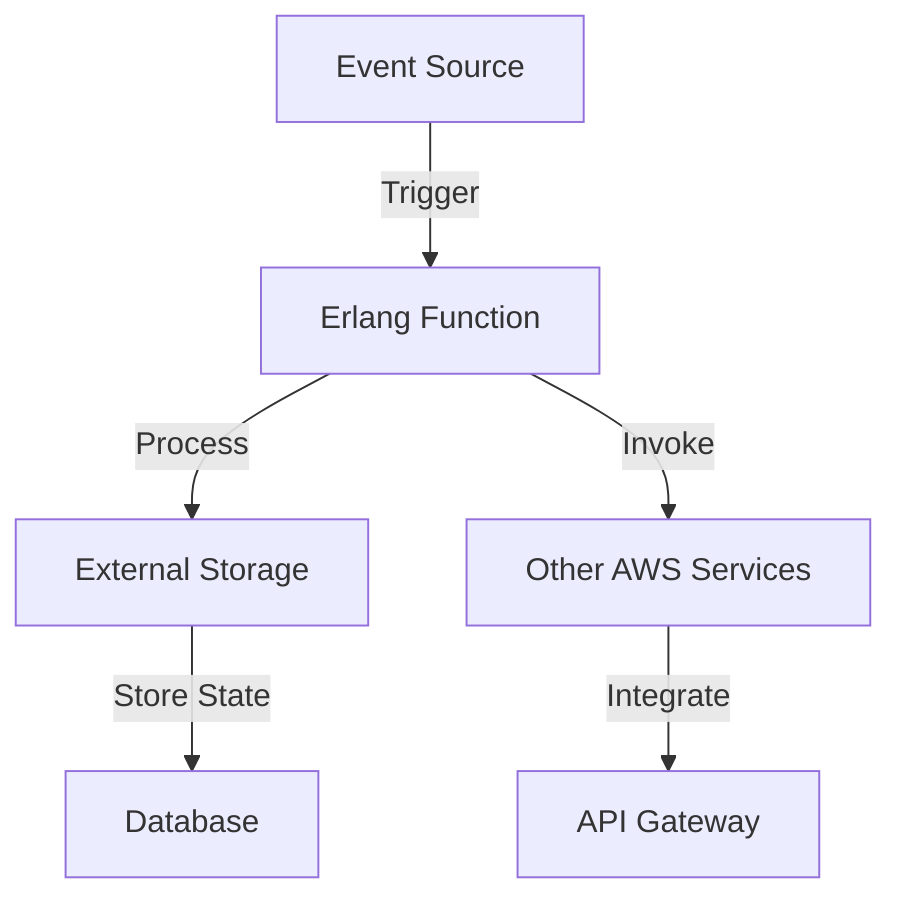

## 27.7 Serverless Architecture with Erlang

Serverless architecture is a cloud computing execution model where the cloud provider dynamically manages the allocation of machine resources. In this model, developers can focus on writing code without worrying about the underlying infrastructure. Erlang, with its robust concurrency model and fault tolerance, is uniquely positioned to excel in serverless environments. This section explores how Erlang can be leveraged in serverless architectures, the challenges involved, and the innovative solutions that can be applied.

### Understanding Serverless Architecture

Serverless architecture, often referred to as Function as a Service (FaaS), allows developers to deploy individual functions that are executed in response to events. This model abstracts the server management, enabling developers to focus solely on code and business logic. Key characteristics of serverless architecture include:

- **Event-Driven Execution**: Functions are triggered by events such as HTTP requests, database changes, or message queue updates.
- **Automatic Scaling**: Functions automatically scale with demand, handling multiple requests concurrently.
- **Pay-per-Use Pricing**: Costs are incurred based on the number of executions and the resources consumed, rather than pre-allocated server capacity.

### Challenges of Running Erlang in Serverless Environments

Running Erlang in serverless environments presents unique challenges, primarily due to the nature of Erlang's runtime and the constraints of serverless platforms like AWS Lambda. Let's explore these challenges and potential solutions:

#### Cold Starts

Cold starts occur when a function is invoked after being idle, requiring the runtime environment to be initialized. This can lead to increased latency, which is a significant concern for performance-sensitive applications.

**Solution**: To mitigate cold starts, consider using provisioned concurrency, which keeps a specified number of function instances warm and ready to handle requests. Additionally, optimizing the function's startup time by reducing dependencies and using lightweight libraries can help.

#### State Management

Serverless functions are inherently stateless, meaning they do not retain state between invocations. This can be challenging for applications that require persistent state or session management.

**Solution**: Use external storage solutions like Amazon DynamoDB, Redis, or Mnesia for state persistence. Erlang's distributed nature makes it well-suited for integrating with these storage systems, allowing for efficient state management.

#### Function Execution Limits

Serverless platforms impose limits on function execution time, memory usage, and other resources. These constraints can affect the performance of Erlang applications, especially those with long-running processes.

**Solution**: Break down complex tasks into smaller, independent functions that can be executed within the limits. Utilize Erlang's concurrency model to parallelize tasks and optimize resource usage.

### Running Erlang on AWS Lambda

AWS Lambda is a popular serverless platform that supports custom runtimes, allowing Erlang applications to be deployed. Here's how you can set up an Erlang runtime on AWS Lambda:

1. **Create a Custom Runtime**: Use AWS Lambda's custom runtime feature to create an Erlang runtime. This involves packaging the Erlang runtime and your application code into a deployment package.

2. **Deploy the Function**: Upload the deployment package to AWS Lambda and configure the function settings, including memory allocation and timeout limits.

3. **Trigger the Function**: Set up event sources such as API Gateway, S3, or DynamoDB to trigger the function in response to specific events.

4. **Monitor and Optimize**: Use AWS CloudWatch to monitor function performance and optimize resource allocation based on usage patterns.

### Use Cases for Erlang in Serverless Models

Erlang's strengths in concurrency and fault tolerance make it ideal for several serverless use cases:

#### Real-Time Data Processing

Erlang's ability to handle concurrent processes makes it suitable for real-time data processing tasks, such as processing streaming data from IoT devices or financial transactions.

#### Chat Applications

Serverless architectures can be used to build scalable chat applications, leveraging Erlang's message-passing capabilities to manage user sessions and message delivery.

#### Microservices

Erlang can be used to implement microservices in a serverless architecture, where each service is deployed as an independent function. This allows for easy scaling and maintenance of individual services.

### Considerations for Using Erlang in Serverless Paradigms

When adopting Erlang in serverless architectures, consider the following:

- **Concurrency Model**: Leverage Erlang's lightweight processes to handle concurrent requests efficiently.
- **Fault Tolerance**: Utilize Erlang's "let it crash" philosophy to build resilient functions that can recover from failures.
- **Integration with Other Services**: Take advantage of Erlang's ability to integrate with other AWS services, such as S3, DynamoDB, and SNS, to build comprehensive serverless applications.

### Encouraging Innovation with Erlang in Serverless

Erlang's unique features open up opportunities for innovation in serverless architectures. Consider experimenting with the following:

- **Custom Protocols**: Implement custom communication protocols using Erlang's message-passing capabilities.
- **Distributed Systems**: Build distributed systems that leverage Erlang's strengths in handling network partitions and maintaining consistency.
- **Event-Driven Architectures**: Design event-driven architectures that utilize Erlang's ability to handle asynchronous events efficiently.

### Conclusion

Erlang's strengths in concurrency, fault tolerance, and distributed computing make it a powerful choice for serverless architectures. By addressing the challenges of running Erlang in serverless environments and leveraging its unique features, developers can build scalable, cost-effective applications that meet the demands of modern cloud computing.

### Try It Yourself

Experiment with deploying an Erlang function on AWS Lambda using a custom runtime. Modify the function to handle different types of events and observe how Erlang's concurrency model handles multiple requests.

### Visualizing Erlang in Serverless Architecture

*Figure: Visualizing Erlang in a Serverless Architecture*

### Key Takeaways

- Erlang's concurrency and fault tolerance make it well-suited for serverless architectures.
- Address challenges like cold starts and state management with strategic solutions.
- Explore innovative use cases and leverage Erlang's unique features in serverless paradigms.

## Quiz: Serverless Architecture with Erlang



### What is a key characteristic of serverless architecture?

- [x] Event-Driven Execution
- [ ] Manual Scaling
- [ ] Fixed Pricing
- [ ] Persistent State

> **Explanation:** Serverless architecture is characterized by event-driven execution, where functions are triggered by events.

### How can cold starts be mitigated in serverless environments?

- [x] Use provisioned concurrency
- [ ] Increase function timeout
- [ ] Use larger instance types
- [ ] Disable logging

> **Explanation:** Provisioned concurrency keeps function instances warm, reducing cold start latency.

### What is a challenge of using Erlang in serverless environments?

- [x] Cold Starts
- [ ] Lack of concurrency
- [ ] High memory usage
- [ ] Inability to handle events

> **Explanation:** Cold starts are a challenge due to the initialization time required for Erlang runtimes.

### Which AWS service can be used for state management in serverless applications?

- [x] Amazon DynamoDB
- [ ] Amazon S3
- [ ] Amazon EC2
- [ ] Amazon RDS

> **Explanation:** Amazon DynamoDB is a suitable choice for managing state in serverless applications.

### What is a suitable use case for Erlang in serverless models?

- [x] Real-Time Data Processing
- [ ] Batch Processing
- [ ] Static Website Hosting
- [ ] Video Streaming

> **Explanation:** Erlang's concurrency model makes it ideal for real-time data processing tasks.

### How can function execution limits be addressed in serverless environments?

- [x] Break down tasks into smaller functions
- [ ] Increase memory allocation
- [ ] Use larger instance types
- [ ] Disable logging

> **Explanation:** Breaking down tasks into smaller functions ensures they execute within the limits.

### What is a benefit of using Erlang in serverless architectures?

- [x] Fault Tolerance
- [ ] High memory usage
- [ ] Manual scaling
- [ ] Fixed pricing

> **Explanation:** Erlang's fault tolerance is a significant advantage in serverless architectures.

### Which Erlang feature is beneficial for event-driven architectures?

- [x] Message Passing
- [ ] Manual Scaling
- [ ] High memory usage
- [ ] Fixed pricing

> **Explanation:** Erlang's message-passing capabilities are beneficial for handling asynchronous events.

### What is a consideration when using Erlang in serverless paradigms?

- [x] Concurrency Model
- [ ] Lack of scalability
- [ ] High memory usage
- [ ] Fixed pricing

> **Explanation:** Leveraging Erlang's concurrency model is crucial for efficient serverless applications.

### True or False: Erlang is not suitable for serverless architectures due to its concurrency model.

- [ ] True
- [x] False

> **Explanation:** Erlang's concurrency model is an advantage, making it suitable for serverless architectures.



Remember, this is just the beginning. As you explore serverless architectures with Erlang, you'll discover new ways to build scalable, efficient applications. Keep experimenting, stay curious, and enjoy the journey!
