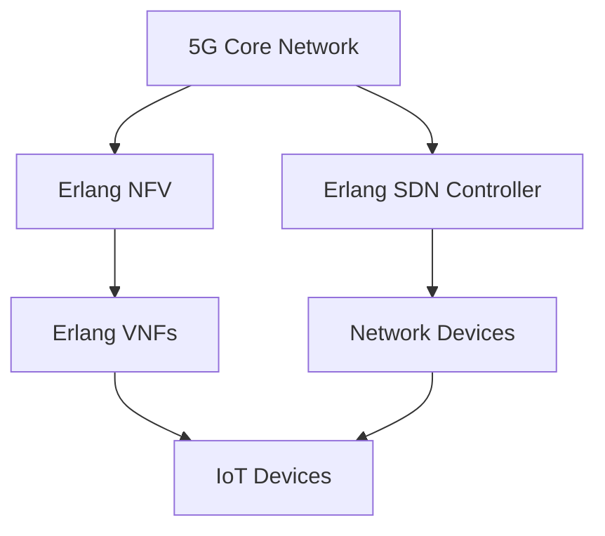

## 27.8 Erlang in 5G Networks

### Introduction to 5G Technology

The advent of 5G technology marks a significant leap forward in telecommunications, promising unprecedented speeds, ultra-low latency, and the ability to connect a massive number of devices simultaneously. As the fifth generation of mobile networks, 5G is designed to meet the ever-growing demands for data and connectivity, driven by the proliferation of IoT devices, autonomous vehicles, and smart cities.

5G networks are characterized by three key features:

1. **Enhanced Mobile Broadband (eMBB)**: Offers faster data rates and improved capacity for mobile users.
2. **Ultra-Reliable Low Latency Communications (URLLC)**: Ensures minimal delay, crucial for applications like remote surgery and autonomous driving.
3. **Massive Machine Type Communications (mMTC)**: Supports a vast number of connected devices, facilitating the Internet of Things (IoT).

These features require a robust, scalable, and reliable infrastructure, which is where Erlang comes into play.

### Erlang's Suitability for Telecommunications

Erlang, a functional programming language developed by Ericsson, has a long-standing reputation in the telecommunications industry. Its design is inherently suited to meet the demands of 5G networks due to several key characteristics:

- **Concurrency**: Erlang's lightweight process model allows it to handle thousands of concurrent connections efficiently, making it ideal for managing the massive connectivity required by 5G.
- **Fault Tolerance**: With its "let it crash" philosophy and robust error handling, Erlang ensures high reliability and uptime, critical for URLLC applications.
- **Distributed Computing**: Erlang's ability to seamlessly distribute processes across nodes supports the distributed nature of 5G networks.
- **Hot Code Swapping**: Enables updates and maintenance without downtime, essential for continuous service in telecommunications.

### Erlang in Network Functions Virtualization (NFV)

Network Functions Virtualization (NFV) is a key component of modern telecommunications infrastructure, allowing network functions to be decoupled from proprietary hardware and run as software on commodity servers. Erlang's strengths in concurrency and fault tolerance make it an excellent choice for implementing NFV solutions.

#### Example: Virtualized Network Functions (VNFs)

Consider a scenario where Erlang is used to implement a virtualized network function such as a firewall or load balancer. Erlang's ability to handle multiple connections concurrently ensures that the VNF can process traffic efficiently without becoming a bottleneck.

```erlang
-module(vnf_firewall).
-export([start/0, handle_packet/1]).

start() ->
    % Start the firewall process
    spawn(fun loop/0).

loop() ->
    receive
        {packet, Packet} ->
            handle_packet(Packet),
            loop();
        stop ->
            ok
    end.

handle_packet(Packet) ->
    % Logic to process the packet
    io:format("Processing packet: ~p~n", [Packet]).
```

In this example, the `vnf_firewall` module demonstrates a simple virtualized network function that processes incoming packets. The `handle_packet/1` function can be expanded to include complex logic for filtering and routing traffic.

### Erlang in Software-Defined Networking (SDN)

Software-Defined Networking (SDN) separates the control plane from the data plane, allowing network administrators to manage network services through abstraction of lower-level functionality. Erlang's ability to handle distributed systems and its support for real-time updates make it a strong candidate for SDN applications.

#### Example: SDN Controller

An SDN controller implemented in Erlang can manage network resources dynamically, responding to changes in network conditions in real-time.

```erlang
-module(sdn_controller).
-export([start/0, add_flow/2, remove_flow/1]).

start() ->
    % Start the SDN controller process
    spawn(fun loop/0).

loop() ->
    receive
        {add_flow, FlowId, Rules} ->
            add_flow(FlowId, Rules),
            loop();
        {remove_flow, FlowId} ->
            remove_flow(FlowId),
            loop();
        stop ->
            ok
    end.

add_flow(FlowId, Rules) ->
    % Logic to add flow rules
    io:format("Adding flow: ~p with rules: ~p~n", [FlowId, Rules]).

remove_flow(FlowId) ->
    % Logic to remove flow rules
    io:format("Removing flow: ~p~n", [FlowId]).
```

This `sdn_controller` module illustrates a basic SDN controller that can add and remove flow rules dynamically. Erlang's concurrency model allows it to handle multiple flow updates simultaneously, ensuring efficient network management.

### Handling Massive Connectivity with Erlang

One of the most significant challenges of 5G networks is managing the massive number of connected devices. Erlang's lightweight process model and efficient message-passing capabilities make it well-suited for this task.

#### Example: IoT Device Management

In a 5G-enabled IoT environment, Erlang can be used to manage thousands of devices, each represented by an Erlang process.

```erlang
-module(iot_manager).
-export([start/0, register_device/1, send_command/2]).

start() ->
    % Start the IoT manager process
    spawn(fun loop/0).

loop() ->
    receive
        {register_device, DeviceId} ->
            register_device(DeviceId),
            loop();
        {send_command, DeviceId, Command} ->
            send_command(DeviceId, Command),
            loop();
        stop ->
            ok
    end.

register_device(DeviceId) ->
    % Logic to register a new IoT device
    io:format("Registering device: ~p~n", [DeviceId]).

send_command(DeviceId, Command) ->
    % Logic to send a command to a device
    io:format("Sending command: ~p to device: ~p~n", [Command, DeviceId]).
```

The `iot_manager` module demonstrates how Erlang can be used to manage IoT devices in a 5G network. Each device can be registered and controlled through commands, showcasing Erlang's ability to handle massive connectivity.

### Erlang's Impact on 5G Technology Advancement

Erlang's unique features make it a powerful tool for advancing 5G technologies. Its ability to handle concurrent connections, provide fault tolerance, and support distributed computing aligns perfectly with the requirements of 5G networks. As 5G continues to evolve, Erlang's role in developing scalable, reliable, and efficient network solutions will become increasingly important.

### Visualizing Erlang's Role in 5G Networks

To better understand Erlang's role in 5G networks, let's visualize the architecture of a 5G network with Erlang components.



**Diagram Description**: This diagram illustrates a 5G network architecture where Erlang is used to implement NFV and SDN components. The Erlang NFV manages virtualized network functions, while the Erlang SDN Controller oversees network devices and IoT devices.

### Knowledge Check

- **Question**: How does Erlang's concurrency model benefit 5G networks?
- **Challenge**: Modify the `vnf_firewall` example to include logging of packet processing times.

### Summary

Erlang's strengths in concurrency, fault tolerance, and distributed computing make it an ideal choice for implementing 5G network solutions. Its ability to handle massive connectivity and provide real-time updates ensures that it can meet the demands of modern telecommunications infrastructure. As 5G technology continues to evolve, Erlang's role in developing scalable and reliable network solutions will be crucial.

### Embrace the Journey

Remember, this is just the beginning. As you explore Erlang's capabilities in 5G networks, you'll discover new ways to leverage its strengths in building robust and scalable telecommunications solutions. Keep experimenting, stay curious, and enjoy the journey!

## Quiz: Erlang in 5G Networks



### How does Erlang's concurrency model benefit 5G networks?

- [x] It allows handling thousands of concurrent connections efficiently.
- [ ] It reduces the need for hardware resources.
- [ ] It simplifies the network architecture.
- [ ] It eliminates the need for error handling.

> **Explanation:** Erlang's lightweight process model allows it to handle thousands of concurrent connections efficiently, which is crucial for 5G networks.

### What is a key feature of 5G networks that Erlang can support effectively?

- [x] Ultra-Reliable Low Latency Communications (URLLC)
- [ ] High power consumption
- [ ] Limited connectivity
- [ ] Static network configurations

> **Explanation:** Erlang's fault tolerance and real-time capabilities make it suitable for supporting URLLC in 5G networks.

### Which Erlang feature is beneficial for Network Functions Virtualization (NFV)?

- [x] Concurrency
- [ ] High memory usage
- [ ] Limited scalability
- [ ] Complex syntax

> **Explanation:** Erlang's concurrency model allows it to efficiently handle multiple connections, making it ideal for NFV implementations.

### How does Erlang's "let it crash" philosophy benefit 5G networks?

- [x] It ensures high reliability and uptime.
- [ ] It increases the complexity of error handling.
- [ ] It reduces the need for testing.
- [ ] It simplifies the codebase.

> **Explanation:** Erlang's "let it crash" philosophy ensures that systems can recover from errors quickly, maintaining high reliability and uptime.

### What is the role of an SDN controller in a 5G network?

- [x] To manage network resources dynamically
- [ ] To increase network latency
- [ ] To reduce network capacity
- [ ] To eliminate the need for network security

> **Explanation:** An SDN controller manages network resources dynamically, responding to changes in network conditions in real-time.

### How does Erlang handle massive connectivity in IoT environments?

- [x] By using lightweight processes for each device
- [ ] By reducing the number of connected devices
- [ ] By increasing the complexity of the network
- [ ] By limiting the number of concurrent connections

> **Explanation:** Erlang's lightweight process model allows it to manage thousands of IoT devices efficiently.

### What is a benefit of Erlang's hot code swapping in 5G networks?

- [x] It allows updates without downtime.
- [ ] It increases the need for hardware resources.
- [ ] It simplifies the network architecture.
- [ ] It eliminates the need for error handling.

> **Explanation:** Erlang's hot code swapping feature allows updates and maintenance without downtime, ensuring continuous service.

### Which Erlang feature supports distributed computing in 5G networks?

- [x] Seamless process distribution across nodes
- [ ] High memory usage
- [ ] Limited scalability
- [ ] Complex syntax

> **Explanation:** Erlang's ability to distribute processes across nodes supports the distributed nature of 5G networks.

### What is a challenge of 5G networks that Erlang can address effectively?

- [x] Managing massive numbers of connected devices
- [ ] Increasing network latency
- [ ] Reducing network capacity
- [ ] Eliminating the need for network security

> **Explanation:** Erlang's concurrency model allows it to handle massive numbers of connected devices efficiently.

### True or False: Erlang is not suitable for real-time applications in 5G networks.

- [ ] True
- [x] False

> **Explanation:** Erlang is highly suitable for real-time applications in 5G networks due to its concurrency and fault tolerance capabilities.




