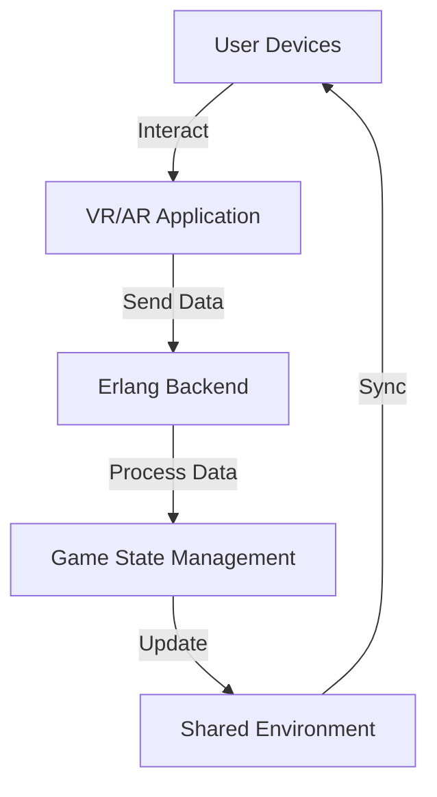

## 27.9 Virtual and Augmented Reality Applications

Virtual Reality (VR) and Augmented Reality (AR) are rapidly transforming the way we interact with digital content, offering immersive experiences that blend the physical and virtual worlds. As these technologies evolve, the demand for robust backend systems capable of handling real-time data and synchronization becomes increasingly critical. Erlang, with its powerful concurrency model and functional programming paradigm, emerges as a compelling choice for building scalable and efficient backends for VR and AR applications.

### Understanding the Backend Demands of VR and AR Applications

VR and AR applications require a backend infrastructure that can support:

- **Real-Time Data Processing**: VR and AR applications demand low-latency data processing to ensure seamless user experiences. This includes real-time updates to 3D environments, user interactions, and sensor data.
- **Synchronization**: Multiplayer VR/AR environments require precise synchronization of state across multiple users to maintain consistency and immersion.
- **Scalability**: As user bases grow, backends must scale efficiently to handle increased loads without compromising performance.
- **Reliability**: Ensuring uptime and fault tolerance is crucial, as any disruption can significantly impact user experience.

### Erlang's Concurrency Model for Real-Time Messaging and State Management

Erlang's concurrency model is built around lightweight processes and message passing, making it well-suited for the demands of VR and AR backends. Here's how Erlang can address these needs:

- **Lightweight Processes**: Erlang's processes are lightweight and can be spawned in large numbers, allowing for concurrent handling of multiple tasks such as user interactions, data updates, and network communication.
- **Message Passing**: Erlang's message-passing mechanism facilitates communication between processes without shared memory, reducing the risk of data races and ensuring consistency.
- **Fault Tolerance**: Erlang's "let it crash" philosophy and OTP framework provide robust mechanisms for error recovery and process supervision, enhancing reliability.
- **Scalability**: Erlang's distributed nature allows for easy scaling across multiple nodes, accommodating growing user bases and data loads.

### Example: Erlang in Multiplayer VR/AR Environments

Consider a multiplayer VR game where players interact in a shared virtual space. Erlang can manage the backend processes responsible for:

- **Player State Management**: Each player's state, including position, actions, and interactions, is managed by individual Erlang processes. These processes communicate with each other to synchronize the shared environment.
- **Real-Time Messaging**: Erlang's message-passing capabilities enable real-time communication between players, ensuring that actions are reflected instantly across all clients.
- **Event Handling**: Game events, such as collisions or interactions, are processed by dedicated Erlang processes, which update the game state and notify relevant players.

Here's a simplified Erlang code example illustrating a basic player process in a VR environment:

```erlang
-module(vr_player).
-export([start/1, move/2, get_state/1]).

-record(player, {id, position = {0, 0, 0}, health = 100}).

% Start a new player process
start(Id) ->
    spawn(fun() -> loop(#player{id = Id}) end).

% Move the player to a new position
move(PlayerPid, NewPosition) ->
    PlayerPid ! {move, NewPosition}.

% Get the current state of the player
get_state(PlayerPid) ->
    PlayerPid ! {get_state, self()},
    receive
        {state, State} -> State
    end.

% Player process loop
loop(State) ->
    receive
        {move, NewPosition} ->
            NewState = State#player{position = NewPosition},
            loop(NewState);
        {get_state, Caller} ->
            Caller ! {state, State},
            loop(State)
    end.
```

### Challenges in VR/AR Backend Development

While Erlang offers many advantages, there are challenges to consider:

- **Latency**: Minimizing latency is critical in VR/AR applications to prevent motion sickness and ensure smooth interactions. Network latency, processing delays, and synchronization overhead must be carefully managed.
- **Data Consistency**: Ensuring consistent state across distributed systems can be complex, especially in dynamic environments with frequent updates.
- **Resource Management**: Efficiently managing resources such as CPU, memory, and network bandwidth is essential to maintain performance and scalability.

### Erlang for Scalable VR/AR Backend Solutions

Erlang's strengths in concurrency, fault tolerance, and scalability make it an excellent choice for VR/AR backends. By leveraging Erlang's capabilities, developers can build systems that handle real-time data processing, synchronize state across users, and scale to meet growing demands.

### Visualizing Erlang's Role in VR/AR Applications

To better understand how Erlang fits into the architecture of VR/AR applications, consider the following diagram illustrating a typical backend setup:



**Diagram Description**: This diagram shows the flow of data in a VR/AR application. User devices interact with the VR/AR application, which sends data to the Erlang backend. The backend processes the data, manages the game state, updates the shared environment, and synchronizes with user devices.

### Encouragement for Erlang Adoption in VR/AR

As you explore the potential of Erlang for VR and AR applications, consider the following:

- **Experiment with Erlang's Concurrency**: Try building small-scale VR/AR prototypes using Erlang to understand its concurrency model and message-passing capabilities.
- **Leverage Erlang's Fault Tolerance**: Design systems that can recover gracefully from failures, ensuring a seamless user experience.
- **Explore Scalability Options**: Investigate how Erlang's distributed nature can help you scale your applications to accommodate more users and data.

### Summary and Key Takeaways

- Erlang's concurrency model and message-passing capabilities make it well-suited for the backend demands of VR and AR applications.
- Real-time data processing, synchronization, scalability, and reliability are critical considerations in VR/AR backend development.
- Erlang's lightweight processes, fault tolerance, and distributed nature provide a strong foundation for building scalable and efficient VR/AR backends.

### Embrace the Journey

Remember, this is just the beginning. As you delve deeper into Erlang's capabilities, you'll uncover new ways to enhance your VR and AR applications. Keep experimenting, stay curious, and enjoy the journey!

## Quiz: Virtual and Augmented Reality Applications



### What makes Erlang suitable for VR/AR backend development?

- [x] Concurrency model and message-passing capabilities
- [ ] Object-oriented programming paradigm
- [ ] Lack of fault tolerance
- [ ] High latency

> **Explanation:** Erlang's concurrency model and message-passing capabilities make it ideal for handling real-time data and synchronization in VR/AR applications.

### Which Erlang feature helps manage multiple tasks concurrently?

- [x] Lightweight processes
- [ ] Shared memory
- [ ] Global variables
- [ ] Single-threaded execution

> **Explanation:** Erlang's lightweight processes allow for concurrent handling of multiple tasks, such as user interactions and data updates.

### How does Erlang ensure communication between processes?

- [x] Message passing
- [ ] Shared memory
- [ ] Global variables
- [ ] Direct function calls

> **Explanation:** Erlang uses message passing to facilitate communication between processes, reducing the risk of data races.

### What is a key challenge in VR/AR backend development?

- [x] Latency
- [ ] High memory usage
- [ ] Lack of scalability
- [ ] Single-threaded execution

> **Explanation:** Minimizing latency is critical in VR/AR applications to ensure smooth interactions and prevent motion sickness.

### Which Erlang philosophy enhances reliability in VR/AR applications?

- [x] Let it crash
- [ ] Global state management
- [ ] Single-threaded execution
- [ ] Lack of error handling

> **Explanation:** Erlang's "let it crash" philosophy and OTP framework provide robust mechanisms for error recovery and process supervision.

### How can Erlang's distributed nature benefit VR/AR applications?

- [x] Easy scaling across multiple nodes
- [ ] Increased latency
- [ ] Reduced fault tolerance
- [ ] Single-threaded execution

> **Explanation:** Erlang's distributed nature allows for easy scaling across multiple nodes, accommodating growing user bases and data loads.

### What is a common use case for Erlang in VR/AR environments?

- [x] Multiplayer state synchronization
- [ ] Single-player game development
- [ ] Static content rendering
- [ ] Offline data processing

> **Explanation:** Erlang is commonly used for multiplayer state synchronization, ensuring consistent state across users in VR/AR environments.

### Which Erlang feature reduces the risk of data races?

- [x] Message passing
- [ ] Shared memory
- [ ] Global variables
- [ ] Direct function calls

> **Explanation:** Erlang's message-passing mechanism reduces the risk of data races by avoiding shared memory.

### What is a benefit of Erlang's lightweight processes?

- [x] Concurrent handling of multiple tasks
- [ ] Increased memory usage
- [ ] Reduced scalability
- [ ] Single-threaded execution

> **Explanation:** Erlang's lightweight processes allow for concurrent handling of multiple tasks, enhancing scalability and performance.

### True or False: Erlang's concurrency model is based on shared memory.

- [ ] True
- [x] False

> **Explanation:** False. Erlang's concurrency model is based on message passing, not shared memory.


