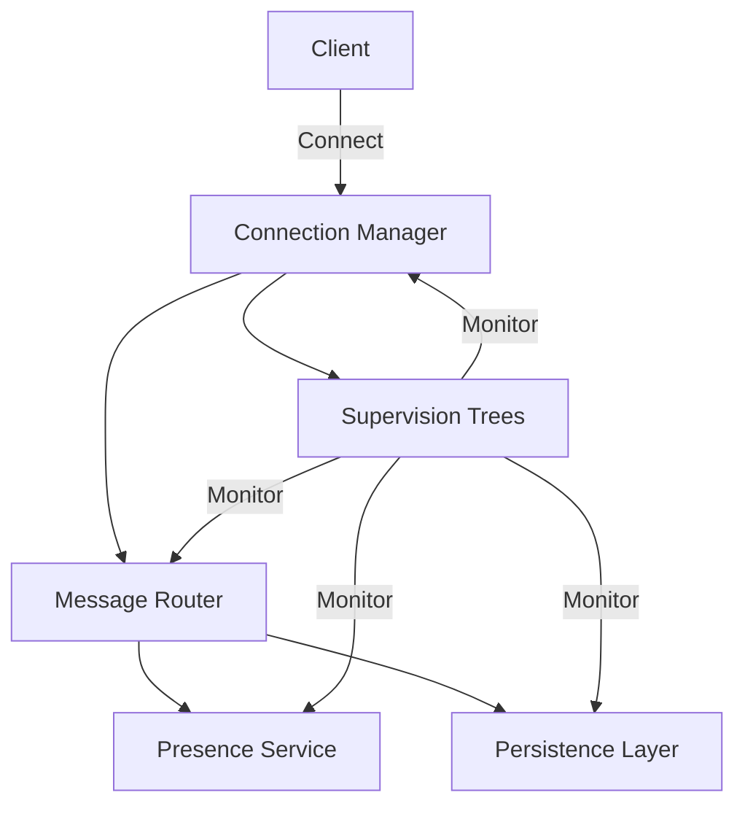
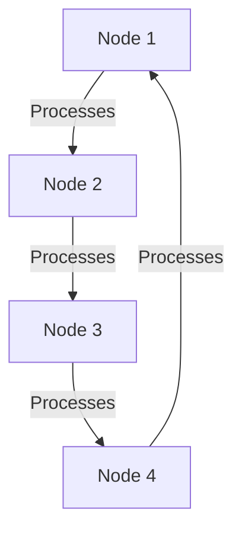

## 28.1 Building a Real-Time Messaging System

### Introduction

In this case study, we will explore the development of a real-time messaging system using Erlang, a language renowned for its ability to handle high concurrency and reliability. Real-time messaging systems are critical in today's digital communication landscape, enabling instant communication across various platforms. Erlang's unique features, such as lightweight processes and the OTP framework, make it an ideal choice for building such systems.

### System Requirements and Objectives

Before diving into the architecture and implementation, let's outline the key requirements and objectives for our real-time messaging system:

1. **High Concurrency**: The system must handle thousands of simultaneous connections without performance degradation.
2. **Low Latency**: Messages should be delivered with minimal delay to ensure a real-time experience.
3. **Scalability**: The architecture should support scaling to accommodate a growing number of users.
4. **Reliability**: The system should be fault-tolerant, ensuring continuous operation even in the face of failures.
5. **Security**: Secure communication channels and user authentication are essential.
6. **Extensibility**: The system should be easy to extend with new features and capabilities.

### Architecture Overview

The architecture of our real-time messaging system leverages Erlang's strengths in concurrency and fault tolerance. We'll use the Actor Model, where each user connection is represented by an Erlang process. The system will be structured around the following key components:

- **Connection Manager**: Handles incoming connections and manages user sessions.
- **Message Router**: Routes messages between users and ensures efficient delivery.
- **Presence Service**: Tracks user availability and status.
- **Persistence Layer**: Stores message history and user data.
- **Supervision Trees**: Ensures system reliability by monitoring and restarting failed processes.

#### Diagram: System Architecture



*Figure 1: High-level architecture of the real-time messaging system.*

### Erlang Processes and OTP Behaviors

Erlang's lightweight processes are central to our system's architecture. Each user connection is managed by a separate process, allowing the system to handle a large number of concurrent users efficiently. We'll use OTP behaviors such as `gen_server` and `supervisor` to implement key components.

#### Connection Manager

The Connection Manager is responsible for handling incoming connections and managing user sessions. It uses the `gen_server` behavior to maintain state and handle requests.

```erlang
-module(connection_manager).
-behaviour(gen_server).

%% API
-export([start_link/0, send_message/2]).

%% gen_server callbacks
-export([init/1, handle_call/3, handle_cast/2, handle_info/2, terminate/2, code_change/3]).

%% State
-record(state, {users = #{}}).

start_link() ->
    gen_server:start_link({local, ?MODULE}, ?MODULE, [], []).

init([]) ->
    {ok, #state{}}.

handle_call({connect, UserId}, _From, State) ->
    NewState = State#state{users = maps:put(UserId, self(), State#state.users)},
    {reply, ok, NewState};

handle_call({disconnect, UserId}, _From, State) ->
    NewState = State#state{users = maps:remove(UserId, State#state.users)},
    {reply, ok, NewState};

handle_cast({send_message, UserId, Message}, State) ->
    case maps:find(UserId, State#state.users) of
        {ok, Pid} -> Pid ! {message, Message};
        error -> ok
    end,
    {noreply, State}.

handle_info(_Info, State) ->
    {noreply, State}.

terminate(_Reason, _State) ->
    ok.

code_change(_OldVsn, State, _Extra) ->
    {ok, State}.
```

*Code Example 1: Connection Manager using `gen_server`.*

#### Message Router

The Message Router is responsible for routing messages between users. It uses pattern matching to efficiently deliver messages to the intended recipients.

```erlang
-module(message_router).
-behaviour(gen_server).

%% API
-export([start_link/0, route_message/3]).

%% gen_server callbacks
-export([init/1, handle_call/3, handle_cast/2, handle_info/2, terminate/2, code_change/3]).

start_link() ->
    gen_server:start_link({local, ?MODULE}, ?MODULE, [], []).

init([]) ->
    {ok, #{}}.

handle_call({route_message, FromUserId, ToUserId, Message}, _From, State) ->
    case maps:find(ToUserId, State) of
        {ok, Pid} -> Pid ! {message, FromUserId, Message};
        error -> ok
    end,
    {reply, ok, State}.

handle_cast(_Msg, State) ->
    {noreply, State}.

handle_info(_Info, State) ->
    {noreply, State}.

terminate(_Reason, _State) ->
    ok.

code_change(_OldVsn, State, _Extra) ->
    {ok, State}.
```

*Code Example 2: Message Router using `gen_server`.*

### Message Passing and Process Supervision

Erlang's message passing model is key to building a robust real-time messaging system. Processes communicate by sending and receiving messages, ensuring that the system remains responsive even under heavy load.

#### Process Supervision

To ensure reliability, we use OTP's supervision trees to monitor and restart failed processes. The supervisor behavior provides a structured way to manage process lifecycles.

```erlang
-module(supervisor_tree).
-behaviour(supervisor).

%% API
-export([start_link/0]).

%% Supervisor callbacks
-export([init/1]).

start_link() ->
    supervisor:start_link({local, ?MODULE}, ?MODULE, []).

init([]) ->
    Children = [
        {connection_manager, {connection_manager, start_link, []}, permanent, 5000, worker, [connection_manager]},
        {message_router, {message_router, start_link, []}, permanent, 5000, worker, [message_router]}
    ],
    {ok, {{one_for_one, 5, 10}, Children}}.
```

*Code Example 3: Supervisor tree managing the Connection Manager and Message Router.*

### Scaling the System

Scaling a real-time messaging system involves both vertical and horizontal strategies. Erlang's ability to handle lightweight processes allows us to scale vertically by adding more processes on a single node. For horizontal scaling, we can distribute processes across multiple nodes in a cluster.

#### Diagram: Scaling Strategy



*Figure 2: Horizontal scaling strategy using multiple nodes.*

### Security Considerations

Security is paramount in a messaging system. We must ensure secure communication channels using SSL/TLS and implement robust user authentication mechanisms. Erlang's `ssl` module provides the necessary tools for secure connections.

### Lessons Learned and Best Practices

1. **Embrace Concurrency**: Leverage Erlang's lightweight processes to handle high concurrency efficiently.
2. **Use OTP**: Utilize OTP behaviors and supervision trees to build robust and maintainable systems.
3. **Plan for Scalability**: Design the system to scale both vertically and horizontally to accommodate growth.
4. **Prioritize Security**: Implement secure communication and authentication to protect user data.
5. **Monitor and Optimize**: Continuously monitor system performance and optimize as needed.

### Try It Yourself

Experiment with the code examples provided by modifying the message routing logic or adding new features such as group messaging. Consider deploying the system on a cluster to test its scalability.

### Conclusion

Building a real-time messaging system with Erlang showcases the language's strengths in handling concurrency and reliability. By leveraging Erlang's processes and OTP framework, we can create a robust, scalable, and secure messaging platform.

## Quiz: Building a Real-Time Messaging System



### What is the primary advantage of using Erlang for a real-time messaging system?

- [x] High concurrency handling
- [ ] Low-level memory management
- [ ] Built-in graphical user interface
- [ ] Extensive machine learning libraries

> **Explanation:** Erlang is renowned for its ability to handle high concurrency, making it ideal for real-time messaging systems.

### Which OTP behavior is used to manage process lifecycles in Erlang?

- [ ] gen_server
- [x] supervisor
- [ ] gen_event
- [ ] gen_statem

> **Explanation:** The `supervisor` behavior is used to manage process lifecycles and ensure system reliability.

### What is the role of the Message Router in the messaging system?

- [ ] Handle incoming connections
- [x] Route messages between users
- [ ] Store message history
- [ ] Authenticate users

> **Explanation:** The Message Router is responsible for routing messages between users.

### How does Erlang achieve fault tolerance in a messaging system?

- [x] Through process supervision and restart strategies
- [ ] By using global variables
- [ ] Through manual error handling
- [ ] By avoiding concurrency

> **Explanation:** Erlang achieves fault tolerance through process supervision and restart strategies provided by OTP.

### What is a key consideration when scaling a real-time messaging system?

- [x] Both vertical and horizontal scaling strategies
- [ ] Only vertical scaling
- [ ] Only horizontal scaling
- [ ] Avoiding process distribution

> **Explanation:** Both vertical and horizontal scaling strategies are important for accommodating growth in a real-time messaging system.

### Which module in Erlang is used for secure communication?

- [ ] gen_server
- [ ] supervisor
- [x] ssl
- [ ] crypto

> **Explanation:** The `ssl` module in Erlang is used for secure communication.

### What is the "Actor Model" in Erlang?

- [x] A concurrency model where each entity is an independent process
- [ ] A graphical user interface framework
- [ ] A machine learning library
- [ ] A database management system

> **Explanation:** The Actor Model in Erlang is a concurrency model where each entity is an independent process.

### What is the purpose of the Connection Manager in the system?

- [x] Handle incoming connections and manage user sessions
- [ ] Route messages between users
- [ ] Store message history
- [ ] Authenticate users

> **Explanation:** The Connection Manager handles incoming connections and manages user sessions.

### Which of the following is a best practice for building a real-time messaging system?

- [x] Use OTP behaviors and supervision trees
- [ ] Avoid using processes
- [ ] Store all data in global variables
- [ ] Use manual error handling

> **Explanation:** Using OTP behaviors and supervision trees is a best practice for building robust systems.

### True or False: Erlang's lightweight processes are ideal for handling high concurrency.

- [x] True
- [ ] False

> **Explanation:** Erlang's lightweight processes are indeed ideal for handling high concurrency, making it suitable for real-time systems.



Remember, this is just the beginning. As you progress, you'll build more complex and interactive systems. Keep experimenting, stay curious, and enjoy the journey!
