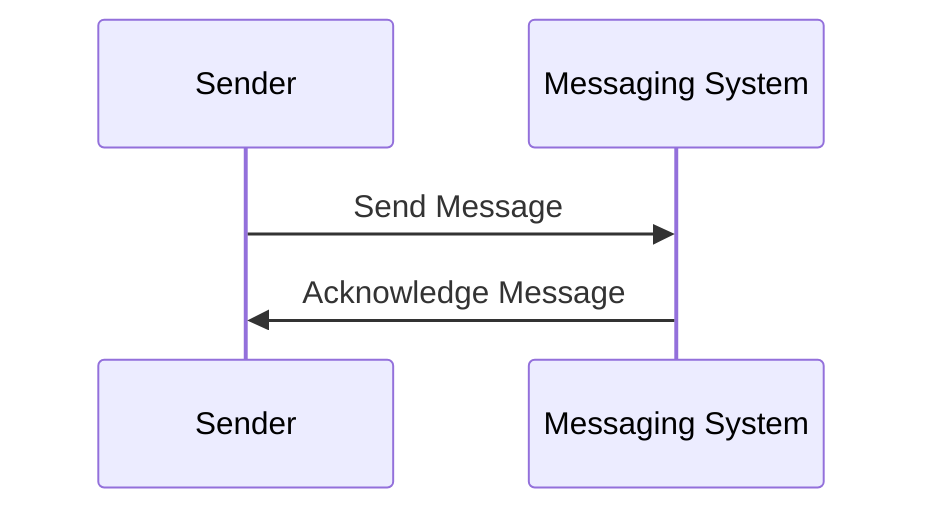

## 28.11 Erlang in Telecommunications

### Introduction

Erlang is a programming language that has played a pivotal role in the telecommunications industry since its inception. Developed by Ericsson in the late 1980s, Erlang was designed to address the specific needs of telecommunications systems, which require high reliability, scalability, and concurrency. In this section, we will explore the historical context of Erlang's development, its applications in telecommunications, and how its features meet the industry's demands. We will also highlight advancements and current use cases, reflecting on Erlang's ongoing relevance in this sector.

### Historical Context

Erlang was born out of necessity at Ericsson, a leading telecommunications company. In the 1980s, Ericsson faced challenges in building reliable and scalable telecommunication systems. Traditional programming languages at the time were not well-suited for handling the high concurrency and fault tolerance required by telecom systems. This led to the creation of Erlang, a language specifically designed to meet these needs.

Erlang's development was spearheaded by Joe Armstrong, Robert Virding, and Mike Williams. The language was designed with several key principles in mind:

- **Concurrency**: Erlang was built to handle thousands of concurrent processes efficiently, a crucial requirement for telecom systems that manage numerous simultaneous connections.
- **Fault Tolerance**: The "let it crash" philosophy was embraced, allowing systems to recover gracefully from errors without affecting overall performance.
- **Distributed Systems**: Erlang was designed to support distributed computing, enabling telecom systems to scale across multiple nodes seamlessly.
- **Hot Code Swapping**: This feature allows for updates to be made to a running system without downtime, a critical capability for telecom systems that require high availability.

### Telecommunications Applications

Erlang has been used in various telecommunications applications, including softswitches, messaging systems, and more. Let's delve into some specific examples:

#### Softswitches

Softswitches are a key component in modern telecommunications networks, enabling the routing of voice and data traffic over IP networks. Erlang's concurrency and fault tolerance make it an ideal choice for implementing softswitches. The language's ability to handle numerous concurrent connections and recover from failures ensures that softswitches can operate reliably and efficiently.

#### Messaging Systems

Erlang's capabilities are also well-suited for building messaging systems, which require high throughput and low latency. The language's lightweight processes and efficient message passing enable the development of systems that can handle millions of messages per second. Erlang's fault tolerance ensures that these systems remain operational even in the face of hardware or software failures.

### Erlang's Features and Industry Demands

Erlang's features align closely with the demands of the telecommunications industry. Let's explore how these features meet the industry's needs:

#### Reliability

Reliability is paramount in telecommunications, where downtime can lead to significant financial losses and customer dissatisfaction. Erlang's "let it crash" philosophy and robust error handling mechanisms ensure that systems can recover from failures quickly and continue operating without interruption.

#### Scalability

Telecommunications systems must scale to accommodate growing numbers of users and connections. Erlang's lightweight processes and distributed computing capabilities enable systems to scale horizontally across multiple nodes, ensuring that they can handle increased loads without degradation in performance.

#### Concurrency

Handling numerous concurrent connections is a fundamental requirement in telecommunications. Erlang's concurrency model, based on lightweight processes and message passing, allows systems to manage thousands of simultaneous connections efficiently.

#### Hot Code Swapping

Telecommunications systems often require updates and maintenance without downtime. Erlang's hot code swapping feature allows developers to update running systems without interrupting service, ensuring high availability.

### Advancements and Current Use Cases

Erlang continues to be relevant in the telecommunications industry, with several modern use cases and advancements:

#### 5G Networks

As the telecommunications industry evolves with the rollout of 5G networks, Erlang's capabilities are being leveraged to build systems that can handle the increased demands of 5G. The language's scalability and concurrency make it well-suited for managing the high data rates and low latency required by 5G applications.

#### Internet of Things (IoT)

The proliferation of IoT devices presents new challenges for telecommunications systems. Erlang's ability to handle large numbers of concurrent connections and its fault tolerance make it an ideal choice for building IoT platforms that require reliable and scalable communication.

#### Cloud-Native Telecommunications

With the shift towards cloud-native architectures, Erlang is being used to build telecommunications systems that can run efficiently in cloud environments. The language's support for distributed computing and its lightweight processes enable the development of cloud-native applications that can scale dynamically based on demand.

### Ongoing Relevance of Erlang

Erlang's foundational role in telecommunications and its continued relevance in modern applications highlight its enduring value in the industry. The language's unique features, designed to meet the specific needs of telecommunications systems, ensure that it remains a powerful tool for building reliable and scalable applications.

### Code Example: Building a Simple Messaging System

Let's explore a simple Erlang code example to demonstrate how Erlang's features can be used to build a messaging system.

```erlang
-module(simple_messaging).
-export([start/0, send_message/2, receive_message/0]).

% Start the messaging system
start() ->
    spawn(fun() -> loop([]) end).

% Send a message to the system
send_message(Pid, Message) ->
    Pid ! {self(), Message}.

% Receive a message from the system
receive_message() ->
    receive
        {Sender, Message} ->
            io:format("Received message: ~p from ~p~n", [Message, Sender]),
            Sender ! {self(), ack}
    end.

% Loop to handle incoming messages
loop(Messages) ->
    receive
        {Sender, Message} ->
            io:format("Processing message: ~p from ~p~n", [Message, Sender]),
            Sender ! {self(), ack},
            loop([Message | Messages])
    end.
```

In this example, we define a simple messaging system using Erlang's concurrency model. The `start/0` function spawns a new process that runs the `loop/1` function, which handles incoming messages. The `send_message/2` function sends a message to the system, and the `receive_message/0` function receives and acknowledges messages.

### Visualizing Erlang's Concurrency Model

To better understand Erlang's concurrency model, let's visualize the process communication using a sequence diagram.



This diagram illustrates the simple interaction between a sender and the messaging system, highlighting Erlang's message-passing capabilities.

### Try It Yourself

Experiment with the code example by modifying the message processing logic or adding additional features, such as message filtering or logging. This hands-on approach will help reinforce your understanding of Erlang's concurrency model and its application in telecommunications.

### Conclusion

Erlang's role in telecommunications is a testament to its reliability, scalability, and concurrency capabilities. From its origins at Ericsson to its modern applications in 5G, IoT, and cloud-native systems, Erlang continues to be a valuable tool for building robust telecommunications systems. As the industry evolves, Erlang's unique features ensure its ongoing relevance and utility.

## Quiz: Erlang in Telecommunications



### What was the primary reason for Erlang's development at Ericsson?

- [x] To address the need for reliable and scalable telecommunications systems
- [ ] To create a new programming language for web development
- [ ] To replace existing database management systems
- [ ] To develop a language for artificial intelligence applications

> **Explanation:** Erlang was developed at Ericsson to meet the specific needs of telecommunications systems, which require high reliability and scalability.

### Which feature of Erlang allows updates to be made to a running system without downtime?

- [x] Hot Code Swapping
- [ ] Concurrency
- [ ] Fault Tolerance
- [ ] Message Passing

> **Explanation:** Hot code swapping is a feature of Erlang that allows updates to be made to a running system without downtime, ensuring high availability.

### What is the "let it crash" philosophy in Erlang?

- [x] A design principle that allows systems to recover gracefully from errors
- [ ] A method for optimizing performance in Erlang applications
- [ ] A strategy for managing memory usage in Erlang
- [ ] A technique for improving code readability

> **Explanation:** The "let it crash" philosophy in Erlang is a design principle that allows systems to recover gracefully from errors without affecting overall performance.

### How does Erlang handle concurrency?

- [x] Through lightweight processes and message passing
- [ ] By using threads and locks
- [ ] Through shared memory and synchronization
- [ ] By utilizing global variables

> **Explanation:** Erlang handles concurrency through lightweight processes and message passing, allowing systems to manage numerous concurrent connections efficiently.

### What makes Erlang suitable for building IoT platforms?

- [x] Its ability to handle large numbers of concurrent connections and fault tolerance
- [ ] Its support for graphical user interfaces
- [ ] Its integration with machine learning libraries
- [ ] Its compatibility with mobile devices

> **Explanation:** Erlang's ability to handle large numbers of concurrent connections and its fault tolerance make it suitable for building IoT platforms that require reliable and scalable communication.

### In which modern application is Erlang being used to handle increased demands?

- [x] 5G Networks
- [ ] Desktop Applications
- [ ] Video Game Development
- [ ] Blockchain Technology

> **Explanation:** Erlang is being used in 5G networks to handle increased demands due to its scalability and concurrency capabilities.

### What is a key component in modern telecommunications networks that Erlang is used to implement?

- [x] Softswitches
- [ ] Web Browsers
- [ ] Email Clients
- [ ] Search Engines

> **Explanation:** Softswitches are a key component in modern telecommunications networks, and Erlang is used to implement them due to its concurrency and fault tolerance.

### Which feature of Erlang ensures that telecommunications systems can scale across multiple nodes?

- [x] Distributed Computing
- [ ] Pattern Matching
- [ ] List Comprehensions
- [ ] Type Specifications

> **Explanation:** Erlang's distributed computing capabilities ensure that telecommunications systems can scale across multiple nodes seamlessly.

### What is a modern use case for Erlang in cloud-native telecommunications?

- [x] Building applications that can scale dynamically based on demand
- [ ] Developing desktop applications with graphical interfaces
- [ ] Creating static websites
- [ ] Designing video games with high graphics

> **Explanation:** In cloud-native telecommunications, Erlang is used to build applications that can scale dynamically based on demand, leveraging its distributed computing and lightweight processes.

### True or False: Erlang's features are no longer relevant in modern telecommunications.

- [ ] True
- [x] False

> **Explanation:** Erlang's features, such as reliability, scalability, and concurrency, remain highly relevant in modern telecommunications, especially with advancements like 5G and IoT.



Remember, this is just the beginning. As you progress, you'll discover more about Erlang's capabilities and its applications in various industries. Keep experimenting, stay curious, and enjoy the journey!
