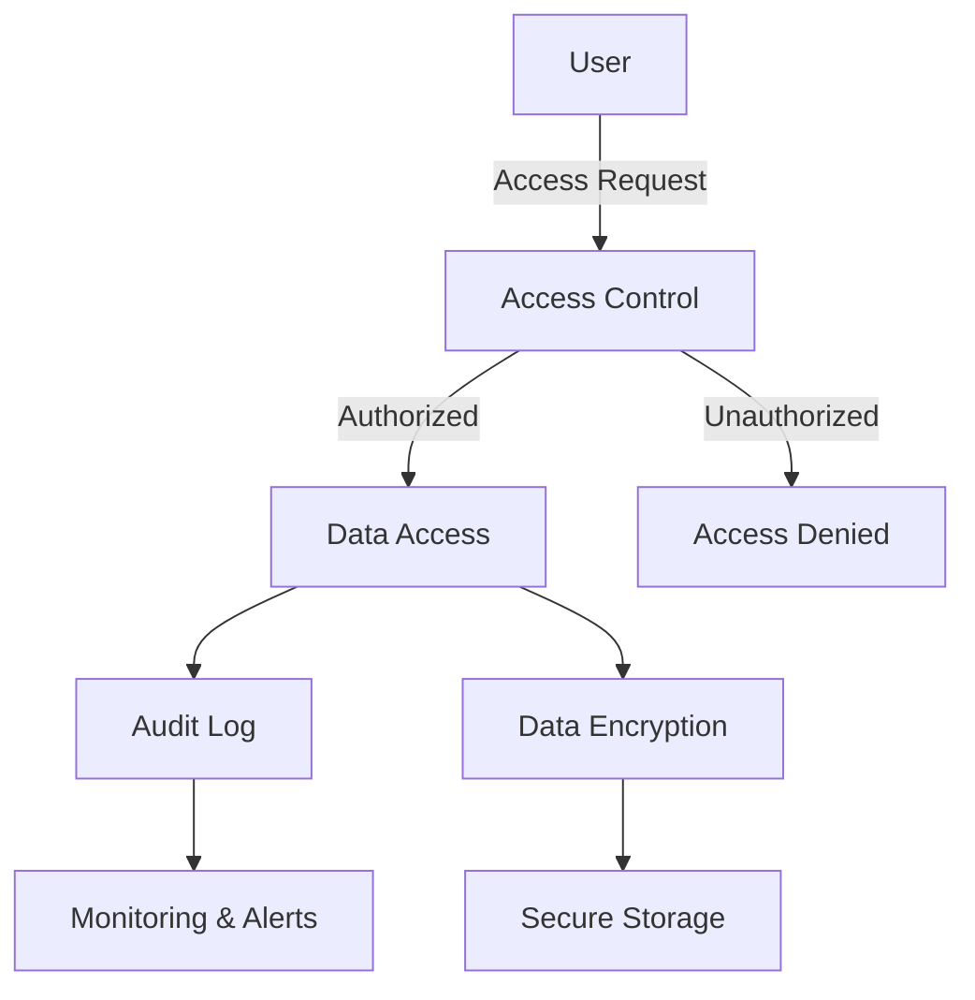

## 28.13.1 Building HIPAA-Compliant Systems with Erlang

In the realm of healthcare applications, ensuring compliance with the Health Insurance Portability and Accountability Act (HIPAA) is crucial. HIPAA sets the standard for protecting sensitive patient data, and any company that deals with protected health information (PHI) must ensure that all the required physical, network, and process security measures are in place and followed. In this section, we will explore how to build HIPAA-compliant systems using Erlang, focusing on data protection, encryption, access controls, and auditing.

### Understanding HIPAA Requirements for Software Developers

HIPAA compliance involves several key components that software developers must consider:

1. **Privacy Rule**: This rule establishes national standards for the protection of certain health information. It addresses the use and disclosure of individuals' health information by entities subject to the Privacy Rule.

2. **Security Rule**: This rule specifies a series of administrative, physical, and technical safeguards for covered entities to use to assure the confidentiality, integrity, and availability of electronic protected health information (ePHI).

3. **Breach Notification Rule**: This rule requires covered entities and business associates to provide notification following a breach of unsecured protected health information.

4. **Enforcement Rule**: This rule contains provisions relating to compliance and investigations, the imposition of civil money penalties for violations of the HIPAA Administrative Simplification Rules, and procedures for hearings.

5. **Omnibus Rule**: This rule implements a number of provisions of the Health Information Technology for Economic and Clinical Health (HITECH) Act to strengthen the privacy and security protections for health information established under HIPAA.

### Strategies for Implementing Compliant Data Handling and Storage

To ensure HIPAA compliance, developers must implement robust strategies for data handling and storage. Here are some key strategies:

#### Data Encryption

Encryption is a critical component of HIPAA compliance. It ensures that even if data is intercepted, it cannot be read without the decryption key.

- **Erlang's `crypto` Module**: Use Erlang's `crypto` module to implement encryption and decryption of data. This module provides a variety of cryptographic functions, including AES (Advanced Encryption Standard), which is widely used for encrypting ePHI.

```erlang
-module(hipaa_encryption).
-export([encrypt/2, decrypt/2]).

% Encrypt data using AES
encrypt(Data, Key) ->
    IV = crypto:strong_rand_bytes(16),
    {ok, CipherText} = crypto:block_encrypt(aes_cbc256, Key, IV, Data),
    {IV, CipherText}.

% Decrypt data using AES
decrypt({IV, CipherText}, Key) ->
    {ok, PlainText} = crypto:block_decrypt(aes_cbc256, Key, IV, CipherText),
    PlainText.
```

#### Access Controls

Implementing strict access controls is essential to ensure that only authorized personnel can access ePHI.

- **Role-Based Access Control (RBAC)**: Implement RBAC to manage user permissions. Define roles such as "Doctor", "Nurse", and "Administrator", and assign permissions accordingly.

```erlang
-module(access_control).
-export([has_access/2]).

% Define roles and permissions
has_access(UserRole, Resource) ->
    case UserRole of
        doctor -> lists:member(Resource, [patient_records, prescriptions]);
        nurse -> lists:member(Resource, [patient_records]);
        admin -> true;
        _ -> false
    end.
```

#### Auditing and Monitoring

Auditing and monitoring are crucial for detecting and responding to security incidents.

- **Audit Logs**: Implement audit logs to track access to ePHI. Log details such as user ID, timestamp, and accessed resource.

```erlang
-module(audit_log).
-export([log_access/3]).

% Log access to resources
log_access(UserId, Resource, Timestamp) ->
    LogEntry = {UserId, Resource, Timestamp},
    % Store LogEntry in a persistent storage
    ok.
```

### Challenges and Solutions Related to Compliance

Building HIPAA-compliant systems presents several challenges, but Erlang's features can help address these:

#### Challenge: Ensuring Data Integrity

- **Solution**: Use Erlang's immutable data structures to prevent accidental data modification. Immutability ensures that once data is created, it cannot be changed, reducing the risk of data corruption.

#### Challenge: Handling Concurrent Access

- **Solution**: Leverage Erlang's concurrency model to handle multiple requests simultaneously without compromising data security. Erlang's lightweight processes and message-passing capabilities make it ideal for building scalable, concurrent applications.

#### Challenge: Implementing Secure Communication

- **Solution**: Use Erlang's `ssl` module to secure communication channels with SSL/TLS. This ensures that data transmitted over the network is encrypted and protected from eavesdropping.

```erlang
-module(secure_communication).
-export([start_ssl_server/0]).

% Start an SSL server
start_ssl_server() ->
    ssl:start(),
    {ok, ListenSocket} = ssl:listen(443, [{certfile, "server.crt"}, {keyfile, "server.key"}]),
    accept_connections(ListenSocket).

accept_connections(ListenSocket) ->
    {ok, Socket} = ssl:transport_accept(ListenSocket),
    ssl:ssl_accept(Socket),
    spawn(fun() -> handle_connection(Socket) end),
    accept_connections(ListenSocket).

handle_connection(Socket) ->
    % Handle incoming data
    ssl:close(Socket).
```

### Importance of Security and Privacy in Healthcare Applications

Security and privacy are paramount in healthcare applications due to the sensitive nature of the data involved. Breaches can lead to severe consequences, including legal penalties and loss of trust. Therefore, developers must prioritize security and privacy throughout the development process.

#### Key Considerations

- **Data Minimization**: Collect only the data necessary for the intended purpose and implement data retention policies to delete data when it is no longer needed.

- **User Education**: Educate users about security best practices, such as using strong passwords and recognizing phishing attempts.

- **Regular Audits**: Conduct regular security audits to identify vulnerabilities and ensure compliance with HIPAA regulations.

### Visualizing HIPAA Compliance in Erlang Applications

Below is a diagram illustrating the key components of a HIPAA-compliant Erlang application:



**Diagram Description**: This flowchart represents the process of accessing data in a HIPAA-compliant system. Users request access, which is evaluated by the access control module. Authorized requests proceed to data access, where actions are logged in the audit log and data is encrypted before secure storage. Monitoring and alerts ensure ongoing compliance and security.

### Try It Yourself

Experiment with the provided code examples by modifying the encryption algorithm or access control rules. Consider implementing additional security measures, such as two-factor authentication or IP whitelisting.

### References and Links

- [HIPAA Compliance Guide](https://www.hhs.gov/hipaa/for-professionals/index.html)
- [Erlang Crypto Module Documentation](http://erlang.org/doc/man/crypto.html)
- [Erlang SSL Module Documentation](http://erlang.org/doc/man/ssl.html)

### Knowledge Check

- What are the key components of HIPAA compliance?
- How can Erlang's concurrency model help in building HIPAA-compliant systems?
- Why is encryption important in healthcare applications?

### Embrace the Journey

Building HIPAA-compliant systems is a challenging but rewarding endeavor. As you continue to develop your skills, remember to prioritize security and privacy. Stay curious, keep learning, and enjoy the journey of creating secure healthcare applications with Erlang!

## Quiz: Building HIPAA-Compliant Systems



### What is the primary purpose of the HIPAA Privacy Rule?

- [x] To establish national standards for the protection of certain health information
- [ ] To specify technical safeguards for electronic health information
- [ ] To provide notification following a breach of unsecured health information
- [ ] To impose civil money penalties for violations

> **Explanation:** The HIPAA Privacy Rule establishes national standards for the protection of certain health information.

### Which Erlang module is commonly used for data encryption in HIPAA-compliant systems?

- [x] `crypto`
- [ ] `ssl`
- [ ] `httpc`
- [ ] `gen_server`

> **Explanation:** The `crypto` module in Erlang is commonly used for data encryption.

### What is the role of audit logs in HIPAA compliance?

- [x] To track access to electronic protected health information
- [ ] To encrypt data during transmission
- [ ] To manage user permissions
- [ ] To provide secure communication channels

> **Explanation:** Audit logs track access to electronic protected health information, which is crucial for HIPAA compliance.

### How does Erlang's concurrency model benefit HIPAA-compliant systems?

- [x] By allowing multiple requests to be handled simultaneously without compromising data security
- [ ] By providing encryption algorithms
- [ ] By managing user roles and permissions
- [ ] By securing communication channels

> **Explanation:** Erlang's concurrency model allows multiple requests to be handled simultaneously without compromising data security.

### What is a key strategy for implementing access controls in HIPAA-compliant systems?

- [x] Role-Based Access Control (RBAC)
- [ ] Data encryption
- [ ] Audit logging
- [ ] Secure communication

> **Explanation:** Role-Based Access Control (RBAC) is a key strategy for implementing access controls in HIPAA-compliant systems.

### Why is data minimization important in healthcare applications?

- [x] To collect only necessary data and reduce the risk of data breaches
- [ ] To encrypt data during transmission
- [ ] To manage user permissions
- [ ] To provide secure communication channels

> **Explanation:** Data minimization is important to collect only necessary data and reduce the risk of data breaches.

### What is the purpose of the HIPAA Security Rule?

- [x] To specify safeguards for the confidentiality, integrity, and availability of electronic protected health information
- [ ] To establish national standards for the protection of certain health information
- [ ] To provide notification following a breach of unsecured health information
- [ ] To impose civil money penalties for violations

> **Explanation:** The HIPAA Security Rule specifies safeguards for the confidentiality, integrity, and availability of electronic protected health information.

### Which Erlang module is used for securing communication channels with SSL/TLS?

- [x] `ssl`
- [ ] `crypto`
- [ ] `httpc`
- [ ] `gen_server`

> **Explanation:** The `ssl` module in Erlang is used for securing communication channels with SSL/TLS.

### What is a common challenge in building HIPAA-compliant systems?

- [x] Ensuring data integrity and secure communication
- [ ] Managing user permissions
- [ ] Encrypting data during transmission
- [ ] Providing secure communication channels

> **Explanation:** Ensuring data integrity and secure communication is a common challenge in building HIPAA-compliant systems.

### True or False: Regular security audits are unnecessary for HIPAA compliance.

- [ ] True
- [x] False

> **Explanation:** Regular security audits are necessary for HIPAA compliance to identify vulnerabilities and ensure ongoing compliance.


