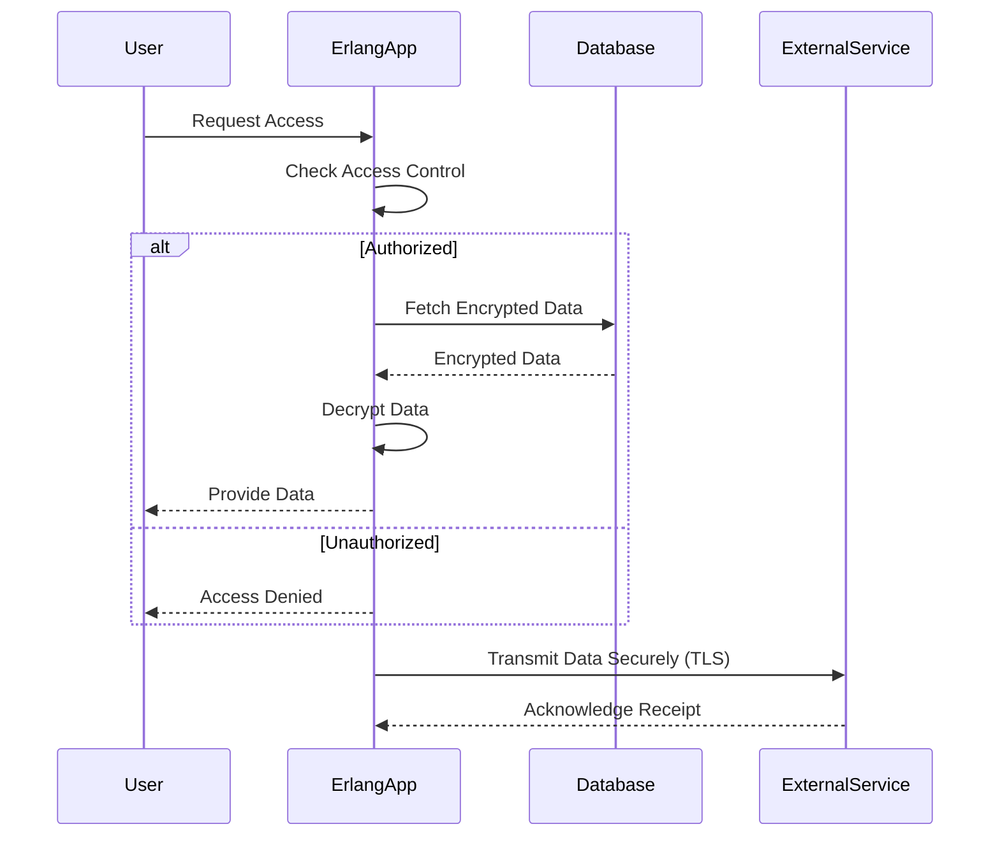

## 28.13.2 Handling Medical Data Securely

In the realm of healthcare applications, the secure handling of medical data is paramount. This section delves into the best practices for managing sensitive medical data within Erlang applications, focusing on encryption, data integrity, unauthorized access prevention, secure data transmission, and compliance with regulations such as HIPAA and GDPR.

### Understanding the Sensitivity of Medical Data

Medical data is inherently sensitive due to its personal nature and the potential impact of its misuse. It includes patient records, medical histories, treatment plans, and more. The unauthorized access or disclosure of such data can lead to severe consequences, including identity theft, financial loss, and reputational damage for healthcare providers.

#### Key Regulations

- **HIPAA (Health Insurance Portability and Accountability Act)**: In the United States, HIPAA sets the standard for protecting sensitive patient data. It mandates safeguards to ensure the confidentiality, integrity, and availability of electronic protected health information (ePHI).
- **GDPR (General Data Protection Regulation)**: In the European Union, GDPR governs the processing of personal data, including medical information. It emphasizes data protection and privacy, requiring explicit consent for data processing and the right to data access and erasure.

### Erlang's Role in Secure Data Handling

Erlang, with its robust concurrency model and fault-tolerant design, is well-suited for building secure healthcare applications. Its functional nature and powerful libraries, such as the `crypto` module, provide the tools necessary to implement strong security measures.

#### Using Erlang's `crypto` Module for Encryption

Encryption is a fundamental aspect of data security, ensuring that sensitive information remains confidential and inaccessible to unauthorized parties. Erlang's `crypto` module offers a suite of cryptographic functions to encrypt and decrypt data.

```erlang
% Example: Encrypting and Decrypting Data with Erlang's crypto Module

-module(medical_data_security).
-export([encrypt_data/2, decrypt_data/2]).

% Encrypt data using AES-256-CBC
encrypt_data(Data, Key) ->
    IV = crypto:strong_rand_bytes(16),
    EncryptedData = crypto:block_encrypt(aes_cbc256, Key, IV, Data),
    {IV, EncryptedData}.

% Decrypt data using AES-256-CBC
decrypt_data({IV, EncryptedData}, Key) ->
    crypto:block_decrypt(aes_cbc256, Key, IV, EncryptedData).
```

In this example, we use AES-256-CBC, a widely adopted encryption standard, to encrypt and decrypt medical data. The `crypto:strong_rand_bytes/1` function generates a secure initialization vector (IV) for encryption, ensuring that the same data encrypted multiple times will yield different ciphertexts.

### Ensuring Data Integrity

Data integrity ensures that medical information remains accurate and unaltered during storage and transmission. Implementing checksums or hash functions can verify data integrity.

```erlang
% Example: Using SHA-256 for Data Integrity Verification

-module(data_integrity).
-export([hash_data/1, verify_data/2]).

% Generate SHA-256 hash of data
hash_data(Data) ->
    crypto:hash(sha256, Data).

% Verify data integrity by comparing hashes
verify_data(Data, Hash) ->
    Hash =:= hash_data(Data).
```

By hashing data with SHA-256, we can generate a unique fingerprint for each piece of information. Comparing the hash of received data with the original hash verifies its integrity.

### Preventing Unauthorized Access

Access control mechanisms are crucial for preventing unauthorized access to medical data. Implement role-based access control (RBAC) to ensure that only authorized personnel can access specific data.

```erlang
% Example: Role-Based Access Control (RBAC)

-module(access_control).
-export([check_access/2]).

% Define roles and permissions
-define(ADMIN, admin).
-define(DOCTOR, doctor).
-define(NURSE, nurse).

% Check if a user has access to a resource
check_access(UserRole, Resource) ->
    case {UserRole, Resource} of
        {?ADMIN, _} -> true;
        {?DOCTOR, patient_records} -> true;
        {?NURSE, patient_records} -> true;
        _ -> false
    end.
```

In this example, we define roles and their corresponding permissions. The `check_access/2` function verifies if a user has the necessary permissions to access a resource.

### Secure Data Transmission and Storage

Secure data transmission and storage are vital for protecting medical data from interception and unauthorized access.

#### Secure Transmission

Use Transport Layer Security (TLS) to encrypt data during transmission. Erlang's `ssl` module provides the necessary functions to establish secure connections.

```erlang
% Example: Establishing a Secure Connection with TLS

-module(secure_connection).
-export([start_tls/2]).

start_tls(Host, Port) ->
    ssl:start(),
    {ok, Socket} = ssl:connect(Host, Port, [{verify, verify_peer}, {cacertfile, "path/to/cacert.pem"}]),
    Socket.
```

This example demonstrates how to establish a secure TLS connection to a remote host, ensuring that data is encrypted during transmission.

#### Secure Storage

Encrypt sensitive data before storing it in databases or file systems. Use Erlang's `crypto` module to encrypt data at rest, as shown in the earlier encryption example.

### Compliance with HIPAA and GDPR

Compliance with regulations like HIPAA and GDPR is essential for healthcare applications handling medical data. These regulations mandate specific security measures and data protection practices.

#### Key Compliance Strategies

- **Data Minimization**: Collect and store only the necessary data to reduce exposure to risks.
- **Access Controls**: Implement strict access controls to ensure that only authorized personnel can access sensitive data.
- **Audit Trails**: Maintain detailed logs of data access and modifications to facilitate auditing and compliance verification.
- **Data Breach Response**: Develop and implement a data breach response plan to quickly address and mitigate the impact of any data breaches.

### Visualizing Secure Data Handling

To better understand the flow of secure data handling in Erlang applications, let's visualize the process using a sequence diagram.



This diagram illustrates the interaction between a user, an Erlang application, a database, and an external service. It highlights the access control check, data encryption and decryption, and secure data transmission.

### Knowledge Check

To reinforce your understanding of securely handling medical data in Erlang applications, consider the following questions:

1. What encryption standard is commonly used for securing medical data?
2. How can you verify the integrity of medical data?
3. What role does the `crypto` module play in data security?
4. Why is role-based access control important in healthcare applications?
5. How does TLS contribute to secure data transmission?

### Try It Yourself

Experiment with the provided code examples by modifying the encryption algorithms or access control rules. Consider implementing additional security measures, such as multi-factor authentication or data anonymization, to enhance the security of your Erlang applications.

### Conclusion

Handling medical data securely in Erlang applications requires a comprehensive approach that encompasses encryption, data integrity, access control, secure transmission, and regulatory compliance. By leveraging Erlang's powerful features and adhering to best practices, you can build robust healthcare applications that protect sensitive medical information.

Remember, this is just the beginning. As you progress, you'll build more secure and efficient applications. Keep experimenting, stay curious, and enjoy the journey!

## Quiz: Handling Medical Data Securely



### What encryption standard is commonly used for securing medical data?

- [x] AES-256-CBC
- [ ] DES
- [ ] MD5
- [ ] RSA

> **Explanation:** AES-256-CBC is a widely adopted encryption standard for securing sensitive data, including medical information.

### How can you verify the integrity of medical data?

- [x] By using hash functions like SHA-256
- [ ] By encrypting the data
- [ ] By compressing the data
- [ ] By storing the data in a database

> **Explanation:** Hash functions like SHA-256 generate a unique fingerprint for data, allowing verification of its integrity.

### What role does the `crypto` module play in data security?

- [x] It provides cryptographic functions for encryption and decryption
- [ ] It manages database connections
- [ ] It handles HTTP requests
- [ ] It performs data compression

> **Explanation:** The `crypto` module offers cryptographic functions essential for encrypting and decrypting data.

### Why is role-based access control important in healthcare applications?

- [x] It ensures only authorized personnel can access specific data
- [ ] It speeds up data processing
- [ ] It reduces data storage costs
- [ ] It improves user interface design

> **Explanation:** Role-based access control restricts data access to authorized personnel, enhancing security in healthcare applications.

### How does TLS contribute to secure data transmission?

- [x] By encrypting data during transmission
- [ ] By compressing data
- [ ] By storing data in a database
- [ ] By hashing data

> **Explanation:** TLS encrypts data during transmission, preventing unauthorized interception and access.

### What is a key strategy for ensuring compliance with HIPAA and GDPR?

- [x] Implementing strict access controls
- [ ] Reducing data storage capacity
- [ ] Using open-source software
- [ ] Increasing server uptime

> **Explanation:** Implementing strict access controls is crucial for ensuring compliance with regulations like HIPAA and GDPR.

### What is the purpose of an audit trail in healthcare applications?

- [x] To maintain detailed logs of data access and modifications
- [ ] To encrypt data
- [ ] To compress data
- [ ] To improve user experience

> **Explanation:** Audit trails provide a record of data access and modifications, facilitating auditing and compliance verification.

### What is the benefit of using Erlang's `crypto:strong_rand_bytes/1` function?

- [x] It generates a secure initialization vector (IV) for encryption
- [ ] It compresses data
- [ ] It hashes data
- [ ] It stores data in a database

> **Explanation:** The `crypto:strong_rand_bytes/1` function generates a secure initialization vector (IV), ensuring different ciphertexts for the same data.

### What is the significance of data minimization in healthcare applications?

- [x] It reduces exposure to risks by collecting and storing only necessary data
- [ ] It increases data storage capacity
- [ ] It speeds up data processing
- [ ] It enhances user interface design

> **Explanation:** Data minimization reduces exposure to risks by limiting the amount of data collected and stored.

### True or False: Erlang's functional nature and powerful libraries make it well-suited for building secure healthcare applications.

- [x] True
- [ ] False

> **Explanation:** Erlang's functional nature and powerful libraries, such as the `crypto` module, provide the tools necessary for implementing strong security measures in healthcare applications.


