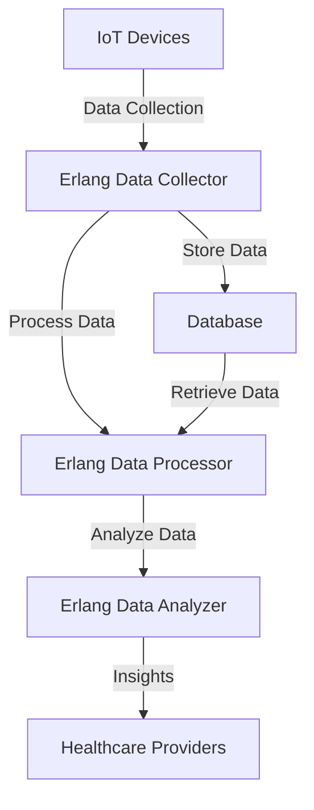

## 28.13.3 Integration with Medical Devices and IoT

In this section, we delve into the integration of Erlang applications with medical devices, leveraging the Internet of Things (IoT) technologies. This integration is pivotal in modern healthcare, enabling real-time data collection, processing, and analysis to improve patient outcomes and operational efficiency.

### The Role of IoT in Modern Healthcare

The Internet of Things (IoT) has revolutionized healthcare by connecting medical devices to the internet, allowing for continuous monitoring and data collection. This connectivity facilitates remote patient monitoring, predictive analytics, and personalized medicine. IoT in healthcare encompasses a wide range of devices, from wearable fitness trackers to sophisticated medical equipment like MRI machines.

#### Key Benefits of IoT in Healthcare

- **Real-Time Monitoring**: IoT devices can continuously monitor patients' vital signs and alert healthcare providers to any anomalies.
- **Data-Driven Insights**: The vast amount of data collected can be analyzed to provide insights into patient health trends and treatment efficacy.
- **Improved Patient Engagement**: Patients can track their health metrics and engage more actively in their care.
- **Operational Efficiency**: Automated data collection reduces the need for manual entry, minimizing errors and freeing up healthcare professionals for more critical tasks.

### Protocols and Standards for Communicating with Medical Devices

Integrating with medical devices requires adherence to specific protocols and standards to ensure interoperability, security, and reliability. Some of the widely used protocols include:

- **HL7 (Health Level Seven)**: A set of international standards for the exchange, integration, sharing, and retrieval of electronic health information.
- **DICOM (Digital Imaging and Communications in Medicine)**: A standard for handling, storing, printing, and transmitting information in medical imaging.
- **FHIR (Fast Healthcare Interoperability Resources)**: A standard describing data formats and elements for exchanging electronic health records.
- **Bluetooth Low Energy (BLE)**: Used for wireless communication with wearable devices.
- **Zigbee and Z-Wave**: Protocols for low-power, low-data-rate wireless communication, often used in home automation and medical devices.

### Data Collection, Processing, and Analysis

Erlang's strengths in concurrency and fault tolerance make it an excellent choice for handling the data flow from IoT devices in healthcare settings. Let's explore how Erlang can be used for data collection, processing, and analysis.

#### Data Collection

Data collection from IoT devices involves capturing and storing data streams from various sensors and devices. Erlang's lightweight processes and message-passing capabilities are ideal for managing multiple data streams simultaneously.

```erlang
-module(data_collector).
-export([start/0, collect_data/1]).

start() ->
    % Start the data collection process
    spawn(fun() -> collect_data([]) end).

collect_data(Data) ->
    receive
        {sensor_data, SensorId, Value} ->
            NewData = [{SensorId, Value} | Data],
            io:format("Collected data from sensor ~p: ~p~n", [SensorId, Value]),
            collect_data(NewData);
        stop ->
            io:format("Stopping data collection.~n"),
            ok
    end.
```

In this example, we demonstrate a simple data collection process that receives data from sensors and stores it in a list. The process continues to collect data until a stop message is received.

#### Data Processing

Once data is collected, it needs to be processed to extract meaningful insights. Erlang's pattern matching and functional programming features make it easy to implement data processing pipelines.

```erlang
-module(data_processor).
-export([process_data/1]).

process_data(Data) ->
    lists:map(fun({SensorId, Value}) ->
        % Example processing: convert raw value to a meaningful metric
        {SensorId, Value * 1.5}
    end, Data).
```

Here, we use the `lists:map/2` function to apply a transformation to each data point, demonstrating how Erlang's higher-order functions can be used for data processing.

#### Data Analysis

Data analysis involves applying algorithms and statistical methods to the processed data to derive insights. Erlang can be integrated with external libraries and tools for advanced analytics.

```erlang
-module(data_analyzer).
-export([analyze/1]).

analyze(Data) ->
    % Example analysis: calculate average value
    Total = lists:foldl(fun({_, Value}, Acc) -> Acc + Value end, 0, Data),
    Count = length(Data),
    Average = Total / Count,
    io:format("Average value: ~p~n", [Average]).
```

In this example, we calculate the average value of the data points, showcasing how Erlang's functional programming capabilities can be leveraged for data analysis.

### Challenges in Integrating Medical Devices and IoT

Integrating medical devices with IoT technologies presents several challenges, including ensuring data security, maintaining real-time responsiveness, and adhering to industry standards.

#### Ensuring Data Security

Data security is paramount in healthcare due to the sensitive nature of medical information. Erlang provides robust security features, but additional measures must be taken to protect data.

- **Encryption**: Use encryption protocols to secure data in transit and at rest.
- **Authentication**: Implement strong authentication mechanisms to control access to data.
- **Audit Logging**: Maintain logs of data access and modifications for auditing purposes.

#### Real-Time Responsiveness

Healthcare applications often require real-time data processing to provide timely alerts and interventions. Erlang's concurrency model supports real-time processing, but careful design is needed to minimize latency.

- **Optimize Process Communication**: Use efficient message-passing techniques to reduce communication overhead.
- **Load Balancing**: Distribute workload across multiple nodes to prevent bottlenecks.

#### Adhering to Medical Industry Standards and Certifications

Compliance with medical industry standards and certifications is crucial for ensuring the safety and efficacy of healthcare applications.

- **FDA Approval**: Ensure that devices and software meet FDA requirements for medical devices.
- **ISO Standards**: Adhere to relevant ISO standards for quality management and risk assessment.
- **HIPAA Compliance**: Implement measures to protect patient privacy and comply with HIPAA regulations.

### Erlang's Unique Features for IoT Integration

Erlang offers several unique features that make it well-suited for integrating with IoT devices in healthcare:

- **Concurrency**: Erlang's lightweight processes and message-passing model enable efficient handling of multiple data streams.
- **Fault Tolerance**: The "let it crash" philosophy and OTP framework provide robust error handling and recovery mechanisms.
- **Scalability**: Erlang's distributed nature allows applications to scale horizontally across multiple nodes.

### Try It Yourself: Experimenting with Erlang for IoT Integration

To get hands-on experience with Erlang's capabilities for IoT integration, try modifying the code examples provided. Experiment with different data processing techniques, implement additional security measures, or simulate real-time data streams from multiple devices.

### Visualizing IoT Integration with Erlang

Below is a diagram illustrating the architecture of an Erlang-based IoT integration system for healthcare applications:



**Diagram Description**: This diagram represents the flow of data from IoT devices through an Erlang-based system, highlighting the stages of data collection, processing, analysis, and delivery of insights to healthcare providers.

### References and Further Reading

- [HL7 International](https://www.hl7.org/)
- [DICOM Standards](https://www.dicomstandard.org/)
- [FHIR Overview](https://www.hl7.org/fhir/overview.html)
- [Bluetooth Low Energy](https://www.bluetooth.com/learn-about-bluetooth/technology/bluetooth-low-energy/)
- [Zigbee Alliance](https://zigbeealliance.org/)

### Knowledge Check

- What are the key benefits of IoT in healthcare?
- How does Erlang's concurrency model support real-time data processing?
- What are some challenges in integrating medical devices with IoT technologies?
- Why is data security critical in healthcare applications?
- How can Erlang's unique features be leveraged for IoT integration?

### Embrace the Journey

Remember, integrating Erlang with medical devices and IoT technologies is just the beginning. As you continue to explore this field, you'll discover new ways to enhance healthcare delivery and patient outcomes. Stay curious, keep experimenting, and enjoy the journey!

## Quiz: Integration with Medical Devices and IoT



### What is a key benefit of IoT in healthcare?

- [x] Real-time monitoring of patient health
- [ ] Increased manual data entry
- [ ] Reduced patient engagement
- [ ] Decreased data availability

> **Explanation:** IoT enables real-time monitoring of patient health, allowing for timely interventions and improved outcomes.

### Which protocol is commonly used for exchanging electronic health records?

- [ ] DICOM
- [x] FHIR
- [ ] Zigbee
- [ ] BLE

> **Explanation:** FHIR is a standard for exchanging electronic health records, facilitating interoperability between healthcare systems.

### What is a challenge in integrating medical devices with IoT?

- [x] Ensuring data security
- [ ] Reducing data collection
- [ ] Eliminating data processing
- [ ] Simplifying device connectivity

> **Explanation:** Ensuring data security is a significant challenge due to the sensitive nature of medical information.

### How does Erlang's concurrency model benefit IoT integration?

- [x] Efficient handling of multiple data streams
- [ ] Increased latency
- [ ] Reduced fault tolerance
- [ ] Simplified encryption

> **Explanation:** Erlang's concurrency model allows for efficient handling of multiple data streams, supporting real-time processing.

### What is a critical consideration for healthcare applications?

- [x] Compliance with industry standards
- [ ] Ignoring data privacy
- [ ] Reducing data accuracy
- [ ] Simplifying user interfaces

> **Explanation:** Compliance with industry standards is crucial to ensure the safety and efficacy of healthcare applications.

### Which feature of Erlang supports fault tolerance?

- [x] "Let it crash" philosophy
- [ ] Manual error handling
- [ ] Synchronous processing
- [ ] Static data structures

> **Explanation:** Erlang's "let it crash" philosophy and OTP framework provide robust error handling and recovery mechanisms.

### What is a benefit of using Erlang for IoT integration?

- [x] Scalability across multiple nodes
- [ ] Increased complexity
- [ ] Reduced data security
- [ ] Simplified data analysis

> **Explanation:** Erlang's distributed nature allows applications to scale horizontally across multiple nodes, enhancing scalability.

### Which standard is used for medical imaging?

- [x] DICOM
- [ ] HL7
- [ ] FHIR
- [ ] BLE

> **Explanation:** DICOM is a standard for handling, storing, and transmitting medical imaging information.

### What is a key feature of Erlang's message-passing model?

- [x] Efficient process communication
- [ ] Increased latency
- [ ] Reduced concurrency
- [ ] Simplified encryption

> **Explanation:** Erlang's message-passing model enables efficient communication between processes, supporting real-time data processing.

### True or False: Erlang is not suitable for real-time data processing in healthcare.

- [ ] True
- [x] False

> **Explanation:** False. Erlang's concurrency and fault tolerance make it well-suited for real-time data processing in healthcare applications.


