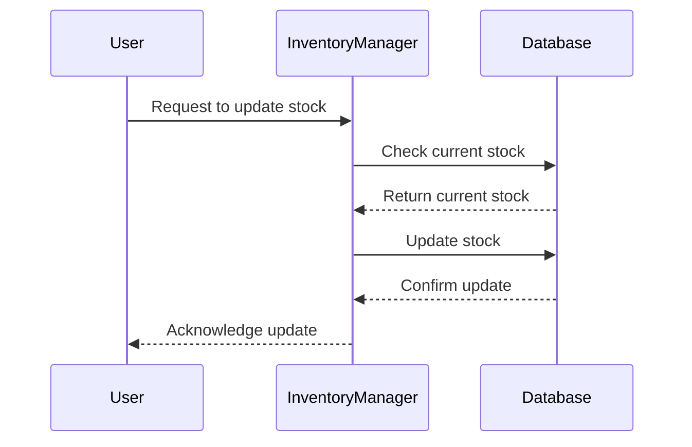

## 28.14.1 Real-Time Inventory Management

In the fast-paced world of e-commerce, real-time inventory management is crucial for maintaining accurate stock levels, preventing overselling, and ensuring customer satisfaction. Erlang, with its robust concurrency model and fault-tolerant design, is an excellent choice for building such systems. In this section, we'll explore the requirements for real-time inventory management, how Erlang's concurrency model can handle simultaneous transactions, strategies for data consistency and conflict resolution, and integration with databases and external systems. We'll also highlight the performance improvements and customer satisfaction outcomes that can be achieved with a well-designed system.

### Requirements for Accurate and Timely Inventory Tracking

Real-time inventory management systems must meet several key requirements to be effective:

1. **Accuracy**: The system must maintain precise stock levels to prevent overselling or underselling products.
2. **Timeliness**: Inventory updates should occur in real-time or near real-time to reflect the current stock status.
3. **Scalability**: The system should handle a large number of transactions simultaneously, especially during peak shopping periods.
4. **Reliability**: The system must be fault-tolerant to ensure continuous operation even in the event of hardware or software failures.
5. **Integration**: Seamless integration with other systems, such as order management and shipping, is essential for a cohesive e-commerce platform.

### Erlang's Concurrency Model for Simultaneous Transactions

Erlang's concurrency model is based on lightweight processes that can run independently and communicate via message passing. This model is particularly well-suited for handling simultaneous transactions in a real-time inventory system. Let's explore how Erlang's features can be leveraged:

- **Lightweight Processes**: Erlang processes are extremely lightweight, allowing thousands or even millions of them to run concurrently. This is ideal for handling multiple inventory updates simultaneously.
- **Message Passing**: Processes communicate through message passing, which is inherently asynchronous. This allows for non-blocking operations and improves system responsiveness.
- **Fault Tolerance**: Erlang's "let it crash" philosophy and supervision trees ensure that failures are isolated and do not affect the entire system.

#### Code Example: Handling Concurrent Inventory Updates

```erlang
-module(inventory_manager).
-export([start/0, update_stock/2, get_stock/1]).

% Start the inventory manager process
start() ->
    register(inventory_manager, spawn(fun() -> loop(#{}))).

% Update stock for a given product
update_stock(ProductId, Quantity) ->
    inventory_manager ! {update, ProductId, Quantity}.

% Get current stock for a given product
get_stock(ProductId) ->
    inventory_manager ! {get, ProductId},
    receive
        {stock, Stock} -> Stock
    end.

% Process loop to handle messages
loop(Inventory) ->
    receive
        {update, ProductId, Quantity} ->
            NewInventory = maps:update_with(ProductId, fun(OldQty) -> OldQty + Quantity end, Quantity, Inventory),
            loop(NewInventory);
        {get, ProductId} ->
            Stock = maps:get(ProductId, Inventory, 0),
            self() ! {stock, Stock},
            loop(Inventory)
    end.
```

In this example, the `inventory_manager` process handles stock updates and queries. The use of message passing ensures that updates are processed concurrently without blocking other operations.

### Data Consistency and Conflict Resolution Strategies

Ensuring data consistency in a distributed system is challenging, especially when multiple transactions occur simultaneously. Here are some strategies to handle this:

- **Optimistic Concurrency Control**: Assume that conflicts are rare and handle them when they occur. This approach can be efficient but requires mechanisms to detect and resolve conflicts.
- **Pessimistic Concurrency Control**: Lock resources during updates to prevent conflicts. This can ensure consistency but may lead to reduced concurrency and performance.
- **Eventual Consistency**: Allow temporary inconsistencies with the guarantee that the system will eventually become consistent. This is suitable for systems where immediate consistency is not critical.

#### Code Example: Conflict Resolution with Versioning

```erlang
-module(inventory_versioning).
-export([update_stock/3, resolve_conflict/2]).

% Update stock with versioning
update_stock(ProductId, Quantity, Version) ->
    case get_current_version(ProductId) of
        Version ->
            % Proceed with update
            ok;
        _ ->
            % Conflict detected
            {error, conflict}
    end.

% Resolve conflict by merging changes
resolve_conflict(ProductId, Changes) ->
    % Custom logic to merge changes
    ok.

get_current_version(ProductId) ->
    % Retrieve the current version for the product
    1.
```

In this example, we use versioning to detect conflicts. If a conflict is detected, a custom resolution strategy can be applied.

### Integrating with Databases and External Systems

A real-time inventory system must integrate seamlessly with databases and other external systems. Erlang provides several options for database integration:

- **Mnesia**: Erlang's distributed database, suitable for applications requiring high availability and fault tolerance.
- **ETS/DETS**: In-memory and disk-based storage options for fast access to data.
- **External Databases**: Integration with databases like PostgreSQL, MySQL, or NoSQL databases using Erlang drivers.

#### Code Example: Integrating with Mnesia

```erlang
-module(inventory_mnesia).
-export([init/0, add_product/2, update_stock/2, get_stock/1]).

-record(product, {id, name, stock}).

% Initialize Mnesia schema and tables
init() ->
    mnesia:create_schema([node()]),
    mnesia:start(),
    mnesia:create_table(product, [{attributes, record_info(fields, product)}]).

% Add a new product
add_product(Id, Name) ->
    mnesia:transaction(fun() ->
        mnesia:write(#product{id=Id, name=Name, stock=0})
    end).

% Update stock for a product
update_stock(Id, Quantity) ->
    mnesia:transaction(fun() ->
        case mnesia:read({product, Id}) of
            [#product{stock=Stock} = Product] ->
                mnesia:write(Product#product{stock=Stock + Quantity});
            [] ->
                {error, not_found}
        end
    end).

% Get stock for a product
get_stock(Id) ->
    mnesia:transaction(fun() ->
        case mnesia:read({product, Id}) of
            [#product{stock=Stock}] -> {ok, Stock};
            [] -> {error, not_found}
        end
    end).
```

This example demonstrates how to use Mnesia for managing product inventory, including adding products and updating stock levels.

### Performance Improvements and Customer Satisfaction Outcomes

Implementing a real-time inventory management system with Erlang can lead to significant performance improvements and enhanced customer satisfaction:

- **Reduced Latency**: Erlang's concurrency model allows for fast processing of inventory updates, reducing latency and improving the user experience.
- **Scalability**: The ability to handle a large number of concurrent transactions ensures that the system can scale to meet demand, even during peak periods.
- **Reliability**: Erlang's fault-tolerant design minimizes downtime and ensures that inventory data is always available and accurate.

### Visualizing Real-Time Inventory Management

To better understand the flow of a real-time inventory management system, let's visualize the process using a sequence diagram.



This diagram illustrates the interaction between the user, the inventory manager, and the database during a stock update.

### Try It Yourself

Experiment with the provided code examples by modifying the stock update logic or integrating with a different database. Consider implementing additional features such as:

- **Real-Time Notifications**: Notify users of stock changes or low inventory levels.
- **Batch Processing**: Handle bulk updates efficiently.
- **Analytics**: Track inventory trends and generate reports.

### Knowledge Check

- What are the key requirements for a real-time inventory management system?
- How does Erlang's concurrency model benefit inventory management?
- What strategies can be used to ensure data consistency in a distributed system?
- How can Mnesia be used to manage inventory data?
- What are the benefits of implementing a real-time inventory system with Erlang?

### Embrace the Journey

Remember, building a real-time inventory management system is just the beginning. As you progress, you'll discover new ways to optimize and enhance your system. Keep experimenting, stay curious, and enjoy the journey!

## Quiz: Real-Time Inventory Management



### What is a key requirement for real-time inventory management systems?

- [x] Accuracy
- [ ] Complexity
- [ ] Redundancy
- [ ] Manual updates

> **Explanation:** Accuracy is crucial to prevent overselling or underselling products.

### How does Erlang handle simultaneous transactions in inventory management?

- [x] Through lightweight processes and message passing
- [ ] By using heavy threads
- [ ] By blocking operations
- [ ] Through shared memory

> **Explanation:** Erlang uses lightweight processes and message passing for concurrency.

### What is a strategy for ensuring data consistency in distributed systems?

- [x] Optimistic concurrency control
- [ ] Ignoring conflicts
- [ ] Using only one server
- [ ] Manual reconciliation

> **Explanation:** Optimistic concurrency control assumes conflicts are rare and handles them when they occur.

### Which Erlang feature is suitable for managing inventory data?

- [x] Mnesia
- [ ] ETS only
- [ ] Only external databases
- [ ] None of the above

> **Explanation:** Mnesia is Erlang's distributed database suitable for high availability.

### What is a benefit of using Erlang for real-time inventory management?

- [x] Reduced latency
- [ ] Increased complexity
- [ ] Manual updates
- [ ] Limited scalability

> **Explanation:** Erlang's concurrency model reduces latency and improves responsiveness.

### What is a common challenge in real-time inventory systems?

- [x] Data consistency
- [ ] Lack of transactions
- [ ] Overuse of resources
- [ ] Manual updates

> **Explanation:** Ensuring data consistency is a common challenge in distributed systems.

### How can Erlang improve customer satisfaction in inventory management?

- [x] By reducing latency and ensuring reliability
- [ ] By increasing complexity
- [ ] By using manual updates
- [ ] By limiting scalability

> **Explanation:** Erlang's design reduces latency and ensures reliable operations.

### What is a visual tool used to represent the flow of inventory management?

- [x] Sequence diagram
- [ ] Bar chart
- [ ] Pie chart
- [ ] Histogram

> **Explanation:** Sequence diagrams illustrate interactions between system components.

### What is a potential feature to add to an inventory management system?

- [x] Real-time notifications
- [ ] Manual stock updates
- [ ] Increased latency
- [ ] Reduced scalability

> **Explanation:** Real-time notifications can enhance user experience by providing timely updates.

### True or False: Erlang's "let it crash" philosophy helps in building fault-tolerant systems.

- [x] True
- [ ] False

> **Explanation:** Erlang's "let it crash" philosophy isolates failures, contributing to fault tolerance.


