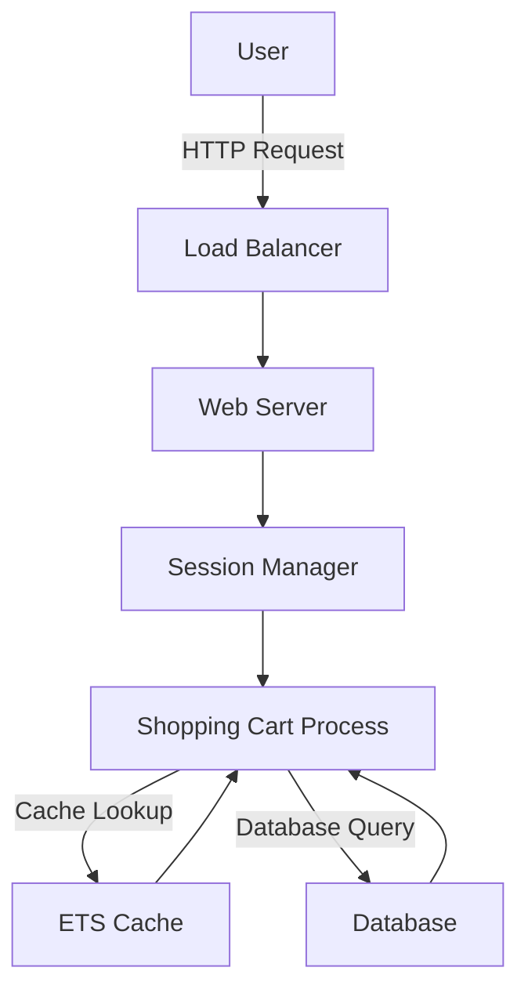

## 28.14.2 High-Performance Shopping Carts

In the fast-paced world of e-commerce, the shopping cart is a critical component that directly impacts user experience and business success. Building a high-performance shopping cart system requires careful consideration of scalability, responsiveness, and reliability. Erlang, with its robust concurrency model and functional programming paradigm, offers unique advantages for developing such systems. In this section, we will explore how to leverage Erlang to create scalable and responsive shopping cart systems, addressing challenges such as session management, state maintenance, caching, and load balancing.

### Challenges in High-Traffic Environments

High-traffic e-commerce platforms face several challenges, including:

- **Session Management**: Maintaining user sessions efficiently without compromising performance.
- **State Management**: Handling the dynamic state of shopping carts as users add or remove items.
- **Scalability**: Ensuring the system can handle a large number of concurrent users.
- **Reliability**: Providing consistent performance and availability, even under peak loads.

### Leveraging Erlang Processes for Session Management

Erlang's lightweight processes are ideal for managing user sessions. Each user session can be represented as an Erlang process, allowing for isolated and concurrent handling of session data. This approach provides several benefits:

- **Isolation**: Each session is independent, reducing the risk of data corruption.
- **Concurrency**: Erlang's scheduler efficiently manages thousands of processes, ensuring responsive performance.
- **Fault Tolerance**: Processes can be monitored and restarted in case of failure, enhancing reliability.

#### Example: Session Management with Erlang Processes

```erlang
-module(shopping_cart).
-export([start_session/1, add_item/2, remove_item/2, get_cart/1]).

% Start a new shopping cart session
start_session(UserId) ->
    spawn(fun() -> session_loop(UserId, []) end).

% Add an item to the shopping cart
add_item(SessionPid, Item) ->
    SessionPid ! {add_item, Item}.

% Remove an item from the shopping cart
remove_item(SessionPid, Item) ->
    SessionPid ! {remove_item, Item}.

% Get the current state of the shopping cart
get_cart(SessionPid) ->
    SessionPid ! {get_cart, self()},
    receive
        {cart, Cart} -> Cart
    end.

% Session loop to handle cart operations
session_loop(UserId, Cart) ->
    receive
        {add_item, Item} ->
            NewCart = [Item | Cart],
            session_loop(UserId, NewCart);
        {remove_item, Item} ->
            NewCart = lists:delete(Item, Cart),
            session_loop(UserId, NewCart);
        {get_cart, Caller} ->
            Caller ! {cart, Cart},
            session_loop(UserId, Cart)
    end.
```

In this example, each user session is managed by a separate process. The `session_loop/2` function handles messages to add or remove items and retrieve the cart's current state.

### Optimizing for Speed and Reliability

To optimize the shopping cart system for speed and reliability, consider the following strategies:

- **Caching**: Use in-memory caches like ETS (Erlang Term Storage) to store frequently accessed data, reducing database load and improving response times.
- **Load Balancing**: Distribute incoming requests across multiple nodes to ensure even load distribution and prevent bottlenecks.
- **Asynchronous Processing**: Perform non-blocking operations to maintain responsiveness, especially for tasks like inventory checks or payment processing.

#### Example: Caching with ETS

```erlang
-module(cart_cache).
-export([init_cache/0, cache_item/2, get_cached_item/1]).

% Initialize the ETS cache
init_cache() ->
    ets:new(cart_cache, [named_table, public, set]).

% Cache an item
cache_item(Key, Value) ->
    ets:insert(cart_cache, {Key, Value}).

% Retrieve a cached item
get_cached_item(Key) ->
    case ets:lookup(cart_cache, Key) of
        [{_, Value}] -> {ok, Value};
        [] -> not_found
    end.
```

ETS provides a fast, in-memory storage solution for caching shopping cart data, improving access times and reducing database queries.

### Real-World Application Results

Erlang's capabilities have been successfully applied in real-world e-commerce platforms, achieving significant improvements in performance and scalability. For instance, companies like Klarna and WhatsApp have leveraged Erlang to handle millions of concurrent users, demonstrating its effectiveness in high-traffic environments.

### Visualizing the Architecture

To better understand the architecture of a high-performance shopping cart system in Erlang, consider the following diagram:



**Diagram Description**: This diagram illustrates the flow of a user request through the system. The load balancer distributes requests to web servers, which interact with session managers and shopping cart processes. The cart processes utilize ETS for caching and interact with the database as needed.

### Knowledge Check

Before we conclude, let's reinforce what we've learned:

- How does Erlang's concurrency model benefit session management?
- What are the advantages of using ETS for caching?
- How can load balancing improve system performance?

### Try It Yourself

Experiment with the provided code examples by:

- Modifying the session management code to include additional operations, such as updating item quantities.
- Implementing a caching mechanism for user preferences or frequently viewed items.
- Simulating high traffic by spawning multiple user sessions and observing system performance.

### Conclusion

Building high-performance shopping carts with Erlang involves leveraging its unique features, such as lightweight processes, efficient concurrency, and robust fault tolerance. By implementing strategies like caching and load balancing, developers can create scalable and responsive systems capable of handling high traffic and ensuring a seamless user experience.

### References and Further Reading

- [Erlang Documentation](https://www.erlang.org/doc/)
- [ETS: Erlang Term Storage](https://erlang.org/doc/man/ets.html)
- [Concurrency in Erlang](https://erlang.org/doc/reference_manual/processes.html)

## Quiz: High-Performance Shopping Carts



### How does Erlang's concurrency model benefit session management?

- [x] It allows for isolated and concurrent handling of session data.
- [ ] It requires complex synchronization mechanisms.
- [ ] It limits the number of concurrent sessions.
- [ ] It increases the risk of data corruption.

> **Explanation:** Erlang's concurrency model allows each session to be managed by an independent process, ensuring isolation and efficient handling of concurrent sessions.

### What is the primary advantage of using ETS for caching?

- [x] Fast, in-memory storage solution.
- [ ] Requires frequent database queries.
- [ ] Limited to small data sets.
- [ ] Complex to implement.

> **Explanation:** ETS provides a fast, in-memory storage solution that reduces database load and improves access times.

### How can load balancing improve system performance?

- [x] By distributing incoming requests across multiple nodes.
- [ ] By concentrating all requests on a single node.
- [ ] By reducing the number of concurrent users.
- [ ] By increasing database queries.

> **Explanation:** Load balancing distributes incoming requests across multiple nodes, ensuring even load distribution and preventing bottlenecks.

### What is a key benefit of using Erlang processes for session management?

- [x] Fault tolerance through process monitoring and restarting.
- [ ] Increased complexity in session handling.
- [ ] Reduced system responsiveness.
- [ ] Limited scalability.

> **Explanation:** Erlang processes provide fault tolerance by allowing processes to be monitored and restarted in case of failure.

### Which strategy helps maintain responsiveness in a shopping cart system?

- [x] Asynchronous processing.
- [ ] Blocking operations.
- [ ] Synchronous processing.
- [ ] Increasing database queries.

> **Explanation:** Asynchronous processing allows non-blocking operations, maintaining system responsiveness.

### What is a common challenge in high-traffic e-commerce platforms?

- [x] Maintaining user sessions efficiently.
- [ ] Reducing the number of concurrent users.
- [ ] Limiting system scalability.
- [ ] Decreasing system reliability.

> **Explanation:** High-traffic platforms need to maintain user sessions efficiently without compromising performance.

### How does Erlang handle a large number of concurrent processes?

- [x] Through efficient scheduling by the BEAM VM.
- [ ] By limiting the number of processes.
- [ ] By requiring manual synchronization.
- [ ] By increasing system complexity.

> **Explanation:** Erlang's BEAM VM efficiently schedules and manages a large number of concurrent processes.

### What is the role of the session manager in the architecture diagram?

- [x] To manage user sessions and interact with shopping cart processes.
- [ ] To handle database queries directly.
- [ ] To balance incoming requests.
- [ ] To store user preferences.

> **Explanation:** The session manager manages user sessions and interacts with shopping cart processes.

### What is a benefit of using Erlang for high-performance shopping carts?

- [x] Robust fault tolerance and concurrency handling.
- [ ] Limited scalability.
- [ ] Increased complexity in code.
- [ ] Reduced system reliability.

> **Explanation:** Erlang provides robust fault tolerance and efficient concurrency handling, making it suitable for high-performance systems.

### True or False: Erlang's lightweight processes are ideal for managing user sessions.

- [x] True
- [ ] False

> **Explanation:** True. Erlang's lightweight processes are well-suited for managing user sessions due to their isolation and concurrency capabilities.



Remember, this is just the beginning. As you progress, you'll build more complex and interactive systems. Keep experimenting, stay curious, and enjoy the journey!
