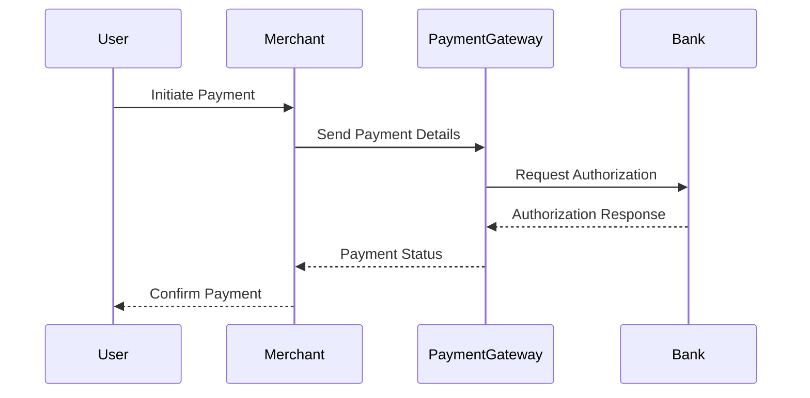

## 28.14.3 Payment Processing and Security

In the realm of e-commerce, payment processing is a critical component that demands the utmost attention to security. As developers, our responsibility extends beyond mere functionality; we must ensure that the systems we build are secure, reliable, and trustworthy. In this section, we will delve into the intricacies of implementing secure payment processing workflows in Erlang applications, focusing on integration with payment gateways, data encryption, PCI DSS compliance, and fraud prevention.

### The Critical Importance of Security in Payment Processing

Security in payment processing is paramount for several reasons:

1. **Protection of Sensitive Data**: Payment processing involves handling sensitive information such as credit card numbers, personal identification numbers (PINs), and other personal data. Ensuring this data is protected from unauthorized access is crucial.

2. **Compliance with Standards**: Adhering to industry standards such as the Payment Card Industry Data Security Standard (PCI DSS) is mandatory for businesses that handle credit card transactions.

3. **Building Customer Trust**: Customers are more likely to engage with businesses that demonstrate a commitment to protecting their data. Robust security measures help build trust and foster long-term customer relationships.

4. **Preventing Financial Loss**: Security breaches can lead to significant financial losses due to fraud, legal penalties, and damage to reputation.

### Integrating with Payment Gateways

Payment gateways act as intermediaries between merchants and financial institutions, facilitating secure transactions. Integrating with payment gateways in Erlang involves several steps:

1. **Selecting a Payment Gateway**: Choose a payment gateway that aligns with your business needs and supports the currencies and payment methods you require.

2. **Establishing Secure Connections**: Use SSL/TLS protocols to establish secure connections with the payment gateway, ensuring data is encrypted during transmission.

3. **Implementing API Calls**: Payment gateways provide APIs for processing transactions. Implement these API calls in your Erlang application to handle payments, refunds, and other operations.

4. **Handling Responses**: Process the responses from the payment gateway to update transaction statuses and handle errors appropriately.

#### Code Example: Integrating with a Payment Gateway

```erlang
-module(payment_processor).
-export([process_payment/3]).

% Function to process a payment
process_payment(CardDetails, Amount, Currency) ->
    % Construct the request payload
    Payload = #{card_details => CardDetails, amount => Amount, currency => Currency},
    
    % Send the request to the payment gateway
    Response = httpc:request(post, {"https://api.paymentgateway.com/charge", [], "application/json", Payload}, [], []),
    
    % Handle the response
    case Response of
        {ok, {{_, 200, _}, _, Body}} ->
            {ok, parse_response(Body)};
        {ok, {{_, StatusCode, _}, _, _}} ->
            {error, {gateway_error, StatusCode}};
        {error, Reason} ->
            {error, {network_error, Reason}}
    end.

% Function to parse the response body
parse_response(Body) ->
    % Parse the JSON response
    {ok, Parsed} = jsx:decode(Body),
    Parsed.
```

### Encrypting Sensitive Data

Encrypting sensitive data is a fundamental aspect of securing payment processing systems. Erlang provides robust libraries for encryption, such as the `crypto` module, which can be used to encrypt and decrypt data.

#### Code Example: Encrypting Credit Card Information

```erlang
-module(encryption).
-export([encrypt_card/1, decrypt_card/1]).

% Function to encrypt credit card information
encrypt_card(CardNumber) ->
    Key = <<"your-encryption-key">>,
    IV = crypto:strong_rand_bytes(16),
    Encrypted = crypto:block_encrypt(aes_cbc256, Key, IV, CardNumber),
    {IV, Encrypted}.

% Function to decrypt credit card information
decrypt_card({IV, Encrypted}) ->
    Key = <<"your-encryption-key">>,
    crypto:block_decrypt(aes_cbc256, Key, IV, Encrypted).
```

### PCI DSS Compliance

The Payment Card Industry Data Security Standard (PCI DSS) is a set of security standards designed to ensure that all companies that accept, process, store, or transmit credit card information maintain a secure environment. Compliance with PCI DSS involves:

1. **Building and Maintaining a Secure Network**: Implement firewalls and other security measures to protect cardholder data.

2. **Protecting Cardholder Data**: Encrypt transmission of cardholder data across open, public networks.

3. **Maintaining a Vulnerability Management Program**: Regularly update and patch systems to protect against vulnerabilities.

4. **Implementing Strong Access Control Measures**: Restrict access to cardholder data to only those who need it.

5. **Regularly Monitoring and Testing Networks**: Monitor access to network resources and cardholder data, and regularly test security systems and processes.

6. **Maintaining an Information Security Policy**: Develop and maintain a policy that addresses information security for all personnel.

### Fraud Detection and Prevention

Fraud detection and prevention are critical components of a secure payment processing system. Implementing effective fraud detection mechanisms involves:

1. **Monitoring Transactions**: Use machine learning algorithms to analyze transaction patterns and identify anomalies.

2. **Implementing Multi-Factor Authentication (MFA)**: Require additional verification steps for high-risk transactions.

3. **Setting Transaction Limits**: Establish limits on transaction amounts and frequencies to reduce the risk of fraud.

4. **Using Fraud Detection Services**: Integrate with third-party fraud detection services to enhance your system's capabilities.

### Building Customer Trust Through Robust Security Measures

Building customer trust involves more than just implementing security measures; it requires transparent communication and a commitment to protecting customer data. Key strategies include:

1. **Communicating Security Practices**: Clearly communicate your security practices and policies to customers.

2. **Providing Secure Payment Options**: Offer secure payment options, such as tokenization and digital wallets, to enhance security.

3. **Responding to Security Incidents**: Have a plan in place to respond to security incidents promptly and effectively.

4. **Regularly Updating Security Measures**: Continuously update and improve security measures to address emerging threats.

### Visualizing Payment Processing Workflow

To better understand the payment processing workflow, let's visualize the process using a sequence diagram.



### Try It Yourself

To deepen your understanding, try modifying the code examples provided:

- Experiment with different encryption algorithms and key sizes in the encryption example.
- Implement additional error handling in the payment gateway integration example.
- Integrate a third-party fraud detection service and analyze its impact on transaction processing.

### Knowledge Check

- What are the key components of a secure payment processing system?
- How does encrypting sensitive data enhance security?
- What are the main requirements for PCI DSS compliance?
- How can fraud detection mechanisms be implemented in Erlang applications?

### Summary

In this section, we've explored the critical aspects of secure payment processing in Erlang applications. By integrating with payment gateways, encrypting sensitive data, complying with PCI DSS, and implementing fraud detection mechanisms, we can build secure and trustworthy payment systems. Remember, security is an ongoing process that requires continuous improvement and adaptation to new threats.

## Quiz: Payment Processing and Security



### What is the primary purpose of encrypting sensitive data in payment processing?

- [x] To protect data from unauthorized access
- [ ] To increase transaction speed
- [ ] To reduce server load
- [ ] To comply with marketing standards

> **Explanation:** Encrypting sensitive data ensures that it is protected from unauthorized access, maintaining confidentiality and integrity.

### Which protocol is recommended for establishing secure connections with payment gateways?

- [x] SSL/TLS
- [ ] HTTP
- [ ] FTP
- [ ] SMTP

> **Explanation:** SSL/TLS protocols are recommended for establishing secure connections, ensuring data is encrypted during transmission.

### What is a key requirement of PCI DSS compliance?

- [x] Encrypting transmission of cardholder data
- [ ] Using open-source software
- [ ] Offering discounts to customers
- [ ] Reducing transaction fees

> **Explanation:** PCI DSS compliance requires encrypting the transmission of cardholder data across open, public networks.

### How can fraud detection be enhanced in payment processing systems?

- [x] By using machine learning algorithms
- [ ] By reducing transaction limits
- [ ] By increasing server capacity
- [ ] By offering more payment options

> **Explanation:** Machine learning algorithms can analyze transaction patterns and identify anomalies, enhancing fraud detection.

### What is an effective way to build customer trust in payment processing?

- [x] Clearly communicating security practices
- [ ] Offering free products
- [ ] Reducing prices
- [ ] Increasing marketing efforts

> **Explanation:** Clearly communicating security practices helps build customer trust by demonstrating a commitment to protecting their data.

### What role do payment gateways play in payment processing?

- [x] They act as intermediaries between merchants and financial institutions
- [ ] They store customer data
- [ ] They provide marketing services
- [ ] They manufacture payment cards

> **Explanation:** Payment gateways facilitate secure transactions by acting as intermediaries between merchants and financial institutions.

### What is a common method for preventing fraud in payment processing?

- [x] Implementing multi-factor authentication
- [ ] Reducing server load
- [ ] Offering discounts
- [ ] Increasing transaction speed

> **Explanation:** Multi-factor authentication adds an extra layer of security, making it harder for unauthorized users to access accounts.

### Why is it important to regularly update security measures in payment processing systems?

- [x] To address emerging threats
- [ ] To increase transaction speed
- [ ] To reduce server load
- [ ] To comply with marketing standards

> **Explanation:** Regularly updating security measures helps address emerging threats and maintain the security of the system.

### What is a benefit of using third-party fraud detection services?

- [x] They enhance the system's fraud detection capabilities
- [ ] They reduce transaction fees
- [ ] They increase server capacity
- [ ] They offer marketing services

> **Explanation:** Third-party fraud detection services provide additional tools and expertise to enhance the system's fraud detection capabilities.

### True or False: PCI DSS compliance is optional for businesses that handle credit card transactions.

- [ ] True
- [x] False

> **Explanation:** PCI DSS compliance is mandatory for businesses that handle credit card transactions to ensure a secure environment.



Remember, this is just the beginning. As you progress, you'll build more complex and secure payment systems. Keep experimenting, stay curious, and enjoy the journey!
