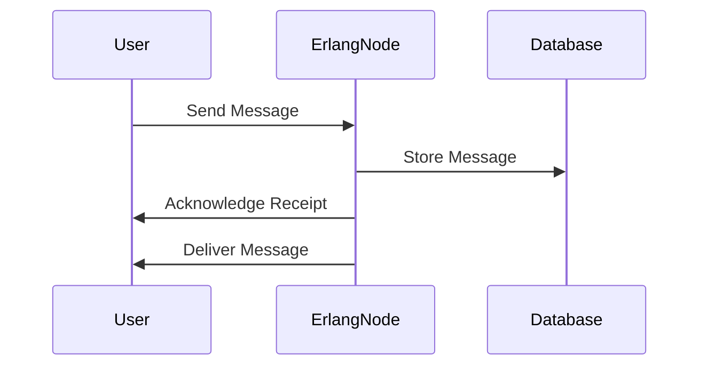

## 28.17 Erlang in Messaging Systems: The Backbone of WhatsApp

In this section, we delve into the fascinating world of messaging systems, focusing on how Erlang serves as the backbone for one of the most popular messaging platforms in the world—WhatsApp. We will explore the architecture of WhatsApp, the unique features of Erlang that make it ideal for such applications, and the challenges overcome in building a system capable of handling billions of messages daily.

### Overview of WhatsApp's Architecture

WhatsApp is a prime example of a large-scale messaging system that leverages Erlang's strengths. The architecture of WhatsApp is designed to ensure high availability, scalability, and fault tolerance. At its core, WhatsApp uses a distributed system architecture, where Erlang plays a crucial role in managing concurrent processes and ensuring reliable message delivery.

#### Key Components of WhatsApp's Architecture

1. **Erlang Nodes**: WhatsApp's server infrastructure consists of numerous Erlang nodes, each capable of handling thousands of concurrent connections. These nodes communicate with each other to distribute the load and ensure seamless message delivery.

2. **Message Queues**: Messages are queued and processed asynchronously, allowing the system to handle high volumes of traffic without bottlenecks.

3. **Database Integration**: WhatsApp uses a combination of databases to store user data and message history. The choice of databases is optimized for speed and reliability.

4. **Load Balancers**: Load balancers are used to distribute incoming connections across multiple Erlang nodes, ensuring that no single node becomes a bottleneck.

5. **Fault Tolerance Mechanisms**: WhatsApp employs various fault tolerance strategies, including process supervision and automatic restarts, to maintain service continuity.

### Erlang's Features Enabling Scalability and Reliability

Erlang's design is inherently suited for building scalable and reliable systems. Let's explore the features that make Erlang an ideal choice for messaging systems like WhatsApp.

#### Concurrency and the Actor Model

Erlang's concurrency model is based on lightweight processes and message passing, which aligns perfectly with the needs of a messaging system. Each user connection can be handled by a separate Erlang process, allowing the system to scale horizontally by simply adding more nodes.

```erlang
% Example of spawning a process in Erlang
spawn(fun() -> 
    receive
        {From, Message} -> 
            io:format("Received message ~p from ~p~n", [Message, From])
    end
end).
```

#### Fault Tolerance and the "Let It Crash" Philosophy

Erlang's "let it crash" philosophy encourages developers to design systems that can recover from failures automatically. This is achieved through process supervision, where supervisors monitor worker processes and restart them if they fail.

```erlang
% Example of a simple supervisor in Erlang
-module(simple_supervisor).
-behaviour(supervisor).

init([]) ->
    {ok, {{one_for_one, 5, 10},
          [{worker, {worker_module, start_link, []}, permanent, 5000, worker, [worker_module]}]}}.
```

#### Distributed Nature

Erlang's ability to run distributed applications across multiple nodes is a key factor in WhatsApp's architecture. This allows for load balancing and redundancy, ensuring that the system can handle a large number of users and messages.

```erlang
% Example of connecting nodes in Erlang
net_adm:ping('node1@hostname').
net_adm:ping('node2@hostname').
```

### Challenges Overcome by Using Erlang

Building a messaging system like WhatsApp comes with its own set of challenges. Erlang's features help overcome these challenges effectively.

#### Scalability

Handling billions of messages daily requires a system that can scale effortlessly. Erlang's lightweight processes and distributed nature allow WhatsApp to scale horizontally by adding more nodes to the system.

#### Fault Tolerance

In a messaging system, downtime is not an option. Erlang's fault tolerance mechanisms ensure that even if a process crashes, the system can recover quickly without affecting the user experience.

#### Real-Time Communication

Erlang's concurrency model and efficient message passing enable real-time communication, which is crucial for a messaging platform. Users expect their messages to be delivered instantly, and Erlang's architecture supports this requirement.

### Impact of Erlang on User Experience and Service Reliability

The choice of Erlang as the backbone for WhatsApp has a significant impact on user experience and service reliability. Users benefit from a platform that is fast, reliable, and always available.

#### Enhanced User Experience

Erlang's ability to handle concurrent connections ensures that users can send and receive messages without delay. The system's responsiveness is a direct result of Erlang's efficient process management.

#### Service Reliability

With Erlang's fault tolerance features, WhatsApp can maintain high service reliability. Users experience minimal downtime, and the system can recover from failures quickly, ensuring continuous availability.

### Drawing Inspiration from WhatsApp's Success

WhatsApp's success story serves as an inspiration for developers looking to build large-scale applications. By leveraging Erlang's strengths, developers can create systems that are not only scalable and reliable but also capable of providing an exceptional user experience.

#### Key Takeaways

- **Leverage Erlang's Concurrency**: Use Erlang's lightweight processes to handle multiple connections simultaneously.
- **Embrace the "Let It Crash" Philosophy**: Design systems that can recover from failures automatically.
- **Utilize Distributed Systems**: Take advantage of Erlang's distributed nature to build scalable applications.
- **Focus on User Experience**: Ensure that your system is responsive and reliable to provide the best user experience.

### Try It Yourself

To truly understand the power of Erlang in messaging systems, try building a simple chat application using Erlang. Experiment with process spawning, message passing, and fault tolerance mechanisms. Modify the code examples provided to see how changes affect the system's behavior.

### Visualizing Erlang's Role in Messaging Systems

To better understand how Erlang fits into the architecture of a messaging system like WhatsApp, let's visualize the process flow using a sequence diagram.



This diagram illustrates the basic flow of a message being sent and delivered in a messaging system. Erlang nodes handle the message processing and communication with the database, ensuring that messages are stored and delivered reliably.

### References and Further Reading

- [Erlang's Official Website](https://www.erlang.org/)
- [WhatsApp's Engineering Blog](https://engineering.fb.com/category/whatsapp/)
- [Erlang and OTP in Action](https://www.manning.com/books/erlang-and-otp-in-action)

### Knowledge Check

Before moving on, take a moment to reflect on what you've learned. Consider the following questions:

- How does Erlang's concurrency model benefit messaging systems?
- What role does fault tolerance play in ensuring service reliability?
- How can you apply Erlang's features to your own projects?

### Embrace the Journey

Remember, building large-scale applications is a journey. As you explore Erlang's capabilities, you'll discover new ways to enhance your systems. Keep experimenting, stay curious, and enjoy the process of learning and growing as a developer.

## Quiz: Erlang in Messaging Systems (e.g., WhatsApp)



### What is a key feature of Erlang that makes it suitable for messaging systems?

- [x] Concurrency model
- [ ] Object-oriented programming
- [ ] Static typing
- [ ] Manual memory management

> **Explanation:** Erlang's concurrency model, based on lightweight processes and message passing, is ideal for handling multiple connections in messaging systems.

### How does Erlang handle process failures?

- [x] Through supervision and automatic restarts
- [ ] By terminating the entire system
- [ ] By logging errors and ignoring them
- [ ] By using try-catch blocks

> **Explanation:** Erlang uses a supervision strategy to monitor processes and automatically restart them if they fail, ensuring system reliability.

### What is the "let it crash" philosophy in Erlang?

- [x] Allowing processes to fail and recover automatically
- [ ] Preventing any process from crashing
- [ ] Ignoring errors in the system
- [ ] Manually handling all exceptions

> **Explanation:** The "let it crash" philosophy encourages designing systems that can recover from failures automatically, without manual intervention.

### How does Erlang's distributed nature benefit messaging systems like WhatsApp?

- [x] It allows for load balancing and redundancy
- [ ] It simplifies the codebase
- [ ] It reduces the need for databases
- [ ] It eliminates the need for fault tolerance

> **Explanation:** Erlang's distributed nature allows for load balancing and redundancy, ensuring that the system can handle a large number of users and messages.

### What is a common challenge in building messaging systems that Erlang helps overcome?

- [x] Scalability
- [ ] User interface design
- [ ] Marketing
- [ ] Content creation

> **Explanation:** Erlang's features, such as lightweight processes and distributed architecture, help overcome the challenge of scalability in messaging systems.

### What impact does Erlang have on user experience in messaging systems?

- [x] It enhances responsiveness and reliability
- [ ] It complicates the user interface
- [ ] It slows down message delivery
- [ ] It increases development time

> **Explanation:** Erlang's efficient process management and fault tolerance enhance the responsiveness and reliability of messaging systems, improving user experience.

### How does Erlang's fault tolerance contribute to service reliability?

- [x] By ensuring minimal downtime and quick recovery
- [ ] By preventing all errors
- [ ] By requiring manual intervention for failures
- [ ] By using complex error handling mechanisms

> **Explanation:** Erlang's fault tolerance mechanisms ensure minimal downtime and quick recovery, maintaining high service reliability.

### What is the role of load balancers in WhatsApp's architecture?

- [x] To distribute incoming connections across Erlang nodes
- [ ] To store user data
- [ ] To manage user interfaces
- [ ] To encrypt messages

> **Explanation:** Load balancers distribute incoming connections across multiple Erlang nodes, preventing any single node from becoming a bottleneck.

### How can developers draw inspiration from WhatsApp's use of Erlang?

- [x] By leveraging Erlang's strengths in their own projects
- [ ] By copying WhatsApp's code
- [ ] By avoiding Erlang altogether
- [ ] By focusing solely on user interface design

> **Explanation:** Developers can draw inspiration from WhatsApp's success by leveraging Erlang's strengths, such as concurrency and fault tolerance, in their own projects.

### True or False: Erlang's concurrency model is based on shared memory.

- [ ] True
- [x] False

> **Explanation:** Erlang's concurrency model is based on message passing, not shared memory, which helps avoid issues related to shared state.



By understanding how Erlang powers messaging systems like WhatsApp, you can apply these insights to your own projects, creating scalable, reliable, and efficient applications. Keep exploring and experimenting with Erlang to unlock its full potential in your development journey.
