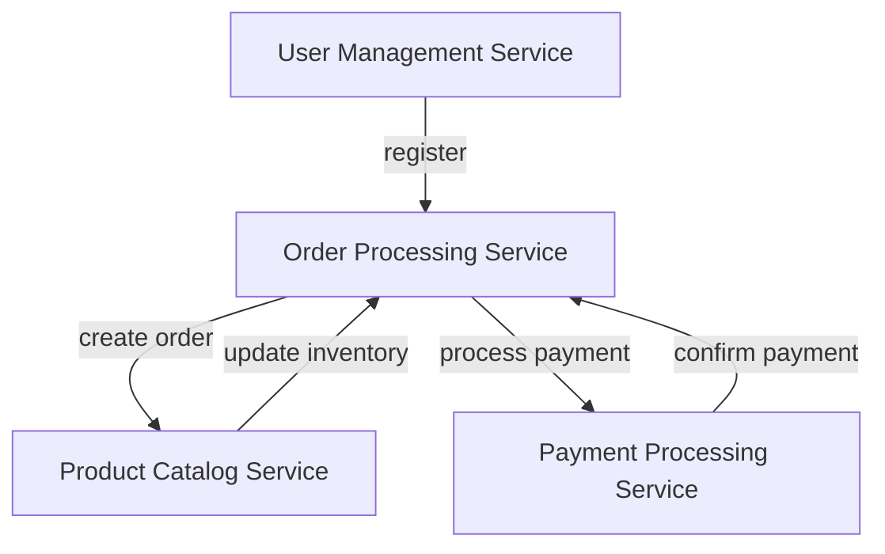

## 28.2 Developing a Microservices Architecture with Erlang

In this section, we will delve into the development of a microservices architecture using Erlang. We'll explore the rationale behind choosing a microservices approach, how services are defined and interact in Erlang, and the role of OTP applications in encapsulating microservices. Additionally, we'll highlight how Erlang's unique features simplify the implementation of microservices and reflect on the benefits and challenges encountered during the process.

### Understanding Microservices Architecture

Microservices architecture is a design approach where a software application is composed of small, independent services that communicate over a network. Each service is focused on a specific business capability and can be developed, deployed, and scaled independently. This architecture contrasts with monolithic architectures, where all components are tightly integrated and deployed as a single unit.

#### Why Choose Microservices?

1. **Scalability**: Microservices allow individual services to be scaled independently based on demand, optimizing resource usage.
2. **Flexibility**: Different services can be developed using different technologies, allowing teams to choose the best tool for each job.
3. **Resilience**: Failure in one service does not necessarily affect the entire system, enhancing fault tolerance.
4. **Faster Deployment**: Smaller, independent services can be deployed more frequently, accelerating the release cycle.

### Erlang and Microservices: A Perfect Match

Erlang is a functional programming language designed for building scalable and fault-tolerant systems. Its concurrency model, based on lightweight processes and message passing, aligns well with the microservices architecture. Erlang's Open Telecom Platform (OTP) provides robust tools for building distributed systems, making it an excellent choice for microservices.

#### Key Erlang Features for Microservices

- **Concurrency**: Erlang's lightweight processes enable efficient handling of concurrent tasks.
- **Fault Tolerance**: The "let it crash" philosophy and supervision trees ensure systems can recover from failures.
- **Distribution**: Built-in support for distributed computing facilitates communication between services.
- **Hot Code Upgrades**: Erlang allows for code updates without stopping the system, minimizing downtime.

### Designing a Microservices Application in Erlang

Let's consider a case study of developing an e-commerce platform using a microservices architecture in Erlang. The platform consists of several services, including user management, product catalog, order processing, and payment processing.

#### Service Decomposition

1. **User Management Service**: Handles user registration, authentication, and profile management.
2. **Product Catalog Service**: Manages product listings, categories, and inventory.
3. **Order Processing Service**: Manages order creation, status updates, and history.
4. **Payment Processing Service**: Handles payment transactions and integrations with payment gateways.

#### Service Interaction

Services communicate using message passing, a core feature of Erlang. Each service runs as an independent OTP application, encapsulating its functionality and state.

```erlang
% Example of message passing between services
% User Management Service sends a message to Order Processing Service

% In User Management Service
OrderProcessingPid ! {new_order, UserId, OrderDetails}.

% In Order Processing Service
receive
    {new_order, UserId, OrderDetails} ->
        process_order(UserId, OrderDetails);
    _Other ->
        ignore
end.
```

### Encapsulating Microservices with OTP Applications

OTP applications provide a structured way to build Erlang applications, encapsulating all necessary components, including processes, modules, and configuration.

#### Creating an OTP Application

1. **Define the Application Module**: Create a module that implements the `application` behavior, specifying the application's start and stop functions.

```erlang
-module(user_management_app).
-behaviour(application).

-export([start/2, stop/1]).

start(_StartType, _StartArgs) ->
    UserManagementSup = user_management_sup:start_link(),
    {ok, UserManagementSup}.

stop(_State) ->
    ok.
```

2. **Implement a Supervisor**: Use a supervisor to manage the lifecycle of processes within the application, ensuring they are restarted in case of failure.

```erlang
-module(user_management_sup).
-behaviour(supervisor).

-export([start_link/0, init/1]).

start_link() ->
    supervisor:start_link({local, ?MODULE}, ?MODULE, []).

init([]) ->
    Children = [
        {user_management_server, {user_management_server, start_link, []},
         permanent, 5000, worker, [user_management_server]}
    ],
    {ok, {{one_for_one, 5, 10}, Children}}.
```

3. **Develop the Service Logic**: Implement the core functionality of the service in a separate module, using processes to handle concurrent tasks.

```erlang
-module(user_management_server).
-behaviour(gen_server).

-export([start_link/0, init/1, handle_call/3, handle_cast/2, handle_info/2, terminate/2, code_change/3]).

start_link() ->
    gen_server:start_link({local, ?MODULE}, ?MODULE, [], []).

init([]) ->
    {ok, #state{}}.

handle_call({register_user, UserDetails}, _From, State) ->
    % Logic to register a new user
    {reply, ok, State};

handle_cast(_Msg, State) ->
    {noreply, State}.

handle_info(_Info, State) ->
    {noreply, State}.

terminate(_Reason, _State) ->
    ok.

code_change(_OldVsn, State, _Extra) ->
    {ok, State}.
```

### Benefits of Using Erlang for Microservices

1. **Concurrency and Scalability**: Erlang's lightweight processes and message-passing model make it easy to build scalable microservices that handle many concurrent requests.
2. **Fault Tolerance**: The OTP framework provides tools for building resilient systems that can recover from failures automatically.
3. **Ease of Distribution**: Erlang's built-in support for distributed computing simplifies the deployment of microservices across multiple nodes.
4. **Hot Code Upgrades**: Erlang allows for seamless updates to running systems, reducing downtime during deployments.

### Challenges and Considerations

1. **Complexity**: Managing multiple services can increase the complexity of the system, requiring careful design and orchestration.
2. **Communication Overhead**: The need for inter-service communication can introduce latency and require efficient message-passing strategies.
3. **State Management**: Ensuring consistency and managing state across distributed services can be challenging.
4. **Monitoring and Debugging**: Observability tools are essential for monitoring the health and performance of microservices.

### Visualizing Microservices Architecture

Below is a diagram illustrating the interaction between different microservices in our e-commerce platform.



*Figure 1: Interaction between microservices in an e-commerce platform.*

### Try It Yourself

To experiment with building microservices in Erlang, try modifying the code examples to add new features or services. For instance, you could:

- Add a new service for handling customer reviews.
- Implement caching in the Product Catalog Service using ETS.
- Introduce a new payment gateway integration in the Payment Processing Service.

### Conclusion

Developing a microservices architecture with Erlang offers numerous benefits, including scalability, fault tolerance, and ease of distribution. By leveraging Erlang's unique features and OTP framework, developers can build robust and efficient microservices. However, it's essential to consider the challenges and complexities involved in managing distributed systems.

## Quiz: Developing a Microservices Architecture with Erlang



### What is a key advantage of using microservices architecture?

- [x] Scalability
- [ ] Simplicity
- [ ] Monolithic design
- [ ] Single point of failure

> **Explanation:** Microservices architecture allows individual services to be scaled independently, optimizing resource usage.

### Which Erlang feature is particularly beneficial for microservices?

- [x] Lightweight processes
- [ ] Global variables
- [ ] Synchronous communication
- [ ] Single-threaded execution

> **Explanation:** Erlang's lightweight processes enable efficient handling of concurrent tasks, which is beneficial for microservices.

### What is the role of OTP applications in Erlang microservices?

- [x] Encapsulate functionality and manage processes
- [ ] Provide global state management
- [ ] Enable synchronous communication
- [ ] Simplify code compilation

> **Explanation:** OTP applications encapsulate functionality and manage the lifecycle of processes within a microservice.

### How do Erlang services typically communicate?

- [x] Message passing
- [ ] Shared memory
- [ ] Global variables
- [ ] Direct function calls

> **Explanation:** Erlang services communicate using message passing, which is a core feature of the language.

### What is a potential challenge of microservices architecture?

- [x] Increased complexity
- [ ] Reduced scalability
- [ ] Single point of failure
- [ ] Lack of flexibility

> **Explanation:** Managing multiple services can increase the complexity of the system, requiring careful design and orchestration.

### What does the "let it crash" philosophy in Erlang promote?

- [x] Fault tolerance
- [ ] Error suppression
- [ ] Global error handling
- [ ] Synchronous execution

> **Explanation:** The "let it crash" philosophy promotes fault tolerance by allowing processes to fail and be restarted by supervisors.

### Which tool is essential for monitoring Erlang microservices?

- [x] Observability tools
- [ ] Global variables
- [ ] Synchronous communication
- [ ] Single-threaded execution

> **Explanation:** Observability tools are essential for monitoring the health and performance of microservices.

### What is a benefit of Erlang's hot code upgrades?

- [x] Seamless updates with reduced downtime
- [ ] Increased complexity
- [ ] Single point of failure
- [ ] Lack of flexibility

> **Explanation:** Erlang's hot code upgrades allow for seamless updates to running systems, reducing downtime during deployments.

### Which diagramming tool is used to visualize microservices architecture in this guide?

- [x] Mermaid.js
- [ ] UML
- [ ] Visio
- [ ] PowerPoint

> **Explanation:** Mermaid.js is used to create diagrams that visually represent concepts, architectures, and workflows.

### True or False: Erlang's message-passing model is synchronous.

- [ ] True
- [x] False

> **Explanation:** Erlang's message-passing model is asynchronous, allowing processes to communicate without blocking.



Remember, this is just the beginning. As you progress, you'll build more complex and interactive systems. Keep experimenting, stay curious, and enjoy the journey!
