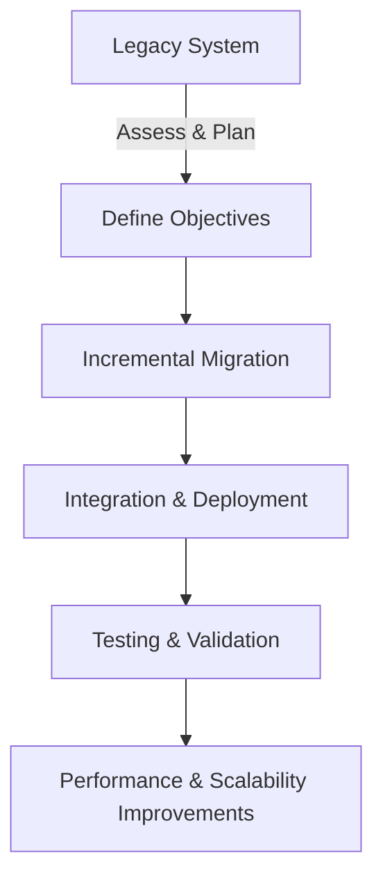

## 28.4 Migrating a Legacy System to Erlang

Migrating a legacy system to Erlang can be a transformative process, offering significant improvements in scalability, maintainability, and performance. In this section, we will explore the motivations for such a migration, the strategies employed, the challenges encountered, and the benefits realized. We will also provide recommendations for similar projects.

### Understanding the Legacy System

Before embarking on a migration journey, it's crucial to understand the existing system's limitations and the motivations for migration. Legacy systems often suffer from issues such as:

- **Scalability Constraints**: Many legacy systems were not designed to handle modern workloads, leading to performance bottlenecks.
- **Maintenance Challenges**: Over time, the codebase can become difficult to maintain due to outdated technologies and lack of documentation.
- **Lack of Concurrency**: Older systems may not efficiently handle concurrent operations, which are essential for modern applications.
- **Technical Debt**: Accumulated shortcuts and workarounds can hinder further development and innovation.

### Motivations for Migration

The decision to migrate to Erlang is often driven by the need to address these limitations. Erlang's strengths include:

- **Concurrency**: Erlang's lightweight process model and message-passing capabilities make it ideal for concurrent applications.
- **Fault Tolerance**: The "let it crash" philosophy and robust error handling improve system reliability.
- **Scalability**: Erlang's distributed nature allows for seamless scaling across multiple nodes.
- **Maintainability**: Functional programming paradigms and clear syntax enhance code readability and maintainability.

### Migration Strategy

Migrating a legacy system to Erlang requires a well-thought-out strategy. Here are the key steps involved:

#### 1. Assessment and Planning

- **Evaluate the Current System**: Identify critical components, dependencies, and potential bottlenecks.
- **Define Objectives**: Clearly outline the goals of the migration, such as improved performance or scalability.
- **Risk Assessment**: Identify potential risks and develop mitigation strategies.

#### 2. Incremental Migration

- **Modular Approach**: Break down the system into smaller, manageable components for gradual migration.
- **Parallel Development**: Develop new components in Erlang while maintaining the existing system.
- **Testing and Validation**: Continuously test new components to ensure they meet performance and functionality requirements.

#### 3. Integration and Deployment

- **Seamless Integration**: Ensure new Erlang components integrate smoothly with existing systems.
- **Deployment Strategy**: Plan for phased deployment to minimize disruption.

### Challenges and Adaptation

Migrating to Erlang presents unique challenges, particularly in adapting to its paradigms:

#### Adapting to Functional Programming

- **Immutability**: Embrace immutable data structures, which can be a shift from mutable state in legacy systems.
- **Recursion**: Replace iterative loops with recursive functions, leveraging Erlang's tail call optimization.

#### Concurrency Model

- **Process Model**: Transition from thread-based concurrency to Erlang's lightweight processes.
- **Message Passing**: Adapt to asynchronous communication through message passing, which may require redesigning certain components.

#### Tooling and Ecosystem

- **Learning Curve**: Familiarize the team with Erlang's tools and libraries, such as Rebar3 for build automation.
- **Community Support**: Leverage Erlang's active community for support and resources.

### Improvements and Benefits

The migration to Erlang can yield significant improvements:

- **Performance**: Enhanced concurrency and efficient resource management lead to better performance.
- **Scalability**: Distributed architecture allows for horizontal scaling, accommodating increased workloads.
- **Maintainability**: Cleaner codebase and functional paradigms simplify maintenance and future development.

### Recommendations for Successful Migration

- **Comprehensive Planning**: Invest time in thorough planning and risk assessment.
- **Incremental Approach**: Migrate in stages to minimize risk and ensure continuity.
- **Continuous Testing**: Implement rigorous testing to validate each component.
- **Team Training**: Provide training and resources to help the team adapt to Erlang's paradigms.
- **Community Engagement**: Engage with the Erlang community for insights and support.

### Code Example: Migrating a Simple Component

Let's illustrate the migration process with a simple example. Suppose we have a legacy system component responsible for handling user sessions. In the legacy system, this might be implemented using a global state and locks. In Erlang, we can leverage processes and message passing.

```erlang
-module(session_manager).
-export([start/0, create_session/1, get_session/1, delete_session/1]).

% Start the session manager process
start() ->
    spawn(fun loop/0).

% Loop to handle incoming messages
loop() ->
    receive
        {create, UserId} ->
            % Create a new session for the user
            SessionId = erlang:unique_integer([monotonic]),
            io:format("Session created for user ~p: ~p~n", [UserId, SessionId]),
            loop();
        {get, SessionId, From} ->
            % Retrieve session information
            From ! {session_info, SessionId, "Session data"},
            loop();
        {delete, SessionId} ->
            % Delete the session
            io:format("Session ~p deleted~n", [SessionId]),
            loop()
    end.

% API to create a session
create_session(UserId) ->
    Pid = start(),
    Pid ! {create, UserId}.

% API to get session information
get_session(SessionId) ->
    Pid = start(),
    Pid ! {get, SessionId, self()},
    receive
        {session_info, SessionId, Data} ->
            io:format("Session ~p: ~p~n", [SessionId, Data])
    end.

% API to delete a session
delete_session(SessionId) ->
    Pid = start(),
    Pid ! {delete, SessionId}.
```

### Visualizing the Migration Process

To better understand the migration process, let's visualize the workflow using a Mermaid.js flowchart:



**Figure 1**: Migration Workflow from Legacy System to Erlang

### Knowledge Check

- **What are the main motivations for migrating a legacy system to Erlang?**
- **Describe the key steps involved in the migration strategy.**
- **What challenges might you face when adapting to Erlang's paradigms?**
- **How does Erlang improve performance and scalability?**

### Conclusion

Migrating a legacy system to Erlang is a strategic decision that can lead to significant improvements in performance, scalability, and maintainability. By understanding the legacy system's limitations, planning a comprehensive migration strategy, and embracing Erlang's paradigms, organizations can transform their systems to meet modern demands. Remember, this journey requires careful planning, continuous testing, and a willingness to adapt to new paradigms. As you embark on this migration, leverage the resources and support available within the Erlang community.

## Quiz: Migrating a Legacy System to Erlang



### What is a common motivation for migrating a legacy system to Erlang?

- [x] Improved scalability and concurrency
- [ ] Reduced development costs
- [ ] Enhanced user interface design
- [ ] Simplified database management

> **Explanation:** Erlang's concurrency model and distributed nature make it ideal for scalable applications.

### Which of the following is a key step in the migration strategy?

- [x] Incremental migration
- [ ] Complete system rewrite
- [ ] Ignoring existing system dependencies
- [ ] Skipping testing phases

> **Explanation:** Incremental migration allows for gradual transition and minimizes risk.

### What is a challenge when adapting to Erlang's paradigms?

- [x] Transitioning to message-passing concurrency
- [ ] Implementing global state management
- [ ] Using mutable data structures
- [ ] Relying on synchronous operations

> **Explanation:** Erlang's concurrency model relies on message passing, which may require redesigning components.

### How does Erlang improve system performance?

- [x] By leveraging lightweight processes and efficient resource management
- [ ] By using global locks for synchronization
- [ ] By increasing the number of threads
- [ ] By relying on mutable state

> **Explanation:** Erlang's lightweight processes and message-passing model enhance performance.

### What is a benefit of using Erlang for distributed systems?

- [x] Seamless horizontal scaling
- [ ] Centralized state management
- [ ] Synchronous communication
- [ ] Complex thread management

> **Explanation:** Erlang's distributed architecture supports seamless scaling across nodes.

### What is a recommended approach for migrating a legacy system?

- [x] Modular and incremental migration
- [ ] Complete system overhaul
- [ ] Ignoring legacy system limitations
- [ ] Relying solely on automated tools

> **Explanation:** A modular approach allows for manageable migration and reduces risk.

### What is a key feature of Erlang's concurrency model?

- [x] Lightweight processes and message passing
- [ ] Thread-based concurrency
- [ ] Global locks for synchronization
- [ ] Synchronous communication

> **Explanation:** Erlang uses lightweight processes and asynchronous message passing for concurrency.

### Which tool is commonly used for build automation in Erlang?

- [x] Rebar3
- [ ] Maven
- [ ] Gradle
- [ ] Ant

> **Explanation:** Rebar3 is a popular build tool in the Erlang ecosystem.

### True or False: Erlang's "let it crash" philosophy enhances system reliability.

- [x] True
- [ ] False

> **Explanation:** The "let it crash" philosophy encourages robust error handling and fault tolerance.

### What is an advantage of using functional programming paradigms in Erlang?

- [x] Improved code readability and maintainability
- [ ] Increased reliance on mutable state
- [ ] Simplified global state management
- [ ] Enhanced user interface design

> **Explanation:** Functional programming paradigms in Erlang lead to cleaner, more maintainable code.


