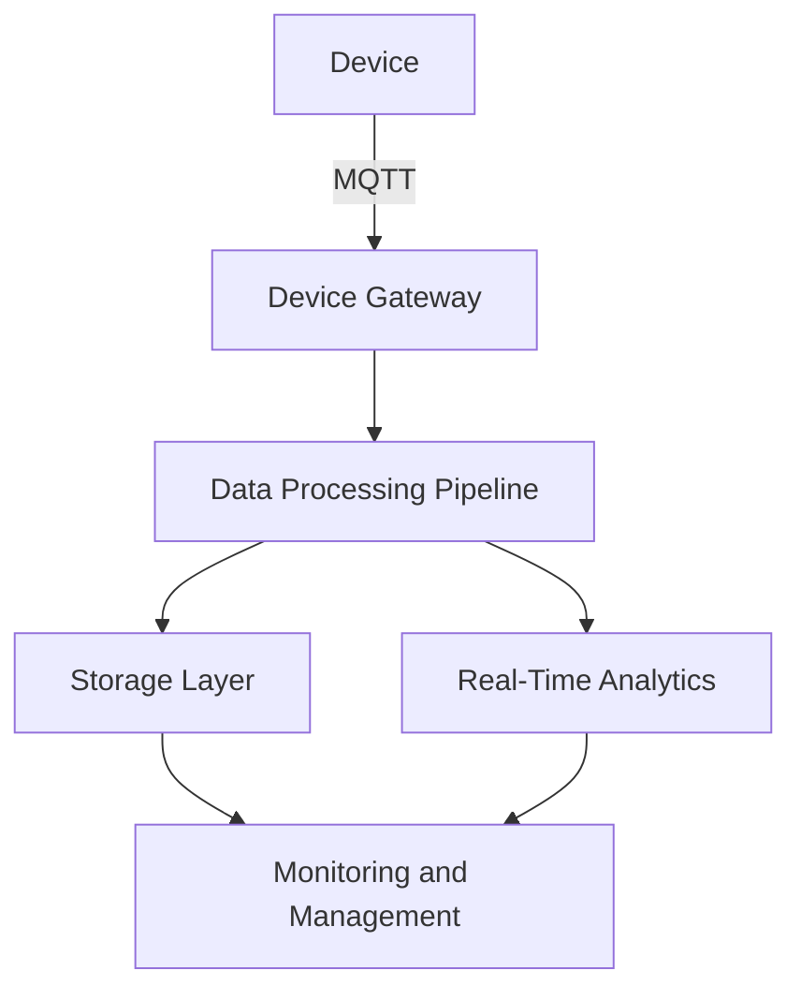

## 28.5 Designing an IoT Platform with Erlang

In the rapidly evolving world of the Internet of Things (IoT), building a platform that can efficiently manage numerous devices and process vast streams of data is crucial. Erlang, with its inherent strengths in concurrency and fault tolerance, is an excellent choice for developing such a platform. In this section, we will explore the design and implementation of an IoT platform using Erlang, focusing on device management, data processing, and leveraging Erlang's unique features for scalability and reliability.

### Platform Requirements

Before diving into the architecture, let's outline the key requirements for our IoT platform:

1. **Device Management**: The platform must handle connections from a large number of devices, each potentially sending data at different intervals.
2. **Data Ingestion and Processing**: Efficiently ingest and process data streams in real-time to provide actionable insights.
3. **Scalability**: Seamlessly scale to accommodate growing numbers of devices and data volume.
4. **Security**: Ensure secure communication and data handling to protect sensitive information.
5. **Reliability**: Maintain high availability and fault tolerance to ensure uninterrupted service.

### Architectural Overview

The architecture of our IoT platform is designed to leverage Erlang's strengths in concurrency and distributed computing. Here's a high-level overview of the components involved:

- **Device Gateway**: Manages device connections and communication using protocols like MQTT.
- **Data Processing Pipeline**: Ingests data from devices, processes it in real-time, and stores it for further analysis.
- **Storage Layer**: Utilizes databases like Mnesia for distributed storage and retrieval of data.
- **Monitoring and Management**: Provides tools for monitoring device status and managing the platform.

#### Diagram: IoT Platform Architecture



*Diagram: High-level architecture of the IoT platform using Erlang.*

### Device Management with Erlang

Managing a multitude of device connections is a critical aspect of any IoT platform. Erlang's lightweight process model and message-passing capabilities make it well-suited for this task.

#### Using MQTT for Device Communication

MQTT (Message Queuing Telemetry Transport) is a lightweight messaging protocol ideal for IoT applications. It operates over TCP/IP and is designed for connections with remote locations where a small code footprint is required.

- **Broker**: Acts as an intermediary for message exchange between devices and the platform.
- **Clients**: Devices that publish and subscribe to topics to send and receive messages.

#### Implementing the Device Gateway

The device gateway is responsible for handling device connections and routing messages to the appropriate components. Here's a simplified example of how you might implement an MQTT broker in Erlang:

```erlang
-module(mqtt_broker).
-export([start/0, handle_message/2]).

start() ->
    % Start the MQTT broker process
    spawn(fun() -> loop() end).

loop() ->
    receive
        {connect, ClientId} ->
            io:format("Client ~p connected~n", [ClientId]),
            loop();
        {publish, Topic, Message} ->
            io:format("Received message on ~p: ~p~n", [Topic, Message]),
            loop();
        {disconnect, ClientId} ->
            io:format("Client ~p disconnected~n", [ClientId]),
            loop()
    end.

handle_message(ClientId, {publish, Topic, Message}) ->
    % Handle incoming messages
    io:format("Client ~p published to ~p: ~p~n", [ClientId, Topic, Message]).
```

*Code: A basic MQTT broker implementation in Erlang.*

### Data Ingestion and Real-Time Processing

Once data is received from devices, it needs to be processed in real-time to extract valuable insights. Erlang's concurrency model allows us to handle multiple data streams simultaneously.

#### Building the Data Processing Pipeline

The data processing pipeline ingests data from the device gateway, processes it, and stores it in the storage layer. Here's a conceptual flow of the pipeline:

1. **Data Ingestion**: Receive data from the device gateway.
2. **Data Transformation**: Apply transformations or enrich data as needed.
3. **Data Storage**: Store processed data in a database for further analysis.

#### Example: Real-Time Data Processing

Let's look at an example of how you might implement a simple data processing pipeline in Erlang:

```erlang
-module(data_pipeline).
-export([start/0, process_data/1]).

start() ->
    % Start the data processing pipeline
    spawn(fun() -> loop() end).

loop() ->
    receive
        {data, DeviceId, Data} ->
            TransformedData = transform_data(Data),
            store_data(DeviceId, TransformedData),
            loop()
    end.

transform_data(Data) ->
    % Apply transformations to the data
    lists:map(fun(X) -> X * 2 end, Data).

store_data(DeviceId, Data) ->
    % Store the transformed data
    io:format("Storing data for device ~p: ~p~n", [DeviceId, Data]).
```

*Code: A simple data processing pipeline in Erlang.*

### Scalability Considerations

Scalability is a key concern for any IoT platform. Erlang's ability to handle thousands of lightweight processes concurrently makes it an ideal choice for scaling IoT applications.

#### Horizontal Scaling with Erlang

Erlang's distributed nature allows us to scale horizontally by adding more nodes to the system. This can be achieved by:

- **Load Balancing**: Distributing device connections and data processing tasks across multiple nodes.
- **Cluster Management**: Using tools like `epmd` (Erlang Port Mapper Daemon) to manage clusters of Erlang nodes.

### Security and Reliability

Ensuring the security and reliability of the IoT platform is paramount. Erlang provides several features that help achieve these goals:

#### Secure Communication

- **TLS/SSL**: Use the `ssl` module to encrypt communication between devices and the platform.
- **Authentication**: Implement authentication mechanisms to verify device identities.

#### Fault Tolerance

- **Supervision Trees**: Use OTP (Open Telecom Platform) supervision trees to automatically restart failed processes.
- **"Let It Crash" Philosophy**: Embrace Erlang's philosophy of letting processes crash and recover gracefully.

### Conclusion

Designing an IoT platform with Erlang offers numerous advantages, particularly in terms of concurrency, scalability, and fault tolerance. By leveraging Erlang's unique features, we can build a robust and efficient platform capable of handling the demands of modern IoT applications.

### Try It Yourself

Experiment with the code examples provided by modifying the data processing logic or adding new features to the MQTT broker. Consider how you might extend the platform to include additional components, such as real-time analytics or machine learning models.

## Quiz: Designing an IoT Platform with Erlang



### What is the primary protocol used for device communication in the IoT platform described?

- [x] MQTT
- [ ] HTTP
- [ ] FTP
- [ ] SMTP

> **Explanation:** MQTT is a lightweight messaging protocol ideal for IoT applications, used for device communication in the platform.

### Which Erlang feature is crucial for managing numerous device connections?

- [x] Concurrency model
- [ ] Pattern matching
- [ ] List comprehensions
- [ ] Macros

> **Explanation:** Erlang's concurrency model allows for managing numerous device connections efficiently.

### What is the role of the device gateway in the IoT platform?

- [x] Manages device connections and routes messages
- [ ] Stores data in a database
- [ ] Processes data in real-time
- [ ] Provides user authentication

> **Explanation:** The device gateway manages device connections and routes messages to the appropriate components.

### How does Erlang handle process failures in the IoT platform?

- [x] Supervision trees
- [ ] Global variables
- [ ] Shared memory
- [ ] Synchronous messaging

> **Explanation:** Erlang uses supervision trees to automatically restart failed processes, ensuring fault tolerance.

### What is the purpose of the data processing pipeline?

- [x] Ingests, processes, and stores data
- [ ] Manages device connections
- [ ] Encrypts communication
- [ ] Provides user interfaces

> **Explanation:** The data processing pipeline ingests, processes, and stores data for further analysis.

### Which Erlang module is used for secure communication?

- [x] ssl
- [ ] lists
- [ ] gen_server
- [ ] ets

> **Explanation:** The `ssl` module is used for secure communication in Erlang.

### What is the "Let It Crash" philosophy in Erlang?

- [x] Allow processes to crash and recover gracefully
- [ ] Prevent any process from crashing
- [ ] Use global variables to handle errors
- [ ] Avoid using processes altogether

> **Explanation:** The "Let It Crash" philosophy allows processes to crash and recover gracefully, enhancing reliability.

### How can the IoT platform scale horizontally?

- [x] By adding more nodes to the system
- [ ] By increasing the number of processes per node
- [ ] By using global variables
- [ ] By reducing the number of devices

> **Explanation:** The platform can scale horizontally by adding more nodes to the system, leveraging Erlang's distributed nature.

### Which tool is used for managing clusters of Erlang nodes?

- [x] epmd
- [ ] rebar3
- [ ] dialyzer
- [ ] observer

> **Explanation:** `epmd` (Erlang Port Mapper Daemon) is used for managing clusters of Erlang nodes.

### True or False: Erlang's lightweight process model is not suitable for IoT applications.

- [ ] True
- [x] False

> **Explanation:** False. Erlang's lightweight process model is highly suitable for IoT applications due to its efficiency in handling numerous concurrent connections.



Remember, this is just the beginning. As you progress, you'll build more complex and interactive IoT platforms. Keep experimenting, stay curious, and enjoy the journey!
