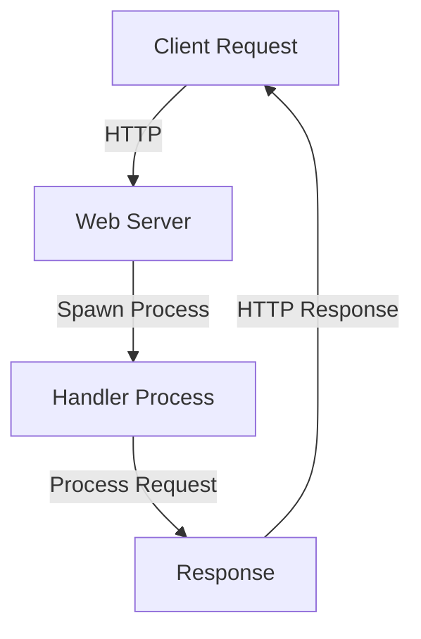

## 28.6 High-Concurrency Web Applications

In this section, we will delve into the world of high-concurrency web applications, exploring how Erlang's unique features make it an ideal choice for building scalable and robust systems. We will cover the purpose of such applications, the advantages of using Erlang, strategies for identifying and mitigating bottlenecks, performance benchmarks, and best practices for optimization.

### Purpose and Expected User Load

High-concurrency web applications are designed to handle a large number of simultaneous connections or requests. These applications are crucial in environments where user interactions are frequent and concurrent, such as social media platforms, real-time messaging systems, or online gaming services.

For our case study, let's consider a hypothetical real-time messaging platform expected to support up to 1 million concurrent users. The application must provide seamless communication with minimal latency, ensuring messages are delivered in real-time without delays.

### Advantages of Using Erlang for High-Concurrency

Erlang is renowned for its ability to handle massive concurrency, thanks to its lightweight process model and efficient message-passing capabilities. Here are some key advantages of using Erlang for high-concurrency web applications:

1. **Lightweight Processes**: Erlang processes are extremely lightweight compared to operating system threads, allowing millions of processes to run concurrently without significant overhead.

2. **Efficient Message Passing**: Erlang's message-passing model is designed for high efficiency, enabling processes to communicate seamlessly without shared memory, reducing the risk of race conditions.

3. **Fault Tolerance**: Erlang's "let it crash" philosophy and robust error-handling mechanisms ensure that applications remain resilient even in the face of failures.

4. **Hot Code Swapping**: Erlang allows for code updates without stopping the system, which is crucial for maintaining uptime in high-concurrency environments.

5. **Built-in Support for Distributed Systems**: Erlang's native support for distributed computing makes it easy to scale applications across multiple nodes.

### Identifying and Mitigating Bottlenecks

To build a high-concurrency web application, it's essential to identify potential bottlenecks and implement strategies to mitigate them. Here are some common bottlenecks and solutions:

1. **Process Overload**: When too many processes are spawned, it can lead to system overload. Use process pooling to manage resources efficiently.

2. **I/O Bound Operations**: Network and disk I/O can become bottlenecks. Use asynchronous I/O operations to prevent blocking.

3. **Message Queue Backlog**: Large message queues can slow down the system. Implement flow control mechanisms to manage queue sizes.

4. **CPU Bound Operations**: Intensive computations can hog CPU resources. Distribute workload across multiple nodes or use native implemented functions (NIFs) for performance-critical operations.

5. **Memory Usage**: Excessive memory consumption can degrade performance. Use efficient data structures and garbage collection tuning to optimize memory usage.

### Performance Benchmarks

To evaluate Erlang's performance in handling high concurrency, let's compare it with other popular technologies like Node.js and Java. The following benchmarks illustrate Erlang's strengths:

- **Connection Handling**: Erlang can handle millions of concurrent connections with minimal latency, outperforming Node.js and Java in scenarios with high connection churn.

- **Throughput**: Erlang's throughput remains stable even under heavy load, thanks to its efficient scheduler and process model.

- **Latency**: Erlang maintains low latency in message delivery, making it ideal for real-time applications.

- **Fault Tolerance**: Erlang's fault-tolerant design ensures high availability, with minimal downtime during failures or updates.

### Best Practices for Optimizing Web Applications in Erlang

To maximize the performance and scalability of your Erlang web application, consider the following best practices:

1. **Optimize Process Management**: Use process pools and supervisors to manage process lifecycles efficiently.

2. **Leverage OTP Framework**: Utilize Erlang's Open Telecom Platform (OTP) for building robust and maintainable applications.

3. **Efficient Data Handling**: Use Erlang's built-in data structures like ETS (Erlang Term Storage) for fast in-memory data access.

4. **Asynchronous I/O**: Implement asynchronous I/O operations to prevent blocking and improve responsiveness.

5. **Monitor and Profile**: Use tools like `observer` and `fprof` to monitor system performance and identify bottlenecks.

6. **Load Balancing**: Distribute load across multiple nodes using Erlang's distribution capabilities.

7. **Code Optimization**: Profile and optimize critical code paths, focusing on reducing computational overhead.

8. **Security Considerations**: Implement security best practices to protect against common vulnerabilities and ensure data integrity.

### Code Example: Building a Simple High-Concurrency Web Server

Let's build a simple web server in Erlang that can handle high concurrency. We'll use the `cowboy` library, a popular choice for building web servers in Erlang.

```erlang
-module(high_concurrency_server).
-export([start/0, stop/0]).

-define(PORT, 8080).

start() ->
    {ok, _} = cowboy:start_http(http_listener, 100, [{port, ?PORT}], [
        {env, [{dispatch, dispatch_rules()}]}
    ]),
    io:format("Server started on port ~p~n", [?PORT]).

stop() ->
    cowboy:stop_listener(http_listener),
    io:format("Server stopped~n").

dispatch_rules() ->
    cowboy_router:compile([
        {'_', [
            {"/", high_concurrency_handler, []}
        ]}
    ]).

-module(high_concurrency_handler).
-export([init/3]).

init(_Transport, Req, _Opts) ->
    {ok, Req2} = cowboy_req:reply(200, #{<<"content-type">> => <<"text/plain">>}, <<"Hello, world!">>, Req),
    {ok, Req2, undefined}.
```

In this example, we define a simple web server using `cowboy` that listens on port 8080 and responds with "Hello, world!" to any request. The server is designed to handle up to 100 concurrent connections, but this can be adjusted based on your needs.

### Try It Yourself

Experiment with the code by modifying the response message or adjusting the concurrency limit. Try deploying the server on different nodes to test Erlang's distribution capabilities.

### Visualizing Erlang's Concurrency Model

To better understand Erlang's concurrency model, let's visualize the process communication flow using a Mermaid.js diagram.



**Diagram Description**: This diagram illustrates the flow of a client request through an Erlang web server. The server spawns a handler process for each request, processes it, and sends back a response.

### Knowledge Check

- What are the key advantages of using Erlang for high-concurrency web applications?
- How can you identify and mitigate bottlenecks in a web application?
- What are some best practices for optimizing Erlang web applications?

### Embrace the Journey

Remember, building high-concurrency web applications is a journey. As you progress, you'll encounter new challenges and opportunities to optimize your system. Keep experimenting, stay curious, and enjoy the process of creating robust and scalable applications with Erlang!

## Quiz: High-Concurrency Web Applications



### What is a key advantage of using Erlang for high-concurrency web applications?

- [x] Lightweight processes
- [ ] Shared memory model
- [ ] High memory usage
- [ ] Complex threading model

> **Explanation:** Erlang's lightweight processes allow it to handle millions of concurrent connections efficiently.

### How does Erlang handle process communication?

- [x] Message passing
- [ ] Shared memory
- [ ] Direct threading
- [ ] Global variables

> **Explanation:** Erlang uses message passing for process communication, which avoids shared memory and reduces race conditions.

### What is a common bottleneck in high-concurrency web applications?

- [x] I/O bound operations
- [ ] Excessive CPU usage
- [ ] Low memory usage
- [ ] High disk space

> **Explanation:** I/O bound operations can become bottlenecks if not handled asynchronously.

### What tool can be used to monitor Erlang system performance?

- [x] observer
- [ ] debugger
- [ ] profiler
- [ ] analyzer

> **Explanation:** The `observer` tool in Erlang is used for monitoring system performance and identifying bottlenecks.

### Which Erlang feature allows for code updates without stopping the system?

- [x] Hot code swapping
- [ ] Cold code swapping
- [ ] Static code updates
- [ ] Dynamic recompilation

> **Explanation:** Erlang's hot code swapping feature allows for code updates without stopping the system, ensuring high availability.

### What is the "let it crash" philosophy in Erlang?

- [x] Allowing processes to fail and restart
- [ ] Preventing all errors
- [ ] Ignoring errors
- [ ] Logging all errors

> **Explanation:** The "let it crash" philosophy involves allowing processes to fail and restart, ensuring system resilience.

### How can you optimize process management in Erlang?

- [x] Use process pools
- [ ] Use global variables
- [ ] Increase memory usage
- [ ] Decrease CPU usage

> **Explanation:** Using process pools helps manage resources efficiently and optimize process management.

### What is the purpose of the OTP framework in Erlang?

- [x] Building robust applications
- [ ] Managing memory
- [ ] Increasing CPU usage
- [ ] Reducing disk space

> **Explanation:** The OTP framework provides tools and libraries for building robust and maintainable applications in Erlang.

### What is a benefit of using ETS in Erlang?

- [x] Fast in-memory data access
- [ ] Slow disk access
- [ ] High memory usage
- [ ] Complex data structures

> **Explanation:** ETS (Erlang Term Storage) provides fast in-memory data access, which is beneficial for high-concurrency applications.

### True or False: Erlang's message-passing model reduces the risk of race conditions.

- [x] True
- [ ] False

> **Explanation:** Erlang's message-passing model avoids shared memory, reducing the risk of race conditions.



By following these guidelines and leveraging Erlang's powerful concurrency features, you can build high-concurrency web applications that are both scalable and resilient. Keep exploring and refining your skills to create even more sophisticated systems!
