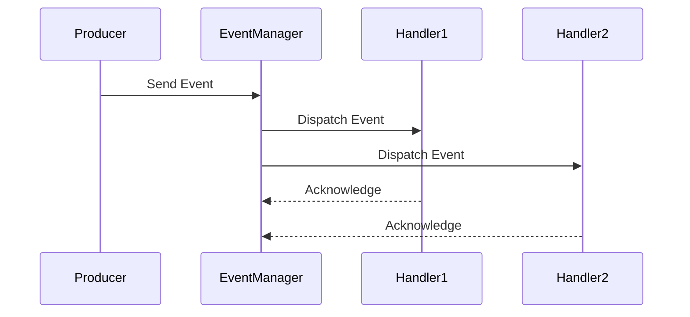

## 28.7 Event-Driven Systems with `gen_event`

In this section, we delve into the practical application of using `gen_event` for building event-driven systems in Erlang. Event-driven architectures are pivotal in creating scalable and responsive applications, and Erlang's `gen_event` behavior provides a robust framework for implementing such systems. We'll explore the requirements for event handling, how `gen_event` structures the flow of events and handlers, and provide code examples to illustrate event generation and consumption. Additionally, we'll discuss the benefits of decoupling producers and consumers, along with performance optimizations and scalability considerations.

### Understanding Event-Driven Systems

Event-driven systems are designed to respond to events or changes in state. These systems are characterized by the decoupling of event producers and consumers, which allows for greater flexibility and scalability. In Erlang, the `gen_event` behavior is a powerful tool for implementing such systems, enabling developers to create dynamic and flexible event handling mechanisms.

#### Key Concepts

- **Event Producers**: Components that generate events. These could be user actions, system events, or messages from other systems.
- **Event Consumers**: Components that respond to events. These are often implemented as handlers that perform specific actions when an event is received.
- **Event Bus**: A central mechanism that routes events from producers to consumers. In Erlang, `gen_event` serves as the event bus.

### Requirements for Event Handling

Before implementing an event-driven system using `gen_event`, it's essential to outline the system's requirements:

1. **Asynchronous Event Processing**: Events should be processed asynchronously to ensure that the system remains responsive.
2. **Decoupling of Components**: Producers and consumers should be decoupled to allow for independent development and scaling.
3. **Dynamic Handler Management**: The system should support dynamic addition and removal of event handlers.
4. **Error Handling**: Robust error handling mechanisms should be in place to ensure system reliability.
5. **Scalability**: The system should be able to handle a large number of events and scale with increasing load.

### `gen_event` in Erlang

The `gen_event` behavior in Erlang provides a framework for implementing event-driven systems. It allows for the dynamic management of event handlers and supports asynchronous event processing.

#### Structure of `gen_event`

The `gen_event` behavior consists of the following components:

- **Event Manager**: The central component that manages event handlers and routes events.
- **Event Handlers**: Modules that implement specific actions in response to events. Handlers can be added or removed dynamically.
- **Events**: Messages that are sent to the event manager and subsequently dispatched to the appropriate handlers.

#### How `gen_event` Works

1. **Event Generation**: Events are generated by producers and sent to the event manager.
2. **Event Dispatching**: The event manager dispatches events to all registered handlers.
3. **Event Handling**: Each handler processes the event according to its logic.

### Implementing an Event-Driven System

Let's implement a simple logging service using `gen_event`. This service will demonstrate how to generate and consume events using `gen_event`.

#### Step 1: Define the Event Handler

First, we define an event handler module that implements the `gen_event` behavior.

```erlang
-module(log_handler).
-behaviour(gen_event).

-export([init/1, handle_event/2, handle_call/2, handle_info/2, terminate/2, code_change/3]).

init([]) ->
    {ok, []}.

handle_event({log, Message}, State) ->
    io:format("Log: ~s~n", [Message]),
    {ok, State};
handle_event(_, State) ->
    {ok, State}.

handle_call(_Request, State) ->
    {ok, ok, State}.

handle_info(_Info, State) ->
    {ok, State}.

terminate(_Reason, _State) ->
    ok.

code_change(_OldVsn, State, _Extra) ->
    {ok, State}.
```

#### Step 2: Create the Event Manager

Next, we create an event manager that will manage our log handlers.

```erlang
-module(log_manager).
-export([start_link/0, add_handler/1, log_message/1]).

start_link() ->
    gen_event:start_link({local, log_event_manager}).

add_handler(Handler) ->
    gen_event:add_handler(log_event_manager, Handler, []).

log_message(Message) ->
    gen_event:notify(log_event_manager, {log, Message}).
```

#### Step 3: Using the Event-Driven System

Now, let's see how we can use our event-driven logging system.

```erlang
% Start the event manager
{ok, _Pid} = log_manager:start_link().

% Add a log handler
ok = log_manager:add_handler(log_handler).

% Log a message
log_manager:log_message("This is a test log message").
```

### Benefits of Decoupling Producers and Consumers

Decoupling producers and consumers in an event-driven system offers several benefits:

- **Scalability**: Producers and consumers can be scaled independently, allowing the system to handle increased load.
- **Flexibility**: New event handlers can be added without modifying existing producers.
- **Maintainability**: Decoupled components are easier to maintain and test.

### Performance Optimizations and Scalability Considerations

When building event-driven systems with `gen_event`, consider the following performance optimizations and scalability strategies:

- **Load Balancing**: Distribute events across multiple event managers to balance the load.
- **Concurrency**: Use multiple event handlers to process events concurrently.
- **Backpressure Handling**: Implement mechanisms to handle backpressure when the system is overwhelmed with events.

### Visualizing Event Flow

To better understand the flow of events in our system, let's visualize the process using a Mermaid.js sequence diagram.



### Try It Yourself

Experiment with the code examples provided. Try adding additional handlers or modifying the message format. Consider implementing a notification service using a similar pattern.

### Knowledge Check

- What are the key components of an event-driven system?
- How does `gen_event` facilitate decoupling of producers and consumers?
- What are some performance optimizations for event-driven systems?

### Summary

In this section, we've explored the implementation of event-driven systems using `gen_event` in Erlang. We've seen how to define event handlers, create an event manager, and generate and consume events. By decoupling producers and consumers, we can build scalable and flexible systems. Remember, this is just the beginning. As you progress, you'll be able to build more complex and responsive applications. Keep experimenting, stay curious, and enjoy the journey!

## Quiz: Event-Driven Systems with `gen_event`



### What is the primary role of the `gen_event` behavior in Erlang?

- [x] To manage event handlers and route events
- [ ] To create processes for concurrent execution
- [ ] To handle HTTP requests and responses
- [ ] To manage database connections

> **Explanation:** The `gen_event` behavior is used to manage event handlers and route events in an event-driven system.

### Which component in an event-driven system is responsible for generating events?

- [x] Event Producer
- [ ] Event Consumer
- [ ] Event Handler
- [ ] Event Manager

> **Explanation:** Event producers are responsible for generating events in an event-driven system.

### How does `gen_event` facilitate the decoupling of producers and consumers?

- [x] By allowing dynamic addition and removal of event handlers
- [ ] By synchronizing all event processing
- [ ] By using a single process for all events
- [ ] By directly connecting producers to consumers

> **Explanation:** `gen_event` allows for dynamic addition and removal of event handlers, facilitating the decoupling of producers and consumers.

### What is a benefit of decoupling producers and consumers in an event-driven system?

- [x] Scalability
- [ ] Increased complexity
- [ ] Reduced flexibility
- [ ] Tight coupling

> **Explanation:** Decoupling producers and consumers allows for scalability, as they can be scaled independently.

### What is the function of an event handler in a `gen_event` system?

- [x] To process events according to specific logic
- [ ] To generate events
- [ ] To manage event producers
- [ ] To synchronize event processing

> **Explanation:** Event handlers process events according to specific logic in a `gen_event` system.

### What is a common performance optimization for event-driven systems?

- [x] Load balancing across multiple event managers
- [ ] Using a single event handler for all events
- [ ] Synchronous event processing
- [ ] Direct communication between producers and consumers

> **Explanation:** Load balancing across multiple event managers is a common performance optimization for event-driven systems.

### What is the purpose of the `handle_event/2` function in a `gen_event` handler?

- [x] To define how events are processed
- [ ] To initialize the event handler
- [ ] To terminate the event handler
- [ ] To change the handler's code

> **Explanation:** The `handle_event/2` function defines how events are processed in a `gen_event` handler.

### How can you add a new event handler to a `gen_event` manager?

- [x] By using the `gen_event:add_handler/3` function
- [ ] By modifying the event producer
- [ ] By creating a new event manager
- [ ] By directly connecting to the event consumer

> **Explanation:** The `gen_event:add_handler/3` function is used to add a new event handler to a `gen_event` manager.

### What is a potential challenge when handling a large number of events?

- [x] Backpressure
- [ ] Increased coupling
- [ ] Reduced concurrency
- [ ] Simplified error handling

> **Explanation:** Backpressure can occur when the system is overwhelmed with a large number of events.

### True or False: `gen_event` supports synchronous event processing by default.

- [ ] True
- [x] False

> **Explanation:** `gen_event` supports asynchronous event processing by default, which helps maintain system responsiveness.


