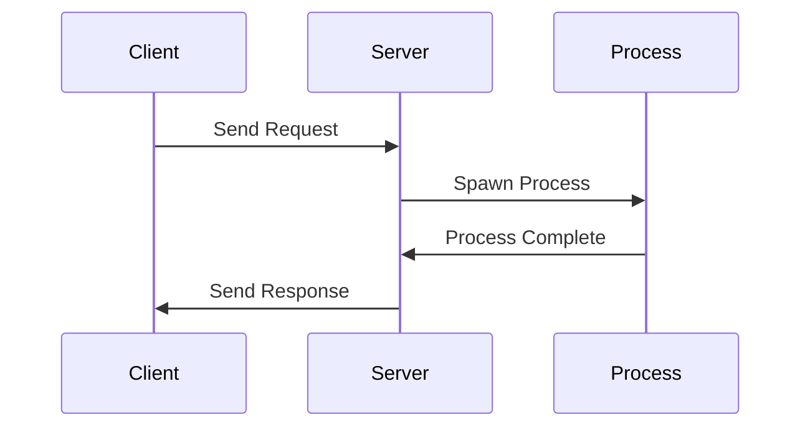

## 29.3 Final Thoughts on Design Patterns in Erlang

As we conclude our comprehensive guide on design patterns in Erlang, it's essential to reflect on the journey we've undertaken and the profound impact that understanding and utilizing design patterns can have on your development process. Design patterns are more than just reusable solutions to common problems; they are a language that developers can use to communicate complex ideas succinctly and effectively. Let's delve into the value of these patterns, the importance of continual learning, and how they enhance code quality and maintainability.

### The Value of Understanding and Utilizing Design Patterns

Design patterns in Erlang, much like in other programming paradigms, serve as a toolkit for developers to solve recurring problems efficiently. They encapsulate best practices and provide a shared vocabulary for developers to discuss solutions without delving into the minutiae of implementation details.

#### Key Benefits of Design Patterns:

- **Efficiency**: By leveraging established patterns, developers can avoid reinventing the wheel, leading to faster development cycles.
- **Scalability**: Patterns often address scalability concerns, making it easier to build applications that can grow with user demand.
- **Maintainability**: Well-documented patterns lead to code that is easier to understand, maintain, and extend.
- **Collaboration**: A shared understanding of patterns fosters better collaboration among team members.

### Continual Learning and Adaptation

The world of software development is ever-evolving, and so too are the patterns we use. It's crucial to remain open to learning and adapting these patterns to suit the unique needs of your projects. Erlang's functional and concurrent nature offers a rich landscape for innovation in design patterns.

#### Embrace Change:

- **Stay Updated**: Keep abreast of new patterns and emerging best practices in the Erlang community.
- **Experiment**: Don't hesitate to experiment with variations of established patterns to better fit your specific use cases.
- **Learn from Others**: Engage with the community to learn from others' experiences and share your own insights.

### Enhancing Code Quality and Maintainability

Design patterns inherently promote a higher standard of code quality. By adhering to these patterns, developers can ensure that their code is not only functional but also robust and resilient.

#### Key Aspects of Code Quality:

- **Readability**: Patterns often lead to code that is more readable and easier to understand for new developers joining a project.
- **Testability**: Many patterns encourage modular design, which inherently supports better testing practices.
- **Resilience**: Patterns like "Let It Crash" in Erlang promote building systems that can recover gracefully from errors.

### Innovating and Sharing Patterns

The Erlang community thrives on collaboration and shared knowledge. As you continue to develop your skills, consider contributing back to the community by sharing your own patterns and insights.

#### Ways to Contribute:

- **Open Source**: Contribute to open-source projects or start your own to share innovative patterns.
- **Documentation**: Write articles or create tutorials to help others understand and implement patterns.
- **Community Engagement**: Participate in forums, attend conferences, and engage in discussions to exchange ideas.

### A Heartfelt Thank You

Thank you for embarking on this journey to master design patterns in Erlang. Your commitment to learning and improving your craft is commendable. Remember, this is just the beginning. As you continue to explore and innovate, you'll not only enhance your skills but also contribute to the growth and evolution of the Erlang community.

### Try It Yourself

To solidify your understanding, try modifying the following code example to implement a new pattern or improve an existing one. Experimentation is key to mastery.

```erlang
-module(example).
-export([start/0, process_message/1]).

start() ->
    spawn(fun() -> loop() end).

loop() ->
    receive
        {message, Msg} ->
            process_message(Msg),
            loop();
        stop ->
            ok
    end.

process_message(Msg) ->
    io:format("Processing message: ~p~n", [Msg]).
```

**Suggestions for Experimentation:**

- Modify the `process_message/1` function to implement a Strategy Pattern.
- Introduce a Supervisor to manage the process lifecycle.
- Experiment with different message handling strategies.

### Visualizing Design Patterns in Erlang

To aid in understanding, let's visualize how design patterns integrate into Erlang's architecture using a simple sequence diagram.



**Diagram Explanation:** This sequence diagram illustrates a typical interaction in an Erlang system where a client sends a request to a server, which then spawns a process to handle the request. Once processing is complete, the server sends a response back to the client.

### Knowledge Check

Reflect on the following questions to reinforce your understanding of design patterns in Erlang:

- How do design patterns improve code maintainability?
- What are some ways to contribute to the Erlang community?
- Why is it important to adapt patterns to specific project needs?

### Embrace the Journey

Remember, mastering design patterns is a journey, not a destination. As you progress, you'll build more complex and robust applications. Keep experimenting, stay curious, and enjoy the journey!

## Quiz: Final Thoughts on Design Patterns in Erlang



### What is one of the primary benefits of using design patterns in Erlang?

- [x] They provide a shared vocabulary for developers.
- [ ] They eliminate the need for testing.
- [ ] They make code less readable.
- [ ] They slow down the development process.

> **Explanation:** Design patterns provide a shared vocabulary that helps developers communicate complex ideas more effectively.

### How can you contribute to the Erlang community?

- [x] By sharing your own patterns and insights.
- [ ] By keeping your knowledge to yourself.
- [x] By participating in forums and discussions.
- [ ] By avoiding open-source projects.

> **Explanation:** Contributing to the community involves sharing knowledge, participating in discussions, and engaging with open-source projects.

### Why is continual learning important in software development?

- [x] Because the field is constantly evolving.
- [ ] Because it is unnecessary.
- [ ] Because it makes development harder.
- [ ] Because it is only for beginners.

> **Explanation:** Continual learning is crucial because software development is an ever-evolving field, and staying updated is necessary to remain effective.

### What does the "Let It Crash" philosophy promote?

- [x] Building systems that can recover gracefully from errors.
- [ ] Ignoring errors completely.
- [ ] Writing code that never fails.
- [ ] Avoiding error handling.

> **Explanation:** The "Let It Crash" philosophy encourages building systems that can handle and recover from errors gracefully.

### What is a key aspect of code quality?

- [x] Readability
- [ ] Complexity
- [x] Testability
- [ ] Obfuscation

> **Explanation:** Readability and testability are key aspects of code quality, making it easier to maintain and extend.

### What is a benefit of using design patterns?

- [x] They lead to faster development cycles.
- [ ] They make code harder to understand.
- [ ] They increase the likelihood of errors.
- [ ] They are only useful for beginners.

> **Explanation:** Design patterns lead to faster development cycles by providing reusable solutions to common problems.

### How can design patterns enhance collaboration?

- [x] By providing a shared understanding among team members.
- [ ] By making code more complex.
- [x] By fostering better communication.
- [ ] By isolating developers.

> **Explanation:** Design patterns enhance collaboration by providing a shared understanding and vocabulary, fostering better communication.

### What should you do to adapt patterns to your project needs?

- [x] Experiment with variations of established patterns.
- [ ] Avoid using patterns altogether.
- [ ] Stick rigidly to one pattern.
- [ ] Ignore project-specific requirements.

> **Explanation:** Experimenting with variations of established patterns allows you to adapt them to better fit your specific project needs.

### What is one way to innovate in design patterns?

- [x] By experimenting with new variations.
- [ ] By avoiding change.
- [ ] By sticking to outdated practices.
- [ ] By ignoring community feedback.

> **Explanation:** Innovating in design patterns involves experimenting with new variations and adapting them to current needs.

### True or False: Design patterns are only useful for large projects.

- [ ] True
- [x] False

> **Explanation:** Design patterns are useful for projects of all sizes, as they provide reusable solutions and improve code quality and maintainability.


