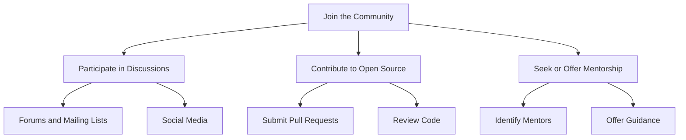

## 29.5 Encouragement for Community Participation

In the world of software development, the strength of a programming language is often reflected in the vibrancy and engagement of its community. Erlang, with its robust features for building scalable and fault-tolerant systems, is no exception. Engaging with the Erlang community offers numerous benefits, from networking and knowledge sharing to contributing to open-source projects and participating in discussions. This section aims to inspire you to become an active member of the Erlang ecosystem, highlighting opportunities for mentorship, collaboration, and personal growth.

### The Benefits of Community Engagement

#### Networking and Knowledge Sharing

Engaging with the Erlang community opens doors to a wealth of knowledge and expertise. By participating in forums, mailing lists, and online discussions, you can connect with seasoned developers and newcomers alike. This networking can lead to:

- **Access to Expertise**: Gain insights from experienced developers who have tackled similar challenges.
- **Collaborative Problem Solving**: Work together to find solutions to complex problems, leveraging diverse perspectives.
- **Staying Updated**: Keep abreast of the latest developments, tools, and best practices in Erlang programming.

#### Contributing to Open-Source Projects

One of the most rewarding ways to engage with the Erlang community is by contributing to open-source projects. This not only enhances your skills but also benefits the community at large. Here’s how you can get involved:

- **Identify Projects**: Start by exploring popular Erlang projects on platforms like GitHub. Look for issues labeled as "good first issue" or "help wanted."
- **Submit Pull Requests**: Contribute code, documentation, or bug fixes. Ensure your contributions adhere to the project's guidelines.
- **Review Code**: Participate in code reviews to help maintain the quality of the project and learn from others' code.

#### Participating in Discussions and Forums

Active participation in discussions and forums is a great way to share your knowledge and learn from others. Consider the following platforms:

- **Erlang Forums**: Join discussions on platforms like the Erlang Forums or Reddit’s Erlang community.
- **Mailing Lists**: Subscribe to Erlang mailing lists to receive updates and engage in email discussions.
- **Social Media**: Follow Erlang-related hashtags on Twitter or LinkedIn to connect with other developers.

### Opportunities for Mentorship

Mentorship plays a crucial role in personal and professional development. Whether you’re seeking guidance or offering your expertise, mentorship can be a mutually beneficial experience.

#### Seeking Mentorship

- **Identify Mentors**: Look for experienced developers who share your interests and goals.
- **Set Clear Goals**: Define what you hope to achieve through mentorship, whether it’s learning new skills or advancing your career.
- **Be Proactive**: Reach out to potential mentors with specific questions or topics you’d like to discuss.

#### Offering Mentorship

- **Share Your Knowledge**: Offer to mentor newcomers to the Erlang community, helping them navigate the language and ecosystem.
- **Provide Feedback**: Offer constructive feedback on code reviews or project contributions.
- **Encourage Growth**: Inspire mentees to take on new challenges and expand their skill set.

### Fostering a Sense of Belonging

The Erlang community thrives on collaboration and inclusivity. By actively participating, you contribute to a welcoming environment where everyone feels valued and supported.

#### Collaboration and Teamwork

- **Join Collaborative Projects**: Participate in hackathons or community-driven projects to work alongside other developers.
- **Share Resources**: Contribute tutorials, blog posts, or presentations to help others learn and grow.
- **Celebrate Achievements**: Recognize and celebrate the accomplishments of community members, fostering a positive atmosphere.

#### Inclusivity and Diversity

- **Promote Diversity**: Encourage participation from individuals of all backgrounds, fostering a diverse and inclusive community.
- **Support Newcomers**: Welcome new members and provide guidance to help them integrate into the community.

### Inspiring Collaboration within the Erlang Ecosystem

The Erlang ecosystem is rich with opportunities for collaboration, from contributing to libraries and frameworks to participating in community events.

#### Contributing to Libraries and Frameworks

- **Enhance Existing Tools**: Contribute to the development and maintenance of Erlang libraries and frameworks.
- **Develop New Tools**: Create new libraries or tools that address gaps in the ecosystem, sharing them with the community.

#### Participating in Community Events

- **Attend Conferences**: Participate in Erlang conferences and meetups to network and learn from industry leaders.
- **Host Workshops**: Organize workshops or webinars to share your expertise and engage with the community.

### Code Example: Contributing to an Open-Source Project

To illustrate the process of contributing to an open-source project, let’s walk through a simple example. Suppose you want to contribute to an Erlang library on GitHub.

```erlang
% Step 1: Fork the repository
% Go to the GitHub page of the project and click "Fork" to create a copy in your account.

% Step 2: Clone the repository
% Clone the forked repository to your local machine.
$ git clone https://github.com/your-username/project-name.git

% Step 3: Create a new branch
% Create a new branch for your changes.
$ git checkout -b feature/new-feature

% Step 4: Make your changes
% Open the project in your favorite editor and make the necessary changes.

% Step 5: Commit your changes
% Add and commit your changes with a descriptive message.
$ git add .
$ git commit -m "Add new feature to improve functionality"

% Step 6: Push your changes
% Push the changes to your forked repository.
$ git push origin feature/new-feature

% Step 7: Submit a pull request
% Go to the original repository and click "New Pull Request" to submit your changes for review.
```

### Try It Yourself

Experiment with contributing to an open-source project by following the steps above. Choose a project that interests you and start with small contributions, such as fixing typos or improving documentation.

### Visualizing Community Engagement

To better understand the flow of community engagement, let's visualize the process using a Mermaid.js diagram.



**Diagram Description:** This flowchart illustrates the various pathways for engaging with the Erlang community, including participating in discussions, contributing to open-source projects, and seeking or offering mentorship.

### References and Links

- [Erlang Forums](https://erlangforums.com)
- [Erlang GitHub Repositories](https://github.com/erlang)
- [Erlang Mailing Lists](http://erlang.org/community.html)
- [Erlang on Twitter](https://twitter.com/erlang)

### Knowledge Check

- What are some benefits of engaging with the Erlang community?
- How can you contribute to open-source projects?
- What platforms can you use to participate in Erlang discussions?
- How can mentorship benefit both mentors and mentees?
- What steps can you take to foster inclusivity in the community?

### Embrace the Journey

Remember, becoming an active member of the Erlang community is a journey, not a destination. As you engage with others, you'll gain valuable insights, build lasting relationships, and contribute to the growth of the Erlang ecosystem. Keep experimenting, stay curious, and enjoy the collaborative spirit of the community!

## Quiz: Encouragement for Community Participation



### What is one benefit of engaging with the Erlang community?

- [x] Access to expertise
- [ ] Guaranteed job offers
- [ ] Free software licenses
- [ ] Unlimited cloud storage

> **Explanation:** Engaging with the community provides access to expertise and collaborative problem-solving opportunities.

### How can you contribute to an open-source project?

- [x] Submit pull requests
- [ ] Buy the project
- [ ] Delete the repository
- [ ] Ignore the issues

> **Explanation:** Contributing to open-source projects involves submitting pull requests, reviewing code, and fixing bugs.

### Which platform is NOT typically used for Erlang discussions?

- [ ] Erlang Forums
- [ ] Mailing Lists
- [x] TikTok
- [ ] Reddit

> **Explanation:** Erlang discussions typically occur on forums, mailing lists, and Reddit, not TikTok.

### What is a key aspect of mentorship?

- [x] Sharing knowledge
- [ ] Hoarding information
- [ ] Avoiding communication
- [ ] Ignoring questions

> **Explanation:** Mentorship involves sharing knowledge and providing guidance to others.

### How can you foster inclusivity in the Erlang community?

- [x] Encourage diverse participation
- [ ] Exclude newcomers
- [ ] Promote a single viewpoint
- [ ] Ignore community feedback

> **Explanation:** Fostering inclusivity involves encouraging diverse participation and supporting newcomers.

### What is the first step in contributing to an open-source project?

- [x] Fork the repository
- [ ] Delete the repository
- [ ] Clone the original repository
- [ ] Submit a pull request

> **Explanation:** The first step is to fork the repository to create a copy in your account.

### What is a benefit of participating in community events?

- [x] Networking with industry leaders
- [ ] Guaranteed speaking slots
- [ ] Free travel accommodations
- [ ] Unlimited event access

> **Explanation:** Community events provide networking opportunities with industry leaders and peers.

### How can you stay updated with the latest Erlang developments?

- [x] Participate in forums
- [ ] Avoid discussions
- [ ] Ignore mailing lists
- [ ] Unsubscribe from updates

> **Explanation:** Participating in forums and mailing lists helps you stay updated with the latest developments.

### What is a good way to start contributing to open-source projects?

- [x] Fix typos or improve documentation
- [ ] Rewrite the entire codebase
- [ ] Delete existing features
- [ ] Ignore project guidelines

> **Explanation:** Starting with small contributions like fixing typos or improving documentation is a good way to begin.

### True or False: Mentorship is only beneficial for the mentee.

- [ ] True
- [x] False

> **Explanation:** Mentorship is beneficial for both the mentor and the mentee, as it fosters growth and learning for both parties.




