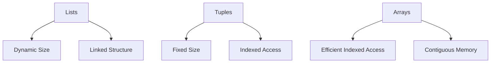

## 3.1.1 Lists, Tuples, and Arrays

In Erlang, understanding the fundamental data structures—lists, tuples, and arrays—is crucial for efficient and effective programming. Each of these structures has unique properties, syntax, and use cases that make them suitable for different scenarios. In this section, we will delve into these data structures, providing examples, performance considerations, and guidance on when to use each one.

### Lists in Erlang

Lists are one of the most commonly used data structures in Erlang. They are versatile and can store elements of any type, including other lists. Lists are defined using square brackets, and elements are separated by commas.

#### Characteristics of Lists

- **Dynamic Size**: Lists can grow and shrink dynamically, making them flexible for various operations.
- **Homogeneous or Heterogeneous**: Lists can contain elements of the same type or different types.
- **Linked Structure**: Internally, lists are implemented as linked lists, which affects their performance characteristics.

#### Creating and Manipulating Lists

Let's explore how to create and manipulate lists in Erlang.

```erlang
% Creating a simple list
List1 = [1, 2, 3, 4, 5].

% Creating a heterogeneous list
List2 = [1, "two", 3.0, {four, 4}].

% Adding an element to the front of a list
List3 = [0 | List1]. % Result: [0, 1, 2, 3, 4, 5]

% Concatenating two lists
List4 = List1 ++ [6, 7, 8]. % Result: [1, 2, 3, 4, 5, 6, 7, 8]

% Accessing elements (head and tail)
[Head | Tail] = List1. % Head: 1, Tail: [2, 3, 4, 5]
```

#### Performance Implications of Lists

Due to their linked list nature, lists have the following performance characteristics:

- **Access Time**: Accessing the head of the list is O(1), but accessing an element by index is O(n).
- **Insertion/Deletion**: Adding or removing elements at the head is O(1), but operations at the tail or middle are O(n).

### Tuples in Erlang

Tuples are fixed-size collections of elements. They are defined using curly braces and are suitable for storing a fixed number of related elements.

#### Characteristics of Tuples

- **Fixed Size**: Once created, the size of a tuple cannot be changed.
- **Homogeneous or Heterogeneous**: Like lists, tuples can contain elements of different types.
- **Indexed Access**: Elements can be accessed by their index, starting from 1.

#### Creating and Manipulating Tuples

Here's how to work with tuples in Erlang.

```erlang
% Creating a tuple
Tuple1 = {ok, "Success", 200}.

% Accessing elements
Element1 = element(1, Tuple1). % Result: ok
Element2 = element(2, Tuple1). % Result: "Success"

% Updating a tuple (creates a new tuple)
Tuple2 = setelement(3, Tuple1, 404). % Result: {ok, "Success", 404}
```

#### Performance Implications of Tuples

Tuples have different performance characteristics compared to lists:

- **Access Time**: Accessing an element by index is O(1).
- **Immutability**: Tuples are immutable; modifying a tuple results in creating a new tuple.

### Arrays in Erlang

Arrays are not a built-in data type in Erlang, but they can be implemented using libraries such as `array` or `gb_trees`. Arrays provide a way to store elements in a contiguous block of memory, allowing for efficient indexed access.

#### Characteristics of Arrays

- **Fixed or Dynamic Size**: Depending on the implementation, arrays can be fixed or dynamically resized.
- **Homogeneous or Heterogeneous**: Arrays can store elements of different types.
- **Indexed Access**: Elements are accessed by their index, similar to tuples.

#### Creating and Manipulating Arrays

Let's see how to use arrays in Erlang with the `array` module.

```erlang
% Creating an array
Array1 = array:new(10, {default, 0}).

% Setting an element
Array2 = array:set(5, 42, Array1).

% Getting an element
Value = array:get(5, Array2). % Result: 42

% Resizing an array
Array3 = array:resize(20, Array2).
```

#### Performance Implications of Arrays

Arrays offer different performance characteristics:

- **Access Time**: Accessing an element by index is O(1).
- **Modification**: Modifying an element is O(1), but resizing can be costly depending on the implementation.

### Choosing Between Lists, Tuples, and Arrays

When deciding which data structure to use, consider the following:

- **Lists**: Use when you need a dynamic, flexible structure that can grow and shrink. Ideal for sequential processing and when the order of elements matters.
- **Tuples**: Use for fixed-size collections where the number of elements is known and unlikely to change. Suitable for returning multiple values from a function.
- **Arrays**: Use when you need efficient indexed access and the size of the collection is relatively stable.

### Visualizing Data Structures

To better understand these data structures, let's visualize them using Mermaid.js diagrams.



**Figure 1**: Visualization of Erlang's Lists, Tuples, and Arrays

### Try It Yourself

Experiment with the code examples provided. Try modifying the lists, tuples, and arrays to see how they behave. For instance, try adding elements to the middle of a list or updating a tuple to understand the implications.

### Knowledge Check

- What are the performance implications of using lists vs. tuples?
- How do you access the third element in a tuple?
- What library can you use to implement arrays in Erlang?

### Summary

In this section, we've explored Erlang's fundamental data structures: lists, tuples, and arrays. Each has its unique properties and use cases. By understanding these structures, you can make informed decisions about which to use in your applications.

Remember, this is just the beginning. As you progress, you'll build more complex data structures and applications. Keep experimenting, stay curious, and enjoy the journey!

## Quiz: Lists, Tuples, and Arrays



### What is the primary characteristic of lists in Erlang?

- [x] Dynamic size
- [ ] Fixed size
- [ ] Contiguous memory
- [ ] Indexed access

> **Explanation:** Lists in Erlang are dynamic in size, allowing them to grow and shrink as needed.

### How are tuples different from lists in Erlang?

- [x] Tuples have a fixed size
- [ ] Tuples are dynamic in size
- [ ] Tuples are implemented as linked lists
- [ ] Tuples allow for contiguous memory storage

> **Explanation:** Tuples have a fixed size, unlike lists, which are dynamic.

### Which data structure is best for efficient indexed access?

- [ ] Lists
- [x] Arrays
- [ ] Tuples
- [ ] Maps

> **Explanation:** Arrays provide efficient indexed access, making them suitable for scenarios where this is required.

### How do you access the first element of a list in Erlang?

- [x] Using pattern matching
- [ ] Using the `element/2` function
- [ ] Using the `array:get/2` function
- [ ] Using the `hd/1` function

> **Explanation:** You can access the first element of a list using pattern matching or the `hd/1` function.

### What is the performance implication of accessing an element by index in a list?

- [ ] O(1)
- [x] O(n)
- [ ] O(log n)
- [ ] O(n^2)

> **Explanation:** Accessing an element by index in a list is O(n) due to its linked list nature.

### Which module can be used to implement arrays in Erlang?

- [ ] `lists`
- [ ] `tuples`
- [x] `array`
- [ ] `maps`

> **Explanation:** The `array` module can be used to implement arrays in Erlang.

### What is a suitable use case for tuples?

- [x] Returning multiple values from a function
- [ ] Storing a large collection of elements
- [ ] Sequential processing
- [ ] Dynamic resizing

> **Explanation:** Tuples are suitable for returning multiple values from a function due to their fixed size.

### How do you update an element in a tuple?

- [ ] Directly modify the element
- [x] Use the `setelement/3` function
- [ ] Use the `array:set/3` function
- [ ] Use the `lists:replace/3` function

> **Explanation:** The `setelement/3` function is used to update an element in a tuple, creating a new tuple.

### What is the result of concatenating two lists `[1, 2] ++ [3, 4]`?

- [x] `[1, 2, 3, 4]`
- [ ] `[3, 4, 1, 2]`
- [ ] `[1, 2]`
- [ ] `[3, 4]`

> **Explanation:** Concatenating two lists `[1, 2]` and `[3, 4]` results in `[1, 2, 3, 4]`.

### True or False: Arrays in Erlang are a built-in data type.

- [ ] True
- [x] False

> **Explanation:** Arrays are not a built-in data type in Erlang; they are implemented using libraries like `array`.


