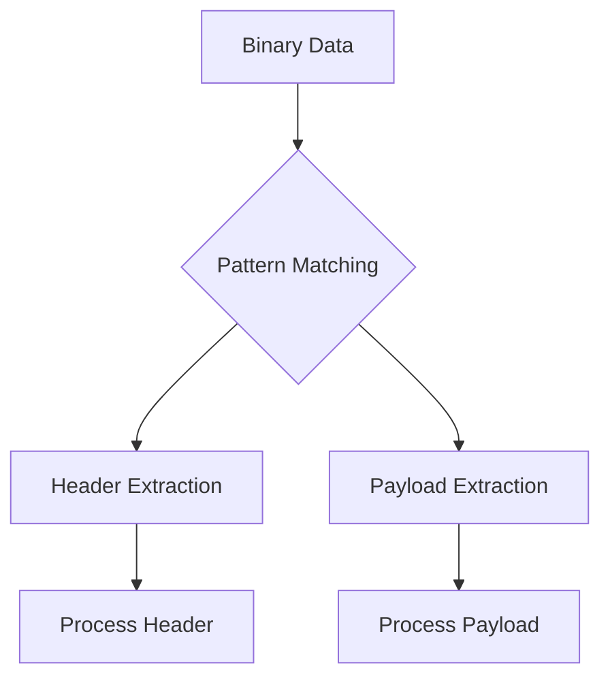

## 3.1.3 Binaries and Bitstrings

In the realm of Erlang, binaries and bitstrings are pivotal for handling binary data efficiently. They are integral to tasks such as network protocol implementation, file I/O, and data serialization. This section delves into the concepts of binaries and bitstrings, illustrating their creation, manipulation, and practical applications.

### Understanding Binaries and Bitstrings

**Binaries** in Erlang are sequences of bytes, optimized for efficient storage and manipulation of binary data. They are particularly useful when dealing with large volumes of data, such as multimedia files or network packets.

**Bitstrings** are more general than binaries, allowing for sequences of bits that may not necessarily align to byte boundaries. This flexibility makes bitstrings suitable for tasks requiring precise bit-level manipulation.

#### Importance of Binaries and Bitstrings

- **Efficiency**: Binaries are stored in a contiguous block of memory, making them efficient for both storage and access.
- **Flexibility**: Bitstrings provide the ability to work with data at the bit level, offering fine-grained control over data manipulation.
- **Pattern Matching**: Erlang's powerful pattern matching capabilities extend to binaries and bitstrings, enabling concise and expressive data parsing.

### Creating and Manipulating Binaries

To create a binary in Erlang, you can use the binary syntax `<<>>`. Here's a simple example:

```erlang
% Creating a binary with three bytes
Binary = <<1, 2, 3>>.
```

You can also create binaries from strings:

```erlang
% Creating a binary from a string
StringBinary = <<"Hello, World!">>.
```

#### Binary Comprehensions

Erlang supports binary comprehensions, similar to list comprehensions, allowing you to construct binaries from existing data:

```erlang
% Creating a binary from a list of integers
List = [1, 2, 3, 4, 5],
Binary = << <<X>> || X <- List >>.
```

### Manipulating Bitstrings

Bitstrings allow for more granular control over data. You can specify the number of bits for each segment:

```erlang
% Creating a bitstring with specific bit sizes
Bitstring = <<5:3, 6:4>>. % 5 is represented with 3 bits, 6 with 4 bits
```

### Binary Pattern Matching

Pattern matching with binaries and bitstrings is a powerful feature in Erlang, enabling you to parse and extract data efficiently.

#### Example: Parsing a Binary Header

Consider a binary data packet with a header and payload:

```erlang
% Binary with a 16-bit header and a payload
Packet = <<16#1234:16, "Payload">>.

% Pattern matching to extract header and payload
<<Header:16, Payload/binary>> = Packet.
```

In this example, `Header` captures the first 16 bits, and `Payload` captures the rest as a binary.

### Use Cases for Binaries and Bitstrings

#### Network Protocol Implementation

Binaries are ideal for implementing network protocols, where data is often transmitted in binary form. Erlang's pattern matching allows for easy parsing of protocol headers and payloads.

```erlang
% Example of parsing a simple network packet
Packet = <<1:8, 2:16, "Data">>,
<<Version:8, Length:16, Data/binary>> = Packet.
```

#### File I/O

When reading or writing binary files, binaries provide an efficient way to handle data:

```erlang
% Reading a binary file
{ok, BinaryData} = file:read_file("example.bin").

% Writing to a binary file
ok = file:write_file("output.bin", BinaryData).
```

### Advanced Binary Manipulation

#### Bitwise Operations

Erlang provides bitwise operations for manipulating binary data:

```erlang
% Bitwise AND
Result = <<(X band Y)>>.

% Bitwise OR
Result = <<(X bor Y)>>.

% Bitwise XOR
Result = <<(X bxor Y)>>.
```

#### Binary Splitting and Joining

You can split and join binaries using pattern matching and concatenation:

```erlang
% Splitting a binary
<<Part1:8, Part2:8, Rest/binary>> = <<1, 2, 3, 4, 5>>.

% Joining binaries
Joined = <<Part1, Part2, Rest>>.
```

### Visualizing Binary Pattern Matching

To better understand how binary pattern matching works, consider the following diagram:



**Diagram Description**: This diagram illustrates the process of binary pattern matching, where binary data is split into a header and payload, each processed separately.

### Best Practices for Using Binaries and Bitstrings

- **Use Binaries for Large Data**: When dealing with large datasets, prefer binaries for their efficiency.
- **Leverage Pattern Matching**: Utilize Erlang's pattern matching to simplify binary data parsing.
- **Optimize Memory Usage**: Be mindful of memory usage, especially when working with large binaries.

### Try It Yourself

Experiment with the following code to deepen your understanding:

```erlang
% Create a binary from a list of integers
List = [10, 20, 30, 40, 50],
Binary = << <<X>> || X <- List >>.

% Parse the binary to extract values
<<A, B, C, D, E>> = Binary.

% Modify the binary and observe changes
ModifiedBinary = <<A, B, C, 100, E>>.
```

**Challenge**: Modify the code to include additional pattern matching and bitwise operations.

### Key Takeaways

- **Binaries and Bitstrings**: Essential for efficient binary data processing in Erlang.
- **Pattern Matching**: A powerful tool for parsing and manipulating binary data.
- **Use Cases**: Network protocols, file I/O, and data serialization are common applications.

### Further Reading

- [Erlang Documentation on Binaries](https://www.erlang.org/doc/programming_examples/binaryhandling.html)
- [Learn You Some Erlang for Great Good! - Binaries](http://learnyousomeerlang.com/binaries)

## Quiz: Binaries and Bitstrings



### What is a binary in Erlang?

- [x] A sequence of bytes optimized for efficient storage and manipulation
- [ ] A sequence of bits that may not align to byte boundaries
- [ ] A data type used for storing text
- [ ] A function for converting integers to strings

> **Explanation:** Binaries are sequences of bytes optimized for efficient storage and manipulation in Erlang.

### How can you create a binary from a string in Erlang?

- [x] Using the syntax `<<"string">>`
- [ ] Using the syntax `<<string>>`
- [ ] Using the syntax `<<'string'>>`
- [ ] Using the syntax `<<string:binary>>`

> **Explanation:** The syntax `<<"string">>` is used to create a binary from a string in Erlang.

### What is the purpose of bitstrings in Erlang?

- [x] To allow sequences of bits that may not align to byte boundaries
- [ ] To store large text files
- [ ] To convert integers to strings
- [ ] To handle floating-point arithmetic

> **Explanation:** Bitstrings allow sequences of bits that may not align to byte boundaries, providing fine-grained control over data manipulation.

### Which operation is used to extract a header from a binary packet?

- [x] Pattern matching
- [ ] List comprehension
- [ ] Function composition
- [ ] Recursion

> **Explanation:** Pattern matching is used to extract specific parts, such as headers, from binary packets.

### What is a common use case for binaries in Erlang?

- [x] Network protocol implementation
- [ ] Text processing
- [ ] Arithmetic operations
- [ ] GUI development

> **Explanation:** Binaries are commonly used in network protocol implementation due to their efficiency in handling binary data.

### How do you perform a bitwise AND operation in Erlang?

- [x] Using the `band` operator
- [ ] Using the `bor` operator
- [ ] Using the `bxor` operator
- [ ] Using the `bnot` operator

> **Explanation:** The `band` operator is used for bitwise AND operations in Erlang.

### What is the result of the following binary comprehension: `<< <<X>> || X <- [1, 2, 3] >>`?

- [x] A binary containing the bytes 1, 2, and 3
- [ ] A list containing the integers 1, 2, and 3
- [ ] A string "123"
- [ ] An integer 123

> **Explanation:** The binary comprehension creates a binary containing the bytes 1, 2, and 3.

### What is the advantage of using binaries for large datasets?

- [x] They are stored in a contiguous block of memory, making them efficient for storage and access
- [ ] They allow for easy conversion to strings
- [ ] They support floating-point arithmetic
- [ ] They are automatically compressed

> **Explanation:** Binaries are stored in a contiguous block of memory, making them efficient for storage and access, especially for large datasets.

### True or False: Bitstrings in Erlang can only be used for data that aligns to byte boundaries.

- [ ] True
- [x] False

> **Explanation:** Bitstrings can be used for data that does not align to byte boundaries, providing flexibility in data manipulation.

### What is a key takeaway from using binaries and bitstrings in Erlang?

- [x] They are essential for efficient binary data processing and enable powerful pattern matching capabilities.
- [ ] They are primarily used for text processing and GUI development.
- [ ] They are only useful for small datasets.
- [ ] They are automatically converted to integers.

> **Explanation:** Binaries and bitstrings are essential for efficient binary data processing and enable powerful pattern matching capabilities in Erlang.



Remember, mastering binaries and bitstrings is crucial for efficient data handling in Erlang. Keep experimenting, stay curious, and enjoy the journey!
