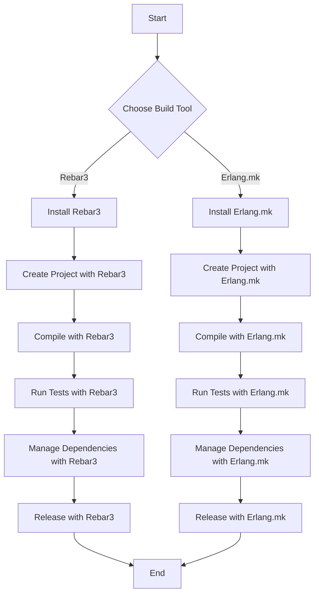

## 3.10 Build Tools: Rebar3 and Erlang.mk

In the world of Erlang development, managing projects, dependencies, and automating tasks are crucial for efficient and effective software delivery. Two prominent tools that facilitate these tasks are Rebar3 and Erlang.mk. In this section, we will delve into the features, setup, and usage of these tools, providing you with a comprehensive understanding of how to leverage them in your Erlang projects.

### Introduction to Rebar3

[Rebar3](https://rebar3.org) is a widely used build tool in the Erlang ecosystem. It simplifies the process of compiling code, running tests, managing dependencies, and releasing applications. Rebar3 is known for its extensibility and ease of use, making it a popular choice among Erlang developers.

#### Key Features of Rebar3

- **Dependency Management**: Rebar3 handles dependencies through Hex, a package manager for the Erlang ecosystem, allowing you to easily include and manage external libraries.
- **Build Automation**: Automate the compilation, testing, and release processes with simple commands.
- **Plugin Architecture**: Extend Rebar3's functionality with plugins, enabling custom build steps and integrations.
- **Release Handling**: Create and manage releases of your Erlang applications with ease.
- **Cross-Platform Support**: Rebar3 works seamlessly across different operating systems, ensuring consistent builds.

#### Setting Up a Project with Rebar3

To get started with Rebar3, follow these steps:

1. **Install Rebar3**: Download and install Rebar3 from the official website or your package manager.

   ```bash
   wget https://s3.amazonaws.com/rebar3/rebar3
   chmod +x rebar3
   mv rebar3 /usr/local/bin/
   ```

2. **Create a New Project**: Use Rebar3 to generate a new Erlang project.

   ```bash
   rebar3 new app my_app
   ```

   This command creates a new directory named `my_app` with a basic project structure.

3. **Compile the Project**: Navigate to your project directory and compile the code.

   ```bash
   cd my_app
   rebar3 compile
   ```

   Rebar3 will compile the Erlang source files and place the compiled beam files in the `_build` directory.

4. **Run Tests**: Execute tests using Rebar3's built-in testing capabilities.

   ```bash
   rebar3 eunit
   ```

5. **Manage Dependencies**: Add dependencies to your `rebar.config` file and run the following command to fetch them.

   ```bash
   rebar3 deps
   ```

#### Example: Compiling Code and Running Tests with Rebar3

Here's a simple example of an Erlang module and how to compile and test it using Rebar3.

```erlang
%% File: src/hello.erl
-module(hello).
-export([greet/0]).

greet() ->
    io:format("Hello, Erlang!~n").
```

To compile and test this module:

1. Add the module to your `src` directory.
2. Compile the project:

   ```bash
   rebar3 compile
   ```

3. Create a test module in the `test` directory:

   ```erlang
   %% File: test/hello_tests.erl
   -module(hello_tests).
   -include_lib("eunit/include/eunit.hrl").

   greet_test() ->
       ?assertEqual(ok, hello:greet()).
   ```

4. Run the tests:

   ```bash
   rebar3 eunit
   ```

### Introduction to Erlang.mk

[Erlang.mk](https://erlang.mk) is another powerful build tool for Erlang projects. It leverages the simplicity and flexibility of Makefiles to manage Erlang applications, providing a straightforward approach to building and managing projects.

#### Key Features of Erlang.mk

- **Makefile-Based**: Uses Makefiles, which are familiar to many developers, for build automation.
- **Dependency Management**: Supports fetching and managing dependencies from various sources.
- **Customizable**: Easily extendable through custom Makefile targets and rules.
- **Lightweight**: Minimal setup and configuration required, making it easy to integrate into existing projects.

#### Setting Up a Project with Erlang.mk

To set up a project using Erlang.mk, follow these steps:

1. **Install Erlang.mk**: Clone the Erlang.mk repository and make it available in your PATH.

   ```bash
   git clone https://github.com/ninenines/erlang.mk.git
   export PATH=$PATH:/path/to/erlang.mk/bin
   ```

2. **Create a New Project**: Use Erlang.mk to initialize a new project.

   ```bash
   make -f erlang.mk bootstrap
   ```

3. **Compile the Project**: Run the following command to compile your Erlang code.

   ```bash
   make
   ```

4. **Run Tests**: Execute tests using Erlang.mk's testing capabilities.

   ```bash
   make tests
   ```

5. **Manage Dependencies**: Add dependencies to your `Makefile` and run the following command to fetch them.

   ```bash
   make deps
   ```

#### Example: Compiling Code and Running Tests with Erlang.mk

Here's how you can compile and test an Erlang module using Erlang.mk.

```erlang
%% File: src/hello.erl
-module(hello).
-export([greet/0]).

greet() ->
    io:format("Hello, Erlang!~n").
```

To compile and test this module:

1. Add the module to your `src` directory.
2. Compile the project:

   ```bash
   make
   ```

3. Create a test module in the `test` directory:

   ```erlang
   %% File: test/hello_tests.erl
   -module(hello_tests).
   -include_lib("eunit/include/eunit.hrl").

   greet_test() ->
       ?assertEqual(ok, hello:greet()).
   ```

4. Run the tests:

   ```bash
   make tests
   ```

### Comparing Rebar3 and Erlang.mk

Both Rebar3 and Erlang.mk are excellent tools for managing Erlang projects, but they have different strengths and use cases.

#### When to Use Rebar3

- **Plugin Support**: If you need extensive plugin support and a rich ecosystem, Rebar3 is the better choice.
- **Hex Integration**: Rebar3's integration with Hex makes it ideal for projects that rely heavily on external libraries.
- **Cross-Platform Consistency**: Rebar3 provides a consistent experience across different operating systems.

#### When to Use Erlang.mk

- **Simplicity**: If you prefer a lightweight and straightforward setup, Erlang.mk is a great option.
- **Makefile Familiarity**: Developers familiar with Makefiles will find Erlang.mk easy to use and customize.
- **Custom Build Processes**: Erlang.mk's flexibility with Makefile targets allows for custom build processes.

### Visualizing the Build Process

To better understand the build process with Rebar3 and Erlang.mk, let's visualize it using a flowchart.



### Try It Yourself

To deepen your understanding, try modifying the code examples provided. Experiment with adding new functions, creating additional test cases, or integrating external libraries. This hands-on approach will reinforce your learning and help you become proficient in using Rebar3 and Erlang.mk.

### Knowledge Check

- What are the key differences between Rebar3 and Erlang.mk?
- How do you manage dependencies in Rebar3?
- What is the advantage of using Makefiles in Erlang.mk?
- How can you extend Rebar3's functionality?
- Why is cross-platform consistency important in build tools?

### Summary

In this section, we've explored the essential build tools Rebar3 and Erlang.mk, which are integral to managing Erlang projects. We've covered their features, setup processes, and provided examples of compiling code, running tests, and managing dependencies. By understanding the strengths and use cases of each tool, you can choose the one that best fits your project's needs.

Remember, mastering these tools is just the beginning. As you continue your journey in Erlang development, you'll find that these build tools are invaluable in streamlining your workflow and enhancing your productivity.

## Quiz: Build Tools: Rebar3 and Erlang.mk



### What is a key feature of Rebar3?

- [x] Plugin architecture
- [ ] Makefile-based
- [ ] Native integration with C
- [ ] Built-in web server

> **Explanation:** Rebar3's plugin architecture allows for extensibility and customization of the build process.

### How do you install dependencies in Erlang.mk?

- [ ] rebar3 deps
- [ ] make install
- [x] make deps
- [ ] erlang.mk install

> **Explanation:** In Erlang.mk, dependencies are installed using the `make deps` command.

### Which tool is known for its simplicity and lightweight setup?

- [ ] Rebar3
- [x] Erlang.mk
- [ ] Hex
- [ ] Mix

> **Explanation:** Erlang.mk is known for its simplicity and lightweight setup, making it easy to integrate into projects.

### What command is used to create a new project with Rebar3?

- [x] rebar3 new app my_app
- [ ] make new app my_app
- [ ] rebar3 create my_app
- [ ] erlang.mk new my_app

> **Explanation:** The `rebar3 new app my_app` command initializes a new project with Rebar3.

### Which build tool integrates with Hex for dependency management?

- [x] Rebar3
- [ ] Erlang.mk
- [ ] Mix
- [ ] Make

> **Explanation:** Rebar3 integrates with Hex, a package manager for the Erlang ecosystem, to manage dependencies.

### What is the primary configuration file for Rebar3 projects?

- [ ] Makefile
- [x] rebar.config
- [ ] config.mk
- [ ] app.config

> **Explanation:** The `rebar.config` file is used to configure Rebar3 projects, including dependencies and build options.

### How can you extend the functionality of Rebar3?

- [x] By using plugins
- [ ] By modifying the Makefile
- [ ] By writing shell scripts
- [ ] By using NIFs

> **Explanation:** Rebar3's functionality can be extended through the use of plugins, which add custom build steps and integrations.

### What is a benefit of using Makefiles in Erlang.mk?

- [x] Familiarity for developers
- [ ] Built-in testing framework
- [ ] Automatic code formatting
- [ ] Native support for Elixir

> **Explanation:** Makefiles are familiar to many developers, making Erlang.mk easy to use and customize.

### Which tool provides a consistent experience across different operating systems?

- [x] Rebar3
- [ ] Erlang.mk
- [ ] Mix
- [ ] Hex

> **Explanation:** Rebar3 provides a consistent experience across different operating systems, ensuring reliable builds.

### True or False: Erlang.mk is primarily used for managing dependencies through Hex.

- [ ] True
- [x] False

> **Explanation:** Erlang.mk uses Makefiles for dependency management and does not primarily rely on Hex.


