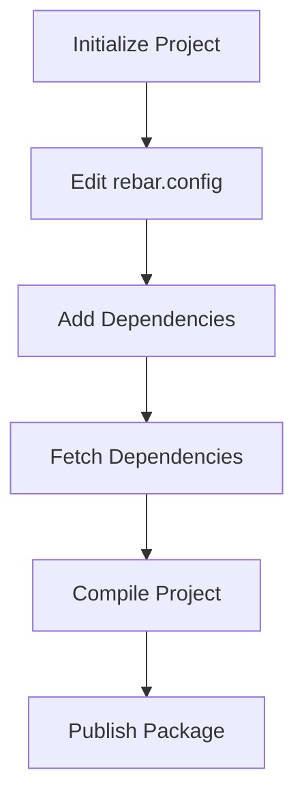

## 3.11 Managing Dependencies with Hex

In the world of software development, managing dependencies is crucial for building robust and maintainable applications. Erlang, with its rich ecosystem, leverages Hex as its package manager to streamline this process. In this section, we'll explore how to manage dependencies in Erlang projects using Hex, understand version constraints, publish packages, and adhere to best practices.

### What is Hex?

Hex is a package manager for the Erlang ecosystem, designed to facilitate the sharing and management of libraries and applications. It provides a centralized repository for packages, making it easy to discover, use, and contribute to open-source projects. Hex is widely used in the Erlang and Elixir communities, offering a seamless experience for managing dependencies.

#### Benefits of Using Hex

- **Centralized Repository**: Hex provides a single source for discovering and managing packages, reducing the complexity of dependency management.
- **Versioning and Compatibility**: Hex supports semantic versioning, ensuring compatibility and stability across different package versions.
- **Community and Collaboration**: Hex fosters a collaborative environment, encouraging developers to share their work and contribute to the ecosystem.
- **Security and Trust**: Hex includes features for verifying package integrity, ensuring that dependencies are secure and trustworthy.

### Adding Dependencies with Rebar3

Rebar3 is a build tool for Erlang projects that integrates seamlessly with Hex. It simplifies the process of adding and managing dependencies.

#### Step-by-Step Guide to Adding Dependencies

1. **Initialize Your Project**: If you haven't already, initialize your Erlang project with Rebar3.

   ```bash
   rebar3 new app my_app
   ```

2. **Edit `rebar.config`**: Open the `rebar.config` file in your project directory. This file is where you'll specify your dependencies.

3. **Add Dependencies**: In the `rebar.config` file, add the dependencies under the `deps` key. For example, to add the `cowboy` web server, you would include:

   ```erlang
   {deps, [
       {cowboy, "2.9.0"}
   ]}.
   ```

4. **Fetch Dependencies**: Run the following command to fetch and compile the dependencies:

   ```bash
   rebar3 compile
   ```

This process will download the specified version of `cowboy` from Hex and make it available in your project.

### Adding Dependencies with Erlang.mk

Erlang.mk is another build tool for Erlang projects that supports Hex for dependency management.

#### Step-by-Step Guide to Adding Dependencies

1. **Create a Makefile**: In your project directory, create a `Makefile` if it doesn't already exist.

2. **Specify Dependencies**: Add your dependencies in the `Makefile` under the `DEPS` variable. For example:

   ```makefile
   DEPS = cowboy
   ```

3. **Fetch Dependencies**: Use the following command to fetch and compile the dependencies:

   ```bash
   make deps
   ```

Erlang.mk will handle the rest, downloading the dependencies from Hex and integrating them into your project.

### Understanding Version Constraints and Dependency Resolution

Version constraints are crucial for ensuring compatibility and stability in your projects. Hex supports semantic versioning, allowing you to specify precise or flexible version requirements.

#### Semantic Versioning

Semantic versioning follows the format `MAJOR.MINOR.PATCH`, where:

- **MAJOR**: Incompatible API changes
- **MINOR**: Backward-compatible functionality
- **PATCH**: Backward-compatible bug fixes

#### Specifying Version Constraints

In `rebar.config`, you can specify version constraints using operators:

- **Exact Version**: `"2.9.0"`
- **Range**: `">= 2.0.0, < 3.0.0"`
- **Wildcard**: `"2.x"`

These constraints help ensure that your project uses compatible versions of dependencies.

### Publishing Packages to Hex

Publishing your packages to Hex allows others to benefit from your work and contributes to the Erlang ecosystem.

#### Steps to Publish a Package

1. **Create a Hex Account**: If you don't have one, create an account on [Hex.pm](https://hex.pm).

2. **Prepare Your Package**: Ensure your project is ready for publishing. This includes having a `README.md`, `LICENSE`, and a properly configured `rebar.config`.

3. **Authenticate with Hex**: Use the following command to authenticate with Hex:

   ```bash
   rebar3 hex user auth
   ```

4. **Publish Your Package**: Run the following command to publish your package:

   ```bash
   rebar3 hex publish
   ```

This process will upload your package to Hex, making it available for others to use.

### Best Practices for Dependency Management

Managing dependencies effectively is key to maintaining a healthy project. Here are some best practices to consider:

- **Regularly Update Dependencies**: Keep your dependencies up-to-date to benefit from the latest features and security patches.
- **Use Version Constraints Wisely**: Specify version constraints to ensure compatibility while allowing flexibility for updates.
- **Audit Dependencies**: Regularly audit your dependencies for security vulnerabilities and deprecated packages.
- **Document Dependencies**: Clearly document the purpose and version of each dependency in your project.
- **Minimize Direct Dependencies**: Only include necessary dependencies to reduce complexity and potential conflicts.

### Try It Yourself

Experiment with managing dependencies in your Erlang project. Try adding a new dependency, updating an existing one, or publishing a package to Hex. Modify the version constraints to see how they affect dependency resolution.

### Visualizing Dependency Management with Hex

Below is a diagram illustrating the process of managing dependencies with Hex using Rebar3:



This flowchart provides a visual representation of the steps involved in managing dependencies with Hex.

### References and Links

- [Hex.pm](https://hex.pm): Official Hex package manager website.
- [Rebar3 Documentation](https://rebar3.org/docs): Comprehensive guide to using Rebar3.
- [Erlang.mk Documentation](https://erlang.mk/guide/): Guide to using Erlang.mk for dependency management.

### Knowledge Check

- What is Hex, and why is it important for Erlang projects?
- How do you add a dependency using Rebar3?
- What are semantic versioning and version constraints?
- Describe the process of publishing a package to Hex.
- What are some best practices for managing dependencies?

### Embrace the Journey

Managing dependencies is a vital skill for any developer. As you continue to explore the Erlang ecosystem, remember that effective dependency management can significantly enhance the stability and maintainability of your projects. Keep experimenting, stay curious, and enjoy the journey!

## Quiz: Managing Dependencies with Hex



### What is Hex?

- [x] A package manager for the Erlang ecosystem
- [ ] A build tool for Erlang projects
- [ ] A version control system
- [ ] An integrated development environment

> **Explanation:** Hex is a package manager specifically designed for the Erlang ecosystem, facilitating the management of dependencies.

### Which tool integrates with Hex for dependency management in Erlang projects?

- [x] Rebar3
- [ ] Git
- [ ] Docker
- [ ] Visual Studio Code

> **Explanation:** Rebar3 is a build tool for Erlang projects that integrates with Hex for managing dependencies.

### What is the purpose of semantic versioning?

- [x] To ensure compatibility and stability across package versions
- [ ] To provide a unique identifier for each package
- [ ] To track the number of downloads for a package
- [ ] To categorize packages based on their functionality

> **Explanation:** Semantic versioning helps maintain compatibility and stability by following a structured versioning format.

### How do you specify a dependency in `rebar.config`?

- [x] Under the `deps` key
- [ ] In the `Makefile`
- [ ] In the `README.md`
- [ ] In the `LICENSE` file

> **Explanation:** Dependencies are specified under the `deps` key in the `rebar.config` file.

### What command is used to fetch dependencies with Rebar3?

- [x] `rebar3 compile`
- [ ] `rebar3 fetch`
- [ ] `rebar3 install`
- [ ] `rebar3 update`

> **Explanation:** The `rebar3 compile` command is used to fetch and compile dependencies in a Rebar3 project.

### What is a best practice for managing dependencies?

- [x] Regularly update dependencies
- [ ] Avoid using version constraints
- [ ] Include as many dependencies as possible
- [ ] Ignore security vulnerabilities

> **Explanation:** Regularly updating dependencies ensures that you benefit from the latest features and security patches.

### How do you publish a package to Hex?

- [x] Use the `rebar3 hex publish` command
- [ ] Use the `git push` command
- [ ] Use the `docker push` command
- [ ] Use the `npm publish` command

> **Explanation:** The `rebar3 hex publish` command is used to publish a package to Hex.

### What is the format of semantic versioning?

- [x] MAJOR.MINOR.PATCH
- [ ] PATCH.MINOR.MAJOR
- [ ] MINOR.MAJOR.PATCH
- [ ] MAJOR.PATCH.MINOR

> **Explanation:** Semantic versioning follows the format MAJOR.MINOR.PATCH.

### What is the benefit of using version constraints?

- [x] Ensures compatibility while allowing flexibility for updates
- [ ] Increases the number of dependencies
- [ ] Reduces the need for documentation
- [ ] Simplifies the build process

> **Explanation:** Version constraints help ensure compatibility and allow flexibility for updates.

### True or False: Hex is only used for Erlang projects.

- [ ] True
- [x] False

> **Explanation:** While Hex is primarily used for Erlang projects, it is also widely used in the Elixir community.


