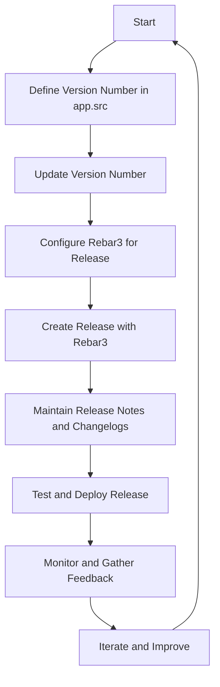

## 3.12 Versioning and Release Management

In the realm of software development, versioning and release management are critical components that ensure the consistency, stability, and reliability of applications. This section delves into the best practices for versioning and managing releases in Erlang, focusing on semantic versioning, application version management, and the use of tools like Rebar3. We will also discuss guidelines for maintaining release notes and changelogs, as well as strategies for smooth upgrades and backward compatibility.

### Importance of Semantic Versioning

Semantic versioning is a versioning scheme that conveys meaning about the underlying changes with each new release. It is a widely adopted standard in the software industry, providing a clear and structured way to communicate changes to users and developers.

#### Key Concepts of Semantic Versioning

Semantic versioning follows the format `MAJOR.MINOR.PATCH`, where:

- **MAJOR** version changes indicate incompatible API changes.
- **MINOR** version changes add functionality in a backward-compatible manner.
- **PATCH** version changes are for backward-compatible bug fixes.

By adhering to semantic versioning, developers can set clear expectations for users regarding the impact of an update. For example, a change from version 1.4.2 to 2.0.0 signals a breaking change, whereas a change to 1.5.0 indicates new features without breaking existing functionality.

#### Benefits of Semantic Versioning

- **Predictability**: Users can anticipate the impact of updates based on version numbers.
- **Compatibility**: Developers can ensure compatibility with dependencies by specifying version ranges.
- **Communication**: Clear versioning helps communicate the nature of changes to stakeholders.

### Managing Application Versions in Erlang

In Erlang, managing application versions involves defining and updating version numbers in the application's metadata. This process is crucial for maintaining consistency across different environments and ensuring that the correct version of an application is deployed.

#### Defining Version Numbers

Erlang applications typically define their version numbers in the `app.src` file, which is part of the application's source code. The `version` attribute specifies the current version of the application.

```erlang
{application, my_app,
 [
  {description, "My Sample Application"},
  {vsn, "1.0.0"}, % Version number
  {modules, [my_app]},
  {registered, [my_app]},
  {applications, [kernel, stdlib]},
  {mod, {my_app, []}}
 ]}.
```

#### Updating Version Numbers

When making changes to an application, it's important to update the version number according to the semantic versioning guidelines. This update should reflect the nature of the changes, whether they are bug fixes, new features, or breaking changes.

### Tools for Creating Releases: Rebar3

Rebar3 is a powerful build tool for Erlang that simplifies the process of managing dependencies, compiling code, running tests, and creating releases. It is an essential tool for Erlang developers, providing a streamlined workflow for building and deploying applications.

#### Creating Releases with Rebar3

Rebar3 automates the process of creating releases, which are self-contained packages of an application and its dependencies. This automation ensures that the correct versions of all components are included, reducing the risk of deployment issues.

To create a release with Rebar3, you need to define a `relx` configuration in your `rebar.config` file. This configuration specifies the applications and their versions to be included in the release.

```erlang
{relx, [
  {release, {my_app, "1.0.0"}, [my_app, sasl]},
  {dev_mode, true},
  {include_erts, false},
  {extended_start_script, true}
]}.
```

Once the configuration is set, you can create a release by running the following command:

```shell
rebar3 release
```

This command generates a release package in the `_build/default/rel` directory, which can be deployed to production environments.

#### Managing Dependencies with Rebar3

Rebar3 also handles dependency management, ensuring that the correct versions of libraries are used. You can specify dependencies in the `rebar.config` file, and Rebar3 will automatically fetch and compile them.

```erlang
{deps, [
  {cowboy, "2.8.0"},
  {jsx, "3.0.0"}
]}.
```

### Maintaining Release Notes and Changelogs

Release notes and changelogs are essential for documenting the changes made in each version of an application. They provide users and developers with a clear understanding of what has been added, changed, or fixed.

#### Guidelines for Writing Release Notes

- **Be Concise**: Clearly summarize the changes without unnecessary detail.
- **Categorize Changes**: Group changes into categories such as new features, bug fixes, and improvements.
- **Highlight Breaking Changes**: Clearly indicate any changes that may affect backward compatibility.

#### Example of a Changelog

```markdown
# Changelog

## [1.1.0] - 2024-11-23
### Added
- New feature for user authentication.
- Support for JSON data serialization.

### Fixed
- Resolved issue with data parsing in the API module.

### Changed
- Updated the logging mechanism for better performance.
```

### Practices for Smooth Upgrades and Backward Compatibility

Ensuring smooth upgrades and maintaining backward compatibility are crucial for minimizing disruptions during deployments. Here are some best practices to consider:

#### Implementing Backward Compatibility

- **Deprecate Gradually**: Introduce new features alongside existing ones and provide a deprecation timeline.
- **Use Feature Flags**: Enable or disable features dynamically to test changes without affecting all users.
- **Provide Migration Guides**: Offer clear instructions for users to transition to new versions.

#### Testing Upgrades

- **Automate Testing**: Use automated tests to verify that new versions do not introduce regressions.
- **Staging Environments**: Deploy new versions to staging environments before production to catch issues early.
- **Monitor Performance**: Continuously monitor application performance after upgrades to identify potential problems.

### Visualizing Versioning and Release Management

To better understand the process of versioning and release management, let's visualize the workflow using a flowchart.



**Figure 1**: Workflow for Versioning and Release Management in Erlang.

### References and Further Reading

- [Semantic Versioning Specification](https://semver.org/)
- [Rebar3 Documentation](https://rebar3.org/docs)
- [Erlang/OTP Documentation](https://www.erlang.org/docs)

### Knowledge Check

- **Question**: What is the purpose of semantic versioning?
- **Exercise**: Create a simple Erlang application and practice updating its version number according to semantic versioning guidelines.

### Embrace the Journey

Remember, mastering versioning and release management is an ongoing journey. As you gain experience, you'll develop a deeper understanding of how to manage changes effectively and ensure the stability of your applications. Keep experimenting, stay curious, and enjoy the process!

## Quiz: Versioning and Release Management



### What is the primary purpose of semantic versioning?

- [x] To convey meaning about the underlying changes with each new release
- [ ] To increase the version number arbitrarily
- [ ] To ensure all software uses the same version number
- [ ] To make version numbers more complex

> **Explanation:** Semantic versioning provides a structured way to communicate the nature of changes in each release, helping users understand the impact of updates.

### Which tool is commonly used in Erlang for creating releases?

- [x] Rebar3
- [ ] Maven
- [ ] Gradle
- [ ] npm

> **Explanation:** Rebar3 is a build tool specifically designed for Erlang, simplifying the process of managing dependencies and creating releases.

### What does the MAJOR version number indicate in semantic versioning?

- [x] Incompatible API changes
- [ ] Backward-compatible bug fixes
- [ ] New features in a backward-compatible manner
- [ ] Minor improvements

> **Explanation:** The MAJOR version number indicates changes that are not backward-compatible, signaling potential breaking changes to users.

### What should be included in release notes?

- [x] A summary of changes, categorized by type
- [ ] Only the version number
- [ ] Detailed code changes
- [ ] Personal opinions of the developer

> **Explanation:** Release notes should provide a concise summary of changes, categorized by type, to inform users about what has been added, changed, or fixed.

### How can backward compatibility be maintained during upgrades?

- [x] Deprecate features gradually and provide migration guides
- [ ] Remove old features immediately
- [ ] Ignore user feedback
- [ ] Change the entire codebase

> **Explanation:** Maintaining backward compatibility involves gradually deprecating features and providing clear migration guides to help users transition smoothly.

### What is the role of Rebar3 in Erlang development?

- [x] Managing dependencies and creating releases
- [ ] Writing test cases
- [ ] Designing user interfaces
- [ ] Compiling Java code

> **Explanation:** Rebar3 is a build tool that manages dependencies and automates the process of creating releases in Erlang.

### What is a best practice for testing upgrades?

- [x] Use automated tests and deploy to staging environments
- [ ] Skip testing to save time
- [ ] Test only in production environments
- [ ] Rely solely on manual testing

> **Explanation:** Automated testing and deploying to staging environments help catch issues early and ensure that upgrades do not introduce regressions.

### What is a feature flag used for?

- [x] Enabling or disabling features dynamically
- [ ] Indicating the version number
- [ ] Documenting code changes
- [ ] Managing user accounts

> **Explanation:** Feature flags allow developers to enable or disable features dynamically, facilitating testing and gradual rollouts.

### What should be done after deploying a new release?

- [x] Monitor performance and gather feedback
- [ ] Ignore user feedback
- [ ] Immediately start the next release
- [ ] Delete the previous version

> **Explanation:** Monitoring performance and gathering feedback after deploying a new release helps identify potential issues and improve future releases.

### True or False: Semantic versioning is only applicable to major software projects.

- [x] False
- [ ] True

> **Explanation:** Semantic versioning can be applied to projects of any size, providing a clear and consistent way to communicate changes.


