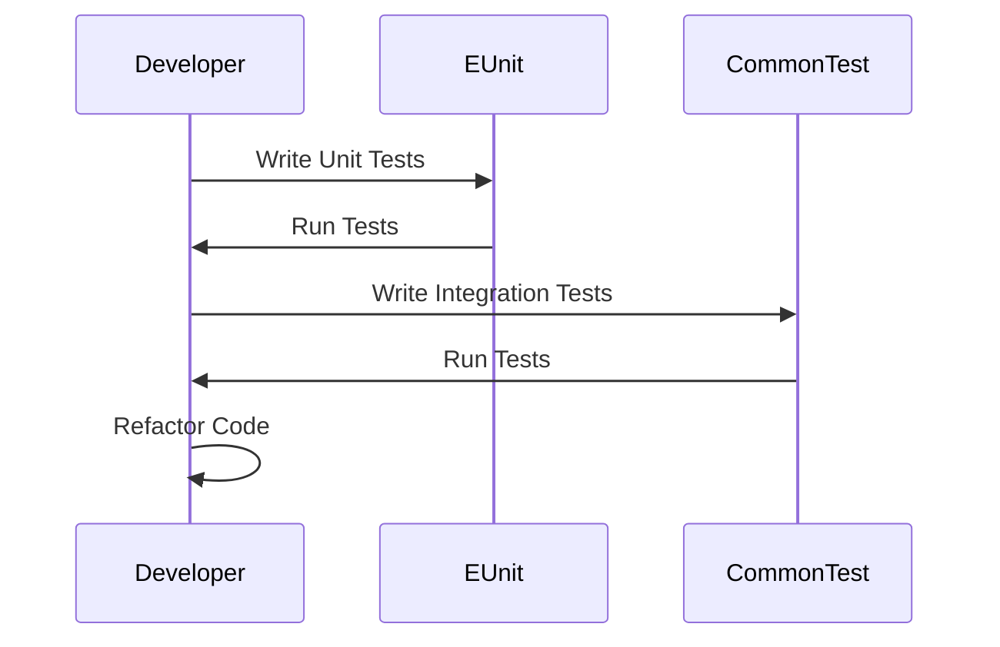

## 3.13 Testing with EUnit and Common Test

In the world of software development, testing is a critical component that ensures the reliability, quality, and performance of applications. In Erlang, two powerful testing frameworks, EUnit and Common Test, are widely used to facilitate unit testing and integration testing, respectively. This section will guide you through the essentials of these frameworks, demonstrating how to write effective tests and encouraging the adoption of test-driven development (TDD) practices.

### The Role of Testing in Software Development

Testing is an integral part of the software development lifecycle. It helps in identifying bugs, verifying functionality, and ensuring that the software meets the specified requirements. Testing can be categorized into various types, including unit testing, integration testing, system testing, and acceptance testing. In this section, we will focus on unit testing with EUnit and integration/system-level testing with Common Test.

### Writing Unit Tests with EUnit

EUnit is a lightweight unit testing framework for Erlang, designed to be easy to use and integrate into your development workflow. It allows you to write tests for individual functions or modules, ensuring that each component behaves as expected.

#### Getting Started with EUnit

To begin using EUnit, you need to include it in your project. If you're using Rebar3, you can add EUnit as a dependency in your `rebar.config` file:

```erlang
{deps, [
    {eunit, ".*", {git, "https://github.com/erlang/eunit.git", {branch, "master"}}}
]}.
```

#### Writing Your First EUnit Test

Let's start by writing a simple EUnit test for a function that adds two numbers:

```erlang
-module(math_tests).
-include_lib("eunit/include/eunit.hrl").

add(X, Y) -> X + Y.

add_test() ->
    ?assertEqual(5, add(2, 3)),
    ?assertEqual(0, add(-1, 1)).
```

In this example, we define a module `math_tests` with a function `add/2` and a corresponding test function `add_test/0`. The `?assertEqual` macro is used to assert that the expected result matches the actual result.

#### Test Fixtures in EUnit

Test fixtures are used to set up the environment for your tests. They can be used to initialize data or state before each test is run. EUnit provides several macros for defining fixtures:

```erlang
setup_test_() ->
    {setup,
     fun setup/0,
     fun cleanup/1,
     fun test/1}.

setup() ->
    % Setup code here
    ok.

cleanup(_State) ->
    % Cleanup code here
    ok.

test(_State) ->
    ?assertEqual(5, add(2, 3)).
```

In this example, `setup_test_` defines a test fixture that sets up and cleans up the environment for the `test/1` function.

### Introduction to Common Test

Common Test is a robust testing framework for integration and system-level testing in Erlang. It is designed to handle complex test scenarios, including distributed systems and network protocols.

#### Setting Up Common Test

To use Common Test, ensure it is included in your Erlang/OTP installation. You can create a test suite by defining a module with the `_SUITE` suffix:

```erlang
-module(my_app_SUITE).
-include_lib("common_test/include/ct.hrl").

all() -> [simple_test].

init_per_suite(Config) ->
    % Initialize suite
    Config.

end_per_suite(_Config) ->
    % Cleanup suite
    ok.

simple_test(Config) ->
    ?assertEqual(5, math:add(2, 3)).
```

#### Running Common Test Suites

You can run your Common Test suites using the `ct_run` command:

```shell
$ ct_run -suite my_app_SUITE
```

This command will execute all the test cases defined in `my_app_SUITE`.

### Test Cases and Assertions

Both EUnit and Common Test provide a variety of assertions to validate your code. Here are some common assertions:

- `?assertEqual(Expected, Actual)`: Checks if the expected value equals the actual value.
- `?assertMatch(Pattern, Value)`: Checks if the value matches the pattern.
- `?assertError(Error, Expression)`: Checks if the expression raises the specified error.

### Encouraging Test-Driven Development (TDD)

Test-driven development is a software development approach where tests are written before the actual code. This practice encourages developers to think about the requirements and design before implementation, leading to more robust and maintainable code.

#### TDD Workflow

1. **Write a Test**: Start by writing a test for a new feature or functionality.
2. **Run the Test**: Execute the test, which should fail initially since the feature is not yet implemented.
3. **Implement the Code**: Write the minimum code necessary to pass the test.
4. **Refactor**: Improve the code while ensuring that all tests still pass.
5. **Repeat**: Continue this cycle for each new feature or change.

### Code Examples and Exercises

Let's explore some more complex examples and encourage experimentation:

#### Example: Testing a List Sorting Function

```erlang
-module(list_tests).
-include_lib("eunit/include/eunit.hrl").

sort_list(List) -> lists:sort(List).

sort_list_test() ->
    ?assertEqual([1, 2, 3], sort_list([3, 2, 1])),
    ?assertEqual([], sort_list([])).
```

#### Try It Yourself

Modify the `sort_list/1` function to handle lists with duplicate elements. Write additional tests to verify the behavior.

### Visualizing the Testing Process

To better understand the testing workflow, let's visualize it using a sequence diagram:



This diagram illustrates the interaction between the developer and the testing frameworks during the development process.

### References and Further Reading

- [EUnit Documentation](https://erlang.org/doc/apps/eunit/chapter.html)
- [Common Test User's Guide](https://erlang.org/doc/apps/common_test/users_guide.html)
- [Test-Driven Development by Example](https://www.amazon.com/Test-Driven-Development-Kent-Beck/dp/0321146530)

### Knowledge Check

- What is the primary purpose of unit testing?
- How does EUnit differ from Common Test?
- What are the benefits of test-driven development?

### Embrace the Journey

Remember, testing is not just about finding bugs; it's about building confidence in your code. As you continue to explore EUnit and Common Test, you'll develop a deeper understanding of how to create reliable and maintainable Erlang applications. Keep experimenting, stay curious, and enjoy the journey!

## Quiz: Testing with EUnit and Common Test



### What is the primary purpose of unit testing?

- [x] To verify the functionality of individual components
- [ ] To test the entire system as a whole
- [ ] To ensure the application is ready for deployment
- [ ] To check the user interface design

> **Explanation:** Unit testing focuses on verifying the functionality of individual components or functions in isolation.

### How does EUnit differ from Common Test?

- [x] EUnit is used for unit testing, while Common Test is for integration testing
- [ ] EUnit is for integration testing, while Common Test is for unit testing
- [ ] EUnit is more complex than Common Test
- [ ] EUnit is only used for testing GUIs

> **Explanation:** EUnit is designed for unit testing individual functions or modules, whereas Common Test is used for integration and system-level testing.

### What is the first step in the TDD workflow?

- [x] Write a test
- [ ] Implement the code
- [ ] Refactor the code
- [ ] Run the test

> **Explanation:** The first step in test-driven development is to write a test for the new feature or functionality.

### Which assertion checks if the expected value equals the actual value?

- [x] ?assertEqual(Expected, Actual)
- [ ] ?assertMatch(Pattern, Value)
- [ ] ?assertError(Error, Expression)
- [ ] ?assertTrue(Expression)

> **Explanation:** The `?assertEqual` assertion checks if the expected value equals the actual value.

### What is a test fixture used for in EUnit?

- [x] To set up and clean up the environment for tests
- [ ] To generate random test data
- [ ] To compile the test code
- [ ] To document the test cases

> **Explanation:** Test fixtures in EUnit are used to set up and clean up the environment for tests, ensuring consistent test conditions.

### What command is used to run Common Test suites?

- [x] ct_run
- [ ] eunit_run
- [ ] erl_test
- [ ] test_run

> **Explanation:** The `ct_run` command is used to execute Common Test suites.

### Which of the following is a benefit of test-driven development?

- [x] Leads to more robust and maintainable code
- [ ] Eliminates the need for manual testing
- [ ] Guarantees bug-free software
- [ ] Reduces the need for documentation

> **Explanation:** Test-driven development encourages developers to think about requirements and design before implementation, leading to more robust and maintainable code.

### What does the `?assertError` assertion check for?

- [x] If the expression raises the specified error
- [ ] If the expression returns true
- [ ] If the expression matches a pattern
- [ ] If the expression is equal to a value

> **Explanation:** The `?assertError` assertion checks if the expression raises the specified error.

### What is the purpose of the `init_per_suite` function in a Common Test suite?

- [x] To initialize the test suite
- [ ] To clean up after each test case
- [ ] To run before each test case
- [ ] To generate test reports

> **Explanation:** The `init_per_suite` function is used to initialize the test suite before any test cases are run.

### True or False: EUnit can be used for both unit and integration testing.

- [ ] True
- [x] False

> **Explanation:** EUnit is primarily designed for unit testing, while Common Test is used for integration and system-level testing.


