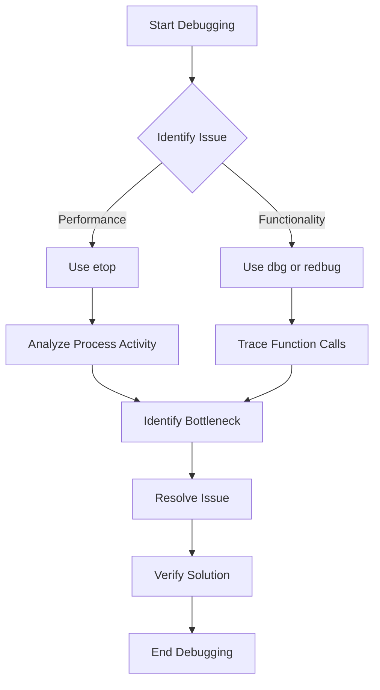

## 3.14 Debugging Techniques with `dbg`, `observer`, `redbug`, and `etop`

Debugging is a crucial aspect of software development, especially in a concurrent and distributed environment like Erlang. This section delves into the powerful debugging tools available in Erlang: `dbg`, `observer`, `redbug`, and `etop`. These tools help developers diagnose and resolve issues efficiently, ensuring robust and reliable applications.

### Introduction to Erlang Debugging Tools

Erlang's debugging tools are designed to handle the unique challenges of concurrent and distributed systems. They provide insights into process behavior, system performance, and application state, enabling developers to pinpoint and fix issues effectively.

### The `dbg` Module: Tracing Function Calls

The `dbg` module is a built-in Erlang tool for tracing function calls. It allows developers to monitor function execution, inspect arguments, and analyze return values. This is particularly useful for understanding the flow of execution and identifying unexpected behavior.

#### Setting Up `dbg`

To start using `dbg`, you need to initialize the tracer and specify the functions you want to trace. Here's a basic setup:

```erlang
% Start the tracer
dbg:tracer().

% Trace all processes
dbg:p(all, c).

% Trace calls to a specific module
dbg:tpl(my_module, my_function, x).
```

- **`dbg:tracer/0`**: Initializes the tracer.
- **`dbg:p/2`**: Specifies the processes to trace. The `all` option traces all processes.
- **`dbg:tpl/3`**: Sets a trace pattern for a specific function. The `x` option traces all calls.

#### Example: Tracing a Function Call

Consider a simple module with a function that calculates the factorial of a number:

```erlang
-module(math_utils).
-export([factorial/1]).

factorial(0) -> 1;
factorial(N) when N > 0 -> N * factorial(N - 1).
```

To trace the `factorial/1` function, use the following commands:

```erlang
% Start the tracer
dbg:tracer().

% Trace calls to factorial/1
dbg:tpl(math_utils, factorial, x).

% Call the function
math_utils:factorial(5).
```

This setup will output each call to `factorial/1`, showing the arguments and return values.

#### Stopping the Trace

To stop tracing, use:

```erlang
dbg:stop().
```

### Monitoring System State with `observer`

The `observer` tool provides a graphical interface for monitoring the state of an Erlang system. It offers insights into process activity, memory usage, and system performance.

#### Launching `observer`

To start `observer`, run the following command in the Erlang shell:

```erlang
observer:start().
```

This opens a window displaying various tabs, including:

- **Processes**: Lists all running processes, their states, and message queues.
- **Applications**: Shows the status of running applications.
- **Memory**: Displays memory usage statistics.
- **System**: Provides system-level information, such as CPU and IO statistics.

#### Using `observer` for Debugging

`observer` is particularly useful for identifying bottlenecks and resource-intensive processes. You can sort processes by message queue length or memory usage to find potential issues.

### Lightweight Tracing with `redbug`

[redbug](https://github.com/massemanet/redbug) is a lightweight tracing tool for Erlang. It offers a simpler interface than `dbg` and is suitable for production environments due to its minimal performance impact.

#### Installing `redbug`

To use `redbug`, you need to add it to your project dependencies. If you're using `rebar3`, add the following to your `rebar.config`:

```erlang
{deps, [
    {redbug, ".*", {git, "https://github.com/massemanet/redbug.git", {branch, "master"}}}
]}.
```

#### Basic Usage of `redbug`

Here's how to trace a function call with `redbug`:

```erlang
% Start tracing
redbug:start("my_module:my_function/1").

% Call the function
my_module:my_function(Arg).
```

`redbug` outputs trace information directly to the console, showing function calls, arguments, and return values.

#### Stopping `redbug`

To stop `redbug`, use:

```erlang
redbug:stop().
```

### Real-Time Process Monitoring with `etop`

`etop` is a tool for real-time monitoring of Erlang processes. It provides a top-like interface, displaying process information such as CPU usage, memory consumption, and message queue length.

#### Starting `etop`

To start `etop`, run:

```erlang
etop:start().
```

This opens a console interface similar to the Unix `top` command, showing a list of processes sorted by CPU usage.

#### Customizing `etop`

You can customize `etop` to display specific information or sort processes differently. For example, to sort by memory usage, use:

```erlang
etop:start([{sort, memory}]).
```

### Practical Debugging Scenarios

Let's explore some practical scenarios where these tools can be used effectively.

#### Scenario 1: Identifying a Bottleneck

Suppose your application is experiencing slow response times. Use `observer` to identify processes with long message queues or high memory usage. Then, use `dbg` or `redbug` to trace specific functions and understand their execution flow.

#### Scenario 2: Monitoring a Production System

In a production environment, use `redbug` for lightweight tracing without significant performance overhead. Combine it with `etop` to monitor process activity and resource usage in real-time.

#### Scenario 3: Debugging a Distributed System

For distributed systems, use `observer` to monitor nodes and their interactions. Trace inter-node communication with `dbg` or `redbug` to diagnose issues related to message passing or process synchronization.

### Visualizing Debugging Workflows

To better understand the debugging process, let's visualize a typical workflow using Mermaid.js:



This diagram illustrates a systematic approach to debugging, starting with issue identification and ending with verification of the solution.

### Summary

In this section, we explored the powerful debugging tools available in Erlang: `dbg`, `observer`, `redbug`, and `etop`. Each tool serves a unique purpose, from tracing function calls to monitoring system performance. By mastering these tools, you can effectively diagnose and resolve issues in your Erlang applications.

### Try It Yourself

Experiment with the examples provided in this section. Modify the code to trace different functions or monitor various system aspects. Practice using these tools in different scenarios to build your debugging skills.

### Further Reading

- [Erlang Documentation on `dbg`](https://www.erlang.org/doc/man/dbg.html)
- [Observer User Guide](https://www.erlang.org/doc/apps/observer/observer_ug.html)
- [redbug GitHub Repository](https://github.com/massemanet/redbug)
- [etop Documentation](https://www.erlang.org/doc/man/etop.html)

## Quiz: Debugging Techniques with `dbg`, `observer`, `redbug`, and `etop`



### Which Erlang tool provides a graphical interface for monitoring system state?

- [ ] dbg
- [x] observer
- [ ] redbug
- [ ] etop

> **Explanation:** `observer` provides a graphical interface for monitoring system state, including processes, memory, and applications.

### What is the primary purpose of the `dbg` module?

- [x] Tracing function calls
- [ ] Monitoring system performance
- [ ] Lightweight tracing
- [ ] Real-time process monitoring

> **Explanation:** The `dbg` module is used for tracing function calls, allowing developers to monitor execution flow and inspect arguments and return values.

### How can you start the `observer` tool in Erlang?

- [ ] dbg:start().
- [x] observer:start().
- [ ] redbug:start().
- [ ] etop:start().

> **Explanation:** `observer:start().` is the command used to launch the `observer` tool in Erlang.

### Which tool is suitable for lightweight tracing in production environments?

- [ ] dbg
- [ ] observer
- [x] redbug
- [ ] etop

> **Explanation:** `redbug` is designed for lightweight tracing, making it suitable for use in production environments with minimal performance impact.

### What command is used to stop tracing with `dbg`?

- [x] dbg:stop().
- [ ] observer:stop().
- [ ] redbug:stop().
- [ ] etop:stop().

> **Explanation:** `dbg:stop().` is the command used to stop tracing with the `dbg` module.

### Which tool provides a top-like interface for real-time process monitoring?

- [ ] dbg
- [ ] observer
- [ ] redbug
- [x] etop

> **Explanation:** `etop` provides a top-like interface for real-time monitoring of Erlang processes, displaying CPU usage, memory consumption, and more.

### How do you trace a specific function call using `redbug`?

- [ ] dbg:tpl(module, function, x).
- [ ] observer:trace(module, function).
- [x] redbug:start("module:function/arity").
- [ ] etop:trace(module, function).

> **Explanation:** `redbug:start("module:function/arity").` is the command used to trace a specific function call with `redbug`.

### What is the purpose of the `etop` tool?

- [ ] Tracing function calls
- [ ] Monitoring system state
- [ ] Lightweight tracing
- [x] Real-time process monitoring

> **Explanation:** `etop` is used for real-time process monitoring, providing insights into CPU usage, memory consumption, and message queue lengths.

### Which tool can be used to identify bottlenecks in an Erlang application?

- [ ] dbg
- [x] observer
- [ ] redbug
- [x] etop

> **Explanation:** Both `observer` and `etop` can be used to identify bottlenecks by monitoring system performance and process activity.

### True or False: `dbg` can be used to trace all processes in an Erlang system.

- [x] True
- [ ] False

> **Explanation:** `dbg` can be configured to trace all processes in an Erlang system, providing comprehensive insights into function calls across the application.



Remember, debugging is an essential skill in software development. By mastering these tools, you'll be well-equipped to tackle any challenges that arise in your Erlang applications. Keep experimenting, stay curious, and enjoy the journey!
