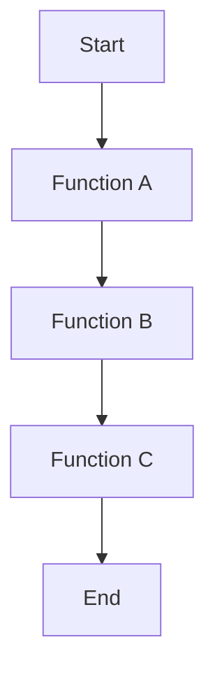

## 3.15 Profiling and Performance Monitoring Tools

In the world of software development, performance is a critical aspect that can make or break an application. Erlang, known for its concurrency and fault tolerance, offers several tools to help developers profile and monitor the performance of their applications. In this section, we will explore the importance of profiling, delve into the tools available in Erlang such as `fprof`, `eprof`, and `percept`, and provide strategies for optimizing your code based on profiling data.

### The Importance of Profiling in Performance Optimization

Profiling is the process of measuring the space (memory) and time complexity of a program, identifying parts of the code that are consuming the most resources. It is crucial for:

- **Identifying Bottlenecks**: Profiling helps pinpoint the exact functions or processes that are slowing down your application.
- **Improving Efficiency**: By understanding where the most resources are consumed, you can optimize those areas to improve overall performance.
- **Ensuring Scalability**: Profiling ensures that your application can handle increased loads without degradation in performance.
- **Maintaining Code Quality**: Regular profiling helps maintain efficient code as the application evolves.

### Profiling Tools in Erlang

Erlang provides several tools for profiling and performance monitoring, each with its unique features and use cases. Let's explore the most commonly used tools: `fprof`, `eprof`, and `percept`.

#### fprof: Function Call Profiling

`fprof` is a powerful tool for profiling function calls in Erlang applications. It provides detailed information about the time spent in each function, helping you identify bottlenecks.

**How to Use fprof**

1. **Start Profiling**: Begin by starting the profiler and specifying the function you want to profile.

   ```erlang
   fprof:apply(Mod, Fun, Args).
   ```

   Here, `Mod` is the module, `Fun` is the function, and `Args` are the arguments to the function.

2. **Analyze Results**: Once profiling is complete, analyze the results to identify bottlenecks.

   ```erlang
   fprof:analyse([totals]).
   ```

3. **Interpret Results**: The results will show the time spent in each function, helping you identify which functions are consuming the most resources.

**Example**

```erlang
-module(example).
-export([run/0]).

run() ->
    fprof:apply(example, slow_function, []),
    fprof:analyse([totals]).

slow_function() ->
    timer:sleep(1000),
    io:format("This is a slow function~n").
```

**Interpreting Results**

The output will show the time spent in `slow_function`, allowing you to see the impact of the `timer:sleep/1` call.

#### eprof: Time Profiling

`eprof` is another profiling tool that focuses on time profiling, providing insights into how much time is spent in each process.

**How to Use eprof**

1. **Start Profiling**: Start the profiler and specify the processes you want to profile.

   ```erlang
   eprof:start(),
   eprof:profile(fun_to_profile).
   ```

2. **Stop and Analyze**: Stop the profiler and analyze the results.

   ```erlang
   eprof:stop(),
   eprof:analyze().
   ```

**Example**

```erlang
-module(example).
-export([run/0]).

run() ->
    eprof:start(),
    eprof:profile(fun_to_profile),
    eprof:stop(),
    eprof:analyze().

fun_to_profile() ->
    timer:sleep(500),
    io:format("Profiling with eprof~n").
```

**Interpreting Results**

The analysis will show the time distribution across different processes, helping you identify which processes are taking the most time.

#### percept: Concurrency Profiling

`percept` is a concurrency profiling tool that provides insights into the concurrency behavior of your application, helping you understand how processes interact.

**How to Use percept**

1. **Start Profiling**: Start the percept profiler.

   ```erlang
   percept:start().
   ```

2. **Run Your Application**: Execute the application you want to profile.

3. **Stop and Analyze**: Stop the profiler and generate a report.

   ```erlang
   percept:stop(),
   percept:analyze().
   ```

**Example**

```erlang
-module(example).
-export([run/0]).

run() ->
    percept:start(),
    spawn(fun_to_profile),
    percept:stop(),
    percept:analyze().

fun_to_profile() ->
    timer:sleep(300),
    io:format("Concurrency profiling with percept~n").
```

**Interpreting Results**

The report will provide a visual representation of process interactions, helping you understand concurrency patterns.

### Strategies for Optimizing Code Based on Profiling Data

Once you have profiled your application and identified bottlenecks, the next step is optimization. Here are some strategies:

- **Optimize Hotspots**: Focus on optimizing functions or processes that consume the most resources.
- **Refactor Code**: Simplify complex code structures to improve efficiency.
- **Use Efficient Data Structures**: Choose data structures that offer better performance for your use case.
- **Parallelize Workloads**: Distribute workloads across multiple processes to take advantage of Erlang's concurrency model.
- **Cache Results**: Cache expensive computations to avoid redundant calculations.

### Encouraging Periodic Profiling

Profiling should not be a one-time activity. As your application evolves, new bottlenecks may emerge. Regular profiling helps maintain efficient code and ensures that your application performs optimally under different conditions.

### Visualizing Profiling Data

To better understand the profiling data, visual representations can be incredibly helpful. Below is a simple example of how you might visualize the call graph of a function using Mermaid.js.



**Description**: This diagram represents a simple call graph where `Function A` calls `Function B`, which in turn calls `Function C`.

### References and Further Reading

- [Erlang Documentation on fprof](https://erlang.org/doc/man/fprof.html)
- [Erlang Documentation on eprof](https://erlang.org/doc/man/eprof.html)
- [Erlang Documentation on percept](https://erlang.org/doc/man/percept.html)

### Knowledge Check

To reinforce your understanding, consider the following questions:

- What are the main differences between `fprof`, `eprof`, and `percept`?
- How can you interpret the results from `fprof` to identify bottlenecks?
- What strategies can you employ to optimize code based on profiling data?

### Embrace the Journey

Remember, profiling is an ongoing process. As you continue to develop and optimize your Erlang applications, keep experimenting with different profiling tools and techniques. Stay curious, and enjoy the journey of making your applications more efficient and scalable!

## Quiz: Profiling and Performance Monitoring Tools



### What is the primary purpose of profiling in Erlang?

- [x] To identify performance bottlenecks
- [ ] To write more code
- [ ] To debug syntax errors
- [ ] To enhance security

> **Explanation:** Profiling helps identify parts of the code that consume the most resources, allowing developers to optimize performance.

### Which tool is used for function call profiling in Erlang?

- [x] fprof
- [ ] eprof
- [ ] percept
- [ ] dialyzer

> **Explanation:** `fprof` is used for profiling function calls, providing detailed information about time spent in each function.

### How do you start profiling with eprof?

- [x] eprof:start()
- [ ] fprof:apply()
- [ ] percept:start()
- [ ] eprof:analyze()

> **Explanation:** `eprof:start()` is used to initiate profiling with `eprof`.

### What does percept primarily focus on?

- [x] Concurrency profiling
- [ ] Memory usage
- [ ] Syntax checking
- [ ] Code formatting

> **Explanation:** `percept` is used for concurrency profiling, providing insights into process interactions.

### Which of the following is a strategy for optimizing code based on profiling data?

- [x] Refactor code
- [ ] Ignore bottlenecks
- [ ] Add more processes
- [ ] Increase memory usage

> **Explanation:** Refactoring code is a common strategy to improve efficiency based on profiling data.

### What is the benefit of using efficient data structures in Erlang?

- [x] Improved performance
- [ ] Increased code complexity
- [ ] More memory usage
- [ ] Slower execution

> **Explanation:** Efficient data structures can significantly enhance performance by reducing time complexity.

### How often should you profile your Erlang application?

- [x] Periodically
- [ ] Only once
- [ ] Never
- [ ] Only when errors occur

> **Explanation:** Regular profiling helps maintain efficient code and ensures optimal performance as the application evolves.

### What is a common outcome of profiling an application?

- [x] Identification of resource-heavy functions
- [ ] More syntax errors
- [ ] Increased code size
- [ ] Reduced functionality

> **Explanation:** Profiling helps identify functions or processes that consume the most resources, allowing for targeted optimization.

### Which tool provides a visual representation of process interactions?

- [x] percept
- [ ] fprof
- [ ] eprof
- [ ] dialyzer

> **Explanation:** `percept` provides a visual representation of concurrency patterns and process interactions.

### True or False: Profiling is only necessary for large applications.

- [ ] True
- [x] False

> **Explanation:** Profiling is beneficial for applications of all sizes to ensure efficient resource usage and optimal performance.


