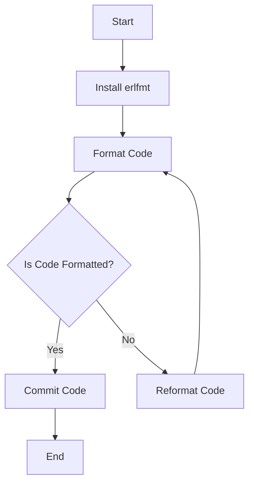

## 3.16 Formatting Erlang Code with `erlfmt`

In the world of software development, maintaining a consistent code style is crucial for readability, maintainability, and collaboration. This is especially true in Erlang, where the functional and concurrent paradigms can introduce complexity. In this section, we will explore the importance of code formatting and how `erlfmt`, a code formatter for Erlang, can help ensure a consistent style across your codebase.

### Why Code Formatting Matters

Code formatting is more than just aesthetics; it is about creating a common language for developers to communicate effectively. Here are some reasons why code formatting is essential:

- **Readability**: Consistent formatting makes code easier to read and understand, reducing cognitive load.
- **Maintainability**: Well-formatted code is easier to maintain and modify, as developers can quickly grasp the structure and flow.
- **Collaboration**: A uniform code style minimizes friction among team members, as everyone adheres to the same conventions.
- **Error Reduction**: Consistent formatting can help prevent errors by making it easier to spot anomalies or mistakes in the code.
- **Tooling and Automation**: Automated tools can enforce code style rules, reducing the need for manual code reviews focused on style issues.

### Introducing `erlfmt`

[`erlfmt`](https://github.com/WhatsApp/erlfmt) is an open-source code formatter for Erlang, developed by WhatsApp. It aims to provide a consistent and automated way to format Erlang code, adhering to a set of predefined style rules. By using `erlfmt`, you can ensure that your codebase maintains a uniform style, regardless of individual developer preferences.

### Installing `erlfmt`

To start using `erlfmt`, you need to install it on your system. Follow these steps to install `erlfmt`:

1. **Clone the Repository**: Begin by cloning the `erlfmt` repository from GitHub.

   ```bash
   git clone https://github.com/WhatsApp/erlfmt.git
   ```

2. **Build the Project**: Navigate to the cloned directory and build the project using `rebar3`.

   ```bash
   cd erlfmt
   rebar3 escriptize
   ```

3. **Add to PATH**: Add the `erlfmt` executable to your system's PATH for easy access.

   ```bash
   export PATH=$PATH:$(pwd)/_build/default/bin
   ```

### Using `erlfmt`

Once installed, you can use `erlfmt` to format your Erlang code. Here are some basic commands to get you started:

- **Format a Single File**: To format a single Erlang file, use the following command:

  ```bash
  erlfmt format path/to/your_file.erl
  ```

- **Format an Entire Directory**: To format all Erlang files in a directory, use:

  ```bash
  erlfmt format path/to/your_directory
  ```

- **Check Formatting**: To check if a file is already formatted according to `erlfmt` rules, use:

  ```bash
  erlfmt check path/to/your_file.erl
  ```

### Code Formatting Examples

Let's look at some examples of how `erlfmt` formats Erlang code. Consider the following unformatted code snippet:

```erlang
-module(example).
-export([start/0]).

start() -> io:format("Hello, world!~n").
```

After running `erlfmt`, the code is formatted as follows:

```erlang
-module(example).
-export([start/0]).

start() ->
    io:format("Hello, world!~n").
```

#### Key Formatting Changes

- **Indentation**: `erlfmt` enforces consistent indentation, making the code structure clear.
- **Whitespace**: It manages whitespace around operators and between expressions for better readability.
- **Line Breaks**: It ensures appropriate line breaks to avoid overly long lines, improving readability.

### Integrating `erlfmt` into Development Workflows

To maximize the benefits of `erlfmt`, integrate it into your development workflow. Here are some strategies:

- **Pre-Commit Hooks**: Use Git hooks to automatically format code before commits. This ensures that all code in the repository adheres to the style guide.
  
  ```bash
  # .git/hooks/pre-commit
  erlfmt format path/to/your_directory
  ```

- **Continuous Integration (CI)**: Incorporate `erlfmt` checks into your CI pipeline to enforce code style consistency across all branches.

  ```yaml
  # Example CI configuration
  steps:
    - name: Check Code Formatting
      run: erlfmt check path/to/your_directory
  ```

- **Editor Integration**: Configure your code editor to automatically format Erlang files on save. Most modern editors support integration with external formatters.

### Encouraging Team Adoption

For `erlfmt` to be effective, it should be adopted by the entire team. Here are some tips to encourage team-wide adoption:

- **Documentation**: Provide clear documentation on how to install and use `erlfmt`, including any custom configurations.
- **Training**: Conduct workshops or training sessions to familiarize team members with `erlfmt` and its benefits.
- **Feedback**: Encourage feedback from the team to address any concerns or issues with the formatter.
- **Consistency**: Highlight the importance of consistency in code style for collaboration and maintainability.

### Try It Yourself

To get hands-on experience with `erlfmt`, try formatting some of your existing Erlang code. Experiment with different configurations and observe how `erlfmt` transforms your code. Consider modifying the code examples provided and see how `erlfmt` handles various scenarios.

### Visualizing Code Formatting with `erlfmt`

To better understand how `erlfmt` affects code formatting, let's visualize the process using a flowchart. This diagram illustrates the steps involved in formatting Erlang code with `erlfmt`.



**Figure 1**: The process of formatting Erlang code with `erlfmt`.

### References and Links

For further reading and resources on `erlfmt` and code formatting in Erlang, consider the following links:

- [erlfmt GitHub Repository](https://github.com/WhatsApp/erlfmt)
- [Erlang Programming Language](https://www.erlang.org/)
- [Rebar3 Build Tool](https://rebar3.org/)

### Knowledge Check

To reinforce your understanding of `erlfmt` and its role in code formatting, consider the following questions:

- Why is consistent code formatting important in a collaborative environment?
- How can `erlfmt` be integrated into a CI/CD pipeline?
- What are some common formatting changes made by `erlfmt`?

### Embrace the Journey

Remember, adopting a consistent code style is just the beginning. As you continue to work with Erlang, you'll find that tools like `erlfmt` not only improve your code's readability but also enhance your team's productivity. Keep experimenting, stay curious, and enjoy the journey of writing clean and maintainable Erlang code!

## Quiz: Formatting Erlang Code with `erlfmt`



### What is the primary purpose of `erlfmt`?

- [x] To ensure consistent code formatting in Erlang projects
- [ ] To compile Erlang code
- [ ] To debug Erlang applications
- [ ] To manage Erlang dependencies

> **Explanation:** `erlfmt` is a tool designed to format Erlang code consistently across a codebase.

### How can you install `erlfmt`?

- [x] Clone the repository and build with `rebar3`
- [ ] Download a binary from the official website
- [ ] Use a package manager like `apt` or `yum`
- [ ] Install it via `npm`

> **Explanation:** `erlfmt` is installed by cloning its GitHub repository and building it using `rebar3`.

### Which command formats an entire directory with `erlfmt`?

- [x] `erlfmt format path/to/your_directory`
- [ ] `erlfmt check path/to/your_directory`
- [ ] `erlfmt compile path/to/your_directory`
- [ ] `erlfmt run path/to/your_directory`

> **Explanation:** The `format` command is used to format all Erlang files in a specified directory.

### What is a benefit of using `erlfmt` in a team setting?

- [x] It ensures all team members adhere to the same code style
- [ ] It speeds up code compilation
- [ ] It automatically fixes all code bugs
- [ ] It manages project dependencies

> **Explanation:** `erlfmt` helps maintain a consistent code style, which is crucial for team collaboration.

### How can `erlfmt` be integrated into a CI pipeline?

- [x] By adding a step to check code formatting
- [ ] By using it to deploy applications
- [ ] By compiling code with it
- [ ] By using it to monitor application performance

> **Explanation:** `erlfmt` can be used in CI pipelines to enforce code style consistency by checking formatting.

### What does `erlfmt` do to whitespace in code?

- [x] It manages whitespace for better readability
- [ ] It removes all whitespace
- [ ] It adds extra whitespace for emphasis
- [ ] It ignores whitespace

> **Explanation:** `erlfmt` adjusts whitespace to improve code readability and consistency.

### Which of the following is a key feature of `erlfmt`?

- [x] Automated code formatting
- [ ] Code compilation
- [ ] Dependency management
- [ ] Debugging support

> **Explanation:** `erlfmt` is primarily used for automated code formatting in Erlang.

### What is a common practice when using `erlfmt` in version control?

- [x] Use pre-commit hooks to format code before commits
- [ ] Use it to merge branches
- [ ] Use it to create pull requests
- [ ] Use it to delete branches

> **Explanation:** Pre-commit hooks can automatically format code, ensuring consistency before code is committed.

### Can `erlfmt` be configured to format code on save in editors?

- [x] True
- [ ] False

> **Explanation:** Many modern editors can be configured to run `erlfmt` automatically when saving Erlang files.

### What is the benefit of visualizing the `erlfmt` process with a flowchart?

- [x] It helps understand the steps involved in code formatting
- [ ] It speeds up the formatting process
- [ ] It compiles the code faster
- [ ] It manages dependencies more effectively

> **Explanation:** Visualizing the process with a flowchart can clarify the steps and improve understanding.


