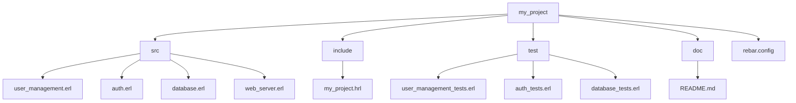

## 3.17 Best Practices in Code Organization

In the world of software development, especially when working with a language like Erlang, organizing your code effectively is crucial. Proper code organization not only enhances readability and maintainability but also facilitates collaboration among team members. In this section, we will explore best practices for organizing Erlang code, focusing on logical grouping of modules and functions, separating concerns, modularity, effective directory structures, naming conventions, and the impact of organization on collaboration.

### Logical Grouping of Modules and Functions

**Explain the Concept**: In Erlang, a module is a collection of functions that are logically related. Grouping functions into modules based on their functionality is a fundamental practice. This approach helps in maintaining a clean and understandable codebase.

**Provide Examples**: Consider an application that handles user management and authentication. You might have separate modules like `user_management` and `auth`. Each module should contain functions relevant to its purpose.

```erlang
-module(user_management).
-export([create_user/1, delete_user/1, update_user/2]).

create_user(UserData) ->
    % Logic to create a user
    ok.

delete_user(UserId) ->
    % Logic to delete a user
    ok.

update_user(UserId, NewData) ->
    % Logic to update user information
    ok.
```

```erlang
-module(auth).
-export([login/2, logout/1, check_permissions/2]).

login(Username, Password) ->
    % Logic to authenticate user
    ok.

logout(UserId) ->
    % Logic to log out user
    ok.

check_permissions(UserId, Resource) ->
    % Logic to check user permissions
    ok.
```

**Highlight Key Points**: By organizing functions into modules based on their functionality, you make it easier for developers to find and understand the code. It also simplifies testing and debugging.

### Importance of Separating Concerns and Modularity

**Explain the Concept**: Separating concerns is a design principle for separating a computer program into distinct sections, such that each section addresses a separate concern. Modularity refers to the degree to which a system's components may be separated and recombined.

**Discuss Benefits**: Separating concerns and ensuring modularity in your codebase leads to:

- **Improved Maintainability**: Changes in one module do not affect others.
- **Reusability**: Modules can be reused across different projects.
- **Scalability**: Easier to scale the application by adding new modules.

**Provide Examples**: In a web application, you might separate concerns into modules like `database`, `web_server`, and `business_logic`.

```erlang
-module(database).
-export([connect/0, disconnect/0, query/1]).

connect() ->
    % Logic to connect to the database
    ok.

disconnect() ->
    % Logic to disconnect from the database
    ok.

query(Sql) ->
    % Logic to execute a query
    ok.
```

```erlang
-module(web_server).
-export([start/0, stop/0, handle_request/1]).

start() ->
    % Logic to start the web server
    ok.

stop() ->
    % Logic to stop the web server
    ok.

handle_request(Request) ->
    % Logic to handle incoming requests
    ok.
```

**Highlight Key Points**: By separating concerns, you can focus on one aspect of the application at a time, making it easier to manage complexity.

### Effective Directory Structures

**Explain the Concept**: A well-organized directory structure is essential for maintaining a clean and efficient codebase. It helps developers navigate the project easily and understand the relationships between different components.

**Provide Examples**: Here is an example of an effective directory structure for an Erlang project:

```
my_project/
│
├── src/
│   ├── user_management.erl
│   ├── auth.erl
│   ├── database.erl
│   └── web_server.erl
│
├── include/
│   └── my_project.hrl
│
├── test/
│   ├── user_management_tests.erl
│   ├── auth_tests.erl
│   └── database_tests.erl
│
├── doc/
│   └── README.md
│
└── rebar.config
```

**Discuss Each Section**:

- **src/**: Contains all the source code files.
- **include/**: Contains header files, which are used to define macros and record definitions.
- **test/**: Contains test files for different modules.
- **doc/**: Contains documentation files.
- **rebar.config**: Configuration file for the build tool Rebar3.

**Highlight Key Points**: A clear directory structure helps in organizing code logically, making it easier to manage and navigate.

### Naming Conventions and File Organization

**Explain the Concept**: Consistent naming conventions and file organization are crucial for a maintainable codebase. They help in understanding the purpose of a module or function at a glance.

**Provide Guidelines**:

- **Modules**: Use lowercase letters and underscores to separate words (e.g., `user_management`).
- **Functions**: Use descriptive names that convey the function's purpose (e.g., `create_user`).
- **Variables**: Use camelCase for variables (e.g., `userId`).

**Provide Examples**: Consider the following naming conventions:

```erlang
-module(user_management).
-export([create_user/1, delete_user/1, update_user/2]).

create_user(UserData) ->
    % Logic to create a user
    ok.

delete_user(UserId) ->
    % Logic to delete a user
    ok.

update_user(UserId, NewData) ->
    % Logic to update user information
    ok.
```

**Highlight Key Points**: Consistent naming conventions make the code more readable and understandable, reducing the cognitive load on developers.

### Impact of Organization on Collaboration

**Explain the Concept**: A well-organized codebase facilitates collaboration among team members. It allows developers to work on different parts of the codebase without stepping on each other's toes.

**Discuss Benefits**:

- **Ease of Onboarding**: New developers can quickly understand the codebase.
- **Parallel Development**: Multiple developers can work on different modules simultaneously.
- **Reduced Conflicts**: Clear boundaries between modules reduce merge conflicts.

**Provide Examples**: Consider a scenario where multiple developers are working on a project. A well-organized codebase allows them to work independently on different modules, such as `user_management` and `auth`, without interfering with each other's work.

**Highlight Key Points**: Effective code organization is crucial for team collaboration, especially in large projects with multiple developers.

### Try It Yourself

Encourage experimentation by suggesting modifications to the code examples. For instance, try adding a new function to the `user_management` module or reorganizing the directory structure to include a new feature.

### Visualizing Code Organization

To better understand the organization of an Erlang project, let's visualize the directory structure using a Mermaid.js diagram.



**Diagram Description**: This diagram represents the directory structure of an Erlang project, showing the relationships between different components.

### References and Links

- [Erlang Documentation](https://www.erlang.org/docs)
- [Rebar3 User Guide](https://rebar3.org/docs)

### Knowledge Check

- **Question**: Why is it important to separate concerns in your codebase?
- **Exercise**: Create a new module in an existing Erlang project and organize it following the best practices discussed.

### Embrace the Journey

Remember, organizing your code effectively is just the beginning. As you progress, you'll find more ways to improve your codebase. Keep experimenting, stay curious, and enjoy the journey!

### Summary

In this section, we explored best practices for organizing Erlang code, focusing on logical grouping of modules and functions, separating concerns, modularity, effective directory structures, naming conventions, and the impact of organization on collaboration. By following these practices, you can create a maintainable and collaborative codebase.

## Quiz: Best Practices in Code Organization



### What is the primary benefit of grouping functions into modules based on functionality?

- [x] It enhances code readability and maintainability.
- [ ] It increases the execution speed of the program.
- [ ] It reduces the size of the codebase.
- [ ] It eliminates the need for documentation.

> **Explanation:** Grouping functions into modules based on functionality enhances code readability and maintainability by making it easier to find and understand the code.

### How does separating concerns improve a codebase?

- [x] It improves maintainability and reusability.
- [ ] It increases the complexity of the code.
- [ ] It makes debugging more difficult.
- [ ] It reduces the need for testing.

> **Explanation:** Separating concerns improves maintainability and reusability by allowing changes in one module without affecting others.

### What is a key advantage of a well-organized directory structure?

- [x] It helps developers navigate the project easily.
- [ ] It increases the execution speed of the program.
- [ ] It reduces the number of files in the project.
- [ ] It eliminates the need for comments in the code.

> **Explanation:** A well-organized directory structure helps developers navigate the project easily and understand the relationships between different components.

### Which naming convention is recommended for Erlang modules?

- [x] Use lowercase letters and underscores to separate words.
- [ ] Use camelCase for module names.
- [ ] Use uppercase letters for module names.
- [ ] Use numbers to differentiate module names.

> **Explanation:** In Erlang, it is recommended to use lowercase letters and underscores to separate words in module names for consistency and readability.

### How does effective code organization impact collaboration?

- [x] It facilitates collaboration by allowing parallel development.
- [ ] It increases the likelihood of merge conflicts.
- [ ] It makes it difficult for new developers to understand the codebase.
- [ ] It reduces the need for communication among team members.

> **Explanation:** Effective code organization facilitates collaboration by allowing multiple developers to work on different modules simultaneously, reducing conflicts.

### What is the purpose of the `include/` directory in an Erlang project?

- [x] To store header files with macros and record definitions.
- [ ] To store compiled binaries of the project.
- [ ] To store test cases for the project.
- [ ] To store documentation files.

> **Explanation:** The `include/` directory is used to store header files, which contain macros and record definitions used across the project.

### Why is it important to use descriptive names for functions?

- [x] It makes the code more readable and understandable.
- [ ] It increases the execution speed of the program.
- [ ] It reduces the number of lines of code.
- [ ] It eliminates the need for comments.

> **Explanation:** Using descriptive names for functions makes the code more readable and understandable, reducing the cognitive load on developers.

### What is a benefit of using consistent naming conventions?

- [x] It enhances code readability and maintainability.
- [ ] It increases the execution speed of the program.
- [ ] It reduces the size of the codebase.
- [ ] It eliminates the need for documentation.

> **Explanation:** Consistent naming conventions enhance code readability and maintainability by making it easier to understand the purpose of a module or function at a glance.

### Which of the following is a recommended practice for organizing Erlang code?

- [x] Group functions into modules based on their functionality.
- [ ] Use a flat directory structure with all files in a single folder.
- [ ] Avoid using comments in the code.
- [ ] Use random names for modules and functions.

> **Explanation:** Grouping functions into modules based on their functionality is a recommended practice for organizing Erlang code to enhance readability and maintainability.

### True or False: A well-organized codebase can reduce the cognitive load on developers.

- [x] True
- [ ] False

> **Explanation:** A well-organized codebase can reduce the cognitive load on developers by making it easier to find and understand the code.


