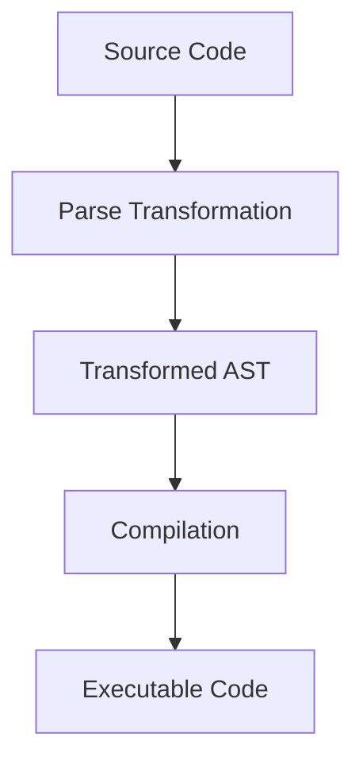

## 3.18 Advanced Macros and Metaprogramming

In this section, we delve into the advanced features of macros and metaprogramming in Erlang. These powerful tools allow developers to create abstractions and manipulate code in ways that can significantly enhance flexibility and expressiveness. However, they come with their own set of challenges and risks, which we will also explore.

### Understanding Macros in Erlang

Macros in Erlang are a way to define reusable code snippets that can be inserted into your program. They are similar to macros in C, allowing you to define constants or functions that are expanded at compile time.

#### Basic Macros

Before diving into advanced macros, let's quickly review basic macros. A simple macro in Erlang is defined using the `-define` directive:

```erlang
-define(PI, 3.14159).
```

This macro can be used in your code as follows:

```erlang
Area = ?PI * Radius * Radius.
```

#### Advanced Macro Features

Advanced macros in Erlang can include macro functions, which allow for parameterized code snippets. This is particularly useful for creating more dynamic and flexible code.

```erlang
-define(SQUARE(X), (X) * (X)).
```

In this example, `?SQUARE(4)` would expand to `(4) * (4)`.

### Metaprogramming with Parse Transformations

Metaprogramming in Erlang is primarily achieved through parse transformations. This technique allows you to manipulate the abstract syntax tree (AST) of your code during compilation, enabling powerful code transformations and optimizations.

#### What are Parse Transformations?

Parse transformations are modules that transform the abstract syntax tree of Erlang code before it is compiled. This allows you to modify the code structure, add new constructs, or optimize existing ones.

#### Creating a Parse Transformation

To create a parse transformation, you need to define a module that implements the `parse_transform/2` function. This function takes the form and options as arguments and returns the transformed form.

```erlang
-module(my_transform).
-export([parse_transform/2]).

parse_transform(Forms, _Options) ->
    %% Transform the AST here
    TransformedForms = lists:map(fun transform_form/1, Forms),
    TransformedForms.

transform_form(Form) ->
    %% Example transformation logic
    Form.
```

### Example: Adding Logging to Functions

Let's create a parse transformation that automatically adds logging to all function calls in a module.

```erlang
-module(logging_transform).
-export([parse_transform/2]).

parse_transform(Forms, _Options) ->
    lists:map(fun add_logging/1, Forms).

add_logging({function, Line, Name, Arity, Clauses}) ->
    {function, Line, Name, Arity, lists:map(fun add_logging_to_clause/1, Clauses)};
add_logging(Other) ->
    Other.

add_logging_to_clause({clause, Line, Patterns, Guards, Body}) ->
    NewBody = [{call, Line, {remote, Line, {atom, Line, io}, {atom, Line, format}}, [{string, Line, "Calling ~p with ~p~n"}, [{atom, Line, Name}, {tuple, Line, Patterns}]]} | Body],
    {clause, Line, Patterns, Guards, NewBody}.
```

### Benefits and Risks of Metaprogramming

#### Benefits

1. **Code Reusability**: Macros and parse transformations allow for code reuse and abstraction, reducing duplication.
2. **Performance Optimization**: By transforming code at compile time, you can optimize performance-critical sections.
3. **Enhanced Flexibility**: Metaprogramming provides the ability to introduce new language constructs or modify existing ones.

#### Risks

1. **Complexity**: Metaprogramming can introduce significant complexity, making code harder to read and maintain.
2. **Debugging Challenges**: Errors in macros or parse transformations can be difficult to trace and debug.
3. **Portability Issues**: Code that relies heavily on metaprogramming may be less portable across different environments or Erlang versions.

### Best Practices for Using Macros and Metaprogramming

1. **Use Sparingly**: Only use macros and metaprogramming when necessary. Overuse can lead to code that is difficult to understand and maintain.
2. **Document Thoroughly**: Ensure that any macros or transformations are well-documented, explaining their purpose and usage.
3. **Test Extensively**: Thoroughly test any code that uses metaprogramming to ensure it behaves as expected.
4. **Keep It Simple**: Aim for simplicity in your transformations. Avoid overly complex logic that can obscure the code's intent.

### Try It Yourself

Experiment with the provided parse transformation example by modifying it to log the return values of functions as well. Consider how you might extend this transformation to include additional logging features or apply it selectively to certain functions.

### Visualizing Parse Transformations

To better understand how parse transformations work, let's visualize the process using a flowchart.



**Caption**: This diagram illustrates the flow of Erlang code through a parse transformation, resulting in transformed abstract syntax trees that are then compiled into executable code.

### Knowledge Check

- What are the primary benefits of using macros in Erlang?
- How do parse transformations differ from traditional macros?
- What are some potential risks associated with metaprogramming?

### Summary

In this section, we've explored the advanced features of macros and metaprogramming in Erlang. By understanding and applying these techniques, you can create powerful abstractions and optimizations in your code. However, it's crucial to use these tools judiciously to avoid unnecessary complexity and maintainability issues.

Remember, this is just the beginning. As you progress, you'll discover even more ways to leverage Erlang's capabilities to build robust and scalable applications. Keep experimenting, stay curious, and enjoy the journey!

## Quiz: Advanced Macros and Metaprogramming



### What is a primary benefit of using macros in Erlang?

- [x] Code reusability
- [ ] Increased runtime performance
- [ ] Simplified debugging
- [ ] Enhanced portability

> **Explanation:** Macros allow for code reuse and abstraction, reducing duplication.

### How do parse transformations differ from traditional macros?

- [x] They operate on the abstract syntax tree
- [ ] They are evaluated at runtime
- [ ] They are simpler to implement
- [ ] They are more portable

> **Explanation:** Parse transformations manipulate the abstract syntax tree during compilation, unlike traditional macros which are simple text replacements.

### What is a potential risk of using metaprogramming?

- [x] Increased code complexity
- [ ] Improved readability
- [ ] Enhanced portability
- [ ] Simplified debugging

> **Explanation:** Metaprogramming can introduce significant complexity, making code harder to read and maintain.

### What function must a parse transformation module implement?

- [x] parse_transform/2
- [ ] transform/1
- [ ] parse/1
- [ ] transform_ast/2

> **Explanation:** The `parse_transform/2` function is required for a parse transformation module.

### What should be included in the documentation of macros and transformations?

- [x] Purpose and usage
- [ ] Compiler version
- [ ] Author's name
- [ ] Execution time

> **Explanation:** Thorough documentation should explain the purpose and usage of macros and transformations.

### What is a recommended practice when using metaprogramming?

- [x] Use sparingly
- [ ] Use extensively
- [ ] Avoid testing
- [ ] Ignore documentation

> **Explanation:** Metaprogramming should be used sparingly to avoid unnecessary complexity.

### What is a common use case for parse transformations?

- [x] Code optimization
- [ ] Runtime error handling
- [ ] Memory management
- [ ] User interface design

> **Explanation:** Parse transformations can optimize performance-critical sections of code.

### What is an example of an advanced macro feature?

- [x] Macro functions
- [ ] Inline comments
- [ ] Runtime evaluation
- [ ] Dynamic typing

> **Explanation:** Macro functions allow for parameterized code snippets, providing more flexibility.

### What is a key difference between macros and parse transformations?

- [x] Macros are expanded at compile time, while parse transformations modify the AST
- [ ] Macros are evaluated at runtime, while parse transformations are not
- [ ] Macros are simpler to implement than parse transformations
- [ ] Macros are more portable than parse transformations

> **Explanation:** Macros are expanded at compile time, whereas parse transformations modify the abstract syntax tree.

### True or False: Metaprogramming can simplify debugging.

- [ ] True
- [x] False

> **Explanation:** Metaprogramming can complicate debugging due to the complexity it introduces.




