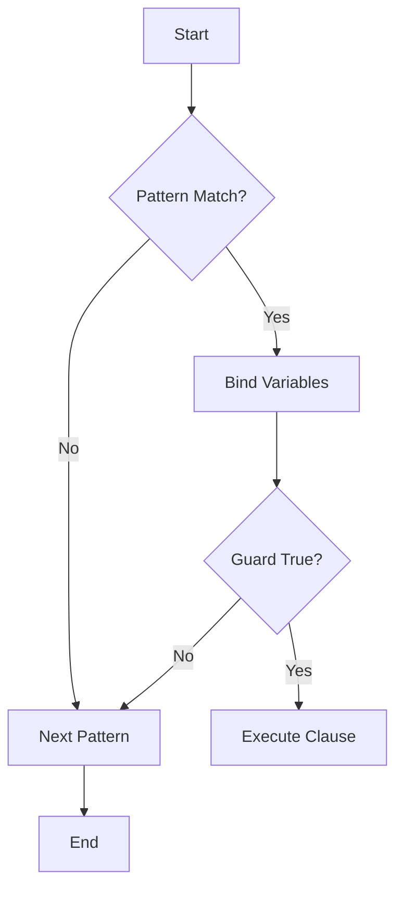

## 3.2 Pattern Matching and Guards in Depth

Pattern matching and guards are fundamental features in Erlang that enable developers to write expressive, concise, and efficient code. In this section, we delve into the intricacies of pattern matching and guards, exploring advanced techniques and best practices that will enhance your Erlang programming skills.

### Introduction to Pattern Matching

Pattern matching is a powerful mechanism in Erlang that allows you to destructure data structures and bind variables to values in a concise manner. It is used extensively in function definitions, case expressions, and receive blocks. Let's start by examining the basics and then move on to more complex patterns.

#### Basic Pattern Matching

In its simplest form, pattern matching involves matching a value against a pattern. If the value fits the pattern, the match succeeds, and any variables in the pattern are bound to corresponding parts of the value.

```erlang
% Basic pattern matching in a function clause
factorial(0) -> 1;
factorial(N) when N > 0 -> N * factorial(N - 1).

% Pattern matching in a case expression
case {ok, Value} of
    {ok, V} -> io:format("Value: ~p~n", [V]);
    {error, Reason} -> io:format("Error: ~p~n", [Reason])
end.
```

In the above examples, we see pattern matching in function clauses and case expressions. The pattern `{ok, V}` matches a tuple with two elements where the first element is the atom `ok`.

### Advanced Pattern Matching

As you become more comfortable with basic pattern matching, you can start using more complex patterns to match nested data structures and use pattern matching in more sophisticated ways.

#### Matching Nested Structures

Erlang allows you to match nested structures directly, which can simplify your code significantly.

```erlang
% Matching nested tuples
handle_message({message, {user, Name}, Content}) ->
    io:format("Message from ~s: ~s~n", [Name, Content]).

% Matching lists with specific elements
process_list([H | T]) ->
    io:format("Head: ~p, Tail: ~p~n", [H, T]).
```

In the first example, we match a nested tuple structure directly in the function head. In the second example, we use pattern matching to deconstruct a list into its head and tail.

#### Using Pattern Matching in Maps

Erlang's maps provide a flexible way to store key-value pairs, and pattern matching can be used to extract values from maps.

```erlang
% Pattern matching with maps
extract_user_info(#{name := Name, age := Age}) ->
    io:format("Name: ~s, Age: ~p~n", [Name, Age]).
```

Here, we use pattern matching to extract the `name` and `age` fields from a map. This approach is both concise and expressive.

### Introduction to Guards

Guards are additional conditions that can be used in conjunction with pattern matching to further refine the selection of function clauses or case branches. They are specified using the `when` keyword.

#### Basic Guard Expressions

Guards allow you to specify conditions that must be true for a pattern match to succeed. They are often used to enforce constraints on the values being matched.

```erlang
% Using guards in function clauses
is_even(N) when N rem 2 == 0 -> true;
is_even(_) -> false.

% Guards in case expressions
case X of
    Y when Y > 0 -> io:format("Positive~n");
    Y when Y < 0 -> io:format("Negative~n");
    _ -> io:format("Zero~n")
end.
```

In these examples, guards are used to check whether a number is even and to determine if a number is positive, negative, or zero.

### Advanced Guard Techniques

Erlang supports a variety of guard expressions, including comparisons, arithmetic operations, and type tests. Understanding these can help you write more precise and efficient code.

#### Combining Guards

You can combine multiple guard expressions using logical operators such as `and`, `or`, and `not`.

```erlang
% Combining guards with logical operators
is_valid_age(Age) when Age >= 0, Age =< 120 -> true;
is_valid_age(_) -> false.
```

In this example, we combine two conditions to ensure that an age is within a valid range.

#### Using Type Tests in Guards

Erlang provides built-in type tests that can be used in guards to check the type of a value.

```erlang
% Using type tests in guards
process_input(X) when is_integer(X) -> io:format("Integer: ~p~n", [X]);
process_input(X) when is_float(X) -> io:format("Float: ~p~n", [X]);
process_input(X) when is_atom(X) -> io:format("Atom: ~p~n", [X]).
```

Here, we use type tests to determine the type of the input and handle it accordingly.

### Common Pitfalls and Best Practices

While pattern matching and guards are powerful tools, there are some common pitfalls to be aware of. Let's explore these and discuss best practices to avoid them.

#### Avoiding Overly Complex Patterns

While it's tempting to use complex patterns to match deeply nested structures, this can make your code harder to read and maintain. Instead, consider breaking down complex patterns into simpler ones.

```erlang
% Avoid overly complex patterns
handle_data(Data) ->
    case Data of
        {ok, {user, Name, {address, City, Country}}} ->
            io:format("User: ~s, City: ~s, Country: ~s~n", [Name, City, Country]);
        _ ->
            io:format("Invalid data~n")
    end.
```

In this example, the pattern is quite complex. Consider simplifying it by breaking it into smaller parts.

#### Using Guards Effectively

Guards should be used to enforce constraints that cannot be expressed through pattern matching alone. Avoid using guards for conditions that can be checked with pattern matching.

```erlang
% Use guards for constraints, not pattern matching
process_number(N) when is_integer(N), N > 0 -> io:format("Positive integer~n");
process_number(N) when is_integer(N), N < 0 -> io:format("Negative integer~n");
process_number(_) -> io:format("Not an integer~n").
```

In this example, guards are used to enforce constraints on the value of `N`.

### Encouraging Effective Use of Pattern Matching

Pattern matching is a key feature of Erlang that can lead to more concise and expressive code. Here are some tips to make the most of it:

- **Use pattern matching in function heads**: This can simplify your code by eliminating the need for explicit condition checks.
- **Leverage pattern matching in case expressions**: This can make your code more readable by clearly expressing the different cases you are handling.
- **Combine pattern matching with guards**: Use guards to enforce additional constraints that cannot be expressed through pattern matching alone.

### Try It Yourself

To solidify your understanding of pattern matching and guards, try modifying the examples provided. Experiment with different patterns and guards to see how they affect the behavior of the code. Here are some suggestions:

- Modify the `factorial` function to handle negative numbers gracefully.
- Experiment with different guard expressions in the `is_even` function.
- Try using pattern matching to extract values from a more complex data structure, such as a nested list or map.

### Visualizing Pattern Matching and Guards

To better understand how pattern matching and guards work, let's visualize the process using a flowchart.



**Diagram Description**: This flowchart illustrates the process of pattern matching and guards in Erlang. The process starts with a pattern match. If the match is successful, variables are bound, and the guard is evaluated. If the guard is true, the clause is executed. If not, the next pattern is tried.

### References and Links

For further reading on pattern matching and guards in Erlang, consider the following resources:

- [Erlang Documentation on Pattern Matching](https://erlang.org/doc/reference_manual/patterns.html)
- [Erlang Documentation on Guards](https://erlang.org/doc/reference_manual/expressions.html#guards)

### Knowledge Check

To reinforce your understanding of pattern matching and guards, consider the following questions:

- What are the benefits of using pattern matching in function heads?
- How can guards be used to enforce constraints that cannot be expressed through pattern matching alone?
- What are some common pitfalls to avoid when using pattern matching and guards?

### Embrace the Journey

Remember, mastering pattern matching and guards is just the beginning of your journey with Erlang. As you continue to explore the language, you'll discover even more powerful features and techniques. Keep experimenting, stay curious, and enjoy the journey!

## Quiz: Pattern Matching and Guards in Depth



### What is the primary purpose of pattern matching in Erlang?

- [x] To destructure data and bind variables to values
- [ ] To perform arithmetic operations
- [ ] To manage process communication
- [ ] To handle exceptions

> **Explanation:** Pattern matching is used to destructure data structures and bind variables to values in Erlang.

### Which keyword is used to introduce guards in Erlang?

- [ ] if
- [ ] case
- [x] when
- [ ] match

> **Explanation:** The `when` keyword is used to introduce guards in Erlang.

### What is a common pitfall when using pattern matching?

- [ ] Using it in function heads
- [x] Creating overly complex patterns
- [ ] Combining it with guards
- [ ] Using it in case expressions

> **Explanation:** Creating overly complex patterns can make code harder to read and maintain.

### How can you combine multiple guard expressions?

- [ ] Using commas
- [x] Using logical operators like `and`, `or`
- [ ] Using semicolons
- [ ] Using colons

> **Explanation:** Multiple guard expressions can be combined using logical operators like `and` and `or`.

### What type of expressions can be used in guards?

- [x] Comparisons and type tests
- [ ] Only arithmetic operations
- [ ] Only string manipulations
- [ ] Only list operations

> **Explanation:** Guards can include comparisons, arithmetic operations, and type tests.

### What is the result of a failed pattern match?

- [ ] A warning
- [ ] A retry
- [x] A runtime error
- [ ] A silent failure

> **Explanation:** A failed pattern match results in a runtime error in Erlang.

### How can pattern matching improve code readability?

- [x] By clearly expressing the structure of data
- [ ] By adding more lines of code
- [ ] By using complex algorithms
- [ ] By avoiding function heads

> **Explanation:** Pattern matching improves code readability by clearly expressing the structure of data.

### What is the role of guards in pattern matching?

- [ ] To replace pattern matching
- [x] To enforce additional constraints
- [ ] To perform arithmetic operations
- [ ] To manage process communication

> **Explanation:** Guards are used to enforce additional constraints in pattern matching.

### Which of the following is a valid guard expression?

- [x] is_integer(X)
- [ ] X + Y
- [ ] io:format("Hello")
- [ ] {ok, Value}

> **Explanation:** `is_integer(X)` is a valid guard expression that checks if `X` is an integer.

### True or False: Guards can be used to replace pattern matching.

- [ ] True
- [x] False

> **Explanation:** Guards cannot replace pattern matching; they are used to enforce additional constraints.


