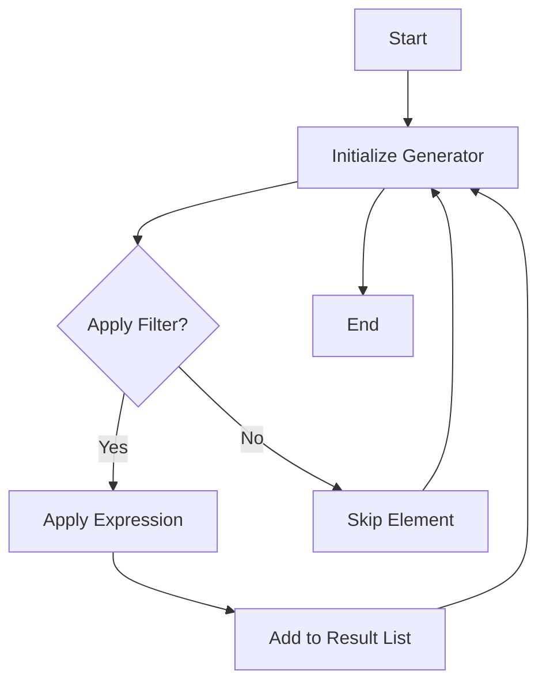

## 3.4 List Comprehensions and Generators

List comprehensions in Erlang offer a concise and expressive way to construct lists by specifying a pattern, a generator, and optional filters. This feature, borrowed from languages like Haskell, allows developers to write more readable and efficient code compared to traditional iterative constructs. In this section, we will delve into the syntax and semantics of list comprehensions, explore their practical applications, and understand how generators and filters enhance their functionality.

### Understanding List Comprehensions

List comprehensions are a syntactic construct that allows you to create lists based on existing lists. The basic syntax of a list comprehension in Erlang is:

```erlang
[Expression || Generator, Filter1, Filter2, ...]
```

- **Expression**: This is the value or transformation applied to each element of the list.
- **Generator**: Specifies the list from which elements are drawn.
- **Filters**: Optional conditions that elements must satisfy to be included in the resulting list.

#### Simple Example

Let's start with a simple example to illustrate the basic use of list comprehensions:

```erlang
% Double each number in the list
DoubledList = [X * 2 || X <- [1, 2, 3, 4, 5]].
% Result: [2, 4, 6, 8, 10]
```

In this example, `X <- [1, 2, 3, 4, 5]` is the generator, and `X * 2` is the expression applied to each element.

### Generators in List Comprehensions

Generators are the heart of list comprehensions. They define the source of elements for the comprehension. You can use multiple generators to iterate over multiple lists simultaneously.

#### Multiple Generators

Consider the following example with multiple generators:

```erlang
% Create pairs of elements from two lists
Pairs = [{X, Y} || X <- [1, 2], Y <- [a, b]].
% Result: [{1, a}, {1, b}, {2, a}, {2, b}]
```

Here, the comprehension iterates over both lists, producing all possible combinations of elements from the two lists.

### Filters in List Comprehensions

Filters allow you to include only those elements that satisfy certain conditions. They are optional but powerful when you need to filter elements based on specific criteria.

#### Example with Filters

Let's see an example where we use filters to select even numbers:

```erlang
% Select even numbers from the list
EvenNumbers = [X || X <- [1, 2, 3, 4, 5, 6], X rem 2 == 0].
% Result: [2, 4, 6]
```

In this example, `X rem 2 == 0` is the filter that ensures only even numbers are included in the resulting list.

### Practical Applications of List Comprehensions

List comprehensions are not just syntactic sugar; they offer practical benefits in terms of code readability and performance. Let's explore some common use cases.

#### Transforming Data

List comprehensions are ideal for transforming data. For example, converting a list of temperatures from Celsius to Fahrenheit:

```erlang
% Convert Celsius to Fahrenheit
Fahrenheit = [C * 9 / 5 + 32 || C <- [0, 10, 20, 30, 40]].
% Result: [32.0, 50.0, 68.0, 86.0, 104.0]
```

#### Filtering Data

You can use list comprehensions to filter data based on complex conditions. For instance, extracting words longer than three characters from a list:

```erlang
% Filter words longer than three characters
LongWords = [Word || Word <- ["cat", "elephant", "dog", "giraffe"], length(Word) > 3].
% Result: ["elephant", "giraffe"]
```

#### Combining Data

List comprehensions can also be used to combine data from multiple lists, such as merging two lists of names:

```erlang
% Merge two lists of names
Names = [Name || Name <- ["Alice", "Bob"], Name2 <- ["Charlie", "Dana"], Name ++ " & " ++ Name2].
% Result: ["Alice & Charlie", "Alice & Dana", "Bob & Charlie", "Bob & Dana"]
```

### Benefits Over Iterative Constructs

List comprehensions provide several advantages over traditional iterative constructs like loops:

1. **Conciseness**: They allow you to express complex operations in a single line of code.
2. **Readability**: The declarative nature of list comprehensions makes the code easier to read and understand.
3. **Performance**: Erlang's VM optimizes list comprehensions, often resulting in better performance compared to manually written loops.

### Advanced List Comprehensions

Erlang's list comprehensions can be extended to handle more complex scenarios, such as nested comprehensions and using them with other data structures.

#### Nested List Comprehensions

You can nest list comprehensions to work with nested lists or matrices:

```erlang
% Flatten a list of lists
Flattened = [Y || X <- [[1, 2], [3, 4], [5, 6]], Y <- X].
% Result: [1, 2, 3, 4, 5, 6]
```

#### Using List Comprehensions with Maps

Although list comprehensions are primarily used with lists, you can also use them with maps by extracting key-value pairs:

```erlang
% Extract keys from a map
Keys = [Key || {Key, _Value} <- maps:to_list(#{a => 1, b => 2, c => 3})].
% Result: [a, b, c]
```

### Visualizing List Comprehensions

To better understand how list comprehensions work, let's visualize the process using a flowchart:



**Figure 1**: Flowchart illustrating the process of list comprehensions in Erlang.

### Try It Yourself

To deepen your understanding, try modifying the examples provided. For instance, change the filter conditions or add more generators to see how the output changes. Experimenting with different scenarios will help solidify your grasp of list comprehensions.

### References and Further Reading

- [Erlang Documentation on List Comprehensions](https://erlang.org/doc/programming_examples/list_comprehensions.html)
- [Learn You Some Erlang for Great Good!](http://learnyousomeerlang.com/starting-out-for-real#list-comprehensions)
- [Erlang Programming by Francesco Cesarini and Simon Thompson](https://www.oreilly.com/library/view/erlang-programming/9780596518189/)

### Knowledge Check

- Can you write a list comprehension to extract all odd numbers from a list?
- How would you use list comprehensions to transform a list of strings to uppercase?
- What are the benefits of using list comprehensions over traditional loops in Erlang?

### Embrace the Journey

Remember, mastering list comprehensions is just one step in your Erlang journey. As you continue to explore, you'll discover more powerful features and patterns that will enhance your programming skills. Keep experimenting, stay curious, and enjoy the process!

## Quiz: List Comprehensions and Generators



### What is the basic syntax of a list comprehension in Erlang?

- [x] `[Expression || Generator, Filter1, Filter2, ...]`
- [ ] `[Generator || Expression, Filter1, Filter2, ...]`
- [ ] `[Expression, Generator || Filter1, Filter2, ...]`
- [ ] `[Filter1, Filter2 || Expression, Generator]`

> **Explanation:** The correct syntax for a list comprehension in Erlang is `[Expression || Generator, Filter1, Filter2, ...]`.

### What is the role of a generator in a list comprehension?

- [x] It specifies the list from which elements are drawn.
- [ ] It applies a transformation to each element.
- [ ] It filters elements based on conditions.
- [ ] It initializes the result list.

> **Explanation:** A generator in a list comprehension specifies the source list from which elements are drawn.

### How can you filter elements in a list comprehension?

- [x] By using conditions after the generator.
- [ ] By modifying the expression.
- [ ] By using a separate function.
- [ ] By changing the generator.

> **Explanation:** Filters are conditions placed after the generator to include only elements that satisfy certain criteria.

### What is a practical application of list comprehensions?

- [x] Transforming data efficiently.
- [ ] Writing complex loops.
- [ ] Managing memory allocation.
- [ ] Handling exceptions.

> **Explanation:** List comprehensions are particularly useful for transforming data efficiently and concisely.

### Can list comprehensions be used with maps in Erlang?

- [x] Yes, by extracting key-value pairs.
- [ ] No, they are only for lists.
- [ ] Yes, but only for keys.
- [ ] Yes, but only for values.

> **Explanation:** List comprehensions can be used with maps by extracting key-value pairs using `maps:to_list/1`.

### What is the benefit of using list comprehensions over loops?

- [x] Improved readability and performance.
- [ ] Increased complexity.
- [ ] More lines of code.
- [ ] Reduced functionality.

> **Explanation:** List comprehensions improve readability and often result in better performance compared to traditional loops.

### How can you create pairs of elements from two lists using list comprehensions?

- [x] By using multiple generators.
- [ ] By using nested loops.
- [ ] By using a single generator.
- [ ] By using a map function.

> **Explanation:** Multiple generators in a list comprehension allow you to create pairs of elements from two lists.

### What does the expression in a list comprehension do?

- [x] It applies a transformation to each element.
- [ ] It specifies the source list.
- [ ] It filters elements.
- [ ] It initializes the generator.

> **Explanation:** The expression in a list comprehension applies a transformation to each element of the source list.

### True or False: List comprehensions can only be used for filtering data.

- [ ] True
- [x] False

> **Explanation:** List comprehensions can be used for filtering, transforming, and combining data, not just filtering.

### What is the result of the following list comprehension: `[X || X <- [1, 2, 3, 4], X rem 2 == 0]`?

- [x] `[2, 4]`
- [ ] `[1, 3]`
- [ ] `[1, 2, 3, 4]`
- [ ] `[]`

> **Explanation:** The list comprehension filters the list to include only even numbers, resulting in `[2, 4]`.


