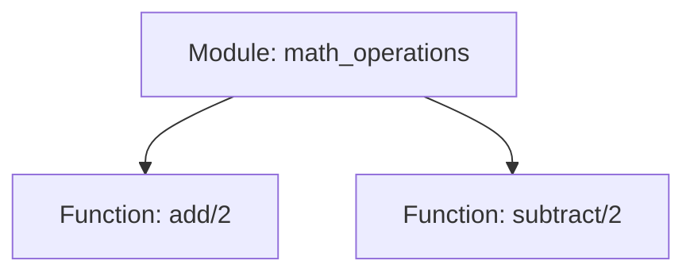

## 3.5 Coding Style and Conventions

In the world of software development, maintaining a consistent coding style is crucial for ensuring that code is readable, maintainable, and easy to collaborate on. This is especially true in Erlang, where the functional and concurrent nature of the language can lead to complex codebases. In this section, we'll explore the key coding style and conventions in Erlang, providing you with the guidelines you need to write clean and effective code.

### Naming Conventions

Naming conventions are the foundation of readable code. They help developers understand the purpose of variables, functions, and modules at a glance. Let's delve into the standard naming conventions in Erlang.

#### Variables

- **Use lowercase letters**: Variable names should be written in lowercase letters, with words separated by underscores. This is known as snake_case.
- **Be descriptive**: Choose names that clearly describe the purpose of the variable. Avoid single-letter names except for loop counters or very short-lived variables.

```erlang
% Good variable names
TotalSum = 0,
UserName = "Alice",

% Poor variable names
X = 0,
U = "Alice",
```

#### Functions

- **Use lowercase letters**: Function names should also be in snake_case, following the same rules as variable names.
- **Be descriptive**: Function names should clearly indicate what the function does. Use verbs to describe actions.

```erlang
% Good function names
calculate_total_sum(List) ->
    lists:sum(List).

get_user_name(UserId) ->
    % Function body here

% Poor function names
calc(List) ->
    lists:sum(List).

name(UserId) ->
    % Function body here
```

#### Modules

- **Use lowercase letters**: Module names should be in lowercase, with words separated by underscores.
- **Reflect functionality**: The module name should reflect the functionality it provides.

```erlang
% Good module name
-module(user_management).

% Poor module name
-module(um).
```

### Formatting Guidelines

Consistent formatting makes code easier to read and understand. Let's explore the key formatting guidelines in Erlang.

#### Indentation and Whitespace

- **Use spaces, not tabs**: Indent your code using spaces. The standard indentation level is four spaces.
- **Align code blocks**: Ensure that code blocks are properly aligned to enhance readability.

```erlang
% Proper indentation
-module(example).

-export([start/0]).

start() ->
    io:format("Hello, world!~n").
```

#### Line Length

- **Keep lines short**: Aim to keep lines under 80 characters. This makes code easier to read and prevents horizontal scrolling.

#### Blank Lines

- **Separate logical sections**: Use blank lines to separate logical sections of your code. This helps to visually organize the code.

```erlang
% Using blank lines to separate sections
-module(math_operations).

-export([add/2, subtract/2]).

add(A, B) ->
    A + B.

subtract(A, B) ->
    A - B.
```

### Comments and Documentation

Comments and documentation are essential for explaining the purpose and functionality of code. They help other developers (and your future self) understand the code more easily.

#### Inline Comments

- **Explain complex logic**: Use inline comments to explain complex logic or non-obvious code sections.
- **Avoid obvious comments**: Do not comment on obvious code, as it clutters the codebase.

```erlang
% Inline comment explaining complex logic
factorial(0) -> 1; % Base case: 0! is 1
factorial(N) when N > 0 -> N * factorial(N - 1). % Recursive case
```

#### Function Documentation

- **Use EDoc**: Document your functions using EDoc, Erlang's documentation tool. This provides a standardized way to generate documentation from your code.

```erlang
%% @doc Calculates the factorial of a number.
%% @spec factorial(integer()) -> integer().
factorial(0) -> 1;
factorial(N) when N > 0 -> N * factorial(N - 1).
```

### Adhering to Community Standards

Following community standards is crucial for collaboration and code sharing. The Erlang community has established a set of programming rules and conventions that you should adhere to. These can be found in the [Erlang Programming Rules and Conventions](https://www.erlang.org/doc/programming_rules/).

### Encouraging Collaboration

By adhering to coding style and conventions, you make it easier for others to understand and contribute to your code. This is especially important in open-source projects and team environments.

### Try It Yourself

To reinforce your understanding of Erlang coding style and conventions, try modifying the following code example to adhere to the guidelines discussed:

```erlang
-module(example).

-export([start/0]).

start() ->
    io:format("Hello, world!~n").
```

- Rename the module and function to reflect their purpose.
- Add inline comments to explain the code.
- Document the function using EDoc.

### Visualizing Erlang Code Structure

To better understand how Erlang code is structured, let's visualize a simple module using a Mermaid.js diagram:



**Diagram Description**: This diagram represents a simple Erlang module named `math_operations` with two functions: `add/2` and `subtract/2`.

### Knowledge Check

- What is the standard naming convention for variables in Erlang?
- Why is it important to keep line lengths under 80 characters?
- How can you document functions in Erlang?

### Summary

In this section, we've explored the key coding style and conventions in Erlang. By following these guidelines, you can write code that is consistent, readable, and easy to maintain. Remember to adhere to community standards and encourage collaboration in your projects.

## Quiz: Coding Style and Conventions



### What is the standard naming convention for variables in Erlang?

- [x] snake_case
- [ ] camelCase
- [ ] PascalCase
- [ ] kebab-case

> **Explanation:** Variables in Erlang should be named using snake_case, which involves lowercase letters with words separated by underscores.

### How should functions be named in Erlang?

- [x] Using descriptive names in snake_case
- [ ] Using single-letter names
- [ ] Using camelCase
- [ ] Using uppercase letters

> **Explanation:** Functions in Erlang should have descriptive names in snake_case to clearly indicate their purpose.

### What is the recommended indentation style in Erlang?

- [x] Four spaces
- [ ] Two spaces
- [ ] Tabs
- [ ] Eight spaces

> **Explanation:** The recommended indentation style in Erlang is four spaces, which helps maintain consistent formatting.

### Why is it important to keep line lengths under 80 characters?

- [x] To improve readability and prevent horizontal scrolling
- [ ] To save disk space
- [ ] To make code look compact
- [ ] To follow outdated standards

> **Explanation:** Keeping line lengths under 80 characters improves readability and prevents horizontal scrolling, making code easier to read.

### How should inline comments be used in Erlang?

- [x] To explain complex logic
- [ ] To comment on every line
- [ ] To replace function names
- [ ] To make code look busy

> **Explanation:** Inline comments should be used to explain complex logic or non-obvious code sections, not to comment on every line.

### What tool is used for documenting functions in Erlang?

- [x] EDoc
- [ ] Javadoc
- [ ] Doxygen
- [ ] RDoc

> **Explanation:** EDoc is the tool used for documenting functions in Erlang, providing a standardized way to generate documentation.

### What is the purpose of adhering to community standards in Erlang?

- [x] To facilitate collaboration and code sharing
- [ ] To make code look fancy
- [ ] To confuse other developers
- [ ] To follow outdated practices

> **Explanation:** Adhering to community standards facilitates collaboration and code sharing, making it easier for others to understand and contribute to your code.

### How should module names be formatted in Erlang?

- [x] Lowercase with underscores
- [ ] Uppercase with spaces
- [ ] camelCase
- [ ] PascalCase

> **Explanation:** Module names in Erlang should be formatted in lowercase with underscores to reflect their functionality.

### What is the benefit of using descriptive names for variables and functions?

- [x] It makes code more understandable
- [ ] It makes code longer
- [ ] It confuses other developers
- [ ] It follows outdated practices

> **Explanation:** Using descriptive names for variables and functions makes code more understandable, helping developers grasp the purpose of the code quickly.

### True or False: Tabs should be used for indentation in Erlang.

- [ ] True
- [x] False

> **Explanation:** Spaces, not tabs, should be used for indentation in Erlang to maintain consistent formatting.



Remember, this is just the beginning. As you progress, you'll build more complex and interactive Erlang applications. Keep experimenting, stay curious, and enjoy the journey!
