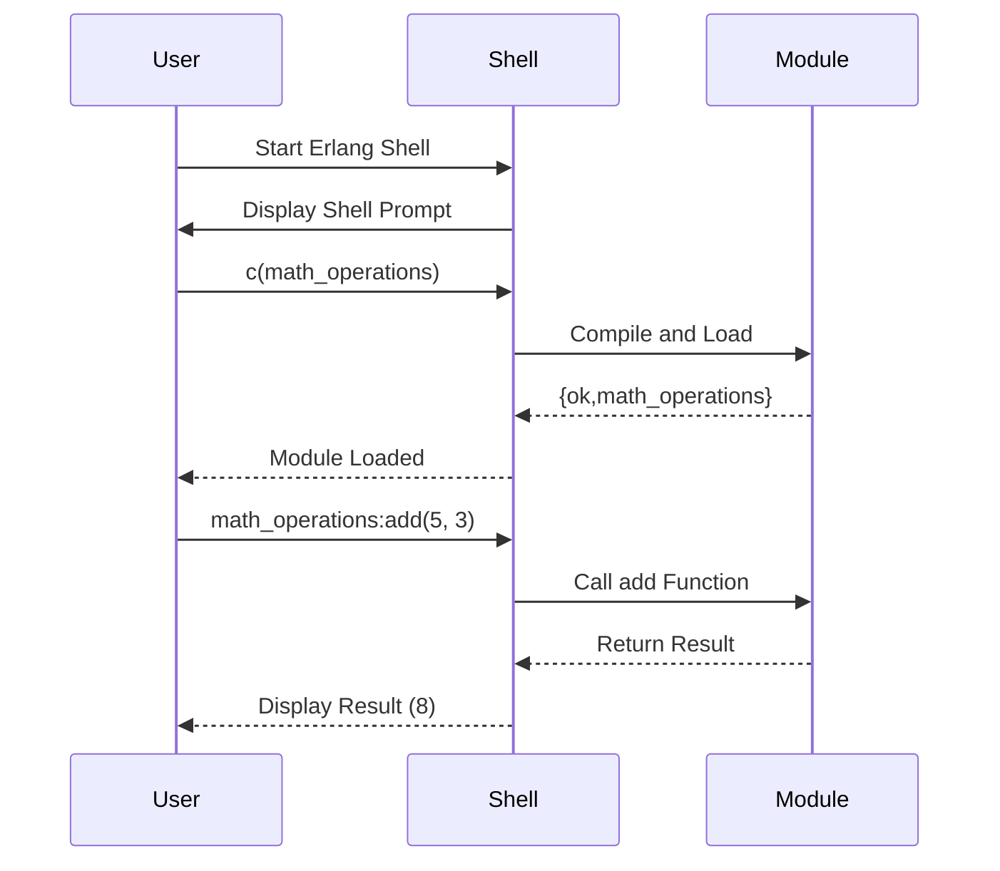

## 3.6 Effective Use of the Erlang Shell (REPL)

The Erlang shell, also known as the Read-Eval-Print Loop (REPL), is a powerful tool that allows developers to interactively develop, test, and debug Erlang code. This section will guide you through the effective use of the Erlang shell, providing insights into its capabilities, commands, and best practices for leveraging it in your development workflow.

### Introduction to the Erlang Shell

The Erlang shell is an interactive command-line interface that allows you to evaluate Erlang expressions, test functions, and debug code snippets in real-time. It is an essential tool for Erlang developers, providing a dynamic environment to experiment with code and quickly iterate on solutions.

#### Key Features of the Erlang Shell

- **Interactive Evaluation**: Execute Erlang expressions and see results immediately.
- **Dynamic Module Loading**: Load and reload modules without restarting the shell.
- **Debugging Capabilities**: Inspect variables, trace function calls, and identify errors.
- **History and Shortcuts**: Navigate through command history and use shortcuts for efficiency.

### Getting Started with the Erlang Shell

To start the Erlang shell, simply open your terminal and type:

```bash
erl
```

This command launches the Erlang shell, where you can begin entering Erlang expressions. The shell prompt typically looks like this:

```erlang
1>
```

The number indicates the command sequence, which increments with each new command entered.

### Basic Shell Commands and Shortcuts

The Erlang shell provides several commands and shortcuts to enhance your productivity. Here are some essential ones:

- **`c(Module)`**: Compile and load a module.
- **`l(Module)`**: Load a previously compiled module.
- **`b()`**: Display the current bindings of variables.
- **`f()`**: Forget all variable bindings.
- **`f(Var)`**: Forget the binding of a specific variable.
- **`q()`**: Quit the shell.

#### Navigating Command History

Use the arrow keys to navigate through your command history. This feature allows you to quickly recall and edit previous commands.

### Loading and Testing Modules

One of the most powerful features of the Erlang shell is the ability to load and test modules interactively. This capability is invaluable for rapid prototyping and debugging.

#### Compiling and Loading Modules

To compile and load a module, use the `c(Module)` command. For example, if you have a module named `math_operations.erl`, you can compile and load it as follows:

```erlang
1> c(math_operations).
{ok,math_operations}
```

Once loaded, you can call functions from the module directly in the shell:

```erlang
2> math_operations:add(5, 3).
8
```

#### Reloading Modules

If you make changes to a module, you can reload it without restarting the shell using the `l(Module)` command:

```erlang
3> l(math_operations).
{module,math_operations}
```

### Debugging with the Erlang Shell

The Erlang shell provides several tools for debugging code interactively. Here are some techniques to help you identify and fix issues:

#### Inspecting Variables

Use the `b()` command to display the current bindings of variables. This command is useful for checking the values of variables during execution:

```erlang
4> X = 10.
10
5> b().
X = 10
```

#### Tracing Function Calls

Erlang's built-in tracing capabilities allow you to monitor function calls and message passing. Use the `dbg` module to set up trace patterns and analyze program behavior.

```erlang
6> dbg:tracer().
{ok,<0.42.0>}
7> dbg:p(all, c).
{ok,[{matched,nonode@nohost,1}]}
8> dbg:tpl(math_operations, add, x).
{ok,[{matched,nonode@nohost,1}]}
```

This setup traces calls to the `add` function in the `math_operations` module.

### Experimenting in the Shell

The Erlang shell is an excellent environment for experimentation. You can test small code snippets, explore language features, and validate assumptions without the overhead of compiling and running a full application.

#### Trying New Functions

Feel free to write and test new functions directly in the shell. This approach is particularly useful for learning and exploring Erlang's functional programming constructs.

```erlang
9> Fun = fun(X, Y) -> X * Y end.
#Fun<erl_eval.6.128620087>
10> Fun(4, 5).
20
```

#### Exploring Erlang Libraries

The shell allows you to explore Erlang's extensive standard library. For example, you can experiment with the `lists` module to manipulate lists:

```erlang
11> lists:reverse([1, 2, 3, 4]).
[4,3,2,1]
```

### Advanced Shell Techniques

As you become more comfortable with the Erlang shell, you can explore advanced techniques to further enhance your productivity.

#### Using Shell Scripts

You can automate repetitive tasks by writing shell scripts. These scripts can include a series of commands to be executed in the shell, streamlining your workflow.

#### Customizing the Shell

The Erlang shell can be customized to suit your preferences. You can modify the shell's behavior by setting environment variables and configuring startup scripts.

### Visualizing Erlang Shell Interactions

To better understand how the Erlang shell interacts with your code, let's visualize the process of loading and testing a module using a sequence diagram.



### Encouragement to Experiment

Remember, the Erlang shell is your playground for learning and discovery. Use it to test ideas, explore new concepts, and deepen your understanding of Erlang. The more you experiment, the more proficient you'll become in leveraging the shell for effective development.

### Knowledge Check

Before we wrap up, let's reinforce what we've learned with a few questions:

- How do you compile and load a module in the Erlang shell?
- What command do you use to forget all variable bindings?
- How can you trace function calls in the Erlang shell?

### Summary

In this section, we've explored the powerful capabilities of the Erlang shell for interactive development, testing, and debugging. By mastering the shell, you can enhance your productivity, quickly iterate on solutions, and gain a deeper understanding of Erlang's functional and concurrent programming paradigms.

## Quiz: Effective Use of the Erlang Shell (REPL)



### What command is used to compile and load a module in the Erlang shell?

- [x] c(Module)
- [ ] l(Module)
- [ ] b()
- [ ] f()

> **Explanation:** The `c(Module)` command is used to compile and load a module in the Erlang shell.

### How can you reload a previously compiled module in the Erlang shell?

- [ ] c(Module)
- [x] l(Module)
- [ ] b()
- [ ] f()

> **Explanation:** The `l(Module)` command is used to reload a previously compiled module in the Erlang shell.

### Which command displays the current bindings of variables in the Erlang shell?

- [ ] c(Module)
- [ ] l(Module)
- [x] b()
- [ ] f()

> **Explanation:** The `b()` command displays the current bindings of variables in the Erlang shell.

### What is the purpose of the `f()` command in the Erlang shell?

- [ ] Compile a module
- [ ] Load a module
- [x] Forget all variable bindings
- [ ] Display variable bindings

> **Explanation:** The `f()` command is used to forget all variable bindings in the Erlang shell.

### How do you quit the Erlang shell?

- [ ] c()
- [ ] l()
- [ ] b()
- [x] q()

> **Explanation:** The `q()` command is used to quit the Erlang shell.

### What feature allows you to navigate through command history in the Erlang shell?

- [x] Arrow keys
- [ ] Function keys
- [ ] Tab key
- [ ] Escape key

> **Explanation:** The arrow keys allow you to navigate through command history in the Erlang shell.

### Which module is used for tracing function calls in Erlang?

- [ ] lists
- [ ] math_operations
- [x] dbg
- [ ] shell

> **Explanation:** The `dbg` module is used for tracing function calls in Erlang.

### What is the output of the following command in the Erlang shell: `lists:reverse([1, 2, 3, 4])`?

- [ ] [1, 2, 3, 4]
- [ ] [4, 3, 2, 1]
- [x] [4, 3, 2, 1]
- [ ] [1, 2, 3, 4]

> **Explanation:** The `lists:reverse([1, 2, 3, 4])` command reverses the list, resulting in `[4, 3, 2, 1]`.

### True or False: The Erlang shell can be customized by setting environment variables.

- [x] True
- [ ] False

> **Explanation:** The Erlang shell can indeed be customized by setting environment variables and configuring startup scripts.

### What is the primary purpose of the Erlang shell?

- [x] Interactive development, testing, and debugging
- [ ] Compiling Erlang code
- [ ] Managing databases
- [ ] Designing user interfaces

> **Explanation:** The primary purpose of the Erlang shell is interactive development, testing, and debugging.



Remember, this is just the beginning. As you progress, you'll build more complex and interactive applications. Keep experimenting, stay curious, and enjoy the journey!
