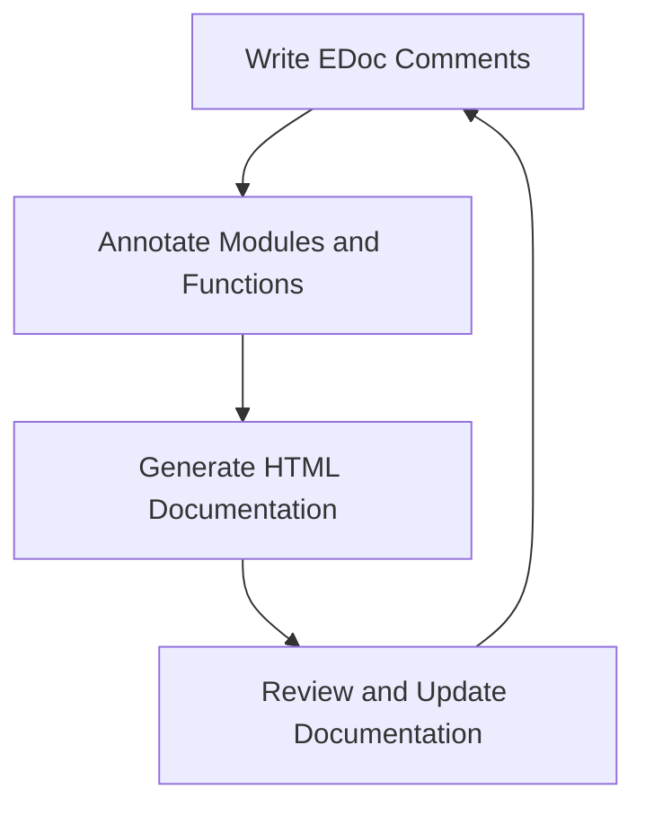

## 3.7 Documentation with EDoc

In the realm of software development, documentation is a cornerstone of maintainability and collaboration. As developers, we often focus on writing efficient and functional code, but without proper documentation, even the most elegant code can become a labyrinth for others—or even ourselves—to navigate. In this section, we will explore how to effectively document Erlang code using EDoc, a powerful tool that facilitates the creation of clear, informative, and accessible documentation.

### The Importance of Documentation

Before diving into EDoc specifics, let's emphasize why documentation is crucial:

- **Maintainability**: Well-documented code is easier to maintain and update. It provides insights into the code's purpose, logic, and structure, reducing the learning curve for new developers.
- **Collaboration**: Documentation serves as a communication tool among team members, ensuring everyone understands the codebase and can contribute effectively.
- **Knowledge Transfer**: It acts as a knowledge repository, preserving the rationale behind design decisions and implementation details.
- **Error Reduction**: Clear documentation can prevent misunderstandings and errors, as developers have a reference to verify their assumptions.

### Introduction to EDoc

EDoc is an Erlang tool designed to generate documentation from comments in your source code. It produces HTML documentation, making it easy to share and access. EDoc is particularly useful for documenting modules, functions, and types, providing a structured way to convey information about your code.

### Writing EDoc Comments

EDoc comments are written in a specific format that EDoc can parse to generate documentation. Let's explore how to write these comments effectively.

#### Module Documentation

Begin by documenting the module itself. This includes a brief description of the module's purpose and any relevant information about its usage.

```erlang
%% @doc
%% This module provides utilities for handling user data.
%% It includes functions for creating, updating, and deleting user records.
-module(user_utils).
```

#### Function Documentation

Each function should have its own documentation, detailing its purpose, parameters, return values, and any side effects.

```erlang
%% @doc
%% Creates a new user record.
%%
%% @spec create_user(Name :: string(), Age :: integer()) -> {ok, UserId :: integer()} | {error, Reason :: term()}.
%% @param Name The name of the user.
%% @param Age The age of the user.
%% @return A tuple indicating success or failure.
create_user(Name, Age) ->
    % Function implementation
    {ok, 1}.
```

#### Types and Records

Document types and records to clarify their structure and intended use.

```erlang
%% @type user() :: #user{name :: string(), age :: integer()}.
-record(user, {name, age}).
```

### Generating HTML Documentation

Once your code is annotated with EDoc comments, generating HTML documentation is straightforward. Use the following command in your Erlang shell or build script:

```shell
erl -noshell -run edoc_run application 'your_app' '[{dir, "doc"}]' -s init stop
```

This command will generate HTML files in the specified directory, providing a browsable documentation set for your application.

### Best Practices for EDoc Documentation

To maximize the effectiveness of your documentation, consider the following best practices:

- **Be Concise and Clear**: Write documentation that is easy to read and understand. Avoid jargon and overly technical language unless necessary.
- **Focus on Intention**: Document the "why" behind your code, not just the "how." Explain the purpose and rationale for your design choices.
- **Keep It Updated**: Regularly update documentation to reflect changes in the codebase. Outdated documentation can be misleading and counterproductive.
- **Use Examples**: Where applicable, include examples to illustrate how functions or modules should be used.
- **Consistent Style**: Maintain a consistent style and format throughout your documentation to enhance readability.

### Encouraging Experimentation

To truly master EDoc, experiment with documenting different types of modules and functions. Try adding documentation to a small project and generate the HTML output to see how your comments translate into structured documentation.

### Visualizing the Documentation Process

To better understand the flow of documenting with EDoc, let's visualize the process:



**Figure 1**: The EDoc Documentation Process

### References and Further Reading

For more in-depth information on EDoc and Erlang documentation practices, consider exploring the following resources:

- [Erlang's Official EDoc Documentation](https://www.erlang.org/doc/apps/edoc/)
- [Erlang Programming: A Comprehensive Guide](https://www.erlang.org/doc/)
- [Erlang and OTP in Action](https://www.manning.com/books/erlang-and-otp-in-action)

### Knowledge Check

To reinforce your understanding of EDoc, consider these questions:

- What are the key benefits of documenting code with EDoc?
- How can you ensure your documentation remains relevant and useful over time?
- What are some common pitfalls to avoid when writing EDoc comments?

### Embrace the Journey

Remember, documentation is an ongoing process. As you continue to develop and refine your Erlang projects, keep experimenting with EDoc. Stay curious, and enjoy the journey of creating clear, informative, and accessible documentation.

## Quiz: Documentation with EDoc



### What is the primary purpose of EDoc in Erlang?

- [x] To generate HTML documentation from source code comments
- [ ] To compile Erlang code into executable binaries
- [ ] To manage dependencies in Erlang projects
- [ ] To optimize Erlang code for performance

> **Explanation:** EDoc is a tool used to generate HTML documentation from comments in Erlang source code, making it easier to share and access documentation.

### Which of the following is a best practice for writing EDoc comments?

- [x] Focus on documenting the intention behind the code
- [ ] Use as much technical jargon as possible
- [ ] Document only the implementation details
- [ ] Avoid using examples in documentation

> **Explanation:** It's important to document the intention behind the code to provide context and understanding, rather than just focusing on implementation details.

### How can you generate HTML documentation using EDoc?

- [x] By running the `erl -noshell -run edoc_run application 'your_app' '[{dir, "doc"}]' -s init stop` command
- [ ] By compiling the code with `erlc`
- [ ] By using the `rebar3 compile` command
- [ ] By executing the `make` command in the project directory

> **Explanation:** The specified command is used to generate HTML documentation from EDoc comments in Erlang source code.

### What should be included in function documentation using EDoc?

- [x] Purpose, parameters, return values, and side effects
- [ ] Only the function name and parameters
- [ ] The entire function implementation
- [ ] Only the return values

> **Explanation:** Function documentation should include the purpose, parameters, return values, and any side effects to provide a comprehensive understanding of the function.

### Why is it important to keep documentation updated?

- [x] To ensure it accurately reflects the current state of the codebase
- [ ] To increase the size of the documentation files
- [ ] To make the documentation more complex
- [ ] To reduce the need for code comments

> **Explanation:** Keeping documentation updated ensures it accurately reflects the current state of the codebase, preventing misunderstandings and errors.

### What is a common pitfall to avoid when writing EDoc comments?

- [x] Writing overly technical or jargon-heavy comments
- [ ] Including examples in the documentation
- [ ] Documenting the purpose of the code
- [ ] Using consistent style and format

> **Explanation:** Overly technical or jargon-heavy comments can make documentation difficult to understand, especially for new developers.

### What is the role of examples in EDoc documentation?

- [x] To illustrate how functions or modules should be used
- [ ] To increase the length of the documentation
- [ ] To replace the need for parameter descriptions
- [ ] To make the documentation more complex

> **Explanation:** Examples help illustrate how functions or modules should be used, providing practical context for the documentation.

### What is the benefit of using a consistent style in documentation?

- [x] It enhances readability and understanding
- [ ] It makes the documentation longer
- [ ] It complicates the documentation process
- [ ] It reduces the need for examples

> **Explanation:** A consistent style enhances readability and understanding, making it easier for developers to navigate and comprehend the documentation.

### What is the purpose of documenting types and records in EDoc?

- [x] To clarify their structure and intended use
- [ ] To increase the size of the documentation
- [ ] To replace function documentation
- [ ] To make the code more complex

> **Explanation:** Documenting types and records clarifies their structure and intended use, aiding developers in understanding how to work with them.

### True or False: EDoc can only generate documentation in HTML format.

- [x] True
- [ ] False

> **Explanation:** EDoc is primarily designed to generate HTML documentation from Erlang source code comments.


