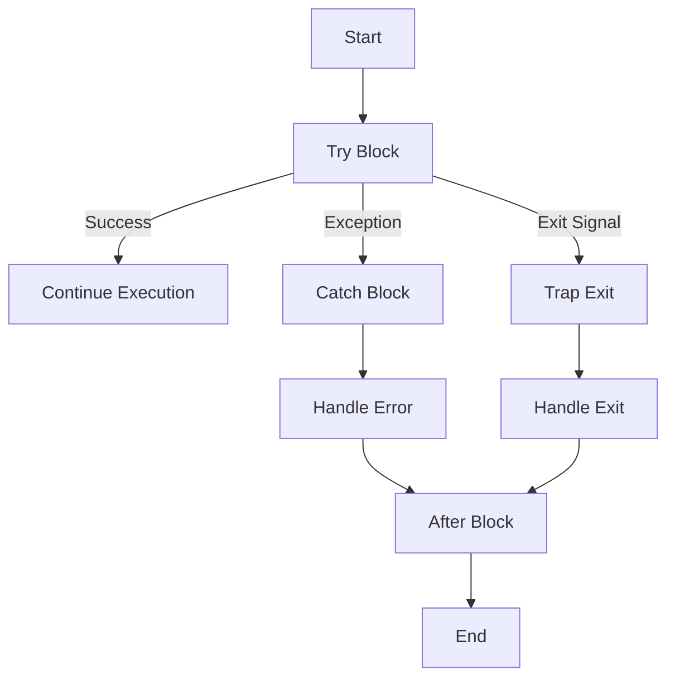

## 3.8 Error Handling and Exceptions

In the world of software development, handling errors gracefully is crucial for building robust and reliable applications. Erlang, with its roots in telecommunications, is designed to handle errors in a way that promotes fault tolerance and system reliability. In this section, we will explore Erlang's error handling mechanisms, including exceptions, exits, and throws, and how to use them effectively to write resilient code.

### Understanding Errors in Erlang

Erlang provides a unique approach to error handling, which is deeply integrated with its concurrency model. Let's start by understanding the different types of errors in Erlang:

1. **Exceptions**: These are errors that occur during the execution of a program, such as arithmetic errors, bad function calls, or pattern matching failures. Exceptions can be caught and handled using `try...catch` constructs.

2. **Exits**: These occur when a process terminates unexpectedly. Exits can be trapped and handled by linked processes, allowing for graceful recovery.

3. **Throws**: These are non-local returns from a function, typically used to signal exceptional conditions that are not necessarily errors.

### Using `try...catch` for Error Handling

The `try...catch` construct in Erlang allows you to handle exceptions in a controlled manner. Here's how you can use it:

```erlang
try
    % Code that might raise an exception
    Result = risky_function(),
    io:format("Result: ~p~n", [Result])
catch
    % Handling different types of exceptions
    error:Reason ->
        io:format("Caught an error: ~p~n", [Reason]);
    exit:Reason ->
        io:format("Caught an exit: ~p~n", [Reason]);
    throw:Reason ->
        io:format("Caught a throw: ~p~n", [Reason])
after
    % Code that runs regardless of whether an exception was raised
    io:format("Cleanup actions~n")
end.
```

#### Key Points:

- **`try` Block**: Contains the code that might raise an exception.
- **`catch` Block**: Handles different types of exceptions (`error`, `exit`, `throw`).
- **`after` Block**: Executes cleanup code, similar to `finally` in other languages.

### Handling Expected and Unexpected Errors

In Erlang, it's important to distinguish between expected and unexpected errors. Expected errors are those that you anticipate and handle explicitly, while unexpected errors are unforeseen and may require a different approach.

#### Example: Handling Expected Errors

Consider a function that reads a file. You might expect errors like "file not found" or "permission denied":

```erlang
read_file(FileName) ->
    try
        {ok, Data} = file:read_file(FileName),
        {ok, Data}
    catch
        error:enoent ->
            {error, "File not found"};
        error:eacces ->
            {error, "Permission denied"}
    end.
```

#### Example: Handling Unexpected Errors

For unexpected errors, you might want to log the error and continue:

```erlang
process_data(Data) ->
    try
        % Process data
        Result = complex_calculation(Data),
        {ok, Result}
    catch
        _:Reason ->
            io:format("Unexpected error: ~p~n", [Reason]),
            {error, Reason}
    end.
```

### Exit Signals and Process Linking

Erlang's concurrency model is based on lightweight processes that communicate via message passing. When a process terminates, it sends an exit signal to linked processes. This mechanism is crucial for building fault-tolerant systems.

#### Linking Processes

You can link processes using the `link/1` function. If a linked process exits, the other process receives an exit signal:

```erlang
start_linked_process() ->
    Pid = spawn(fun() -> exit(die) end),
    link(Pid),
    receive
        {'EXIT', Pid, Reason} ->
            io:format("Process exited with reason: ~p~n", [Reason])
    end.
```

#### Trapping Exits

To handle exit signals gracefully, you can trap exits using `process_flag(trap_exit, true)`:

```erlang
trap_exit_example() ->
    process_flag(trap_exit, true),
    Pid = spawn_link(fun() -> exit(die) end),
    receive
        {'EXIT', Pid, Reason} ->
            io:format("Trapped exit: ~p~n", [Reason])
    end.
```

### Writing Robust Code with Error Handling

To write robust Erlang code, follow these best practices:

- **Embrace the "Let It Crash" Philosophy**: Allow processes to fail and rely on supervisors to restart them. This approach simplifies error handling and improves system reliability.
- **Use Supervisors**: Organize processes into supervision trees to manage failures and restarts.
- **Log Errors**: Use logging to capture error details for debugging and analysis.
- **Handle Expected Errors**: Anticipate and handle common errors explicitly.
- **Trap Exits When Necessary**: Use exit trapping to handle critical processes that must not fail silently.

### Visualizing Error Handling in Erlang

To better understand Erlang's error handling mechanisms, let's visualize the process of handling exceptions and exits using a flowchart:



**Figure 1**: Flowchart illustrating the error handling process in Erlang.

### Try It Yourself

Experiment with the provided code examples by modifying them to handle different types of errors. For instance, try adding a new exception type in the `catch` block or simulate a process exit and observe how it's handled.

### References and Further Reading

- [Erlang Documentation on Error Handling](https://www.erlang.org/doc/reference_manual/errors.html)
- [Learn You Some Erlang for Great Good!](http://learnyousomeerlang.com/errors-and-exceptions)

### Knowledge Check

- What are the three types of errors in Erlang?
- How does the `try...catch` construct work in Erlang?
- What is the purpose of the `after` block in error handling?
- How can you link processes and handle exit signals?
- Why is the "Let It Crash" philosophy important in Erlang?

### Summary

In this section, we've explored Erlang's error handling mechanisms, including exceptions, exits, and throws. We've learned how to use `try...catch` constructs, handle expected and unexpected errors, and manage process exits using linking and trapping. By embracing Erlang's unique approach to error handling, you can build robust and fault-tolerant applications.

Remember, this is just the beginning. As you progress, you'll build more complex and resilient systems. Keep experimenting, stay curious, and enjoy the journey!

## Quiz: Error Handling and Exceptions



### What are the three types of errors in Erlang?

- [x] Exceptions, Exits, Throws
- [ ] Exceptions, Errors, Crashes
- [ ] Errors, Warnings, Exits
- [ ] Throws, Crashes, Warnings

> **Explanation:** Erlang categorizes errors into exceptions, exits, and throws, each serving different purposes in error handling.

### How does the `try...catch` construct work in Erlang?

- [x] It allows handling exceptions by catching them and executing specific code.
- [ ] It only logs errors without handling them.
- [ ] It terminates the program upon encountering an error.
- [ ] It retries the operation automatically.

> **Explanation:** The `try...catch` construct is used to catch exceptions and execute specific code to handle them.

### What is the purpose of the `after` block in error handling?

- [x] To execute cleanup code regardless of whether an exception was raised.
- [ ] To catch and handle errors.
- [ ] To terminate the process.
- [ ] To log errors.

> **Explanation:** The `after` block is used to execute cleanup code, similar to a `finally` block in other languages.

### How can you link processes and handle exit signals?

- [x] Use `link/1` to link processes and `process_flag(trap_exit, true)` to trap exits.
- [ ] Use `spawn/1` to create processes and `catch` to handle exits.
- [ ] Use `try...catch` to link processes.
- [ ] Use `exit/1` to link processes.

> **Explanation:** Linking processes with `link/1` and trapping exits with `process_flag(trap_exit, true)` allows handling exit signals.

### Why is the "Let It Crash" philosophy important in Erlang?

- [x] It simplifies error handling and improves system reliability by allowing processes to fail and restart.
- [ ] It prevents any process from crashing.
- [ ] It ensures all errors are logged.
- [ ] It automatically fixes errors.

> **Explanation:** The "Let It Crash" philosophy allows processes to fail and rely on supervisors to restart them, simplifying error handling and improving reliability.

### What is the difference between an exception and an exit in Erlang?

- [x] An exception occurs during execution, while an exit is a signal sent when a process terminates.
- [ ] An exit occurs during execution, while an exception is a signal sent when a process terminates.
- [ ] Both are the same in Erlang.
- [ ] Exceptions are only used for logging.

> **Explanation:** Exceptions occur during execution, while exits are signals sent when a process terminates.

### How do you handle unexpected errors in Erlang?

- [x] Use `try...catch` to log the error and continue execution.
- [ ] Ignore the error and proceed.
- [ ] Terminate the program.
- [ ] Retry the operation automatically.

> **Explanation:** Using `try...catch` to log unexpected errors and continue execution is a common practice in Erlang.

### What is the role of supervisors in Erlang's error handling?

- [x] They manage process failures and restarts, ensuring system reliability.
- [ ] They log errors and warnings.
- [ ] They prevent any process from crashing.
- [ ] They handle all exceptions automatically.

> **Explanation:** Supervisors manage process failures and restarts, ensuring system reliability and fault tolerance.

### How can you trap exits in Erlang?

- [x] By setting `process_flag(trap_exit, true)`.
- [ ] By using `try...catch`.
- [ ] By linking processes with `spawn/1`.
- [ ] By using `exit/1`.

> **Explanation:** Setting `process_flag(trap_exit, true)` allows a process to trap exit signals.

### True or False: In Erlang, the `after` block in a `try...catch` construct is equivalent to a `finally` block in other languages.

- [x] True
- [ ] False

> **Explanation:** The `after` block in Erlang's `try...catch` construct serves a similar purpose to a `finally` block, executing cleanup code regardless of whether an exception was raised.


