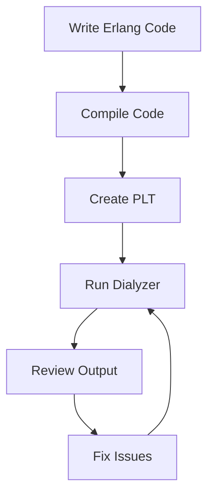

## 3.9 Typespecs and Dialyzer for Static Analysis

In this section, we delve into the powerful tools of typespecs and Dialyzer in Erlang, which are essential for enhancing code reliability through static analysis. By the end of this guide, you will understand how to use typespecs to define function specifications and leverage Dialyzer to identify bugs and discrepancies in your codebase.

### Understanding Typespecs in Erlang

Typespecs in Erlang are annotations that describe the types of function arguments and return values. They serve as a form of documentation and are used by tools like Dialyzer to perform static analysis.

#### Syntax of Typespecs

Typespecs are written using the `@spec` attribute, followed by the function name, its arguments, and the return type. Here's a basic example:

```erlang
-spec add(integer(), integer()) -> integer().
```

In this example, the `add` function takes two integers as arguments and returns an integer.

#### Annotating Functions with `@spec` and `@type`

Let's explore how to annotate functions with typespecs using `@spec` and `@type`.

```erlang
-module(math_utils).
-export([add/2, multiply/2]).

%% Define a type for a number
-type number() :: integer() | float().

%% Specify the types for the add function
-spec add(number(), number()) -> number().
add(X, Y) -> X + Y.

%% Specify the types for the multiply function
-spec multiply(number(), number()) -> number().
multiply(X, Y) -> X * Y.
```

In this example, we define a custom type `number()` that can be either an integer or a float. We then use `@spec` to annotate the `add` and `multiply` functions, specifying that they accept two numbers and return a number.

### Introducing Dialyzer

Dialyzer, short for DIscrepancy AnaLYZer for ERlang, is a static analysis tool used to identify bugs, type errors, and code discrepancies in Erlang applications. It performs analysis without requiring explicit type declarations, making it a powerful tool for detecting subtle bugs.

#### Purpose of Dialyzer

Dialyzer's primary purpose is to find:

- Type errors
- Unreachable code
- Redundant tests
- Pattern matching issues

By analyzing the codebase, Dialyzer helps improve code reliability and maintainability.

### Running Dialyzer on a Codebase

To use Dialyzer, follow these steps:

1. **Compile the Code**: Ensure your Erlang code is compiled. Dialyzer works on BEAM files, which are generated after compilation.

2. **Create a PLT (Persistent Lookup Table)**: Dialyzer uses a PLT to store information about the code and its dependencies. Create a PLT using the following command:

   ```shell
   dialyzer --build_plt --apps erts kernel stdlib
   ```

3. **Analyze the Code**: Run Dialyzer on your codebase:

   ```shell
   dialyzer --plt ~/.dialyzer_plt --src src/
   ```

   Replace `src/` with the path to your source files.

4. **Review the Output**: Dialyzer will output warnings and errors. Review these to identify and fix issues in your code.

### How Static Analysis Improves Code Reliability

Static analysis with Dialyzer offers several benefits:

- **Early Bug Detection**: Identify potential issues before runtime, reducing the likelihood of bugs in production.
- **Improved Code Quality**: Enforce coding standards and detect code smells, leading to cleaner, more maintainable code.
- **Enhanced Documentation**: Typespecs serve as documentation, making it easier for developers to understand the codebase.

### Visualizing the Dialyzer Workflow

To better understand the Dialyzer workflow, let's visualize the process using a Mermaid.js flowchart:



**Figure 1**: The Dialyzer Workflow - This diagram illustrates the steps involved in using Dialyzer for static analysis.

### Try It Yourself

To get hands-on experience, try modifying the `math_utils` module:

1. **Add a New Function**: Implement a `subtract/2` function and annotate it with a typespec.
2. **Introduce a Bug**: Intentionally introduce a type error and run Dialyzer to see how it detects the issue.
3. **Experiment with Types**: Modify the `number()` type to include additional types and observe the impact on Dialyzer's analysis.

### References and Links

For further reading, explore these resources:

- [Erlang Typespecs](http://erlang.org/doc/reference_manual/typespec.html)
- [Dialyzer User's Guide](http://erlang.org/doc/man/dialyzer.html)

### Knowledge Check

- What are typespecs, and how do they benefit Erlang development?
- How does Dialyzer improve code reliability?
- What steps are involved in running Dialyzer on a codebase?

### Embrace the Journey

Remember, mastering typespecs and Dialyzer is a journey. As you continue to explore these tools, you'll gain deeper insights into your codebase and enhance your skills as an Erlang developer. Keep experimenting, stay curious, and enjoy the process!

## Quiz: Typespecs and Dialyzer for Static Analysis



### What is the primary purpose of typespecs in Erlang?

- [x] To define function argument and return types
- [ ] To execute code at runtime
- [ ] To compile Erlang code
- [ ] To manage dependencies

> **Explanation:** Typespecs are used to define the types of function arguments and return values, serving as documentation and aiding static analysis.

### Which tool is used for static analysis in Erlang?

- [ ] EUnit
- [x] Dialyzer
- [ ] Rebar3
- [ ] Observer

> **Explanation:** Dialyzer is the tool used for static analysis in Erlang, identifying bugs and discrepancies in the code.

### What does Dialyzer primarily detect?

- [x] Type errors
- [ ] Syntax errors
- [ ] Compilation errors
- [ ] Runtime exceptions

> **Explanation:** Dialyzer detects type errors, unreachable code, redundant tests, and pattern matching issues.

### How do you annotate a function with typespecs?

- [ ] Using `@doc`
- [x] Using `@spec`
- [ ] Using `@type`
- [ ] Using `@define`

> **Explanation:** Functions are annotated with typespecs using the `@spec` attribute.

### What is a PLT in the context of Dialyzer?

- [x] Persistent Lookup Table
- [ ] Program Logic Table
- [ ] Process Lookup Table
- [ ] Parameter List Table

> **Explanation:** A PLT (Persistent Lookup Table) stores information about the code and its dependencies for Dialyzer analysis.

### What is the first step in using Dialyzer?

- [ ] Create a PLT
- [x] Compile the code
- [ ] Run Dialyzer
- [ ] Review output

> **Explanation:** The first step is to compile the code, as Dialyzer works on BEAM files generated after compilation.

### How does static analysis improve code quality?

- [x] By detecting potential issues before runtime
- [ ] By executing code faster
- [ ] By reducing code size
- [ ] By increasing memory usage

> **Explanation:** Static analysis detects potential issues before runtime, leading to cleaner, more maintainable code.

### What is the benefit of using typespecs as documentation?

- [x] They make the codebase easier to understand
- [ ] They increase code execution speed
- [ ] They reduce memory usage
- [ ] They compile code faster

> **Explanation:** Typespecs serve as documentation, making it easier for developers to understand the codebase.

### What kind of errors does Dialyzer not detect?

- [ ] Type errors
- [ ] Unreachable code
- [ ] Redundant tests
- [x] Syntax errors

> **Explanation:** Dialyzer does not detect syntax errors; it focuses on type errors, unreachable code, and redundant tests.

### True or False: Dialyzer requires explicit type declarations to perform analysis.

- [ ] True
- [x] False

> **Explanation:** Dialyzer does not require explicit type declarations, making it a powerful tool for detecting subtle bugs.


