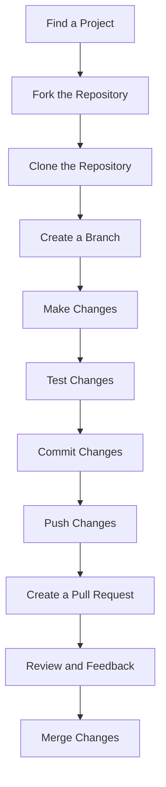

## 30.10 Contributing to Open Source Erlang Projects

Contributing to open source projects is a rewarding way to enhance your skills, collaborate with other developers, and give back to the community. In this section, we will explore the benefits of contributing to open source, provide guidance on finding Erlang projects that need contributors, discuss best practices for collaboration, and highlight the positive impact on personal growth and the community.

### Benefits of Contributing to Open Source

Contributing to open source projects offers numerous benefits, both personally and professionally:

1. **Skill Enhancement**: Working on open source projects allows you to learn new technologies, improve your coding skills, and gain experience with real-world software development practices.

2. **Networking Opportunities**: Collaborating with other developers provides opportunities to build professional relationships and expand your network within the tech community.

3. **Portfolio Building**: Contributions to open source projects can be showcased in your portfolio, demonstrating your skills and commitment to potential employers.

4. **Community Impact**: By contributing to open source, you help improve software that is used by people around the world, making a positive impact on the community.

5. **Personal Satisfaction**: There is a sense of accomplishment and satisfaction in knowing that your contributions are helping others and advancing technology.

### Finding Projects Needing Contributors

Finding the right project to contribute to can be challenging, but there are several strategies you can use to identify projects that need contributors:

1. **Explore GitHub**: GitHub is a popular platform for open source projects. Use the search feature to find Erlang projects and look for issues labeled "good first issue" or "help wanted." These labels indicate tasks that are suitable for new contributors.

2. **Join Erlang Communities**: Engage with Erlang communities on forums, mailing lists, and social media platforms. Community members often share information about projects that need help.

3. **Attend Meetups and Conferences**: Participate in Erlang meetups and conferences to connect with project maintainers and learn about opportunities to contribute.

4. **Check Project Documentation**: Many projects have a "Contributing" section in their documentation that outlines how to get involved and what areas need attention.

5. **Use Open Source Platforms**: Websites like Open Source Guides and First Timers Only provide resources and lists of projects looking for contributors.

### Best Practices for Collaboration

When contributing to open source projects, it's important to follow best practices for collaboration to ensure a positive experience for everyone involved:

1. **Understand the Project**: Before contributing, take the time to understand the project's goals, architecture, and coding standards. Read the documentation and explore the codebase.

2. **Communicate Effectively**: Good communication is key to successful collaboration. Use project communication channels, such as mailing lists or chat rooms, to ask questions, discuss ideas, and provide updates.

3. **Follow Code Standards**: Adhere to the project's coding standards and guidelines. Consistent code style makes it easier for maintainers and other contributors to review and integrate your changes.

4. **Write Clear Commit Messages**: Provide clear and descriptive commit messages that explain the purpose of your changes. This helps maintainers understand your contributions and makes the project's history easier to navigate.

5. **Review and Test**: Before submitting a pull request, review your code for errors and test it thoroughly. This reduces the burden on maintainers and increases the likelihood of your changes being accepted.

6. **Be Respectful and Open-Minded**: Be respectful of other contributors' opinions and open to feedback. Constructive criticism is an opportunity to learn and improve.

### Contributing Beyond Code

Contributing to open source is not limited to writing code. There are many other ways to contribute:

1. **Documentation**: Good documentation is crucial for any project. Help improve or create documentation to make it easier for others to use and contribute to the project.

2. **Testing**: Contribute by writing tests, reporting bugs, or verifying bug fixes. Testing is an essential part of maintaining software quality.

3. **Design and UX**: If you have design skills, contribute by improving the project's user interface or user experience.

4. **Translation**: Help make the project accessible to a wider audience by translating documentation or user interfaces into other languages.

5. **Community Support**: Provide support to other users by answering questions, writing tutorials, or creating how-to guides.

### Positive Impact on Personal Growth and the Community

Contributing to open source projects can have a profound impact on your personal growth and the community:

1. **Personal Growth**: You will develop new skills, gain confidence in your abilities, and become a more well-rounded developer.

2. **Community Building**: Your contributions help build a stronger, more vibrant community. By sharing your knowledge and skills, you inspire others to contribute and collaborate.

3. **Innovation**: Open source projects drive innovation by allowing developers from around the world to collaborate and share ideas. Your contributions can lead to new features, improvements, and even entirely new projects.

4. **Mentorship Opportunities**: As you gain experience, you can mentor new contributors, helping them navigate the open source world and develop their skills.

### Code Example: Contributing to an Erlang Project

Let's walk through a simple example of contributing to an Erlang project on GitHub. We'll assume you have found a project with an issue labeled "good first issue."

1. **Fork the Repository**: First, fork the repository to your GitHub account.

   ```shell
   # Clone the forked repository to your local machine
   git clone https://github.com/your-username/project-name.git
   ```

2. **Create a Branch**: Create a new branch for your changes.

   ```shell
   cd project-name
   git checkout -b feature/your-feature-name
   ```

3. **Make Changes**: Implement the changes required to address the issue. Ensure your code follows the project's coding standards.

4. **Test Your Changes**: Run tests to ensure your changes work as expected.

   ```shell
   # Run the project's test suite
   make test
   ```

5. **Commit Your Changes**: Commit your changes with a clear and descriptive message.

   ```shell
   git add .
   git commit -m "Add feature: your feature description"
   ```

6. **Push Your Changes**: Push your changes to your forked repository.

   ```shell
   git push origin feature/your-feature-name
   ```

7. **Create a Pull Request**: Go to the original repository on GitHub and create a pull request. Provide a clear description of your changes and reference the issue you are addressing.

### Visualizing the Contribution Process

Below is a flowchart illustrating the process of contributing to an open source Erlang project:



### Try It Yourself

Now that you have a basic understanding of contributing to open source Erlang projects, try finding a project on GitHub and follow the steps outlined above. Experiment with making changes, running tests, and creating pull requests. Remember, practice makes perfect!

### Knowledge Check

- What are some benefits of contributing to open source projects?
- How can you find Erlang projects that need contributors?
- What are some best practices for collaborating on open source projects?
- How can you contribute to open source projects beyond writing code?

### Summary

Contributing to open source Erlang projects is a valuable way to enhance your skills, build your network, and make a positive impact on the community. By following the steps and best practices outlined in this guide, you can start contributing to projects and experience the many benefits of open source collaboration. Remember, every contribution, no matter how small, makes a difference.

## Quiz: Contributing to Open Source Erlang Projects



### What is one benefit of contributing to open source projects?

- [x] Skill enhancement
- [ ] Guaranteed employment
- [ ] Free software licenses
- [ ] Unlimited cloud storage

> **Explanation:** Contributing to open source projects allows you to learn new technologies and improve your coding skills.

### Which platform is commonly used to find open source Erlang projects?

- [x] GitHub
- [ ] LinkedIn
- [ ] Facebook
- [ ] Twitter

> **Explanation:** GitHub is a popular platform for hosting and contributing to open source projects.

### What label should you look for on GitHub issues to find tasks suitable for new contributors?

- [x] "good first issue"
- [ ] "urgent"
- [ ] "critical"
- [ ] "wontfix"

> **Explanation:** The "good first issue" label indicates tasks that are suitable for new contributors.

### What is an important practice when submitting a pull request?

- [x] Write clear commit messages
- [ ] Include personal opinions
- [ ] Ignore project guidelines
- [ ] Submit without testing

> **Explanation:** Clear commit messages help maintainers understand your contributions and make the project's history easier to navigate.

### How can you contribute to open source projects beyond writing code?

- [x] Documentation
- [x] Testing
- [ ] Ignoring issues
- [ ] Deleting files

> **Explanation:** Contributing to documentation and testing are valuable ways to support open source projects.

### What is a key aspect of effective collaboration in open source projects?

- [x] Communication
- [ ] Secrecy
- [ ] Competition
- [ ] Isolation

> **Explanation:** Good communication is key to successful collaboration in open source projects.

### What should you do before submitting a pull request?

- [x] Review and test your code
- [ ] Delete unrelated files
- [ ] Change the project name
- [ ] Ignore feedback

> **Explanation:** Reviewing and testing your code reduces the burden on maintainers and increases the likelihood of your changes being accepted.

### What is a positive impact of contributing to open source on personal growth?

- [x] Developing new skills
- [ ] Guaranteed promotions
- [ ] Instant fame
- [ ] Free merchandise

> **Explanation:** Contributing to open source helps you develop new skills and gain confidence in your abilities.

### What is one way to find Erlang projects needing contributors?

- [x] Join Erlang communities
- [ ] Avoid social media
- [ ] Ignore forums
- [ ] Only work alone

> **Explanation:** Engaging with Erlang communities can help you find projects that need contributors.

### True or False: Contributing to open source projects can lead to mentorship opportunities.

- [x] True
- [ ] False

> **Explanation:** As you gain experience, you can mentor new contributors, helping them navigate the open source world and develop their skills.



Remember, contributing to open source is a journey of learning and growth. Embrace the challenges, celebrate your successes, and enjoy the rewarding experience of being part of the open source community.
