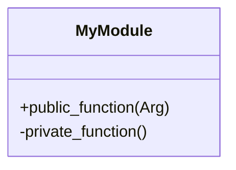

## 30.11 Erlang Style Guides and Conventions

In the world of software development, maintaining a consistent style across your codebase is crucial for readability, maintainability, and collaboration. Erlang, with its unique functional and concurrent programming paradigms, is no exception. In this section, we will delve into the style guides and conventions that are essential for writing clean, efficient, and understandable Erlang code. We will explore key recommendations, discuss the importance of consistency, and provide resources for further reading.

### Importance of Consistent Style in Erlang

Consistent coding style is not just about aesthetics; it plays a vital role in:

- **Readability**: Code that adheres to a consistent style is easier to read and understand, reducing the cognitive load on developers.
- **Maintainability**: Consistent code is easier to maintain and refactor, as developers can quickly grasp the structure and flow of the code.
- **Collaboration**: In team environments, a consistent style ensures that all team members can work on the codebase without confusion or misinterpretation.
- **Error Reduction**: A well-defined style guide helps prevent common errors and misunderstandings in code interpretation.

### Key Style Recommendations

Let's explore some of the key style recommendations for writing Erlang code. These guidelines are derived from [Erlang's official programming rules](https://www.erlang.org/doc/programming_rules/) and other reputable sources.

#### 1. Naming Conventions

- **Modules**: Use lowercase letters and underscores to separate words (e.g., `my_module`).
- **Functions**: Use lowercase letters and underscores, similar to modules (e.g., `calculate_sum`).
- **Variables**: Start with an uppercase letter or an underscore (e.g., `Result`, `_Temp`).
- **Atoms**: Use lowercase letters and underscores (e.g., `ok`, `error_occurred`).

#### 2. Code Layout

- **Indentation**: Use spaces for indentation, typically two spaces per indentation level.
- **Line Length**: Limit lines to 80 characters to ensure readability across different devices and editors.
- **Blank Lines**: Use blank lines to separate logical sections of code, enhancing readability.

#### 3. Comments

- **Single-Line Comments**: Use the `%` symbol for single-line comments. Place comments above the code they describe.
- **Block Comments**: Use multiple `%` symbols for block comments. Ensure comments are meaningful and provide context.

```erlang
% Calculate the sum of two numbers
% Returns the result as an integer
sum(A, B) ->
    A + B.
```

#### 4. Function Definitions

- **Arity**: Clearly specify the arity of functions in comments or documentation (e.g., `sum/2`).
- **Pattern Matching**: Use pattern matching effectively to simplify code and enhance readability.

```erlang
% Calculate the factorial of a number
factorial(0) -> 1;
factorial(N) when N > 0 -> N * factorial(N - 1).
```

#### 5. Error Handling

- **Let It Crash**: Embrace Erlang's "let it crash" philosophy by allowing processes to fail and be restarted by supervisors.
- **Tagged Tuples**: Use tagged tuples for error handling, providing clear and consistent error messages.

```erlang
% Open a file and handle potential errors
open_file(FileName) ->
    case file:open(FileName, [read]) of
        {ok, File} -> {ok, File};
        {error, Reason} -> {error, Reason}
    end.
```

#### 6. Code Organization

- **Modules**: Organize code into modules based on functionality. Each module should have a clear purpose and responsibility.
- **Exports**: Only export functions that are necessary for external use. Keep internal functions private to the module.

```erlang
-module(my_module).
-export([public_function/1]).

% Private function
private_function() ->
    % Implementation
    ok.

% Public function
public_function(Arg) ->
    private_function(),
    % Further implementation
    ok.
```

### Visualizing Erlang Code Structure

To better understand how Erlang code is structured, let's visualize a simple module using a Mermaid.js diagram.



**Diagram Description**: This diagram represents a simple Erlang module with one public function (`public_function`) and one private function (`private_function`). The `+` symbol denotes a public function, while the `-` symbol denotes a private function.

### Adopting a Style Guide

While the recommendations above provide a solid foundation, it's important for teams to adopt or adapt a style guide that suits their specific needs. Here are some steps to consider:

1. **Evaluate Existing Guides**: Review existing style guides, such as [Erlang's official programming rules](https://www.erlang.org/doc/programming_rules/), to understand common practices.
2. **Customize for Your Team**: Adapt the style guide to fit your team's workflow, project requirements, and personal preferences.
3. **Document and Share**: Clearly document the style guide and make it accessible to all team members. Consider using version control to track changes.
4. **Enforce Consistency**: Use code linters and automated tools to enforce the style guide across the codebase.
5. **Review and Revise**: Regularly review and update the style guide to accommodate new practices and technologies.

### Try It Yourself

To solidify your understanding of Erlang style guides and conventions, try modifying the following code snippet to adhere to the style recommendations discussed above:

```erlang
-module(sample).
-export([calc/2]).

calc(A,B) -> A+B.
```

**Suggestions**:
- Add meaningful comments.
- Use proper indentation and line length.
- Rename the module and function to follow naming conventions.

### Further Reading and Resources

For more information on Erlang style guides and conventions, consider exploring the following resources:

- [Erlang's Official Programming Rules](https://www.erlang.org/doc/programming_rules/)
- [Erlang Style Guide by Richard Carlsson](http://www.erlang.se/doc/programming_rules.shtml)
- [Erlang and OTP in Action](https://www.manning.com/books/erlang-and-otp-in-action)

### Knowledge Check

Before we conclude, let's reinforce what we've learned with a few questions:

1. Why is consistent coding style important in Erlang?
2. What are the naming conventions for modules and functions in Erlang?
3. How should comments be used in Erlang code?
4. What is the "let it crash" philosophy in Erlang?

### Embrace the Journey

Remember, adopting a consistent style is just the beginning. As you continue to develop in Erlang, you'll find that these conventions become second nature, allowing you to focus on solving complex problems and building robust applications. Keep experimenting, stay curious, and enjoy the journey!

## Quiz: Erlang Style Guides and Conventions



### Why is consistent coding style important in Erlang?

- [x] It enhances readability and maintainability.
- [ ] It makes the code run faster.
- [ ] It is required by the Erlang compiler.
- [ ] It allows for more complex code structures.

> **Explanation:** Consistent coding style enhances readability and maintainability, making it easier for developers to understand and work with the code.

### What is the recommended naming convention for Erlang modules?

- [x] Use lowercase letters and underscores.
- [ ] Use camelCase.
- [ ] Use PascalCase.
- [ ] Use uppercase letters only.

> **Explanation:** Erlang modules should be named using lowercase letters and underscores to separate words.

### How should single-line comments be written in Erlang?

- [x] Use the `%` symbol.
- [ ] Use `//`.
- [ ] Use `#`.
- [ ] Use `/* */`.

> **Explanation:** In Erlang, single-line comments are written using the `%` symbol.

### What is the "let it crash" philosophy in Erlang?

- [x] Allow processes to fail and be restarted by supervisors.
- [ ] Prevent all errors from occurring.
- [ ] Use try-catch blocks extensively.
- [ ] Write defensive code to handle all possible errors.

> **Explanation:** The "let it crash" philosophy in Erlang encourages allowing processes to fail and be restarted by supervisors, promoting fault tolerance.

### What is the recommended line length for Erlang code?

- [x] 80 characters
- [ ] 100 characters
- [ ] 120 characters
- [ ] 60 characters

> **Explanation:** Limiting lines to 80 characters ensures readability across different devices and editors.

### How should functions be organized in an Erlang module?

- [x] Group related functions together and use exports for public functions.
- [ ] Place all functions in a single block.
- [ ] Use random order for functions.
- [ ] Export all functions regardless of necessity.

> **Explanation:** Functions should be organized by grouping related functions together and using exports for public functions.

### What is the purpose of using tagged tuples in error handling?

- [x] To provide clear and consistent error messages.
- [ ] To make the code more complex.
- [ ] To avoid using pattern matching.
- [ ] To prevent errors from occurring.

> **Explanation:** Tagged tuples are used in error handling to provide clear and consistent error messages.

### How can teams enforce a consistent style guide?

- [x] Use code linters and automated tools.
- [ ] Rely on individual developers to follow the guide.
- [ ] Ignore style guides altogether.
- [ ] Use manual code reviews only.

> **Explanation:** Code linters and automated tools can help enforce a consistent style guide across the codebase.

### What is the recommended way to handle private functions in Erlang?

- [x] Keep them private to the module and do not export them.
- [ ] Export them for potential future use.
- [ ] Use a different naming convention.
- [ ] Place them in a separate module.

> **Explanation:** Private functions should be kept private to the module and not exported.

### True or False: Erlang style guides are only important for large projects.

- [x] False
- [ ] True

> **Explanation:** Erlang style guides are important for projects of all sizes to ensure consistency and readability.


