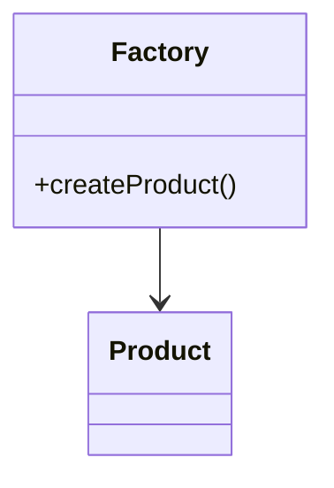
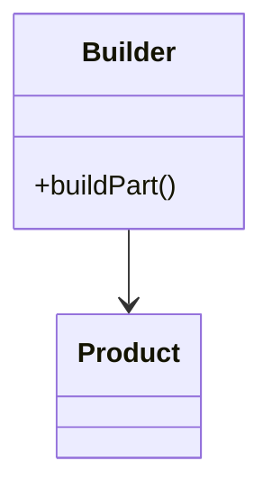
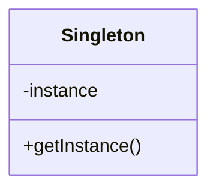
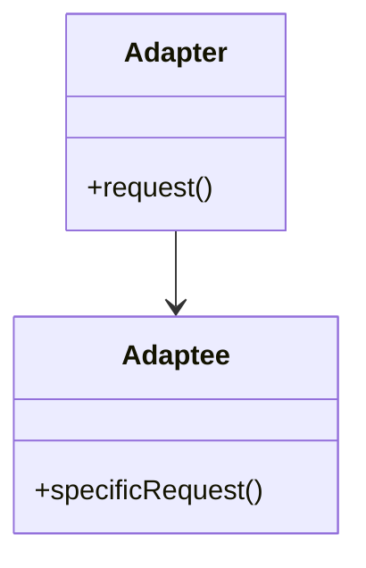
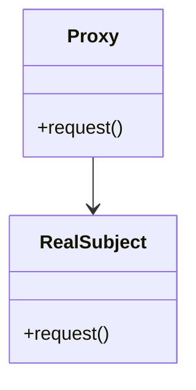
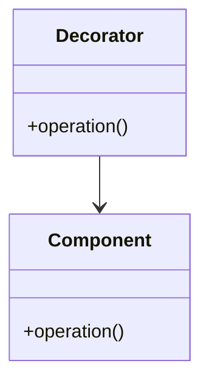
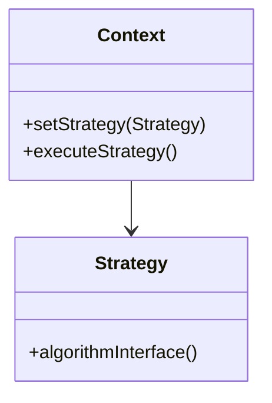
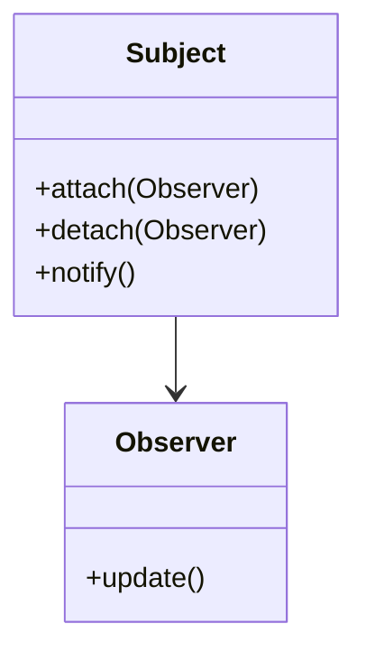
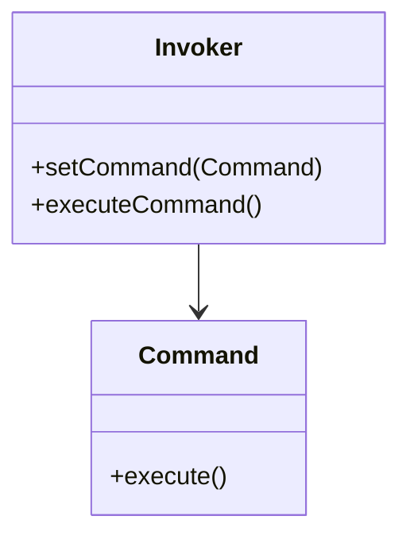

## 30.3 Design Pattern Reference Cheat Sheet

### Introduction

Welcome to the Erlang Design Pattern Reference Cheat Sheet, your go-to resource for quickly recalling and comparing the design patterns discussed throughout this guide. This section provides concise summaries of each pattern, highlighting their intent, applicability, and unique features in Erlang. Whether you're a seasoned Erlang developer or new to the language, this cheat sheet will serve as a handy reference to enhance your understanding and application of design patterns in functional and concurrent programming.

---

### Creational Patterns

#### Factory Pattern

- **Category**: Creational
- **Intent**: Provide an interface for creating objects in a superclass, but allow subclasses to alter the type of objects that will be created.
- **Structure Diagram**:

- **Key Participants**: Factory, Product
- **Applicability**: Use when a class can't anticipate the class of objects it must create.
- **Erlang Unique Features**: Leverage Erlang's module system to create factory functions that return different module implementations.

#### Builder Pattern

- **Category**: Creational
- **Intent**: Separate the construction of a complex object from its representation, allowing the same construction process to create different representations.
- **Structure Diagram**:

- **Key Participants**: Builder, Product
- **Applicability**: Use when the algorithm for creating a complex object should be independent of the parts that make up the object.
- **Erlang Unique Features**: Use functional composition to build complex data structures incrementally.

#### Singleton Pattern

- **Category**: Creational
- **Intent**: Ensure a class has only one instance and provide a global point of access to it.
- **Structure Diagram**:

- **Key Participants**: Singleton
- **Applicability**: Use when exactly one instance of a class is needed.
- **Erlang Unique Features**: Utilize Erlang's process dictionary or application environment for singleton-like behavior.

---

### Structural Patterns

#### Adapter Pattern

- **Category**: Structural
- **Intent**: Convert the interface of a class into another interface clients expect, allowing classes to work together that couldn't otherwise due to incompatible interfaces.
- **Structure Diagram**:

- **Key Participants**: Adapter, Adaptee
- **Applicability**: Use when you want to use an existing class, and its interface does not match the one you need.
- **Erlang Unique Features**: Implement adapters using Erlang's behavior modules to provide a uniform interface.

#### Proxy Pattern

- **Category**: Structural
- **Intent**: Provide a surrogate or placeholder for another object to control access to it.
- **Structure Diagram**:

- **Key Participants**: Proxy, RealSubject
- **Applicability**: Use when you need to control access to an object.
- **Erlang Unique Features**: Use processes as proxies to manage access and control over resources.

#### Decorator Pattern

- **Category**: Structural
- **Intent**: Attach additional responsibilities to an object dynamically. Decorators provide a flexible alternative to subclassing for extending functionality.
- **Structure Diagram**:

- **Key Participants**: Decorator, Component
- **Applicability**: Use to add responsibilities to individual objects dynamically and transparently.
- **Erlang Unique Features**: Use higher-order functions to wrap and extend functionality.

---

### Behavioral Patterns

#### Strategy Pattern

- **Category**: Behavioral
- **Intent**: Define a family of algorithms, encapsulate each one, and make them interchangeable. Strategy lets the algorithm vary independently from clients that use it.
- **Structure Diagram**:

- **Key Participants**: Strategy, Context
- **Applicability**: Use when you need to use different variants of an algorithm.
- **Erlang Unique Features**: Implement strategies using higher-order functions and passing them as parameters.

#### Observer Pattern

- **Category**: Behavioral
- **Intent**: Define a one-to-many dependency between objects so that when one object changes state, all its dependents are notified and updated automatically.
- **Structure Diagram**:

- **Key Participants**: Observer, Subject
- **Applicability**: Use when an object should notify other objects without making assumptions about who these objects are.
- **Erlang Unique Features**: Use Erlang's message passing to implement observer-like behavior.

#### Command Pattern

- **Category**: Behavioral
- **Intent**: Encapsulate a request as an object, thereby allowing for parameterization of clients with queues, requests, and operations.
- **Structure Diagram**:

- **Key Participants**: Command, Invoker
- **Applicability**: Use to parameterize objects with operations.
- **Erlang Unique Features**: Use message passing to encapsulate commands and send them to processes.

---

### Design Considerations

- **When to Use Patterns**: Consider the problem context and the specific requirements of your application. Patterns are not one-size-fits-all solutions and should be applied judiciously.
- **Erlang-Specific Features**: Leverage Erlang's strengths in concurrency, fault tolerance, and functional programming when implementing patterns.
- **Common Pitfalls**: Avoid overusing patterns or applying them inappropriately. Ensure that the pattern chosen aligns with the problem being solved.

### Differences and Similarities

- **Factory vs. Builder**: Both are creational patterns, but Factory is used for creating objects without specifying the exact class, while Builder is used for constructing complex objects step by step.
- **Adapter vs. Proxy**: Adapter is used to change the interface of an existing object, while Proxy controls access to an object.
- **Strategy vs. Command**: Strategy is about choosing an algorithm at runtime, while Command encapsulates a request as an object.

---

## Quiz: Design Pattern Reference Cheat Sheet



### Which pattern is used to provide a surrogate or placeholder for another object to control access to it?

- [ ] Adapter Pattern
- [x] Proxy Pattern
- [ ] Decorator Pattern
- [ ] Observer Pattern

> **Explanation:** The Proxy Pattern provides a surrogate or placeholder for another object to control access to it.

### What is the primary intent of the Factory Pattern?

- [x] To provide an interface for creating objects in a superclass, but allow subclasses to alter the type of objects that will be created.
- [ ] To attach additional responsibilities to an object dynamically.
- [ ] To define a family of algorithms, encapsulate each one, and make them interchangeable.
- [ ] To encapsulate a request as an object.

> **Explanation:** The Factory Pattern provides an interface for creating objects, allowing subclasses to alter the type of objects created.

### Which pattern is best suited for adding responsibilities to individual objects dynamically and transparently?

- [ ] Singleton Pattern
- [ ] Factory Pattern
- [x] Decorator Pattern
- [ ] Command Pattern

> **Explanation:** The Decorator Pattern is used to add responsibilities to individual objects dynamically and transparently.

### In Erlang, which feature is commonly used to implement the Strategy Pattern?

- [ ] Processes
- [x] Higher-order functions
- [ ] Macros
- [ ] Records

> **Explanation:** Higher-order functions are used in Erlang to implement the Strategy Pattern by passing different algorithms as parameters.

### Which pattern defines a one-to-many dependency between objects?

- [ ] Command Pattern
- [ ] Singleton Pattern
- [ ] Factory Pattern
- [x] Observer Pattern

> **Explanation:** The Observer Pattern defines a one-to-many dependency between objects so that when one object changes state, all its dependents are notified and updated automatically.

### What is the primary purpose of the Builder Pattern?

- [ ] To ensure a class has only one instance.
- [x] To separate the construction of a complex object from its representation.
- [ ] To convert the interface of a class into another interface clients expect.
- [ ] To encapsulate a request as an object.

> **Explanation:** The Builder Pattern separates the construction of a complex object from its representation, allowing the same construction process to create different representations.

### Which pattern is used to encapsulate a request as an object?

- [ ] Strategy Pattern
- [ ] Observer Pattern
- [x] Command Pattern
- [ ] Adapter Pattern

> **Explanation:** The Command Pattern encapsulates a request as an object, allowing for parameterization of clients with queues, requests, and operations.

### Which pattern allows for the algorithm to vary independently from clients that use it?

- [x] Strategy Pattern
- [ ] Singleton Pattern
- [ ] Proxy Pattern
- [ ] Factory Pattern

> **Explanation:** The Strategy Pattern allows the algorithm to vary independently from clients that use it by defining a family of algorithms and encapsulating each one.

### Which pattern is used to convert the interface of a class into another interface clients expect?

- [x] Adapter Pattern
- [ ] Proxy Pattern
- [ ] Decorator Pattern
- [ ] Observer Pattern

> **Explanation:** The Adapter Pattern is used to convert the interface of a class into another interface clients expect, allowing classes to work together that couldn't otherwise due to incompatible interfaces.

### True or False: The Singleton Pattern is used to ensure a class has only one instance and provide a global point of access to it.

- [x] True
- [ ] False

> **Explanation:** True. The Singleton Pattern ensures a class has only one instance and provides a global point of access to it.



---

Remember, this cheat sheet is just a starting point. As you delve deeper into Erlang's design patterns, you'll discover more nuances and applications. Keep experimenting, stay curious, and enjoy the journey!
