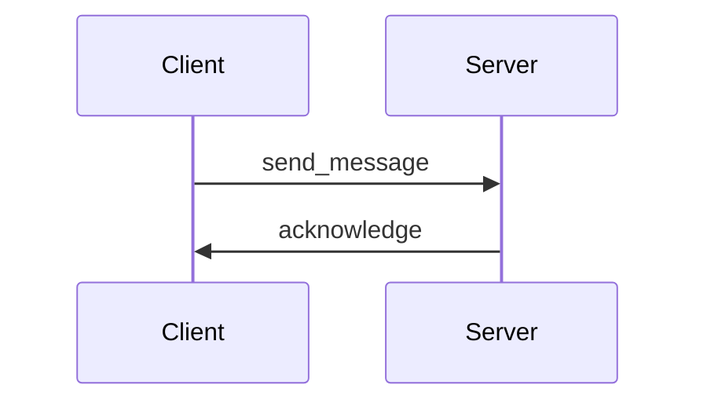
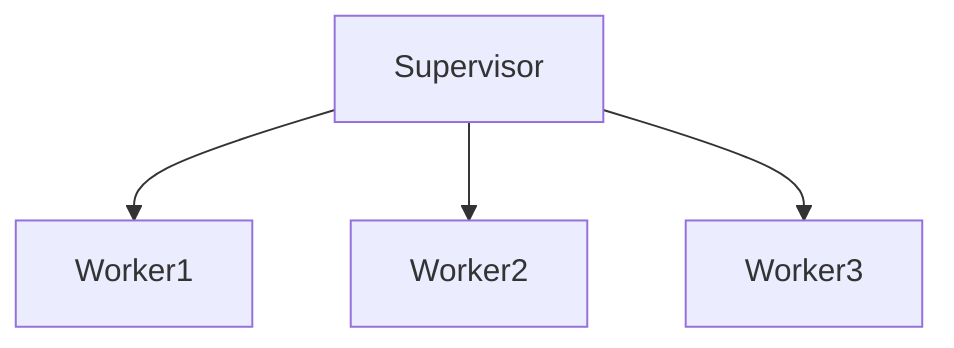

## 30.7 Sample Projects and Code Examples

In this section, we provide a comprehensive collection of sample projects and code examples to help you explore and understand the various design patterns and concepts discussed in this guide. These examples are designed to be practical, illustrating real-world applications of Erlang's functional and concurrent programming paradigms. By studying and experimenting with these samples, you can gain a deeper understanding of how to effectively apply design patterns in your own projects.

### Introduction to Sample Projects

The sample projects included in this section cover a wide range of topics, from basic functional programming concepts to advanced concurrency and distributed systems. Each project is accompanied by detailed explanations and well-commented code to guide you through the implementation process. We encourage you to experiment with the code, modify it, and explore different approaches to solving the problems presented.

### Project 1: Simple Chat Server

**Description**: This project demonstrates the implementation of a simple chat server using Erlang's concurrency model. It showcases the use of processes, message passing, and supervision trees to build a robust and fault-tolerant application.

**Key Concepts**:
- Erlang processes and message passing
- Supervision trees for fault tolerance
- Handling concurrent connections

**GitHub Repository**: [Simple Chat Server](https://github.com/yourusername/simple-chat-server)

**Code Example**:

```erlang
-module(chat_server).
-behaviour(gen_server).

%% API
-export([start_link/0, send_message/2, get_messages/1]).

%% gen_server callbacks
-export([init/1, handle_call/3, handle_cast/2, handle_info/2, terminate/2, code_change/3]).

%% Record to store chat messages
-record(state, {messages = []}).

%% Start the server
start_link() ->
    gen_server:start_link({local, ?MODULE}, ?MODULE, [], []).

%% Send a message
send_message(Pid, Message) ->
    gen_server:cast(Pid, {send_message, Message}).

%% Get all messages
get_messages(Pid) ->
    gen_server:call(Pid, get_messages).

%% gen_server callback implementations
init([]) ->
    {ok, #state{}}.

handle_call(get_messages, _From, State) ->
    {reply, State#state.messages, State};

handle_cast({send_message, Message}, State) ->
    NewState = State#state{messages = [Message | State#state.messages]},
    {noreply, NewState}.

handle_info(_Info, State) ->
    {noreply, State}.

terminate(_Reason, _State) ->
    ok.

code_change(_OldVsn, State, _Extra) ->
    {ok, State}.
```

**Instructions**:
1. Clone the repository from GitHub.
2. Compile the code using `erlc chat_server.erl`.
3. Start the Erlang shell and run the server with `chat_server:start_link().`
4. Use `chat_server:send_message/2` and `chat_server:get_messages/1` to interact with the server.

### Project 2: Distributed Key-Value Store

**Description**: This project implements a distributed key-value store using Erlang's distributed programming capabilities. It demonstrates node communication, data replication, and fault tolerance in a distributed environment.

**Key Concepts**:
- Distributed Erlang nodes
- Data replication and consistency
- Fault tolerance in distributed systems

**GitHub Repository**: [Distributed Key-Value Store](https://github.com/yourusername/distributed-kv-store)

**Code Example**:

```erlang
-module(kv_store).
-export([start/0, put/2, get/1, delete/1]).

%% Start the key-value store
start() ->
    register(kv_store, spawn(fun loop/0)).

%% Put a key-value pair
put(Key, Value) ->
    kv_store ! {put, Key, Value}.

%% Get a value by key
get(Key) ->
    kv_store ! {get, Key, self()},
    receive
        {ok, Value} -> Value;
        {error, not_found} -> not_found
    end.

%% Delete a key
delete(Key) ->
    kv_store ! {delete, Key}.

%% Internal loop to handle messages
loop() ->
    receive
        {put, Key, Value} ->
            put_data(Key, Value),
            loop();
        {get, Key, Caller} ->
            Caller ! {ok, get_data(Key)},
            loop();
        {delete, Key} ->
            delete_data(Key),
            loop()
    end.

%% Internal functions to manage data
put_data(Key, Value) ->
    ets:insert(kv_store, {Key, Value}).

get_data(Key) ->
    case ets:lookup(kv_store, Key) of
        [{_, Value}] -> Value;
        [] -> not_found
    end.

delete_data(Key) ->
    ets:delete(kv_store, Key).
```

**Instructions**:
1. Clone the repository from GitHub.
2. Compile the code using `erlc kv_store.erl`.
3. Start the Erlang shell and run the store with `kv_store:start().`
4. Use `kv_store:put/2`, `kv_store:get/1`, and `kv_store:delete/1` to interact with the store.

### Project 3: OTP-Based Web Server

**Description**: This project demonstrates the use of OTP (Open Telecom Platform) to build a simple web server. It highlights the use of OTP behaviors, supervision trees, and fault-tolerant design.

**Key Concepts**:
- OTP behaviors (`gen_server`, `supervisor`)
- Building a web server with OTP
- Fault-tolerant design with supervision trees

**GitHub Repository**: [OTP-Based Web Server](https://github.com/yourusername/otp-web-server)

**Code Example**:

```erlang
-module(web_server).
-behaviour(gen_server).

%% API
-export([start_link/0, stop/0]).

%% gen_server callbacks
-export([init/1, handle_call/3, handle_cast/2, handle_info/2, terminate/2, code_change/3]).

%% Start the server
start_link() ->
    gen_server:start_link({local, ?MODULE}, ?MODULE, [], []).

%% Stop the server
stop() ->
    gen_server:cast(?MODULE, stop).

%% gen_server callback implementations
init([]) ->
    {ok, listen()}.

handle_call(_Request, _From, State) ->
    {reply, ok, State}.

handle_cast(stop, State) ->
    {stop, normal, State}.

handle_info(_Info, State) ->
    {noreply, State}.

terminate(_Reason, _State) ->
    ok.

code_change(_OldVsn, State, _Extra) ->
    {ok, State}.

%% Listen for incoming connections
listen() ->
    {ok, ListenSocket} = gen_tcp:listen(8080, [binary, {packet, 0}, {active, false}]),
    accept(ListenSocket).

%% Accept incoming connections
accept(ListenSocket) ->
    {ok, Socket} = gen_tcp:accept(ListenSocket),
    spawn(fun() -> handle_connection(Socket) end),
    accept(ListenSocket).

%% Handle a single connection
handle_connection(Socket) ->
    {ok, Data} = gen_tcp:recv(Socket, 0),
    gen_tcp:send(Socket, "HTTP/1.1 200 OK\r\nContent-Length: 13\r\n\r\nHello, World!"),
    gen_tcp:close(Socket).
```

**Instructions**:
1. Clone the repository from GitHub.
2. Compile the code using `erlc web_server.erl`.
3. Start the Erlang shell and run the server with `web_server:start_link().`
4. Access the server by navigating to `http://localhost:8080` in your web browser.

### Project 4: Real-Time Analytics Dashboard

**Description**: This project showcases the implementation of a real-time analytics dashboard using Erlang's concurrency and message-passing capabilities. It demonstrates how to process and visualize data in real-time.

**Key Concepts**:
- Real-time data processing
- Concurrency and message passing
- Data visualization

**GitHub Repository**: [Real-Time Analytics Dashboard](https://github.com/yourusername/real-time-analytics-dashboard)

**Code Example**:

```erlang
-module(analytics_dashboard).
-export([start/0, process_data/1, visualize_data/0]).

%% Start the dashboard
start() ->
    register(dashboard, spawn(fun loop/0)).

%% Process incoming data
process_data(Data) ->
    dashboard ! {process, Data}.

%% Visualize processed data
visualize_data() ->
    dashboard ! visualize.

%% Internal loop to handle messages
loop() ->
    receive
        {process, Data} ->
            %% Process data here
            io:format("Processing data: ~p~n", [Data]),
            loop();
        visualize ->
            %% Visualize data here
            io:format("Visualizing data~n"),
            loop()
    end.
```

**Instructions**:
1. Clone the repository from GitHub.
2. Compile the code using `erlc analytics_dashboard.erl`.
3. Start the Erlang shell and run the dashboard with `analytics_dashboard:start().`
4. Use `analytics_dashboard:process_data/1` and `analytics_dashboard:visualize_data/0` to interact with the dashboard.

### Project 5: Fault-Tolerant Microservices Architecture

**Description**: This project demonstrates the implementation of a fault-tolerant microservices architecture using Erlang's OTP framework. It highlights the use of supervision trees, process monitoring, and distributed communication.

**Key Concepts**:
- Microservices architecture
- Fault tolerance with OTP
- Distributed communication

**GitHub Repository**: [Fault-Tolerant Microservices](https://github.com/yourusername/fault-tolerant-microservices)

**Code Example**:

```erlang
-module(microservice).
-behaviour(gen_server).

%% API
-export([start_link/0, call_service/1]).

%% gen_server callbacks
-export([init/1, handle_call/3, handle_cast/2, handle_info/2, terminate/2, code_change/3]).

%% Start the microservice
start_link() ->
    gen_server:start_link({local, ?MODULE}, ?MODULE, [], []).

%% Call the microservice
call_service(Request) ->
    gen_server:call(?MODULE, {call, Request}).

%% gen_server callback implementations
init([]) ->
    {ok, []}.

handle_call({call, Request}, _From, State) ->
    %% Process request here
    {reply, {ok, process_request(Request)}, State}.

handle_cast(_Msg, State) ->
    {noreply, State}.

handle_info(_Info, State) ->
    {noreply, State}.

terminate(_Reason, _State) ->
    ok.

code_change(_OldVsn, State, _Extra) ->
    {ok, State}.

%% Process a request
process_request(Request) ->
    %% Simulate processing
    io:format("Processing request: ~p~n", [Request]),
    ok.
```

**Instructions**:
1. Clone the repository from GitHub.
2. Compile the code using `erlc microservice.erl`.
3. Start the Erlang shell and run the microservice with `microservice:start_link().`
4. Use `microservice:call_service/1` to interact with the microservice.

### Try It Yourself

We encourage you to experiment with these projects and modify the code to suit your needs. Here are some suggestions for further exploration:

- **Extend the Chat Server**: Add features such as user authentication, private messaging, or chat rooms.
- **Enhance the Key-Value Store**: Implement data persistence or explore different consistency models.
- **Expand the Web Server**: Add support for handling different HTTP methods or implement a simple REST API.
- **Improve the Analytics Dashboard**: Integrate with a data source or add real-time data visualization capabilities.
- **Refine the Microservices Architecture**: Implement additional services or explore different communication patterns.

### Visualizing Erlang Concepts

To aid in understanding, we provide visual representations of some key concepts using Mermaid.js diagrams.

#### Erlang Process Communication



**Description**: This diagram illustrates the basic message-passing mechanism between a client and a server process in Erlang.

#### Supervision Tree Structure



**Description**: This diagram represents a simple supervision tree with a supervisor managing three worker processes.

### References and Further Reading

- [Erlang Programming Language](https://www.erlang.org/)
- [Learn You Some Erlang for Great Good!](http://learnyousomeerlang.com/)
- [Erlang and OTP in Action](https://www.manning.com/books/erlang-and-otp-in-action)
- [Erlang Central](http://erlangcentral.org/)

### Knowledge Check

To reinforce your understanding, consider the following questions:

1. What are the key benefits of using Erlang's concurrency model in building a chat server?
2. How does the supervision tree contribute to fault tolerance in an Erlang application?
3. What are the advantages of using OTP behaviors in building a web server?
4. How can you ensure data consistency in a distributed key-value store?
5. What are some common challenges in implementing a microservices architecture with Erlang?

### Embrace the Journey

Remember, this is just the beginning. As you progress, you'll build more complex and interactive applications. Keep experimenting, stay curious, and enjoy the journey!

## Quiz: Sample Projects and Code Examples



### What is the primary purpose of using supervision trees in Erlang projects?

- [x] To manage process lifecycles and ensure fault tolerance
- [ ] To optimize memory usage
- [ ] To enhance code readability
- [ ] To improve network performance

> **Explanation:** Supervision trees are used to manage process lifecycles and ensure fault tolerance by restarting failed processes.

### Which OTP behavior is commonly used for implementing a server in Erlang?

- [x] `gen_server`
- [ ] `gen_event`
- [ ] `gen_fsm`
- [ ] `supervisor`

> **Explanation:** `gen_server` is the OTP behavior commonly used for implementing servers in Erlang.

### In the chat server example, what is the role of the `handle_cast/2` function?

- [x] To handle asynchronous messages
- [ ] To process synchronous requests
- [ ] To manage process termination
- [ ] To update the server state

> **Explanation:** The `handle_cast/2` function handles asynchronous messages sent to the server.

### What is a key advantage of using Erlang's message-passing model?

- [x] It avoids shared state and reduces concurrency issues
- [ ] It increases memory usage
- [ ] It simplifies code syntax
- [ ] It enhances graphical user interfaces

> **Explanation:** Erlang's message-passing model avoids shared state, reducing concurrency issues.

### How can you extend the functionality of the simple chat server?

- [x] By adding user authentication and private messaging
- [ ] By optimizing memory usage
- [ ] By improving graphical user interfaces
- [ ] By reducing network latency

> **Explanation:** Extending the chat server with user authentication and private messaging adds functionality.

### What is the purpose of the `process_request/1` function in the microservice example?

- [x] To simulate processing a request
- [ ] To handle process termination
- [ ] To manage network connections
- [ ] To optimize memory usage

> **Explanation:** The `process_request/1` function simulates processing a request in the microservice.

### Which Erlang feature is essential for building distributed systems?

- [x] Node communication
- [ ] Graphical user interfaces
- [ ] Memory optimization
- [ ] Code readability

> **Explanation:** Node communication is essential for building distributed systems in Erlang.

### What is a common use case for the `gen_tcp` module in Erlang?

- [x] To handle network connections
- [ ] To manage process lifecycles
- [ ] To optimize memory usage
- [ ] To enhance code readability

> **Explanation:** The `gen_tcp` module is commonly used to handle network connections in Erlang.

### How does the `visualize_data/0` function contribute to the analytics dashboard?

- [x] It triggers data visualization
- [ ] It manages network connections
- [ ] It optimizes memory usage
- [ ] It enhances code readability

> **Explanation:** The `visualize_data/0` function triggers data visualization in the analytics dashboard.

### True or False: Erlang's concurrency model relies on shared state for communication.

- [ ] True
- [x] False

> **Explanation:** Erlang's concurrency model relies on message passing, not shared state, for communication.


