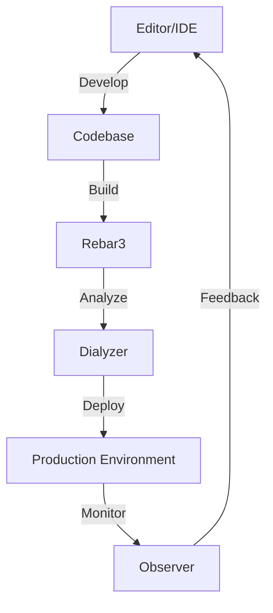

## 30.8 Tooling and IDEs for Erlang Development

In the world of software development, the choice of tools and integrated development environments (IDEs) can significantly impact productivity and code quality. For Erlang developers, a variety of tools and IDEs are available, each offering unique features tailored to the language's functional and concurrent nature. This section explores popular editors and IDEs, highlighting their features, configuration tips, and how they can enhance your Erlang development experience.

### 1. Visual Studio Code

Visual Studio Code (VS Code) has rapidly become one of the most popular code editors due to its versatility, extensive plugin ecosystem, and user-friendly interface. For Erlang development, VS Code offers several extensions that provide essential features such as syntax highlighting, code completion, and debugging support.

#### Key Features

- **Syntax Highlighting**: The Erlang extension for VS Code provides comprehensive syntax highlighting, making it easier to read and understand Erlang code.
- **Code Completion**: IntelliSense offers code suggestions and auto-completion, reducing the likelihood of syntax errors.
- **Debugging Support**: With the Erlang LS (Language Server) extension, developers can set breakpoints, inspect variables, and step through code.
- **Integrated Terminal**: Execute Erlang commands directly within the editor using the integrated terminal.

#### Configuration Tips

- **Install the Erlang Extension**: Search for "Erlang" in the VS Code extensions marketplace and install the Erlang LS extension for enhanced language support.
- **Customize Settings**: Adjust settings such as tab size and line endings to match your coding style.
- **Use Snippets**: Create custom code snippets for frequently used patterns to speed up development.

#### Useful Extensions

- **Erlang LS**: Provides language server protocol support for Erlang, enabling features like code navigation and refactoring.
- **Bracket Pair Colorizer**: Helps in visualizing matching brackets, which is particularly useful in Erlang's nested structures.

#### Resources

- [Visual Studio Code Download](https://code.visualstudio.com/)
- [Erlang LS Extension](https://marketplace.visualstudio.com/items?itemName=erlang-ls.erlang-ls)

### 2. Emacs

Emacs is a highly customizable text editor that has been a favorite among developers for decades. Its extensibility makes it a powerful tool for Erlang development, with several packages available to enhance the experience.

#### Key Features

- **Syntax Highlighting**: Emacs provides syntax highlighting for Erlang out of the box, with additional customization available through packages.
- **REPL Integration**: Run Erlang code directly within Emacs using the integrated REPL (Read-Eval-Print Loop).
- **Customizable Keybindings**: Tailor keybindings to your workflow for increased efficiency.
- **Version Control Integration**: Seamlessly integrate with Git and other version control systems.

#### Configuration Tips

- **Install Erlang Mode**: Use `M-x package-install` to install `erlang-mode`, which provides syntax highlighting and other language-specific features.
- **Customize Your Emacs Configuration**: Modify your `.emacs` or `init.el` file to include custom settings and keybindings.
- **Use Flycheck**: Enable Flycheck for real-time syntax checking and error highlighting.

#### Useful Packages

- **Erlang Mode**: Provides basic Erlang support, including syntax highlighting and indentation.
- **Flycheck**: Offers on-the-fly syntax checking and error reporting.

#### Resources

- [GNU Emacs Download](https://www.gnu.org/software/emacs/)
- [Erlang Mode Documentation](https://github.com/erlang/otp/tree/master/lib/tools/emacs)

### 3. IntelliJ IDEA

IntelliJ IDEA is a robust IDE known for its powerful features and support for multiple languages. With the Erlang plugin, it becomes a formidable tool for Erlang development.

#### Key Features

- **Intelligent Code Completion**: Offers context-aware suggestions and code completion.
- **Refactoring Tools**: Provides advanced refactoring capabilities, including renaming and extracting methods.
- **Debugging**: Set breakpoints and inspect variables with the integrated debugger.
- **Version Control**: Built-in support for Git, SVN, and other version control systems.

#### Configuration Tips

- **Install the Erlang Plugin**: Navigate to the plugins section and search for "Erlang" to install the plugin.
- **Customize Keymaps**: Adjust keymaps to match your preferred shortcuts and improve workflow efficiency.
- **Enable Code Analysis**: Use IntelliJ's code analysis tools to identify potential issues and improve code quality.

#### Useful Plugins

- **Erlang Plugin**: Adds Erlang language support, including syntax highlighting and debugging.
- **Git Integration**: Provides seamless integration with Git for version control.

#### Resources

- [IntelliJ IDEA Download](https://www.jetbrains.com/idea/)
- [Erlang Plugin for IntelliJ IDEA](https://plugins.jetbrains.com/plugin/7080-erlang)

### 4. Atom

Atom is a hackable text editor developed by GitHub, known for its flexibility and extensive package ecosystem. While not as feature-rich as some IDEs, it offers a lightweight option for Erlang development.

#### Key Features

- **Package Ecosystem**: Access a wide range of packages to extend functionality.
- **GitHub Integration**: Built-in support for Git and GitHub, making version control straightforward.
- **Customizable Interface**: Tailor the interface to your preferences with themes and packages.

#### Configuration Tips

- **Install Erlang Packages**: Use the Atom package manager to install packages like `language-erlang` for syntax highlighting.
- **Customize Themes**: Choose from a variety of themes to enhance readability and reduce eye strain.
- **Use Keybindings**: Set up custom keybindings to streamline your workflow.

#### Useful Packages

- **language-erlang**: Provides syntax highlighting and basic language support for Erlang.
- **linter**: Integrates with various linters for real-time error checking.

#### Resources

- [Atom Download](https://atom.io/)
- [language-erlang Package](https://atom.io/packages/language-erlang)

### 5. Sublime Text

Sublime Text is a sophisticated text editor known for its speed and simplicity. With the right packages, it can be an effective tool for Erlang development.

#### Key Features

- **Fast and Lightweight**: Sublime Text is renowned for its speed and responsiveness.
- **Multiple Selections**: Edit multiple lines simultaneously with ease.
- **Command Palette**: Access commands quickly without leaving the keyboard.

#### Configuration Tips

- **Install Package Control**: Use Package Control to easily install and manage packages.
- **Add Erlang Support**: Install the `Erlang` package for syntax highlighting and snippets.
- **Customize Settings**: Modify settings to suit your coding style and preferences.

#### Useful Packages

- **Erlang**: Provides syntax highlighting and snippets for Erlang development.
- **SublimeLinter**: Offers real-time linting and error checking.

#### Resources

- [Sublime Text Download](https://www.sublimetext.com/)
- [Erlang Package for Sublime Text](https://packagecontrol.io/packages/Erlang)

### 6. Eclipse with Erlang Plugin

Eclipse is a widely used IDE that supports a variety of programming languages through plugins. With the Erlang plugin, Eclipse can be configured for Erlang development.

#### Key Features

- **Extensible Plugin System**: Add functionality through a wide range of plugins.
- **Project Management**: Manage large projects with ease using Eclipse's project management tools.
- **Debugging Tools**: Integrated debugging support for Erlang applications.

#### Configuration Tips

- **Install the Erlang Plugin**: Use the Eclipse Marketplace to find and install the Erlang plugin.
- **Configure Workspaces**: Set up workspaces to organize your projects and resources.
- **Use Perspectives**: Customize perspectives to focus on different aspects of development.

#### Useful Plugins

- **Erlang Plugin**: Adds Erlang language support, including syntax highlighting and debugging.
- **EGit**: Provides Git integration for version control.

#### Resources

- [Eclipse Download](https://www.eclipse.org/)
- [Erlang Plugin for Eclipse](https://marketplace.eclipse.org/content/erlang)

### 7. Other Notable Tools

While the above editors and IDEs are among the most popular, several other tools can enhance Erlang development:

- **Rebar3**: A build tool for Erlang that simplifies project management and dependency handling.
- **Dialyzer**: A static analysis tool that identifies software discrepancies such as type errors.
- **Observer**: A graphical tool for monitoring Erlang systems, providing insights into process states and system performance.

### Try It Yourself

Experiment with different tools and configurations to find the setup that best suits your workflow. Consider the following exercises:

- **Customize Your Editor**: Choose an editor and customize its settings, themes, and keybindings to enhance your productivity.
- **Explore Plugins**: Install and configure plugins or extensions that add functionality to your chosen editor.
- **Set Up a Debugging Session**: Use the debugging tools available in your IDE to set breakpoints and step through an Erlang application.

### Visualizing the Tooling Ecosystem

To better understand the relationships and workflows between these tools, consider the following diagram:

**Diagram Description**: This diagram illustrates the typical workflow in Erlang development, starting from code editing in an IDE, building with Rebar3, analyzing with Dialyzer, deploying to a production environment, and monitoring with Observer. Feedback from monitoring informs further development.

### Conclusion

Choosing the right tools and IDEs for Erlang development can greatly enhance your productivity and code quality. Whether you prefer the flexibility of Emacs, the power of IntelliJ IDEA, or the simplicity of Sublime Text, there is a tool that fits your needs. Remember, the best tool is one that complements your workflow and helps you write better code. Keep experimenting, stay curious, and enjoy the journey of Erlang development!

## Quiz: Tooling and IDEs for Erlang Development



### Which of the following is a popular text editor for Erlang development?

- [x] Visual Studio Code
- [ ] Microsoft Word
- [ ] Adobe Photoshop
- [ ] Blender

> **Explanation:** Visual Studio Code is a popular text editor that supports Erlang development through extensions.

### What feature does the Erlang LS extension provide in Visual Studio Code?

- [x] Syntax Highlighting
- [x] Code Completion
- [ ] Image Editing
- [ ] Video Rendering

> **Explanation:** The Erlang LS extension provides syntax highlighting and code completion for Erlang in Visual Studio Code.

### Which package manager is used in Emacs to install `erlang-mode`?

- [x] M-x package-install
- [ ] npm
- [ ] pip
- [ ] gem

> **Explanation:** `M-x package-install` is the command used in Emacs to install packages like `erlang-mode`.

### What is a key feature of IntelliJ IDEA for Erlang development?

- [x] Intelligent Code Completion
- [ ] Photo Editing
- [ ] 3D Modeling
- [ ] Audio Mixing

> **Explanation:** IntelliJ IDEA offers intelligent code completion, which is a key feature for Erlang development.

### Which tool is used for static analysis in Erlang?

- [x] Dialyzer
- [ ] Photoshop
- [ ] Blender
- [ ] Audacity

> **Explanation:** Dialyzer is a static analysis tool used to identify discrepancies in Erlang code.

### What is the primary purpose of the Observer tool in Erlang?

- [x] Monitoring Erlang Systems
- [ ] Editing Images
- [ ] Creating Animations
- [ ] Mixing Audio

> **Explanation:** Observer is used for monitoring Erlang systems, providing insights into process states and performance.

### Which editor is known for its hackability and package ecosystem?

- [x] Atom
- [ ] Microsoft Word
- [ ] Excel
- [ ] PowerPoint

> **Explanation:** Atom is known for its hackability and extensive package ecosystem, making it a flexible choice for developers.

### What is the main advantage of using Rebar3 in Erlang development?

- [x] Simplifies Project Management
- [ ] Edits Videos
- [ ] Designs Graphics
- [ ] Mixes Music

> **Explanation:** Rebar3 simplifies project management and dependency handling in Erlang development.

### Which of the following is a feature of Sublime Text?

- [x] Fast and Lightweight
- [ ] Heavy and Slow
- [ ] Complex and Unintuitive
- [ ] Unstable and Buggy

> **Explanation:** Sublime Text is known for being fast and lightweight, making it a popular choice among developers.

### True or False: Emacs cannot be used for Erlang development.

- [ ] True
- [x] False

> **Explanation:** False. Emacs can be used for Erlang development with the appropriate packages and configurations.


